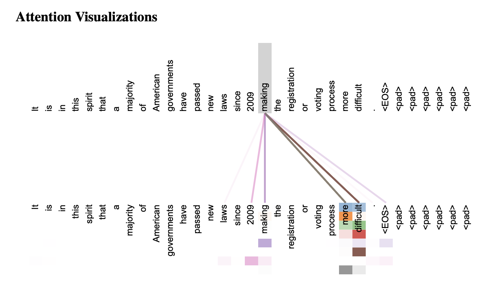

# Attention Is All You Need

> 이 문서는 [Attention Is All You Need](https://arxiv.org/pdf/1706.03762)를 번역한 것입니다.

## 초록

현재 지배적인 시퀀스 변환 모델은 인코더와 디코더를 포함하는 복잡한 순환 신경망(RNN)이나 컨볼루션 신경망(CNN)을 기반으로 합니다. 최고 성능의 모델들은 어텐션 메커니즘을 통해 인코더와 디코더를 연결합니다. 본 논문에서는 순환과 컨볼루션을 완전히 배제하고, 전적으로 어텐션 메커니즘에만 기반한 새로운 네트워크 아키텍처인 '트랜스포머(Transformer)'를 제안합니다. 두 가지 기계 번역 과제에 대한 실험 결과, 트랜스포머는 더 높은 번역 품질을 달성하면서도 병렬 처리가 용이하여 훈련 시간을 크게 단축했습니다. WMT 2014 영어-독일어 번역 과제에서 우리 모델은 28.4 BLEU 점수를 기록하여, 앙상블 모델을 포함한 기존 최고 성능 모델보다 2 BLEU 이상 높은 점수를 달성했습니다. WMT 2014 영어-프랑스어 번역 과제에서는 8개의 GPU로 3.5일간 훈련하여 41.8이라는 새로운 단일 모델 최고 BLEU 점수를 기록했으며, 이는 기존 최고 성능 모델들의 훈련 비용의 극히 일부에 불과합니다. 또한, 트랜스포머가 대규모 및 제한된 훈련 데이터 모두를 사용한 영어 구문 분석 과제에서도 성공적으로 적용됨으로써 다른 과제에도 뛰어난 일반화 성능을 보임을 입증했습니다.

## 1. 소개

순환 신경망(RNN), 특히 장단기 기억(LSTM)과 게이트 순환 유닛(GRU)은 언어 모델링 및 기계 번역과 같은 시퀀스 모델링 및 변환 문제에서 최첨단 접근 방식으로 자리매김했습니다. 이후 순환 언어 모델과 인코더-디코더 아키텍처의 한계를 극복하기 위한 수많은 연구가 이어졌습니다.

순환 모델은 일반적으로 입력 및 출력 시퀀스의 토큰 위치에 따라 계산을 순차적으로 수행합니다. 각 타임스텝 $$t$$에서 은닉 상태 $$h_t$$는 이전 타임스텝의 은닉 상태 $$h_{t-1}$$과 현재 입력을 사용하여 계산됩니다. 이러한 순차적인 특성은 훈련 데이터 내에서의 병렬화를 불가능하게 만듭니다. 시퀀스 길이가 길어질수록 메모리 제약으로 인해 배치(batch) 크기가 제한되므로 이 문제는 더욱 심각해집니다. 최근 연구에서 인수분해 기법과 조건부 계산을 통해 계산 효율성을 크게 향상시키고 모델 성능을 개선했지만, 순차 계산이라는 근본적인 제약은 여전히 남아있습니다.

어텐션 메커니즘은 다양한 과제에서 시퀀스 모델링 및 변환 모델의 핵심 요소로 자리 잡았으며, 입력 또는 출력 시퀀스 내 토큰 간의 거리에 관계없이 의존성을 모델링할 수 있게 해줍니다. 그러나 대부분의 경우 어텐션 메커니즘은 순환 네트워크와 함께 사용됩니다.

본 연구에서는 순환 신경망을 사용하지 않고, 오직 어텐션 메커니즘에만 의존하여 입력과 출력 간의 전역적인 의존성을 학습하는 모델 아키텍처인 '트랜스포머'를 제안합니다. 트랜스포머는 훨씬 높은 수준의 병렬화를 가능하게 하여, 8개의 P100 GPU로 단 12시간만 훈련하여 새로운 번역 품질 최고 기록을 달성할 수 있었습니다.

## 2. 배경

순차 계산을 줄이려는 목표는 Extended Neural GPU, ByteNet, ConvS2S와 같은 모델들의 기반이 되었습니다. 이 모델들은 모두 컨볼루션 신경망(CNN)을 기본 구성 요소로 사용하여 모든 입력 및 출력 위치에 대한 은닉 표현을 병렬로 계산합니다. 이러한 모델에서 두 위치 간의 신호를 연결하는 데 필요한 연산 횟수는 위치 간의 거리에 따라 ConvS2S의 경우 선형적으로, ByteNet의 경우 로그적으로 증가합니다. 이는 장거리 의존성 학습을 어렵게 만듭니다. 트랜스포머에서는 이 연산 횟수를 일정한 수로 줄였습니다. 이는 가중 평균 위치로 인한 해상도 감소라는 단점이 있지만, 3.2절에서 설명하는 멀티-헤드 어텐션(Multi-Head Attention)으로 이를 보완합니다.

셀프 어텐션(Self-Attention)은 단일 시퀀스 내의 다른 위치들을 서로 연결하여 시퀀스의 표현을 계산하는 어텐션 메커니즘입니다. 셀프 어텐션은 독해, 요약, 텍스트 함의, 문장 표현 학습 등 다양한 과제에서 성공적으로 사용되었습니다.

End-to-End Memory Network는 순환 어텐션 메커니즘을 기반으로 하며, 간단한 질의응답 및 언어 모델링 과제에서 좋은 성능을 보였습니다.

하지만 우리가 아는 한, 트랜스포머는 순환 신경망이나 컨볼루션을 사용하지 않고, 오직 셀프 어텐션에만 의존하여 입력과 출력의 표현을 계산하는 최초의 변환 모델입니다. 다음 섹션에서는 트랜스포머의 아키텍처를 설명하고, 셀프 어텐션의 장점을 논의하겠습니다.

## 3. 모델 아키텍처

대부분의 경쟁력 있는 신경망 시퀀스 변환 모델은 인코더-디코더 구조를 가집니다. 인코더는 입력 시퀀스 $$(x_1, ..., x_n)$$를 연속적인 표현 시퀀스 $$z = (z_1, ..., z_n)$$로 변환합니다. 이어서 디코더는 $$z$$를 사용하여 출력 시퀀스 $$(y_1, ..., y_m)$$를 한 번에 하나씩 생성합니다. 각 스텝에서 모델은 이전에 생성된 심볼을 다음 심볼을 생성할 때 추가 입력으로 사용하는 자기 회귀(auto-regressive)적인 특성을 가집니다.

<figure><figcaption>
그림 1: 트랜스포머 모델 아키텍처
</figcaption></figure>

### 3.1 인코더 및 디코더 스택

**인코더:** 인코더는 $$N = 6$$개의 동일한 레이어를 쌓아 만듭니다. 각 레이어는 두 개의 하위 레이어로 구성됩니다. 첫 번째는 멀티-헤드 셀프 어텐션 메커니즘이고, 두 번째는 간단한 위치별 완전 연결 피드포워드 네트워크입니다. 각 하위 레이어의 출력에 잔차 연결(residual connection)과 레이어 정규화(layer normalization)를 적용합니다. 즉, 각 하위 레이어의 출력은 $$LayerNorm(x + Sublayer(x))$$가 되며, 여기서 $$Sublayer(x)$$는 하위 레이어 자체에 의해 구현된 함수입니다. 이러한 잔차 연결을 용이하게 하기 위해, 모델의 모든 하위 레이어와 임베딩 레이어는 $$d_{model} = 512$$ 차원의 출력을 생성합니다.

**디코더:** 디코더 또한 $$N = 6$$개의 동일한 레이어를 쌓아 만듭니다. 디코더는 인코더의 두 하위 레이어 외에, 인코더 스택의 출력에 대해 멀티-헤드 어텐션을 수행하는 세 번째 하위 레이어를 추가합니다. 인코더와 마찬가지로 각 하위 레이어 주위에 잔차 연결과 레이어 정규화를 적용합니다. 또한, 디코더의 셀프 어텐션 하위 레이어를 수정하여 특정 위치가 그 이후의 위치에 어텐션하는 것을 방지합니다. 이러한 마스킹(masking)은 출력 임베딩을 한 위치씩 오른쪽으로 이동시키는 것과 결합하여, 위치 $$i$$에 대한 예측이 $$i$$보다 작은 위치의 알려진 출력에만 의존하도록 보장합니다.

### 3.2 어텐션

어텐션 함수는 쿼리(Query)와 키(Key)-값(Value) 쌍의 집합을 출력에 매핑하는 것으로 설명할 수 있습니다. 여기서 쿼리, 키, 값, 출력은 모두 벡터입니다. 출력은 값의 가중 합으로 계산되며, 각 값에 할당된 가중치는 해당 키와 쿼리의 유사도(compatibility function)에 의해 계산됩니다.

<figure><figcaption>
그림 2: (왼쪽) 스케일링된 내적 어텐션 (오른쪽) 멀티-헤드 어텐션은 여러 어텐션 레이어를 병렬로 실행합니다.
</figcaption></figure>

#### 3.2.1 스케일링된 내적 어텐션 (Scaled Dot-Product Attention)

우리는 본 논문에서 사용하는 어텐션을 "스케일링된 내적 어텐션"이라고 부릅니다. 입력은 $$d_k$$ 차원의 쿼리와 키, 그리고 $$d_v$$ 차원의 값으로 구성됩니다. 우리는 쿼리와 모든 키의 내적을 계산하고, 각각을 $$\sqrt{d_k}$$로 나눈 다음, 소프트맥스(softmax) 함수를 적용하여 값에 대한 가중치를 얻습니다.

실제로는 여러 쿼리에 대한 어텐션 함수를 동시에 계산하며, 쿼리들을 행렬 $$Q$$로 묶습니다. 키와 값도 각각 행렬 $$K$$와 $$V$$로 묶습니다. 출력 행렬은 다음과 같이 계산됩니다.

$$Attention(Q, K, V) = softmax(\frac{Q K^T}{\sqrt{d_k}})V$$

가장 널리 사용되는 어텐션 함수는 추가 어텐션(additive attention)과 내적 어텐션(dot-product attention)입니다. 내적 어텐션은 스케일링 인수 $$\frac{1}{\sqrt{d_k}}$$를 제외하면 우리 알고리즘과 동일합니다. 추가 어텐션은 단일 은닉 레이어를 가진 피드포워드 네트워크를 사용하여 유사도를 계산합니다. 두 방식은 이론적 복잡성은 비슷하지만, 고도로 최적화된 행렬 곱셈 코드를 사용할 수 있기 때문에 실제로는 내적 어텐션이 훨씬 빠르고 공간 효율적입니다.

$$d_k$$가 작은 값일 때는 두 메커니즘이 비슷한 성능을 보이지만, $$d_k$$가 큰 값일 때는 스케일링 없는 내적 어텐션보다 추가 어텐션의 성능이 더 좋습니다. 우리는 $$d_k$$가 클 경우 내적의 값이 너무 커져 소프트맥스 함수를 기울기가 매우 작은 영역으로 밀어 넣기 때문이라고 추측합니다. 이러한 현상을 완화하기 위해 내적을 $$\frac{1}{\sqrt{d_k}}$$로 스케일링합니다.

#### 3.2.2 멀티-헤드 어텐션 (Multi-Head Attention)

$$d_{model}$$ 차원의 키, 값, 쿼리를 사용하여 단일 어텐션 함수를 수행하는 대신, 쿼리, 키, 값을 각각 다른 학습된 선형 투영(linear projection)을 통해 $$h$$번 투영하여 $$d_k$$, $$d_k$$, $$d_v$$ 차원으로 만드는 것이 더 유익하다는 것을 발견했습니다. 이렇게 투영된 각 버전의 쿼리, 키, 값에 대해 병렬로 어텐션 함수를 수행하여 $$d_v$$ 차원의 출력 값을 생성합니다. 이 출력 값들을 연결(concatenate)하고 다시 한 번 투영하여 최종 값을 생성합니다.

멀티-헤드 어텐션을 통해 모델은 서로 다른 위치의 다양한 표현 하위 공간(representation subspace)의 정보에 공동으로 주목할 수 있습니다. 단일 어텐션 헤드를 사용하면 이러한 기능이 평균화로 인해 저해됩니다.

$$MultiHead(Q, K, V) = Concat(head_1, ..., head_h)W^O$$
$$where \ head_i = Attention(QW_i^Q, KW_i^K, VW_i^V)$$

여기서 프로젝션은 파라미터 행렬 $$W_i^Q \in \mathbb{R}^{d_{model} \times d_k}$$, $$W_i^K \in \mathbb{R}^{d_{model} \times d_k}$$, $$W_i^V \in \mathbb{R}^{d_{model} \times d_v}$$ 및 $$W^O \in \mathbb{R}^{h d_v \times d_{model}}$$입니다.

본 연구에서는 $$h = 8$$개의 병렬 어텐션 레이어, 즉 '헤드'를 사용합니다. 각 헤드에 대해 $$d_k = d_v = d_{model}/h = 64$$를 사용합니다. 각 헤드의 차원이 줄어들기 때문에, 총 계산 비용은 전체 차원을 가진 단일 헤드 어텐션과 유사합니다.

#### 3.2.3 우리 모델의 어텐션 적용

트랜스포머는 세 가지 다른 방식으로 멀티-헤드 어텐션을 사용합니다.

*   **인코더-디코더 어텐션:** 쿼리는 이전 디코더 레이어에서 오고, 메모리 키와 값은 인코더의 출력에서 옵니다. 이를 통해 디코더의 모든 위치가 입력 시퀀스의 모든 위치에 주목할 수 있습니다.
*   **인코더의 셀프 어텐션:** 셀프 어텐션 레이어에서는 모든 키, 값, 쿼리가 동일한 위치, 즉 인코더의 이전 레이어 출력에서 옵니다.
*   **디코더의 마스크된 셀프 어텐션:** 디코더의 셀프 어텐션 레이어는 디코더의 각 위치가 해당 위치를 포함한 이전 위치들에만 주목할 수 있도록 합니다. 자기 회귀 속성을 유지하기 위해, 디코더에서 왼쪽으로의 정보 흐름을 차단해야 합니다. 이를 위해 스케일링된 내적 어텐션 내부에서 소프트맥스 입력의 해당 위치 값들을 마스킹(–$$\infty$$로 설정)합니다.

### 3.3 위치별 피드포워드 네트워크

어텐션 하위 레이어 외에도, 인코더와 디코더의 각 레이어는 완전 연결 피드포워드 네트워크를 포함하며, 이는 각 위치에 개별적으로 동일하게 적용됩니다. 이 네트워크는 두 개의 선형 변환과 그 사이에 ReLU 활성화 함수로 구성됩니다.

$$FFN(x) = max(0, xW_1 + b_1)W_2 + b_2$$

선형 변환은 위치마다 동일하지만, 레이어마다 다른 파라미터를 사용합니다. 이는 커널 크기가 1인 두 개의 컨볼루션으로 볼 수도 있습니다. 입력과 출력의 차원은 $$d_{model} = 512$$이고, 내부 레이어의 차원은 $$d_{ff} = 2048$$입니다.

### 3.4 임베딩 및 소프트맥스

다른 시퀀스 변환 모델과 마찬가지로, 학습된 임베딩을 사용하여 입력 토큰과 출력 토큰을 $$d_{model}$$ 차원의 벡터로 변환합니다. 또한, 일반적인 학습된 선형 변환과 소프트맥스 함수를 사용하여 디코더 출력을 다음 토큰의 예측 확률로 변환합니다. 우리 모델에서는 두 임베딩 레이어와 소프트맥스 이전의 선형 변환 간에 동일한 가중치 행렬을 공유합니다. 임베딩 레이어에서는 이 가중치에 $$\sqrt{d_{model}}$$을 곱합니다.

### 3.5 위치 인코딩

우리 모델에는 순환이나 컨볼루션이 없기 때문에, 시퀀스의 순서 정보를 활용하기 위해 토큰의 상대적 또는 절대적 위치에 대한 정보를 주입해야 합니다. 이를 위해 인코더 및 디코더 스택의 맨 아래에 있는 입력 임베딩에 "위치 인코딩(positional encoding)"을 추가합니다. 위치 인코딩은 임베딩과 동일한 차원 $$d_{model}$$을 가지므로 두 벡터를 합산할 수 있습니다.

본 연구에서는 다양한 주파수의 사인 및 코사인 함수를 사용합니다.

$$PE_{(pos, 2i)} = sin(pos / 10000^{2i/d_{model}})$$
$$PE_{(pos, 2i+1)} = cos(pos / 10000^{2i/d_{model}})$$

여기서 $$pos$$는 위치이고 $$i$$는 차원입니다. 즉, 위치 인코딩의 각 차원은 사인파에 해당합니다. 파장은 $$2\pi$$에서 $$10000 \cdot 2\pi$$까지 기하급수적으로 변합니다. 이 함수를 선택한 이유는 고정된 오프셋 $$k$$에 대해 $$PE_{pos+k}$$가 $$PE_{pos}$$의 선형 함수로 표현될 수 있어, 모델이 상대적 위치에 쉽게 주목하는 법을 배울 수 있을 것이라고 가정했기 때문입니다.

## 4. 왜 셀프 어텐션인가?

이 섹션에서는 가변 길이 시퀀스 $$(x_1, ..., x_n)$$를 동일한 길이의 다른 시퀀스 $$(z_1, ..., z_n)$$로 매핑하는 데 일반적으로 사용되는 순환 및 컨볼루션 레이어와 셀프 어텐션 레이어를 비교합니다. 여기서 $$x_i, z_i \in \mathbb{R}^d$$는 일반적인 시퀀스 변환 인코더 또는 디코더의 은닉 레이어에 해당합니다. 셀프 어텐션을 사용하는 동기를 설명하기 위해 세 가지 기준을 고려합니다.

첫째, 레이어당 총 계산 복잡성입니다. 둘째, 병렬화할 수 있는 계산량으로, 이는 최소 순차 연산 횟수로 측정됩니다.

셋째, 네트워크에서 장거리 의존성 간의 경로 길이입니다. 많은 시퀀스 변환 과제에서 장거리 의존성을 학습하는 것은 핵심적인 과제입니다. 이러한 의존성을 학습하는 능력에 영향을 미치는 한 가지 핵심 요소는 신호가 네트워크를 순방향 및 역방향으로 통과해야 하는 경로의 길이입니다. 입력과 출력 시퀀스의 모든 위치 조합 간의 경로가 짧을수록 장거리 의존성을 배우기 쉽습니다. 따라서 우리는 다른 레이어 유형으로 구성된 네트워크에서 두 입력 및 출력 위치 간의 최대 경로 길이를 비교합니다.

표 1에서 볼 수 있듯이, 셀프 어텐션 레이어는 모든 위치를 일정한 수의 순차적으로 실행되는 연산으로 연결하는 반면, 순환 레이어는 $$O(n)$$의 순차 연산이 필요합니다. 계산 복잡성 측면에서, 시퀀스 길이 $$n$$이 표현 차원 $$d$$보다 작을 때 셀프 어텐션 레이어는 순환 레이어보다 빠릅니다. 이는 기계 번역의 최첨단 모델에서 사용되는 문장 표현(예: 단어 조각, 바이트 쌍 표현)에서 가장 흔한 경우입니다. 매우 긴 시퀀스를 처리하는 과제의 계산 성능을 향상시키기 위해, 셀프 어텐션은 각 출력 위치를 중심으로 입력 시퀀스에서 크기 $$r$$의 이웃만 고려하도록 제한될 수 있습니다. 이렇게 하면 최대 경로 길이가 $$O(n/r)$$로 증가합니다. 우리는 향후 연구에서 이 접근 방식을 더 자세히 살펴볼 계획입니다.

커널 너비가 $$k < n$$인 단일 컨볼루션 레이어는 모든 입력 및 출력 위치 쌍을 연결하지 않습니다. 이를 위해서는 연속적인 커널의 경우 $$O(n/k)$$개의 컨볼루션 레이어 스택이 필요하거나, 확장된 컨볼루션(dilated convolution)의 경우 $$O(log_k(n))$$이 필요하며, 이는 네트워크의 두 위치 간의 가장 긴 경로 길이를 증가시킵니다. 컨볼루션 레이어는 일반적으로 순환 레이어보다 $$k$$배 더 비쌉니다. 그러나 분리 가능한 컨볼루션(separable convolution)은 복잡성을 $$O(k \cdot n \cdot d + n \cdot d^2)$$로 크게 줄여줍니다. 하지만 $$k = n$$인 경우에도 분리 가능한 컨볼루션의 복잡성은 우리 모델에서 채택한 셀프 어텐션 레이어와 위치별 피드포워드 레이어의 조합과 동일합니다.

부가적인 이점으로, 셀프 어텐션은 더 해석 가능한 모델을 만들 수 있습니다. 우리는 모델의 어텐션 분포를 조사하고 부록에서 예시를 제시하고 논의합니다. 개별 어텐션 헤드는 명확하게 다른 작업을 학습할 뿐만 아니라, 많은 경우 문장의 구문 및 의미 구조와 관련된 행동을 보입니다.

## 5. 훈련

이 섹션에서는 모델의 훈련 과정을 설명합니다.

### 5.1 훈련 데이터 및 배치

우리는 약 450만 개의 문장 쌍으로 구성된 표준 WMT 2014 영어-독일어 데이터셋으로 훈련했습니다. 문장은 약 37,000개의 토큰으로 구성된 공유 소스-타겟 어휘를 가진 바이트 쌍 인코딩(byte-pair encoding)을 사용하여 인코딩되었습니다. 영어-프랑스어의 경우, 3,600만 개의 문장으로 구성된 훨씬 더 큰 WMT 2014 영어-프랑스어 데이터셋을 사용하고, 토큰을 32,000개의 단어 조각(word-piece) 어휘로 분할했습니다. 문장 쌍은 대략적인 시퀀스 길이에 따라 함께 배치되었습니다. 각 훈련 배치에는 약 25,000개의 소스 토큰과 25,000개의 타겟 토큰을 포함하는 문장 쌍 집합이 포함되었습니다.

### 5.2 하드웨어 및 일정

우리는 8개의 NVIDIA P100 GPU가 장착된 단일 머신에서 모델을 훈련했습니다. 논문 전체에서 설명된 하이퍼파라미터를 사용하는 기본 모델의 경우, 각 훈련 스텝에 약 0.4초가 걸렸습니다. 기본 모델을 총 100,000 스텝 또는 12시간 동안 훈련했습니다. 대형 모델의 경우 스텝 시간은 1.0초였으며, 300,000 스텝(3.5일) 동안 훈련되었습니다.

### 5.3 옵티마이저

Adam 옵티마이저를 $$\beta_1 = 0.9$$, $$\beta_2 = 0.98$$, $$\varepsilon = 10^{-9}$$와 함께 사용했습니다. 훈련 과정에서 학습률을 다음 공식에 따라 변경했습니다.

$$lrate = d_{model}^{-0.5} \cdot min(step\_num^{-0.5}, step\_num \cdot warmup\_steps^{-1.5})$$

이는 첫 $$warmup\_steps$$ 훈련 스텝 동안 학습률을 선형적으로 증가시킨 다음, 스텝 수의 역제곱근에 비례하여 감소시키는 방식입니다. $$warmup\_steps = 4000$$을 사용했습니다.

### 5.4 정규화

훈련 중에 세 가지 유형의 정규화를 사용했습니다.

**잔차 드롭아웃 (Residual Dropout):** 각 하위 레이어의 출력에 드롭아웃을 적용한 후, 하위 레이어 입력에 더하고 정규화합니다. 또한 인코더 및 디코더 스택 모두에서 임베딩과 위치 인코딩의 합계에 드롭아웃을 적용합니다. 기본 모델의 경우 $$P_{drop} = 0.1$$의 비율을 사용합니다.

**레이블 스무딩 (Label Smoothing):** 훈련 중에 $$\varepsilon_{ls} = 0.1$$ 값의 레이블 스무딩을 사용했습니다. 이는 모델이 더 불확실하게 학습하도록 만들어 혼란도(perplexity)를 저하시키지만, 정확도와 BLEU 점수를 향상시킵니다.

## 6. 결과

### 6.1 기계 번역

WMT 2014 영어-독일어 번역 과제에서, 대형 트랜스포머 모델(표 2의 '트랜스포머 (대형)')은 이전에 보고된 최고의 모델(앙상블 포함)보다 2.0 BLEU 이상 높은 28.4의 새로운 최고 BLEU 점수를 달성했습니다. 이 모델의 구성은 표 3의 맨 아래 줄에 나열되어 있습니다. 훈련은 8개의 P100 GPU에서 3.5일이 걸렸습니다. 기본 모델조차도 이전에 발표된 모든 모델 및 앙상블을 능가하며, 경쟁 모델의 훈련 비용의 일부만으로도 가능합니다.

WMT 2014 영어-프랑스어 번역 과제에서, 우리의 대형 모델은 41.8의 BLEU 점수를 달성하여 이전에 발표된 모든 단일 모델보다 뛰어난 성능을 보였으며, 이전 최고 모델 훈련 비용의 1/4 미만으로 달성했습니다. 영어-프랑스어용으로 훈련된 트랜스포머(대형) 모델은 드롭아웃 비율 $$P_{drop} = 0.1$$을 사용했습니다 (기존 0.3 대신).

기본 모델의 경우, 10분 간격으로 저장된 마지막 5개의 체크포인트를 평균하여 얻은 단일 모델을 사용했습니다. 대형 모델의 경우, 마지막 20개의 체크포인트를 평균했습니다. 빔 크기 4와 길이 페널티 $$\alpha = 0.6$$을 사용한 빔 검색(beam search)을 사용했습니다. 이러한 하이퍼파라미터는 개발 세트에서 실험을 통해 선택되었습니다. 추론 시 최대 출력 길이를 입력 길이 + 50으로 설정했지만, 가능한 경우 조기 종료합니다.

**표 2: 트랜스포머는 이전 최고 모델들보다 더 나은 BLEU 점수를 달성하면서도 훈련 비용은 훨씬 적습니다 (영어-독일어 및 영어-프랑스어 newstest2014 테스트).**

| 모델 | BLEU (EN-DE) | BLEU (EN-FR) | 훈련 비용 (FLOPs) (EN-DE) | 훈련 비용 (FLOPs) (EN-FR) |
| :--- | :--- | :--- | :--- | :--- |
| ByteNet | 23.75 | | | |
| Deep-Att + PosUnk | | 39.2 | | $$1.0 \cdot 10^{20}$$ |
| GNMT + RL | 24.6 | 39.92 | $$2.3 \cdot 10^{19}$$ | $$1.4 \cdot 10^{20}$$ |
| ConvS2S | 25.16 | 40.46 | $$9.6 \cdot 10^{18}$$ | $$1.5 \cdot 10^{20}$$ |
| MoE | 26.03 | 40.56 | $$2.0 \cdot 10^{19}$$ | $$1.2 \cdot 10^{20}$$ |
| Deep-Att + PosUnk 앙상블 | | 40.4 | | $$8.0 \cdot 10^{20}$$ |
| GNMT + RL 앙상블 | 26.30 | 41.16 | $$1.8 \cdot 10^{20}$$ | $$1.1 \cdot 10^{21}$$ |
| ConvS2S 앙상블 | 26.36 | 41.29 | $$7.7 \cdot 10^{19}$$ | $$1.2 \cdot 10^{21}$$ |
| **트랜스포머 (기본 모델)** | **27.3** | **38.1** | $$3.3 \cdot 10^{18}$$ | |
| **트랜스포머 (대형)** | **28.4** | **41.8** | $$2.3 \cdot 10^{19}$$ | |

### 6.2 모델 변형

트랜스포머의 각 구성 요소의 중요성을 평가하기 위해, 기본 모델을 다양한 방식으로 변경하여 개발 세트(newstest2013)에서의 영어-독일어 번역 성능 변화를 측정했습니다. 이전 섹션에서 설명한 빔 검색을 사용했지만, 체크포인트 평균화는 사용하지 않았습니다. 결과는 표 3에 제시되어 있습니다.

**표 3: 트랜스포머 아키텍처 변형. 나열되지 않은 값은 기본 모델과 동일합니다. 모든 지표는 영어-독일어 번역 개발 세트(newstest2013)에 대한 것입니다. 나열된 혼란도는 바이트 쌍 인코딩에 따른 단어 조각당 혼란도이며, 단어당 혼란도와 비교해서는 안 됩니다.**

| | N | $$d_{model}$$ | $$d_{ff}$$ | h | $$d_k$$ | $$d_v$$ | $$P_{drop}$$ | $$\varepsilon_{ls}$$ | 훈련 스텝 | 개발 세트 혼란도 (PPL) | 개발 세트 BLEU | 파라미터 (백만) |
| :--- | :--- | :--- | :--- | :--- | :--- | :--- | :--- | :--- | :--- | :--- | :--- | :--- |
| base | 6 | 512 | 2048 | 8 | 64 | 64 | 0.1 | 0.1 | 100K | 4.92 | 25.8 | 65 |
| (A) | | | | 1 | 512 | 512 | | | | 5.29 | 24.9 | |
| | | | | 4 | 128 | 128 | | | | 5.00 | 25.5 | |
| | | | | 16 | 32 | 32 | | | | 4.91 | 25.8 | |
| | | | | 32 | 16 | 16 | | | | 5.01 | 25.4 | |
| (B) | | | | | 16 | | | | | 5.16 | 25.1 | 58 |
| | | | | | 32 | | | | | 5.01 | 25.4 | 60 |
| (C) | 2 | | | | | | | | | 6.11 | 23.7 | 36 |
| | 4 | | | | | | | | | 5.19 | 25.3 | 50 |
| | 8 | | | | | | | | | 4.88 | 25.5 | 80 |
| | | 256 | | | 32 | 32 | | | | 5.75 | 24.5 | 28 |
| | | 1024 | | | 128 | 128 | | | | 4.66 | 26.0 | 168 |
| | | | 1024 | | | | | | | 5.12 | 25.4 | 53 |
| | | | 4096 | | | | | | | 4.75 | 26.2 | 90 |
| (D) | | | | | | | 0.0 | | | 5.77 | 24.6 | |
| | | | | | | | 0.2 | | | 4.95 | 25.5 | |
| | | | | | | | | 0.0 | | 4.67 | 25.3 | |
| | | | | | | | | 0.2 | | 5.47 | 25.7 | |
| (E) | \multicolumn{6}{c}{학습된 위치 임베딩 사용} | | | | 4.92 | 25.7 | |
| big | 6 | 1024 | 4096 | 16 | | | 0.3 | | 300K | 4.33 | 26.4 | 213 |

### 6.3 영어 구문 분석

트랜스포머가 다른 과제에도 일반화될 수 있는지 평가하기 위해 영어 구문 분석 실험을 수행했습니다. 이 과제는 특별한 어려움이 있습니다. 출력은 강력한 구조적 제약을 받으며 입력보다 훨씬 깁니다. 또한, RNN 시퀀스-투-시퀀스 모델은 소규모 데이터 환경에서 최고 성능을 달성하지 못했습니다.

**표 4: 트랜스포머는 영어 구문 분석에도 잘 일반화됩니다 (결과는 WSJ 섹션 23에 대한 F1 점수입니다).**

| 파서 | 훈련 데이터 | WSJ 23 F1 |
| :--- | :--- | :--- |
| Vinyals & Kaiser et al. (2014) | WSJ only, discriminative | 88.3 |
| Petrov et al. (2006) | WSJ only, discriminative | 90.4 |
| Zhu et al. (2013) | WSJ only, discriminative | 90.4 |
| Dyer et al. (2016) | WSJ only, discriminative | 91.7 |
| **트랜스포머 (4 레이어)** | **WSJ only, discriminative** | **91.3** |
| Zhu et al. (2013) | semi-supervised | 91.3 |
| Huang & Harper (2009) | semi-supervised | 91.3 |
| McClosky et al. (2006) | semi-supervised | 92.1 |
| Vinyals & Kaiser et al. (2014) | semi-supervised | 92.1 |
| **트랜스포머 (4 레이어)** | **semi-supervised** | **92.7** |
| Luong et al. (2015) | multi-task | 93.0 |
| Dyer et al. (2016) | generative | 93.3 |

## 7. 결론

본 연구에서는 인코더-디코더 아키텍처에서 가장 일반적으로 사용되는 순환 레이어를 멀티-헤드 셀프 어텐션으로 대체하여, 전적으로 어텐션에만 기반한 최초의 시퀀스 변환 모델인 트랜스포머를 제시했습니다.

번역 과제에서 트랜스포머는 순환 또는 컨볼루션 레이어 기반 아키텍처보다 훨씬 빠르게 훈련될 수 있습니다. WMT 2014 영어-독일어 및 WMT 2014 영어-프랑스어 번역 과제 모두에서 새로운 최고 성능을 달성했습니다. 특히 영어-독일어 과제에서는 이전에 보고된 모든 앙상블 모델보다도 뛰어난 성능을 보였습니다.

우리는 어텐션 기반 모델의 미래에 대해 기대하며, 다른 과제에도 적용할 계획입니다. 트랜스포머를 텍스트 이외의 입력 및 출력 양식을 포함하는 문제로 확장하고, 이미지, 오디오, 비디오와 같은 대규모 입출력을 효율적으로 처리하기 위해 지역적, 제한된 어텐션 메커니즘을 연구할 계획입니다. 생성을 덜 순차적으로 만드는 것 또한 우리의 또 다른 연구 목표입니다.

모델 훈련 및 평가에 사용된 코드는 https://github.com/tensorflow/tensor2tensor 에서 확인하실 수 있습니다.

**감사의 말:** 유익한 의견과 수정, 영감을 주신 Nal Kalchbrenner와 Stephan Gouws에게 감사합니다.