# APPATCH: Automated Adaptive Prompting Large Language Models for Real-World Software Vulnerability Patching

## Abstract

사이버 보안 방어를 위해 시의적절하고 효과적인 취약점 패치는 필수적이지만, 다양한 접근 방식이 제안되었음에도 불구하고 실제 세계의 취약점에 대해 유효하고 정확한 패치를 생성하는 데 여전히 어려움을 겪고 있습니다. 본 논문에서는 테스트 입력/익스플로잇 증거 없이, 그리고 모델 훈련/미세 조정 없이 자동화된 취약점 패치를 가능하게 하기 위해 사전 훈련된 대규모 언어 모델(LLM)의 강력함과 장점을 활용합니다. LLM이 취약한 코드 동작에 대해 효과적으로 추론하도록 유도하기 위해(이는 고품질 패치 생성에 필수적임), 우리는 취약점 시맨틱 추론과 LLM에 대한 적응형 프롬프팅을 도입하고, 이 방법론을 자동화된 LLM 기반 패치 시스템인 APPATCH로 구체화했습니다. 97개의 제로데이 취약점과 20개의 기존 취약점에 대한 APPATCH 평가 결과, 기존 프롬프팅 방법과 최첨단 비-LLM 기반 기술 모두에 비해 우수한 성능을 보였습니다(최고 기준선 대비 F1에서 최대 28.33%, 재현율에서 182.26% 향상). APPATCH를 통해 우리는 LLM 기반 패치에 무엇이 도움이 되는지, 어떻게 도움이 되는지, 그리고 무엇이 여전히 부족하고 그 이유는 무엇인지 논의합니다.

## 1 Introduction

소프트웨어 취약점은 현대 사이버 공간의 보안에 지속적이고 중대한 위협이 되며[[15]](#ref15), [[16]](#ref16), 널리 퍼져 있습니다[[19]](#ref19), [[27]](#ref27), [[30]](#ref30)–[[32]](#ref32). 이러한 취약점으로 인해 가능해진 사이버 공격의 양과 정교함이 급격히 증가함에 따라, 시의적절하고 효과적인 취약점 패치는 점점 더 중요해지고 있습니다[[43]](#ref43), [[52]](#ref52), [[56]](#ref56). 그러나 수동 패치 접근 방식은 비용이 많이 들고[[26]](#ref26) 새로운 취약점의 출현 속도를 따라잡기 어렵습니다[[25]](#ref25). 따라서 개발자가 취약점을 악용되기 전에 패치하는 데 도움이 되는 자동화된 솔루션이 필요합니다[[18]](#ref18), [[55]](#ref55).

이러한 맥락에서, 자동화된 패치에 대한 다양한 접근 방식이 제안되었으며[[14]](#ref14), [[18]](#ref18), [[20]](#ref20), [[34]](#ref34), [[43]](#ref43), [[54]](#ref54), 이는 일반적으로 코드 분석 기반과 딥 러닝(DL) 기반의 두 가지 주요 범주로 나뉩니다. 다른 기술들 중에서, 최첨단(SOTA) 코드 분석 기반 접근 방식은 접근 범위 분석을 기반으로 속성 기반 수정을 달성하여 주어진 안전 속성을 강제하거나[[24]](#ref24), 기호 실행 기반 수정을 위해 취약점을 나타내는 제약 조건을 추출하기 위해 새니타이저를 사용합니다[[20]](#ref20). 더 최근에는, 간단한 템플릿과 함께 귀납적 속성 추론이 취약점 패치를 생성하는 데 사용됩니다[[55]](#ref55). 그러나 이러한 기술은 익스플로잇이나 취약점 유발 테스트 입력에 의존하며, 이는 특히 새로운(예: 제로데이) 취약점의 경우 항상 사용 가능하지 않을 수 있습니다. 또한 패치할 코드가 컴파일 가능해야 하는 경우가 많아 적용 가능성을 더욱 제한합니다(예: 프로젝트가 완료되기 전에는 사용할 수 없음).

DL 기반 접근 방식은 이러한 한계를 극복하고 최근 몇 년 동안 더 많은 추진력을 얻었습니다[[14]](#ref14), [[18]](#ref18), [[52]](#ref52). 이러한 기술은 기존 취약점 데이터셋을 활용하여 알려진 취약점 수정 패턴을 학습하는 DL 모델을 훈련시켜 주어진 취약점을 수정하는 능력을 갖추게 합니다. 그들의 가능성에도 불구하고, 널리 다양하게 사용할 수 없는 상당한 규모와 품질의 취약점 레이블이 있는 훈련 데이터가 필요합니다[[9]](#ref9), [[39]](#ref39), [[41]](#ref41). 결과적으로, 보이지 않는 코드에 대해 잘 일반화되지 않으며 실제 취약점에 대해서는 종종 어려움을 겪습니다[[52]](#ref52). 데이터 증강이 도움이 되지만[[12]](#ref12), [[38]](#ref38), [[40]](#ref40), 최근 연구에 따르면 증강된 모델은 여전히 낮은 정확도를 보입니다[[37]](#ref37), [[38]](#ref38).

가장 최근에, 대규모 언어 모델(LLM)은 개발자가 코딩 관련 작업을 지원하는 강력한 도구로 부상했습니다. LLM은 일반적인 DL 기반 접근 방식의 일반화 가능성 부족을 극복하고 취약점 패치에 유망한 잠재력을 보여주었습니다[[37]](#ref37), [[43]](#ref43). 그러나 SOTA LLM 기반(제로샷) 기술[[43]](#ref43)은 실제 취약점에 대해 잘 작동하지 않으며 종종 패치를 생성하지 않거나 유효하지 않은 패치를 생성합니다[[37]](#ref37). 최근 연구[[37]](#ref37)에 따르면 LLM은 신중하게 설계된 프롬프팅 전략, 특히 연쇄적 사고(CoT)[[51]](#ref51) 추론을 기반으로 할 때 크게 개선될 수 있습니다. 프롬프팅은 (사전) 훈련이나 미세 조정이 필요하지 않다는 점에서 매력적이며, 이는 상당한 레이블이 지정된 데이터셋을 필요로 할 뿐만 아니라 일반 사용자, 특히 파운데이션 규모에서는 실행 불가능할 수 있습니다.

유망한 방향에도 불구하고, LLM을 프롬프팅하여 취약점을 패치하는 것은 최근에 밝혀진 바와 같이 몇 가지 중요한 과제에 직면해 있습니다[[37]](#ref37), [[42]](#ref42), [[52]](#ref52). 첫째, 자동화된 패치를 위해서는 프롬프팅도 자동화되어야 합니다. 그러나 취약점 패치를 위해 LLM에 대한 프롬프트를 자동으로 작성하는 방법은 알려져 있지 않습니다(과제 1). 둘째, 프롬프팅은 효과적이기 위해 예시를 포함하는 경향이 있으며, 특히 CoT와 같이 LLM에 대한 추론을 유도하려는 경우 더욱 그렇습니다[[51]](#ref51). 이는 코드 시맨틱 추론에 의존하는 작업인 취약점 패치에 필수적입니다. 그러나 다시 말하지만, 패치할 임의의 프로그램에 대해 최상의 예시를 준비하는 방법은 알려져 있지 않습니다(과제 2). 셋째, LLM은 용량(#토큰) 및 컨텍스트 제약으로 인해 어려움을 겪는 것으로 알려져 있으며, 이로 인해 프롬프트에 필요한 코드 컨텍스트를 제공하고 상당한 크기의 코드를 분석하기가 어렵습니다. 그러나 취약점은 컨텍스트에 민감하고 프로시저 간에 발생할 수 있으므로 패치하려면 잠재적으로 더 큰 코드 컨텍스트를 수용해야 하는 경우가 많습니다(과제 3). 또한 LLM은 일반적으로 환각 및 비결정적 응답의 대상이 되는 반면, 유효하고 정확한 패치를 안정적으로 생성하는 것은 취약점 패치에 필수적입니다. 잘못된 패치는 패치하지 않는 것보다 더 나쁠 수 있습니다(과제 4).

본 논문에서는 LLM 기반 취약점 패치를 위한 새롭고 자동화된 적응형 프롬프팅 방법론인 APPATCH를 제시합니다. 알려진 취약점 위치가 있는 취약한 프로그램이 주어지면, APPATCH는 먼저 시맨틱 인식 범위 지정이라는 단계를 통해 분석 범위를 프로그램의 관련 하위 집합으로 좁힙니다. 이를 통해 LLM은 취약점 관련 코드 동작에 대한 추론에 필요한 모든 필수 정보를 포함하는 더 작은 코드 조각을 분석할 수 있으며, 이는 과제 3을 해결합니다. 그런 다음, LLM이 축소된 범위 내에서 취약점의 근본 원인을 식별하도록 유도하고, 이어서 사전 마이닝된 예시 데이터베이스에서 프로그램에 가장 적합한 예시를 즉석에서 선택합니다. 이는 동적 적응형 프롬프팅이라고 하는 필수 단계이며, 과제 2를 해결합니다. 데이터베이스는 알려진 패치에서 예시를 마이닝하여 오프라인으로 구축됩니다. 적응적으로 선택된 예시를 사용하여 APPATCH는 LLM으로 여러 후보 패치를 생성하기 위해 패치 프롬프트를 자동으로 형성하여 과제 1을 해결합니다. 모델 환각을 완화하기 위해 APPATCH는 LLM 앙상블을 참조하여 패치 품질의 여러 측면(유효성(기능 변경 없음) 및 정확성(취약점 수정))에 대해 후보 패치를 교차 검증하여 과제 4를 해결합니다.

우리는 4개의 최신 및 가장 강력한 LLM(GPT-4, Gemini-1.5, Claude-3.5, Llama-3.1)을 기반으로 APPATCH를 오픈 소스 도구로 구현했으며, 97개의 제로데이(18개의 고유 프로젝트에 걸쳐) 샘플이 있는 데이터셋과 20개의 기존 실제 취약점 샘플이 있는 데이터셋에 대해 평가했습니다. APPATCH를 사용하면 평가된 LLM은 두 데이터셋에서 각각 최대 36.46% 및 73.86%의 F1을 달성하는 반면, 기준 프롬프팅 전략을 사용하는 동일한 LLM은 각각 최대 28.41% 및 68.54%의 F1만 달성합니다. APPATCH는 또한 SOTA 기존 취약점 패치 접근 방식을 능가하며, 두 데이터셋에서 각각 최대 17.53% 및 85.00%의 재현율만 달성하는 반면 APPATCH는 각각 49.48% 및 90.00%의 재현율을 달성합니다. APPATCH는 또한 합리적으로 효율적이어서 패치를 생성하는 데 평균 37.148-50.209초가 걸리고 LLM으로 패치당 5,684-6,802개의 토큰을 사용합니다.

우리의 결과는 LLM을 활용하여 유효하고 정확한 패치를 생성하는 새로운 방법론(취약점 시맨틱 추론을 기반으로 한 자동화된 적응형 프롬프팅을 중심으로 함)을 통해 LLM 기반 취약점 패치의 실제적인 타당성과 장점을 시사합니다. APPATCH를 통해 우리는 이 어려운 작업에 LLM이 어떻게 도움이 될 수 있는지 보여주었습니다. 또한 실패 사례를 검토하여 LLM이 APPATCH를 사용하더라도 여전히 어떻게/어디서 그리고 왜 부족할 수 있는지 논의합니다.

<figure>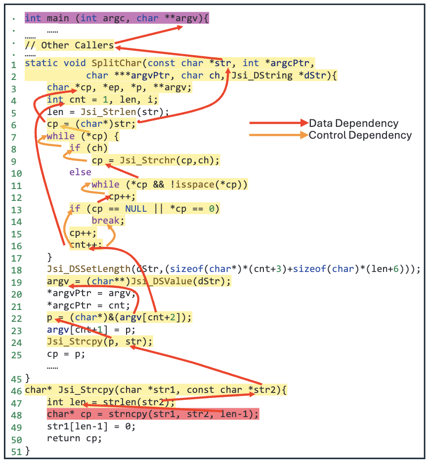<figcaption>
Figure 1: An example vulnerable program sample where the vulnerable statement is at line 48.
</figcaption></figure>
<figure>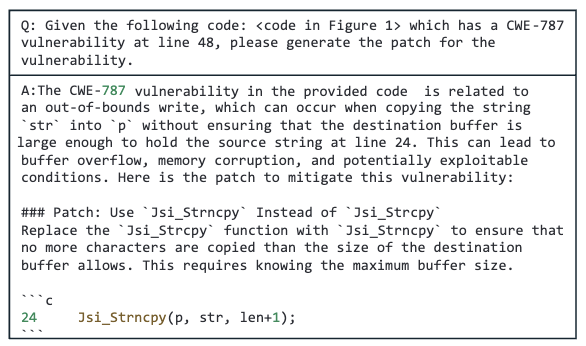<figcaption>
Figure 2: GPT-4's patch for the program sample in Figure 1 with standard prompting.
</figcaption></figure>
<figure>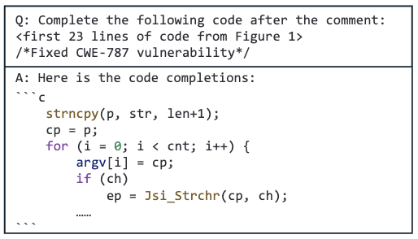<figcaption>
Figure 3: GPT-4's patch for the sample in Figure 1 with a state-of-the-art LLM-based approach zero-shot completion.
</figcaption></figure>

## 2 Background and Motivation

LLM은 취약점 탐지[[36]](#ref36), 패치[[43]](#ref43), [[47]](#ref47), 보안 코드 생성[[21]](#ref21)과 같은 취약점 분석 작업에 대해 탐색되었습니다. 취약점 패치에 대한 기존 접근 방식 중 널리 사용되는 방법은 표준 프롬프팅 전략을 사용하는 것으로, LLM에 직접 취약한 코드를 패치하도록 요청합니다[[47]](#ref47). 그러나 이 방법은 LLM에 필요한 지침을 제공하지 않으므로 모든 취약점 분석 추론 과정을 모델에 맡깁니다. 또 다른 SOTA 방법은 제로샷 코드 완성[[43]](#ref43)으로, 취약한 코드를 제거하고 LLM이 취약한 부분을 완성하도록 합니다. 그러나 이 접근 방식은 취약점 패치를 코드 분석/추론 없이 간단한 코드 완성 작업으로 취급합니다.

기존 LLM 기반 취약점 패치 접근 방식의 한계를 보여주기 위해, 위에서 언급한 두 가지 방법을 그림 1의 예제에 대해 테스트합니다. 그림에서 볼 수 있듯이, 이 예제에는 48행에 CWE-787 취약점이 있습니다. 이 취약점은 문자열 `str2`가 포인터 `str1`이 가리키는 (메모리 영역의) 경계보다 길 수 있으므로 `str1` 포인터에 대한 경계 밖 쓰기 가능성으로 인해 발생합니다. 그림 2는 표준 프롬프팅을 사용한 GPT-4의 출력 패치를 보여주며, 여기서 우리는 모델에 취약한 줄과 CWE ID를 제공하여 취약점을 패치하도록 직접 요청합니다. 보시다시피, GPT-4는 취약점이 24행에서 `p`가 가리키는 메모리의 불충분한 크기로 인해 발생하며 쓰기가 `p`의 경계보다 길지 않도록 해야 한다는 것을 인식하는 것 같습니다. 기본 아이디어는 정확하지만, 취약점을 패치하기 위해 `p`가 얼마나 많은 메모리를 가리켜야 하는지 알아내는 것도 필요합니다. 이 경우, 필요한 데이터/제어 종속성 분석이 필요합니다. 그러나 GPT-4는 코드 시맨틱을 분석하지 않고 `Jsi_Strcpy`를 `Jsi_Strncpy`로 변경하고 쓰기 제한 `len+1`을 추가하여 패치를 생성합니다. 따라서 취약점을 패치하는 데 실패합니다.

그림 3은 제로샷 코드 완성 방법을 사용한 GPT-4의 출력 패치를 보여줍니다. 그림에서 볼 수 있듯이, 우리는 23행까지의 코드(실제 패치가 위치한 곳)를 제공하고 모델에 (주석을 통해) CWE-787 취약점을 해결하면서 나머지 코드를 완성하도록 프롬프트합니다. 표준 프롬프팅과 유사하게, `p`의 실제 크기를 분석하지 않고 단순히 24행을 `strncpy`로 완성하고 쓰기 제한 `len+1`을 설정합니다. 따라서 이 또한 취약점을 패치하는 데 실패합니다.

위의 두 가지 예제를 바탕으로, 실제 취약점을 효과적으로 패치하려면 강력한 LLM이라도 코드 시맨틱에 대한 필요한 추론을 위해 단계별로 안내받아야 할 수 있다는 것이 분명합니다. 따라서 우리는 시맨틱 추론 지침을 통해 LLM을 적응적으로 프롬프트하는 자동화된 프레임워크인 APPATCH를 소개합니다. APPATCH에는 네 가지 주요 설계 요소가 있습니다.

1. LLM이 취약점 패치를 위해 프로그램의 가장 필수적인 부분에 집중하도록 돕기 위해, 우리는 프로그램의 핵심 취약한 동작을 포착하는 코드 엔티티만 LLM에 제공하는 시맨틱 인식 범위 지정을 도입합니다(취약점 시맨틱으로 표기됨).
2. LLM이 취약점을 정확하게 분석하고 패치하도록 안내하기 위해, 우리는 몇 가지 예시를 통해 올바른 추론 단계를 보여주는 CoT 프롬프팅[[51]](#ref51)을 통해 취약점 시맨틱 추론 기능을 제공합니다.
3. 취약점 근본 원인과 패치 전략의 다양성을 고려하여 대규모 예시 풀이 필요합니다. 그러나 예시에 대한 추론 단계를 수동으로 작성하는 것은 시간이 많이 걸립니다. 따라서 우리는 기존 실제 샘플을 기반으로 예시를 생성하는 자동화된 예시 마이닝 모듈을 설계합니다.
4. 주어진 테스트 샘플(즉, 패치할 코드)에 가장 적합한 예시를 제공하기 위해, 우리는 테스트 샘플의 취약점 근본 원인을 기반으로 예시를 자동으로 선택하는 동적 적응형 프롬프팅을 설계합니다.

## 3 Technical Design

이제 우리의 기술적 접근 방식을 제시하며, 각 구성 요소에 대한 세부 정보와 함께 설계 개요부터 시작하겠습니다.

### 3.1 Overview

APPATCH의 전체 설계는 그림 4에 나와 있습니다. 우리는 APPATCH를 사용하여 현실적인 취약점 패치 시나리오를 목표로 하며, 여기서 (1) 주어진 프로그램의 취약점 발생 위치(즉, 취약한 문장)와 (2) 취약점 유형(즉, CWE ID)을 사용할 수 있습니다. 패치 시간 이전에, APPATCH는 (3) 실제 패치가 알려진 기존 취약점 샘플을 사용하여 패치 생성을 향한 올바른 추론을 LLM에 보여줍니다. 이 세 가지가 APPATCH의 입력을 구성합니다.

이러한 입력을 사용하여 APPATCH는 두 단계로 작동합니다. 1단계: 예시 마이닝에서, 시맨틱 인식 범위 지정(1.1)을 통해 주어진 각 취약점 샘플을 유니온 슬라이스[[8]](#ref8)하여 취약점 시맨틱(취약점의 필수 동작, §3.2에서 공식적으로 정의됨)을 포착합니다. 그런 다음, APPATCH는 예시 생성(1.2)을 진행하여 근본 원인 분석, 수정 전략 및 실제 패치를 포함하는 각 예시 풀을 생성합니다. 근본 원인과 수정 전략은 또한 취약점 시맨틱과 실제 패치에 따라 LLM에 의해 자동으로 생성됩니다.

<figure>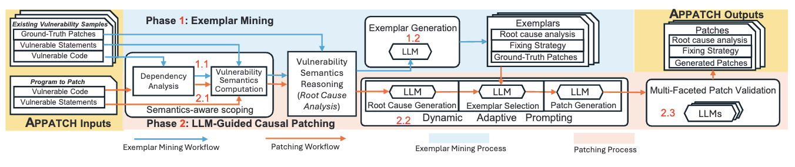<figcaption>
Figure 4: An overview of APPATCH's design, including its inputs, two main working phases, and outputs.
</figcaption></figure>

다음으로, 2단계: LLM 기반 원인 패치에서, 패치할 주어진 프로그램도 취약점 시맨틱(2.1)으로 범위가 지정됩니다. 그런 다음, 동적 적응형 프롬프팅(2.2)을 통해 APPATCH는 LLM으로 주어진 취약점의 근본 원인을 분석하고 근본 원인을 기반으로 유사한 예시를 선택합니다. 선택된 예시를 사용하여 LLM에서 CoT 프롬프팅을 통해 후보 패치가 생성됩니다. 마지막으로, 생성된 패치는 다각적인 패치 검증(2.3) 프로세스를 통해 여러 LLM을 통해 검증되고 개선됩니다.

결과적으로, 검증된 패치는 APPATCH의 출력으로 반환됩니다. 두 단계 모두 취약점 시맨틱 추론을 사용하여 자동화된 근본 원인 및 수정 전략 식별을 위해 LLM에 의존하지만, 1단계는 추가적으로 실제 패치를 모델에 제공합니다. 이 추가는 LLM이 그렇지 않은 경우보다 더 정확할 가능성이 있는 근본 원인과 수정 전략을 생성하는 데 도움이 될 것으로 예상되므로, 패치 시점에 LLM의 유사한 추론을 유도하는 시연(예시) 목적에 부합합니다.

### 3.2 Vulnerability Semantics

우리는 다음 통찰력을 바탕으로 이 핵심 개념을 APPATCH에 도입합니다. 첫째, 취약한 프로그램에는 많은 코드 라인이 포함될 수 있지만, 종종 그 라인 중 상대적으로 작은 부분만이 실제로 취약점을 유발합니다. 이 부분에 초점을 맞추면(코드를 취약하게 만드는 코드의 시맨틱을 범위 지정하여, 직관적으로 현재로서는 취약점 시맨틱으로 표기됨) LLM이 더 효과적인 취약점 분석을 수행할 수 있습니다. 둘째, 주류 LLM은 종종 긴 텍스트를 처리하고 생성하는 데 어려움을 겪습니다. 범위를 취약점 시맨틱으로 좁힘으로써 예시, 프롬프트 및 응답의 길이를 줄여 LLM에 대한 잠재적인 방해 요소를 최소화하고 성능을 향상시킬 수 있습니다. 셋째, 취약점 관련 제어/데이터 흐름은 LLM이 흐름에 대한 추론 지침 없이 이해하기 어려운 것입니다[44]. 따라서 취약점 시맨틱 기반 추론은 LLM이 효과적인 취약점 패치를 수행하도록 안내하는 데 필요합니다.

따라서 우리는 취약점 시맨틱을 프로그램의 취약점에 기여하는 코드의 측면으로 정의합니다. 물론 여기에는 취약점이 트리거되는 문장이 포함됩니다. 그러나 이러한 문장만으로는 외부 입력을 통해 악용될 수 없는 한 취약점을 유발하지 않습니다. 따라서 취약점 시맨틱을 효과적으로 포착하려면 이러한 문장이 제어 및 데이터 흐름 종속성을 통해 프로그램의 외부 입력에 어떻게 영향을 받는지 고려하는 것이 중요합니다. 따라서 우리는 또한 취약점 문장에 영향을 미치는 컨텍스트 문장을 데이터 및 제어 흐름을 기반으로 취약점 시맨틱의 일부로 포함합니다.

문장 집합 S로 구성된 프로그램 P가 주어지면, 취약점 위치 집합 $S_v \subset S$는 취약점이 나타나는 문장입니다. 외부 입력 집합 $E_I \subset S$는 외부 입력 데이터가 P에 의해 수신되거나 검색되는 문장으로 구성됩니다. 여기에는 프로그램 입력 변수, 데이터를 읽는 외부 함수 호출의 반환, 그리고 다른 함수에 의해 수정된 전역 상태(예: 메모리 할당, 파일 입력, 네트워크 입력 등)가 포함됩니다. 취약점 시맨틱 $V(P, S_v, E_I)$는 취약점 위치 $S_v$ 중 하나에서 시작하여 $E_I$의 외부 입력 중 하나에서 끝나는 프로그램 P의 모든 정적 역방향 슬라이스의 합집합으로 정의됩니다. 즉,

$$
V(P, S_v, E_I) = \bigcup_{e_i \in E_I} \bigcup_{s_v \in S_v} \text{Slice}(P, s_v, e_i)
$$

여기서:
- `Slice(P, sv, ei)`는 $s_v$에서 $e_i$까지의 정적 역방향 슬라이스에 있는 모든 문장의 집합입니다.
- $s_v$에서 $e_i$까지의 정적 역방향 슬라이스는 $s_v$에서의 실행에 영향을 미치는 P의 문장 하위 집합으로, 제어 및 데이터 종속성을 따라 역방향으로 추적하여 $e_i$에 도달합니다.

취약점 위치와 외부 입력은 다른 함수에 있을 수 있습니다. 따라서 우리는 취약점 시맨틱을 포괄적으로 포착하기 위해 프로시저 간 역방향 슬라이싱을 수행합니다. 이러한 방식으로, $V(P, S_v, E_I)$는 외부 입력 $E_I$ 중 하나에서 취약점 위치 $S_v$ 중 하나로의 데이터 및 제어 흐름과 관련된 P의 모든 문장 집합을 나타냅니다.

예를 들어, 그림 1은 취약점 시맨틱의 부분적인 표현을 보여줍니다. 우리는 48행의 취약한 문장($s_v$)에서 시작하여 데이터 및 제어 종속성(빨간색 및 주황색 화살표로 표시됨)을 기반으로 프로그램 입력까지 유니온 슬라이싱을 수행합니다. 결과적으로, 노란색으로 표시된 문장은 취약한 문장의 컨텍스트입니다. 취약한 문장(빨간색으로 표시됨), 외부 입력(보라색으로 표시됨) 및 컨텍스트 문장은 샘플의 (코드 표현인) 취약점 시맨틱을 구성합니다.

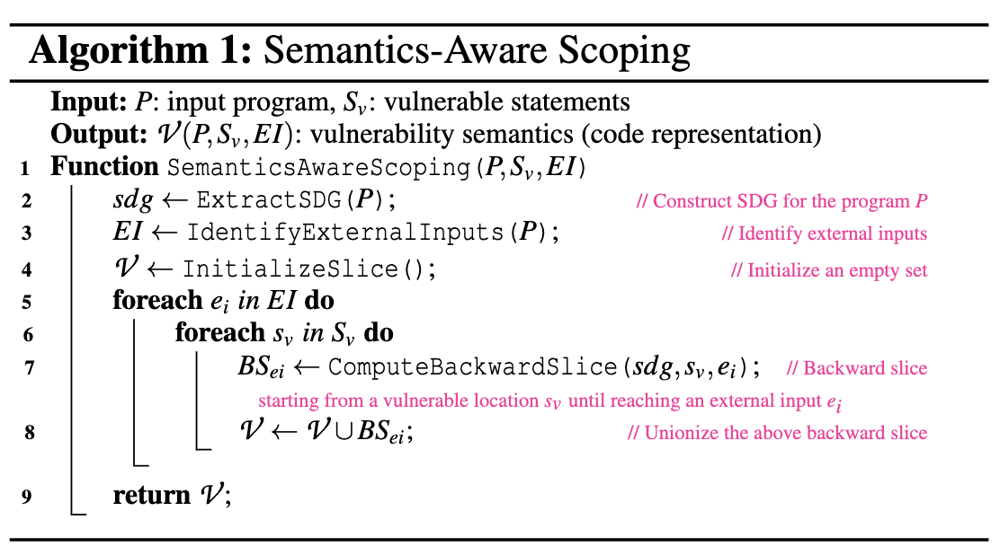

### 3.3 Exemplar Mining (Phase 1)

#### 3.3.1 Semantics-Aware Scoping (Step 1.1)

이 단계에서 APPATCH는 기존의 각 취약한 코드 샘플에서 취약점 시맨틱을 나타내는 필수 코드를 추출합니다. 이를 위해 먼저 샘플을 분석하고 프로시저 간 종속성 분석을 통해 시스템 종속성 그래프(SDG)[23]를 구성합니다. SDG는 프로그램의 데이터 종속성과 제어 종속성을 모두 결합한 표현이므로 프로그램의 취약점 시맨틱을 계산하는 데 필수적입니다. 알고리즘 1에서 볼 수 있듯이, 취약점 시맨틱 계산은 SDG를 구축하여 이 프로세스를 시작합니다(2행). 그런 다음, 간단한 정적 분석을 수행하여 `IdentifyExternalInputs`(3행)을 실현합니다. 먼저 외부 입력을 생성하거나 프로그램 상태에 부작용을 일으킬 수 있는 외부 함수 집합(예: `malloc`, `socket_recv`, `scanf`)을 선별합니다. 그런 다음, 프로그램의 제어 흐름 그래프(CFG)를 순회하여 이러한 외부 함수의 각 호출 사이트를 식별합니다. 더 포괄적으로 하기 위해, 프로그램의 입력 변수의 정의 사이트도 외부 입력으로 간주합니다(단순히 프로그램 진입점을 해당 정의 사이트의 공동 엔티티로 취급함).

주 루프가 시작되면, 방금 구성한 SDG를 기반으로 한 또 다른 정적 분석을 통해 각 취약한 문장 $s_v$에서 각 외부 입력 $e_i$까지의 프로시저 간 역방향 슬라이스를 계산합니다(5-8행). $s_v$에서 sdg를 순회하여 $e_i$에 도달할 때까지(더 이상 역방향 종속성이 없음) 전이적으로 역방향 종속성을 식별합니다. 마지막으로, $E_I$의 모든 외부 입력에 대한 유니온 슬라이스[8]를 계산하고(8행) 이를 취약점 시맨틱의 (코드 표현인) 것으로 반환합니다(9행).

#### 3.3.2 Exemplar Generation (Step 1.2)

1.1단계에서 계산된 취약점 시맨틱을 사용하여, 1.2단계는 주어진 기존 취약점 샘플에서 예시를 생성합니다. 우리의 동적 적응형 프롬프팅은 LLM이 적절한 중간 추론을 통해 고품질 패치를 생성하도록 안내하는 CoT 프롬프팅을 활용하므로, 전체 추론 프로세스를 (1) 취약점 시맨틱 추론(근본 원인 분석), (2) 수정 전략 식별, (3) 패치 생성의 세 가지 상위 수준 단계로 나눕니다. 그러나 수집된 각 샘플에 대한 추론을 수동으로 작성하는 것은 어렵습니다. 따라서 우리는 LLM을 활용하여 예시를 자동으로 생성합니다. 주어진 기존 샘플에 실제 패치가 있으므로, LLM에 다음 템플릿을 사용하여 (1)을 생성하도록 프롬프트합니다.

> Q: 다음 코드 슬라이스 $V_{exem}$은 `<CWE-ID>` 중 하나와 $S_v$ 행에 취약점이 있으며, 패치는 `<ground-truth patch>`입니다. 식별된 외부 입력: `<EI identified>`에서 시작하여, 취약점이 결정될 때까지 취약한 동작에 대해 단계별로 추론하십시오.

코드 슬라이스 V는 전체 프로그램에 걸쳐 프로시저 간에 걸쳐 있으므로 많은 수의 코드 문장을 포함할 가능성이 높아[10] LLM이 처리하기 어렵습니다. 따라서 식별된 EI는 알고리즘 1에서 식별된 전체 EI 집합의 일부일 뿐이며, 패치 위치 중 하나에 도달합니다. 그런 다음, LLM에 제공되는 코드 슬라이스 $V_{exem}$은 식별된 EI 하위 집합 중 하나와 취약한 문장 중 하나 사이의 경로만 포함합니다. 이는 LLM이 취약점 패치를 위해 프로그램의 가장 필수적인 부분에 집중하는 데 도움이 됩니다.

이 템플릿(및 동적 적응형 프롬프팅의 근본 원인 생성을 위한 템플릿)에서는 "외부 입력으로 시작하여 취약점이 결정될 때까지 취약한 동작에 대해 단계별로 추론"으로 설명되는 취약점 시맨틱 기반 추론을 활용합니다. 이것은 간단하지만 LLM이 취약점 근본 원인을 포괄적이고 효과적으로 분석하는 데 크게 도움이 됩니다. 그림 5와 9는 취약점 시맨틱 기반 추론이 있는 경우와 없는 경우의 근본 원인 분석 비교를 보여줍니다. 이러한 추론이 없으면 출력은 취약점 원인에 대한 많은 세부 정보를 놓치게 되어 분석이 부정확해집니다.

자동화된 예시 생성의 기본이 되는 핵심 통찰력은 실제 패치가 제공되면 LLM이 패치할 새로운 샘플이 주어졌을 때 패치를 생성하도록 스스로를 안내하는 데 도움이 되는 올바른 추론 단계를 생성할 수 있다는 것입니다. 이 가설을 확증하기 위해, 우리는 수집된 데이터셋의 실제 샘플에 대한 예비 실험을 수행합니다(§5.1 참조). GPT-4에 의해 생성된 예시에 대한 수동 검사를 기반으로, 추론의 92.98%가 정확하여 LLM을 사용하여 예시를 자동으로 생성하는 것이 효과적임을 나타냅니다. 이러한 예시는 동적 적응형 프롬프팅 단계(2.2단계)에서 예시를 선택하기 위한 고품질 예시 풀을 구성합니다.

### 3.4 LLM-Guided Causal Patching (Phase 2)

#### 3.4.1 Semantics-Aware Scoping (Step 2.1)

2단계에서는 취약한 코드와 취약점 위치를 포함하는 테스트 샘플이 주어지면 APPATCH는 시맨틱 인식 범위 지정 모듈을 사용하여 다시 취약점 시맨틱을 계산합니다. 프로세스는 1.1단계와 동일합니다. 소스 코드에서 SDG를 구성한 다음 알고리즘 1을 통해 취약점 시맨틱을 얻습니다.

#### 3.4.2 Dynamic Adaptive Prompting (Step 2.2)

2.1단계에서 계산된 취약점 시맨틱을 사용하여, 우리는 LLM이 패치를 생성하도록 안내하기 위해 동적 적응형 프롬프팅을 수행합니다. 이 동적 적응형 프롬프팅 단계의 전체 알고리즘은 알고리즘 2에 나와 있습니다. APPATCH는 LLM이 근본 원인을 생성하고, 예시를 선택하고, 분리된 프롬프트에서 패치를 생성하도록 프롬프트하는 점진적인 프롬프팅 전략을 활용합니다. 이는 (1) LLM이 단계별로 패치를 생성하도록 안내하고 (2) LLM이 필요에 따라 정보와 예시를 얻을 수 있도록 하기 위한 것

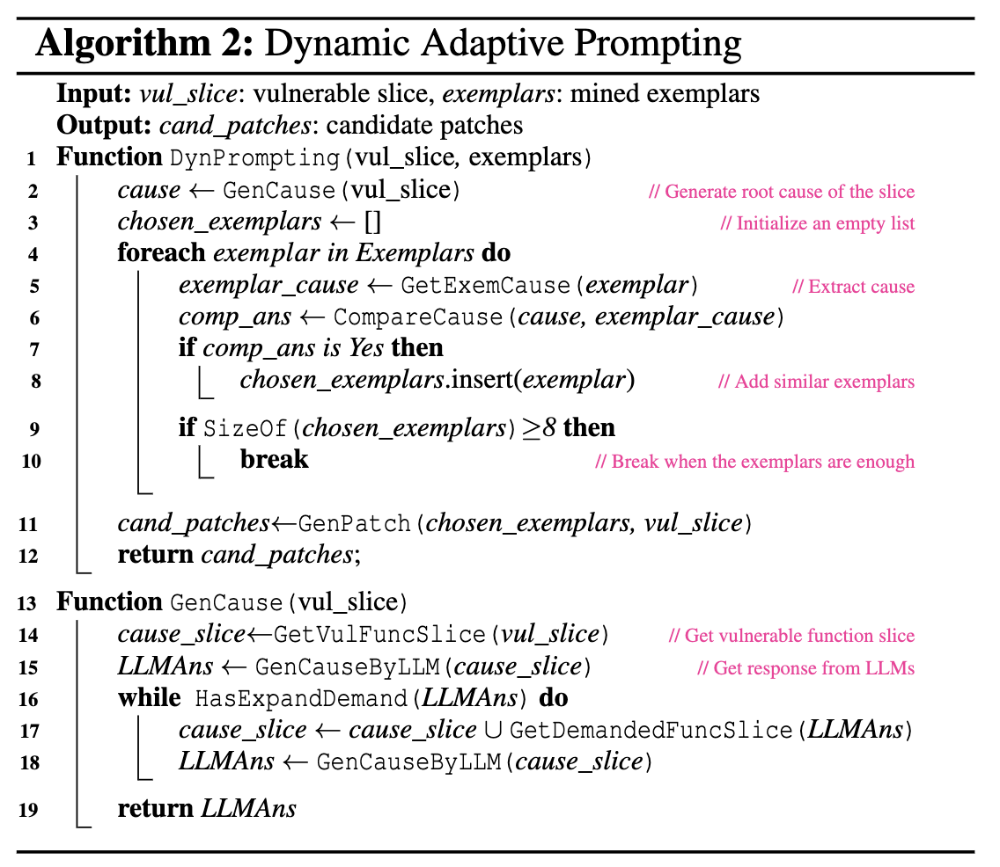

**Root Cause Generation.** 우리는 다시 취약점 시맨틱 추론을 활용하여 근본 원인 분석을 생성합니다. 계산된 취약점 시맨틱(즉, $V_{cause}$로 표기된 유니온 슬라이스), CWE ID 및 취약한 문장 $S_v$가 주어지면, APPATCH는 먼저 LLM에 근본 원인(즉, 취약점 시맨틱 추론 단계의 자연어 설명)을 생성하도록 프롬프트합니다. 우리는 다음 템플릿을 사용하여 LLM에 프롬프트합니다.

> Q: 다음 코드 슬라이스: $V_{cause}$는 `<CWE-ID>` 중 하나와 $S_v$ 행에 취약점이 있습니다. 식별된 외부 입력: `<EI identified>`에서 시작하여, 취약점이 결정될 때까지 취약한 동작에 대해 단계별로 추론하십시오. 함수 정의 부족으로 인해 불확실성이 발생하면 `{"context_funcs":[func_1,func_2,CALLER_of_func...]}` 형식으로 필요한 함수를 알려주십시오. 여기서 "CALLER_of_func"는 주어진 함수의 호출자에 대한 자리 표시자입니다.

위의 프롬프트에서, 우리는 취약한 문장을 포함하는 함수의 슬라이스에서 시작하고(알고리즘 2의 14행) LLM의 요구에 따라 슬라이스를 확장합니다. 식별된 EI는 알고리즘 I에서 식별된 EI의 일부일 뿐이며, 지금까지 LLM이 요청한 함수와 관련이 있습니다. 그 이유는 LLM은 일반적으로 입력 토큰 제한이 있으므로 전체 프로젝트를 모델에 입력할 수 없기 때문입니다. 모델이 더 많은 토큰을 수용할 수 있더라도 관련 없는 함수는 LLM이 취약점을 분석하는 데 방해가 될 것입니다. 따라서 우리는 LLM이 요청하는 함수를 포함하는 슬라이스의 일부만 제공합니다. LLift[28]와 유사한 이 점진적인 프롬프팅 체계는 APPATCH가 프로시저 간 취약점 분석 및 패치를 달성하는 데 필수적입니다.

근본 원인을 생성하는 알고리즘은 알고리즘 2의 13-19행에 나와 있습니다. 많은 수의 함수와 문장을 포함할 수 있는 취약점 코드 슬라이스가 주어지면, 우리는 취약점 발생 문장을 포함하는 함수만 포함하는 슬라이스의 일부로 시작합니다(14행). 그런 다음, LLM이 추가 함수를 요청하지 않을 때까지(15-18행) 이전에 제공된 프롬프트 템플릿을 사용하여 LLM에 반복적으로 쿼리합니다. 최종 근본 원인 분석은 동적 적응형 프롬프팅을 위해 주 루틴(DynPrompting)으로 반환됩니다.

**Exemplar Selection.** 테스트 샘플에 대한 근본 원인 분석을 생성한 후, 우리는 LLM이 패치를 생성하도록 프롬프트하기 위해 적절한 예시를 선택합니다. 알고리즘 2에서 볼 수 있듯이, 빈 목록인 `chosen_exemplars`는 근본 원인과 밀접하게 일치하는 예시를 저장하기 위해 초기화됩니다(3행). 선택 프로세스는 사전 마이닝된 예시 집합을 반복하고 그들로부터 취약점 근본 원인을 얻습니다(4-5행). 예시를 선택하기 위해, 우리는 LLM에 테스트 샘플의 근본 원인 분석 결과와 각 예시 샘플을 비교하도록 프롬프트합니다(6행).

> Q: 다음 두 근본 원인은 유사합니까?
> `<exemplar_sample_root_cause>`
> `<testing_sample_root_cause>`
> 예 또는 아니오로 간단히 대답하십시오.

복잡도가 $O(mn)$(여기서 m은 예시 샘플의 수이고 n은 테스트 샘플의 수)임을 고려하여, 우리는 LLM이 자원을 절약하기 위해 예 또는 아니오로 직접 대답하도록 합니다.

그림 6은 그림 1의 예제에 대한 예시 선택 프로세스의 일부를 보여줍니다. 사용된 LLM이 예라고 대답하면, 해당 예시 샘플의 근본 원인 분석, 수정 전략 및 실제 패치가 테스트 샘플을 패치하도록 LLM을 프롬프트하는 예시로 사용됩니다(7-8행). 우리는 원래 CoT 연구[51]를 따르며 각 테스트 샘플에 대해 최대 8개의 예시만 선택합니다.

**Patch Generation.** 예시가 선택되면, APPATCH는 LLM에 패치를 생성하도록 프롬프트합니다(11행).

<figure>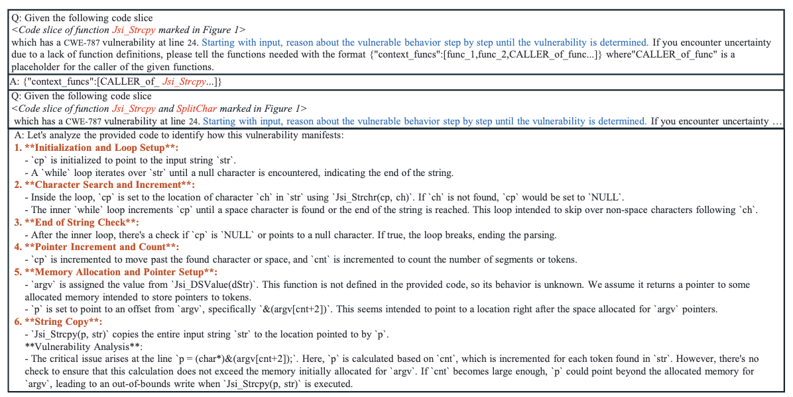<figcaption>
Figure 5: Root cause analysis generated by GPT-4 with vulnerability semantics reasoning for the sample in Figure 1.
</figcaption></figure>
<figure>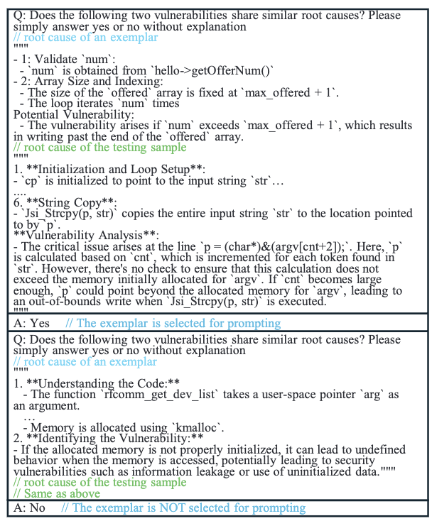<figcaption>
Figure 6: Exemplar selection by GPT-4 for the sample in Figure 1.
</figcaption></figure>
<figure>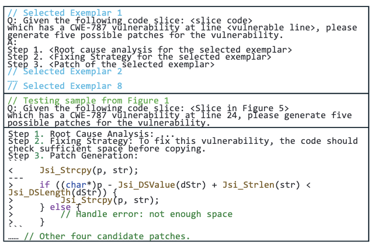<figcaption>
Figure 7: GPT-4's patch for the sample in Figure 1 with APPATCH.
</figcaption></figure>

> `<selected exemplars>`
> Q: 다음 코드 슬라이스: $V_{cause}$는 `<CWE-ID>` 중 하나와 $S_v$ 행에 취약점이 있습니다. 취약점에 대한 다섯 가지 가능한 패치를 생성하십시오.
> A: 1단계. `<root cause analysis>`

이 프롬프트에서, 우리는 먼저 각 예시가 취약점 시맨틱(유니온 슬라이스), CWE-ID, 취약한 문장, 그리고 근본 원인 분석, 수정 전략 및 실제 패치를 포함하는 선택된 예시를 제공합니다. 이는 LLM이 유사하고 완전한 워크플로로 테스트 샘플을 패치하도록 안내하기 위한 것입니다. 그런 다음, 최종 근본 원인 생성에 사용된 테스트 샘플의 취약점 시맨틱 슬라이스($V_{cause}$), CWE-ID 및 취약한 문장($S_v$)을 예시와 동일한 형식으로 제공합니다. 또한 LLM에 하나 이상의 후보 패치를 생성하도록 프롬프트하여 재현율을 향상시키고 개발자가 적절한 패치를 선택할 수 있는 더 많은 선택권을 갖도록 합니다. 반복적인 출력을 피하기 위해, 우리는 또한 LLM이 따르도록 이전 단계에서 생성된 근본 원인을 추가합니다. 동적으로 선택된 예시를 통해 LLM은 고품질 패치를 생성할 것으로 예상됩니다.

#### 3.4.3 Multi-Faceted Patch Validation (Step 2.3)

후보 패치를 생성한 후, 우리는 개발자에게 유용하지 않은 잘못된 패치를 줄이기 위해 다각적인(즉, 취약점 수정 및 기능 보존) 패치 검증을 추가로 활용합니다. 동일한 LLM이 자체적으로 생성된 패치를 검증하는 데 효과적이지 않을 수 있다는 점을 고려하여, 우리는 앙상블 방법을 활용하여 검증을 수행합니다. 따라서 취약점 패치에 효과적인 여러 LLM이 검증에 사용됩니다.

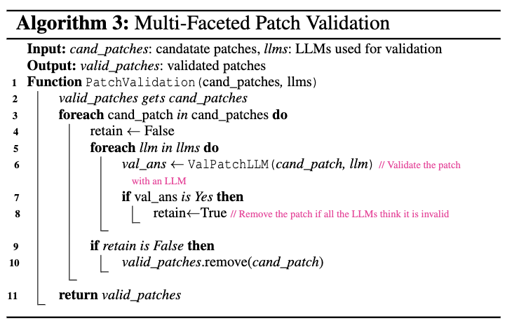

<figure>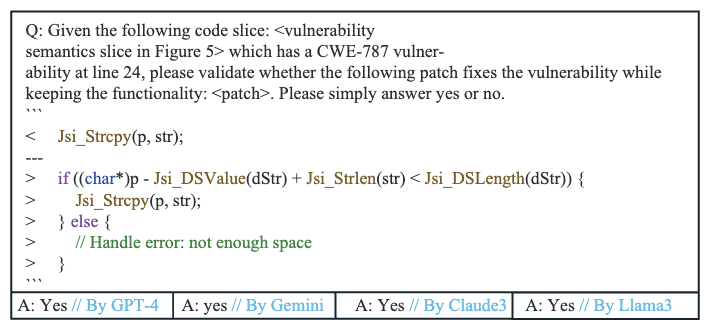<figcaption>
Figure 8: Multi-faceted patch validation for the sample in Figure 1.
</figcaption></figure>

알고리즘 3은 검증 워크플로를 보여줍니다. 모든 후보 패치를 잠재적으로 유효한 것으로 간주하여 초기화합니다(2행). 그런 다음 각 후보 패치가 각 LLM에 대해 독립적으로 평가되어 유효성을 확인하는 중첩 루프에 들어갑니다(3-4행). 내부 루프 내에서 각 패치는 개별 LLM에 의해 검증 확인을 거쳐 패치가 효과적인지 결정합니다(5행). 각 LLM은 생성된 각 패치가 다음 프롬프트를 사용하여 취약점을 올바르게 수정하는지 여부를 평가합니다.

> Q: 다음 코드 슬라이스: $V_{cause}$는 `<CWE-ID>` 중 하나와 $S_v$ 행에 취약점이 있습니다. 다음 패치가 기능을 유지하면서 취약점을 수정하는지 확인하십시오: `<patch>`. 예 또는 아니오로 간단히 대답하십시오.

프롬프트에서, 우리는 또한 LLM에 패치가 유효하지만 잘못된 패치를 피하기 위해 기능을 유지하는지 여부를 묻습니다.

그림 8은 그림 1의 예제에 대한 다각적인 패치 검증 프롬프트와 답변을 보여줍니다. LLM이 패치를 승인하면, 플래그(retain)가 True로 설정되어 패치가 유효한 패치 목록에 유지되어야 함을 나타냅니다(6-8행). 모든 LLM에 의한 평가 후, 패치가 어느 것에 의해서도 검증되지 않으면(즉, retain 플래그가 False로 유지됨), 유효한 패치 목록에서 제거됩니다(9-10행). 이 단계는 최소한 하나의 LLM에 의해 검증된 패치만 유지되도록 합니다. 알고리즘은 이 엄격한 검증 프로세스를 통과한 정제된 유효한 패치 목록을 반환하여 결론을 내립니다(11행). 우리는 다수결 투표 대신 이러한 접근 방식을 사용합니다. 왜냐하면 APPATCH는 정밀도를 유지하면서 재현율을 향상시키는 것을 목표로 하기 때문이며, 이는 실제 개발자에게 그렇지 않은 경우보다 실용적으로 더 가치가 있기 때문입니다. 다수결 투표는 정밀도를 향상시킬 수 있지만 재현율을 감소시켜 실제 패치에 덜 도움이 될 수 있습니다.

## 4 Implementation

프로시저 간 취약점 시맨틱 생성을 지원하기 위해, 우리는 Joern[53]을 사용하여 패치 중인 주어진 취약한 프로그램의 SDG를 구성합니다. 이 작업에서, 우리는 컴파일하지 않고 여러 C 코드 샘플에 대해 APPATCH를 평가하므로, 입력 코드의 컴파일 가능성을 요구하지 않고 확장 가능한 코드 분석을 위해 설계된 강력한 도구인 Joern을 선택했습니다. 구체적으로, 우리는 먼저 각 함수에 대한 PDG(제어 및 데이터 종속성 포함)를 얻습니다(Joern이 즉시 제공함). 그런 다음, Joern이 제공하는 호출 그래프를 활용하여 프로시저 간 종속성 분석을 수행하여 SDG를 구축합니다. SDG를 사용하여 취약한 문장에서 프로시저 간 역방향 슬라이스를 추출합니다. 이 작업에서, 우리는 SySeVR[33]의 스크립트를 재사용하여 각 문장에 대한 제어 흐름 노드를 신속하게 쿼리하고 입력 차수 에지 및 노드를 찾습니다. 이를 바탕으로, 우리는 알고리즘 1에 표시된 대로 시맨틱 인식 범위 지정 알고리즘을 추가로 구현합니다. 추출된 취약점 시맨틱 슬라이스는 LLM이 사용하도록 슬라이스된 소스 코드 텍스트로 저장됩니다.

## 5 Evaluation

우리는 네 가지 연구 질문(RQ)을 통해 APPATCH를 평가합니다.
- RQ1: APPATCH는 실제 취약점 패치에 얼마나 효과적입니까?
- RQ2: APPATCH의 각 주요 설계 구성 요소는 전체 성능에 어떻게 기여합니까?
- RQ3: APPATCH는 기존 취약점 패치 기술과 비교하여 얼마나 효과적입니까?
- RQ4: APPATCH는 패치 생성에 얼마나 효율적입니까?

먼저 사용된 LLM, 데이터셋 및 메트릭을 설명합니다. 그런 다음, 위의 네 가지 연구 질문에 답합니다.

**LLMs.** 표 1은 우리 연구를 위해 선택된 네 가지 SOTA LLM을 요약하여 다양한 크기와 공급업체의 최신 모델을 다룹니다. Gemini-1.5[45]와 Claude-3.5[5]는 각각 Google과 Anthropic의 최신 LLM입니다. 우리는 효과와 효율성 모두를 위해 가장 인기 있는 강력한(Pro 및 Sonnet) 모델을 선택했습니다. GPT-4는 OpenAI의 최신이자 가장 강력한 LLM이며, 우리는 가장 강력한 버전인 GPT-4-Turbo를 사용합니다. Llama-3.1[46]은 Meta의 SOTA LLM이며, 이 중에서도 우리는 실험을 위해 강력한 버전인 llama-3.1-70b를 사용하기로 선택했습니다. 우리는 코드별 LLM(예: CodeLlama) 대신 범용 LLM을 선택했습니다. 후자는 코드 분석 능력이 떨어지기 때문입니다. 부록 표 9에서 볼 수 있듯이, 우리의 예비 실험에 따르면 인기 있는 코드별 LLM(CodeLlama[2], CodeQwen 1.5[3], DeepSeekCoder-v2[57])을 기반으로 할 때 APPATCH는 각각 1.21%, 10.12%, 9.09%의 F1 점수만 달성했으며, 이는 표 2에서 볼 수 있듯이 기본 LLM으로 APPATCH에서 사용될 때 범용 LLM의 성능보다 훨씬 낮습니다.

**Datasets.** 1단계(예시 마이닝)를 위한 예시 샘플을 수집하기 위해, 우리는 널리 사용되는 기존 취약점 데이터셋인 PatchDB[49]와 CVEFixes[9]를 사용합니다. 여기서 PatchDB는 12073개의 실제 수정 샘플을 포함하고 CVEFixes는 C 언어로 된 4,120개의 실제 수정 샘플을 포함합니다. 이 작업에서, 우리는 C 언어에서 가장 인기 있는 CWE를 가진 샘플을 선택합니다: CWE-787(경계 밖 쓰기), CWE-125(경계 밖 읽기), CWE-190(정수 오버플로), CWE-401(메모리 누수), CWE-457(초기화되지 않은 변수 사용), CWE-476(NULL 포인터 사용). 그러나 일부 수정 사항에는 취약점과 관련 없는 편집(예: 코드 리팩토링 또는 새로운 기능 추가)이 포함되어 있습니다. 따라서 우리는 각 샘플을 수동으로 검사하고 부적절한 샘플을 필터링합니다. 현실적으로 하기 위해, 우리는 취약점 보고서를 읽고 취약점 수정 커밋에서 변경된 코드 라인 대신 취약점 발생 위치에 레이블을 지정합니다. 우리는 평가자 간 합의/의견 일치 절차를 적용했습니다. 각 저자는 독립적으로 레이블을 지정한 다음, 결과를 교차 확인하고 불일치를 해결하기 위해 논의했습니다. 우리는 또한 PatchDB와 CVEFixes 간의 중복 샘플을 제거하고, 아래에서 논의할 훈련 세트와 테스트 세트 간에 중복이 없는지 확인합니다. 결과적으로, 우리는 306개의 취약점 수정 샘플을 수집합니다.

테스트 세트의 경우, 최신 강력한 LLM이 기존 데이터에 대해 훈련된다는 점을 고려할 때, 훈련 중에 PatchDB 및 CVEFixes의 샘플을 보았을 가능성이 있습니다. 따라서 PatchDB 및 CVEFixes의 샘플을 테스트 세트로 사용하면 데이터 유출 및 오염 문제가 발생할 수 있습니다. 따라서 우리는 LLM의 최신 컷오프 날짜(Claude-3.5-Sonnet의 2024년 4월) 이후에 모든 취약점이 보고된 제로데이 데이터셋을 수집합니다. 결과적으로, 우리는 PatchDB 및 CVEFixes와 동일한 CWE를 다루는 97개의 취약점을 수집합니다. 그 중 21개의 취약점은 취약점 발생 위치와 패치 위치가 다른 함수에 있는 프로시저 간 취약점입니다. 이러한 샘플은 Linux 커널, FFmpeg 등 18개의 오픈 소스 프로젝트를 다룹니다. 부록 표 8은 데이터셋의 자세한 통계를 보여줍니다.

기존 취약점 패치 기술과 APPATCH를 비교하기 위해, 우리는 비교 실험을 위해 기존 취약점 데이터셋 ExtractFix[20]도 사용합니다. ExtractFix의 샘플은 컴파일 가능하며 패치를 검증할 수 있는 테스트 케이스와 함께 제공됩니다. 이 데이터셋에서, 우리는 재현할 수 있는 20개의 취약점을 수집하고, 각각에 대해 테스트 케이스의 충돌 정보를 기반으로 발생 위치와 CWE ID에 레이블을 지정합니다. 이 데이터셋의 자세한 통계는 부록 표 8에서도 찾을 수 있습니다. 우리는 또한 부록 E에서 데이터 유출 문제를 해결했습니다.

**Metrics.** 데이터셋이 많은 프로젝트를 다루고 각 샘플을 컴파일하고 테스트 케이스를 사용하여 생성된 패치를 검증하기 어렵기 때문에(또한 일부 샘플에는 테스트 케이스가 제공되지 않음), 생성된 패치가 실제와 정확히 일치하지 않으면 자동으로 검증할 수 없습니다. 따라서 우리는 생성된 각 패치를 수동으로 확인합니다. 수동 평가를 개선하고 생성된 패치를 더 잘 이해하기 위해, 우리는 네 가지 메트릭을 고려합니다. (1) 생성된 패치가 실제와 정확히 일치하면 구문적으로 동등(SynEq)하다고 간주합니다. (2) 생성된 패치가 실제와 정확히 일치하지는 않지만 동작이 실제와 동일하면 의미적으로 동등(SemEq)하다고 간주합니다. (3) 패치가 실제와 다른 동작을 하지만 코드 기능을 손상시키지 않고 취약점을 수정하면 타당(plausible)하다고 간주합니다. (4) 위의 세 가지 메트릭을 가진 모든 샘플은 정확(correct)하다고 간주됩니다. 실제 패치 시나리오를 더 잘 시뮬레이션하기 위해, 우리는 LLM에 최대 5개의 패치를 생성하도록 프롬프트하여 개발자가 취약한 코드를 패치하는 데 가장 적합한 것을 선택할 수 있도록 합니다. 생성된 패치를 더 잘 평가하기 위해, 우리는 세 가지 측정값을 고려합니다.

$$
\text{recall} = \frac{\text{\#fixed samples}}{\text{\#testing sample}} \quad (1)
$$

$$
\text{precision} = \frac{\text{\#correct patches}}{\text{\#generated patches}} \quad (2)
$$

$$
F1 = \frac{2 \times \text{recall} \times \text{precision}}{\text{recall} + \text{precision}} \quad (3)
$$

여기서 수정된 샘플은 생성된 패치 중 적어도 하나가 취약점을 수정하는 샘플을 의미합니다.

### 5.1 RQ1: Effectiveness

표 2는 두 테스트 데이터셋에 대한 APPATCH의 효과를 보여줍니다. 우리는 APPATCH가 취약점 패치에 대해 전반적으로 최고의 효과를 달성한다는 것을 알 수 있습니다. APPATCH를 사용하면 GPT-4, Gemini-1.5, Claude-3.5 및 Llama-3.1은 수집된 제로데이 데이터셋의 정확도 메트릭에 대해 각각 33.30%, 20.44%, 36.46% 및 24.28%의 F1을 달성하며, 이는 다른 프롬프팅 접근 방식 중에서 최고입니다. 기존 ExtractFix 데이터셋에서 APPATCH는 다시 다른 프롬프팅 접근 방식 중에서 최고를 달성하며, 정확도 메트릭에 대해 각각 68.41%, 42.90%, 73.86% 및 64.20%의 F1을 달성합니다. ExtractFix 데이터셋에 대한 전반적인 효과가 더 높으며, 이는 제로데이 취약점 패치의 어려움을 나타냅니다.

재현율 측면에서, Claude-3.5는 제로데이 데이터셋에서 49.48%로 최고를 달성하고 GPT-4는 ExtractFix 데이터셋에서 90.00%로 최고를 달성합니다. GPT-4는 제로데이 데이터셋에서 28.96%로 최고의 정밀도를 달성하고 Claude-3.5는 ExtractFix 데이터셋에서 65.31%로 최고의 정밀도를 달성합니다. 다른 메트릭 측면에서, Claude-3.5는 제로데이 및 ExtractFix 데이터셋에 대해 각각 37.11% 및 80.00%의 의미론적 동등성 재현율을 가집니다. 이는 APPATCH가 개발자의 패치에 가까운 패치를 생성함을 나타냅니다.

APPATCH는 제로데이 및 ExtractFix 데이터셋에서 각각 최대 36.46% 및 73.86%의 F1을 보여 취약점 패치에 효과적이며, 실용적인 잠재력을 보여줍니다.

### 5.2 RQ2: Contributions of Components

표 2에서 볼 수 있듯이, 우리는 제거된 프롬프팅 접근 방식으로 APPATCH 구성 요소의 기여도를 조사합니다. 빨간색으로 표시된 숫자는 제거된 프롬프팅 접근 방식에 의해 달성된 최고의 F1 점수입니다. 제거된 버전 중 하나인 "Manual Exemplars"는 우리의 이전 연구[37]에 해당하며, 이는 또한 LLM 기반 패치 기준선입니다.

다각적인 패치 검증을 제거하면 "no validation"에서 볼 수 있듯이 정밀도가 떨어지고 따라서 F1이 낮아지며, 제로데이 데이터셋에서는 20.41%–35.77% F1, ExtractFix 데이터셋에서는 40.00%–73.25% F1로, 다각적인 패치 검증이 정밀도를 향상시키는 데 유용함을 나타냅니다.

그런 다음 시맨틱 인식 범위 지정의 기여도를 조사합니다. 이 제거 연구에서는 취약점 시맨틱 슬라이스를 사용하는 대신 전체 소스 코드 샘플을 LLM에 직접 입력하여 분석합니다. "No slicing" 행에서 볼 수 있듯이, 취약점 시맨틱 슬라이싱이 없으면 재현율, 정밀도 및 F1이 APPATCH에 비해 크게 떨어지며, 제로데이 데이터셋에서는 19.08%-30.08% F1, ExtractFix 데이터셋에서는 37.21%-65.50% F1입니다. 그 이유는 슬라이싱이 없으면 취약점과 관련 없는 코드도 LLM에 입력되어 분석을 방해하고 근본 원인 분석의 정확도에 영향을 미치기 때문입니다. 이를 증명하기 위해, 우리는 테스트 샘플에 대한 추론의 정확도를 조사합니다. 표 10에서 볼 수 있듯이, 취약점 시맨틱 추론은 취약점 시맨틱 범위 지정/슬라이싱이 있는 경우 더 높은 정확도를 달성합니다. 이는 분석을 위해 핵심 취약점 시맨틱을 입력하는 것의 중요성을 나타냅니다.

동적 적응형 프롬프팅의 유용성을 조사하기 위해, 우리는 취약점의 근본 원인을 기반으로 예시를 선택하는 대신 무작위로 선택된 예시로 실험을 수행합니다. 예시의 CWE는 테스트 샘플과 동일하게 유지합니다. "Random Exemplars" 행에서 볼 수 있듯이, F1 점수는 APPATCH에 비해 극적으로 떨어집니다. 프롬프팅을 위해 선택된 예시는 LLM이 취약점을 올바르게 패치하는 데 도움이 되는 유망한 수정 전략을 가지고 있는 반면, 무작위 예시로 패치하기 위해 잘못된 수정 전략을 선택할 수 있습니다. 이는 취약점 패치를 위한 동적 프롬프팅의 중요성과 효과를 나타냅니다.

예시 풀의 예시가 LLM에 의해 생성되므로, 이러한 LLM 생성 예시가 사람이 선별한 예시보다 나은지 여부를 조사하기 위해, 우리는 동일한 추론 단계를 따라 수동으로 예시를 작성합니다. "Manual Exemplars" 행에서 볼 수 있듯이, 전반적인 효과는 크게 떨어지며, 이는 우리 LLM 기반 취약점 패치 설계에 대한 적응형 프롬프팅의 효과를 나타냅니다.

<figure>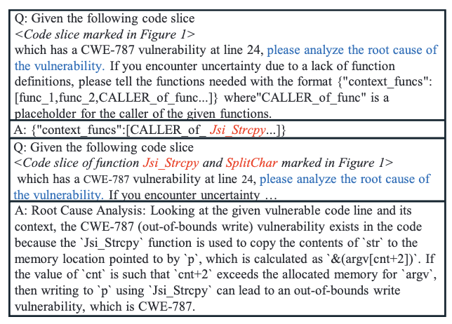<figcaption>
Figure 9: Root cause analysis generated by GPT-4 without vulnerability semantics reasoning for the sample in Figure 1.
</figcaption></figure>

취약점 시맨틱 추론의 효과를 보여주기 위해, 우리는 그림 9와 같이 LLM에 단순히 근본 원인을 생성하도록 프롬프트합니다. "Direct Reasoning" 행에서 볼 수 있듯이, 전반적인 효과는 APPATCH에 비해 크게 떨어집니다. 그 이유는 근본 원인 분석의 정확도가 표 10에서 볼 수 있듯이 취약점 시맨틱 추론보다 낮기 때문입니다. 이는 취약점 분석 및 패치를 개선하기 위해 취약점 시맨틱 추론을 위해 LLM을 안내하는 것이 효과적임을 나타냅니다.

특정 프롬프팅 설계 없이 LLM의 패치 효과를 보여주기 위해, 우리는 LLM에 주어진 취약점을 직접 패치하도록 요청합니다. "Standard Prompting" 행에서 볼 수 있듯이, 표준 프롬프팅은 APPATCH에 비해 효과가 훨씬 낮으며, 최첨단 LLM을 사용하더라도 제로데이 데이터셋에서는 최대 23.01% F1, ExtractFix 데이터셋에서는 60.42% F1만 달성합니다.

최근 Pearce 등[43]은 제로샷 코드 완성을 통해 LLM 기반 취약점 복구 문제에 접근하여 프로그램에서 취약한 코드를 제거하고 LLM이 취약한 부분을 채워 취약점을 수정하도록 합니다. 우리는 비교를 위해 그들의 최고의 템플릿 s2를 사용합니다. "zero-shot completion" 행에서 볼 수 있듯이, 이 접근 방식은 효과가 가장 낮으며, 우리 제로데이 데이터셋에서는 최대 12.48% F1, ExtractFix 데이터셋에서는 24.66% F1을 보여, 추가 정보 없이 이전 코드만 제공하는 것은 LLM이 취약점을 수정하기에 불충분함을 나타냅니다.

APPATCH의 각 구성 요소는 전체 설계의 효과에 실질적으로 기여하여 그 정당성을 입증합니다.

우리는 제로데이 데이터셋의 21개 프로시저 간 샘플을 사용하여 프로시저 간 취약점에 대한 APPATCH의 효과를 추가로 평가합니다. 표 3은 정확도 결과를 보여줍니다(전체 결과는 부록 표 12에 있음). 마찬가지로, 빨간색으로 표시된 숫자는 제거된 프롬프팅 접근 방식에 의해 달성된 최고의 F1 점수입니다. 전체 제로데이 데이터셋의 전체 결과와 비교할 때, APPATCH 및 제거된 버전은 성능이 약간 감소합니다(예: GPT-4를 사용한 APPATCH의 F1 점수는 33.30%에서 31.37%로 감소).

대조적으로, 기준 접근 방식인 표준 프롬프팅 및 제로샷 완성은 효과가 크게 감소합니다(예: 표준 프롬프팅 및 제로샷 완성을 사용한 Claude-3.5는 각각 23.01% 및 12.48%에서 9.81% 및 6.31%로 감소). 표준 프롬프팅의 경우, 계산된 취약점 시맨틱으로 다루는 모든 함수를 제공합니다. 제로샷 완성의 경우, 이러한 설정에서만 작동할 수 있으므로 실제 패치 위치가 있는 함수를 직접 제공합니다. 이들은 이미 두 기준선에 이점을 주지만 이러한 프로시저 간 샘플에서는 여전히 부족합니다. 이러한 악화는 이러한 접근 방식에서 프로시저 간 분석이 없어 LLM의 성능에 부정적인 영향을 미치는 것으로 볼 수 있습니다.

| Model | Version | #Params | Max #Tokens | Vendor | Release date | Cutoff Date |
| :--- | :--- | :--- | :--- | :--- | :--- | :--- |
| Gemini-1.5 | gemini-1.5-pro | 50T | 30,720 | Google | May 2024 | Nov. 2023 |
| Claude-3.5 | claude-3.5-sonnet | 70B | 200,000 | Anthropic | Jun. 2024 | Apr. 2024 |
| GPT-4 | gpt-4-turbo | 175B+ | 128,000 | OpenAI | May 2024 | Oct. 2023 |
| Llama-3.1 | llama-3.1-70b | 70B | 4,096 | Meta | July 2024 | Dec. 2023 |

APPATCH는 독점적으로 프로시저 간 취약점에 대해 약간의 성능 저하를 보이는 반면, 기준 접근 방식은 극적인 감소를 보입니다. 이는 APPATCH에서 프로시저 간 분석의 효과와 장점을 강조합니다.

### 5.3 RQ3: Comparison to Existing Techniques

APPATCH의 효과를 기존 취약점 패치 기술과 비교하기 위해, 우리는 표 4와 같이 다양한 기술 범주를 다루는 4개의 최첨단 비-LLM 기반 도구를 선택합니다. 여기서 빨간색 숫자는 기준선에 의해 달성된 최고의 재현율을 나타냅니다. VulRepair[18]는 사전 훈련된 프로그래밍 언어 모델 CodeT5[50]를 미세 조정하여 취약점을 복구하는 DL 기반 취약점 복구 기술입니다. Getafix[7]는 기존 샘플에서 취약점 패치 패턴을 학습하는 데이터 기반 패턴 기반 취약점 복구 기술입니다. ExtractFix[20]는 테스트 케이스와 제약 조건을 활용하여 취약점을 수정하는 전통적인 취약점 패치 기술입니다. VulnFix[55]는 귀납적 추론을 기반으로 한 SOTA 취약점 패치 기술입니다.

ExtractFix와 VulnFix는 제로데이 데이터셋에서 구축하기 어려운 컴파일 가능한 프로젝트와 테스트 케이스가 필요하므로, 먼저 ExtractFix 데이터셋을 비교에 사용합니다. ExtractFix와 VulnFix는 테스트를 위해 많은 패치를 생성하므로, 이 RQ에서는 재현율 메트릭만 비교합니다. 학습 기반인 Vul-Repair 및 Getafix의 경우, PatchDB+CVEFixes 훈련 세트를 사용하여 모델을 다시 훈련합니다.

표 4에서 볼 수 있듯이, ExtractFix 데이터셋에서 최고의 LLM(GPT-4)을 사용한 APPATCH는 최고의 재현율(90%)을 달성합니다.

기준 기술과 비교합니다. 구문적으로 동등하고, 의미적으로 동등하며, 타당한 것의 재현율 합계는 각 테스트 샘플에 대해 여러 패치가 생성되기 때문에 정확한 것에 대한 재현율을 초과할 수 있습니다. ExtractFix는 패치를 위한 테스트 케이스와 제약 조건을 활용하기 때문에 85%의 재현율을 달성합니다. 이러한 정보가 없으면 다른 기준 기술은 25%-45%의 재현율만 달성합니다.

ExtractFix 데이터셋은 2021년에 출시되었으며, 사용된 LLM의 컷오프 날짜 이전이므로 데이터 유출 문제가 발생할 수 있습니다. 따라서 우리는 LLM이 메타 데이터가 주어진 관련 정보와 패치를 알고 있는지 여부를 테스트합니다. 결과는 그들이 모르거나 잘못된 답변을 제공함을 보여주며, 이는 데이터 유출 문제가 심각하지 않음을 나타냅니다. 자세한 결과는 부록 E에서 찾을 수 있습니다.

우리는 제로데이 데이터셋에서 기준선을 추가로 평가합니다. 이러한 샘플은 컴파일할 수 없으므로, 다른 두 가지(VulnFix 및 ExtractFix) 모두 입력 코드가 컴파일 가능해야 하므로 VulRepair 및 Getafix와 비교를 제한합니다. 표 4에서 볼 수 있듯이, APPATCH는 두 기준선을 모두 크게 능가하여 VulRepair의 17.53% 및 Getafix의 6.19%에 비해 49.48%의 재현율을 달성합니다. 이는 패치에서 APPATCH의 우수한 효과를 강조합니다.

효과와 장점을 강조합니다.

| Technique | SynEq | SemEq | Plausible | Correct | SynEq | SemEq | Plausible | Correct |
| :--- | :--- | :--- | :--- | :--- | :--- | :--- | :--- | :--- |
| APPATCH | 5% | 75% | 40% | 90% | 4.12% | 37.11% | 22.68% | 49.48% |
| VulRepair | 10% | 25% | 0% | 35% | 2.06% | 15.46% | 1.03% | 17.53% |
| Getafix | 20% | 5% | 0% | 25% | 5.15% | 0.00% | 1.03% | 6.19% |
| ExtractFix | 20% | 35% | 30% | 85% | | | | |
| VulnFix | 15% | 10% | 20% | 45% | | | | |

기존 기술과 비교할 때, APPATCH는 추가 정보 없이 취약점 패치에 효과적입니다.

### 5.4 RQ4: Efficiency

우리는 시간 비용과 토큰 사용량 측면에서 APPATCH의 효율성을 평가합니다. 표 5는 각 LLM에 대한 샘플당 APPATCH의 시간 비용과 토큰 사용량을 보여줍니다. 예시를 마이닝한 후, 각 샘플은 예시 선택 및 후보 패치 생성 시간을 포함하여 패치를 생성하는 데 37.148초에서 50.209초가 걸립니다. 이 과정에서, 입력/컨텍스트 토큰 사용량은 샘플당 5,684에서 6,802 범위이며, 생성된 토큰 사용량은 584에서 886 범위입니다. 우리는 Claude-3.5와 GPT-4가 더 많은 토큰을 사용하는 반면 Gemini-1.5와 Llama-3.1은 더 적게 사용한다는 것을 알 수 있습니다. 그 이유는 이전 두 모델이 예시와 패치를 생성할 때 더 많은 토큰을 생성하는 경향이 있기 때문입니다. 각 모델의 API 속도에 따라, 각 샘플을 패치하는 데 0.2에서 8센트가 듭니다. 그러나 Gemini-1.5는 사용량이 많지 않으면 무료 버전을 제공하고 Llama-3.1은 로컬 배포를 지원합니다. 그렇다면 두 모델은 무료입니다.

APPATCH는 시간과 비용 모두에서 취약점 패치에 효율적입니다.

| Model | Time cost | Contexts Tokens | Generated Tokens | Price |
| :--- | :--- | :--- | :--- | :--- |
| GPT-4 | 40.169s | 6290 | 647 | $0.0823 |
| Claude-3.5 | 50.209s | 6802 | 886 | $0.0336 |
| Gemini-1.5 | 37.148s | 5684 | 584 | $0.0026 |
| Llama-3.1 | 46.598s | 5749 | 591 | $0.0203 |

## 6 Discussion

우리는 APPATCH의 더 큰 효과를 가능하게 하는 장점과 일부 샘플에서 실패하는 이유와 방법, 도구 사용성, 현재 한계 및 APPATCH의 확장성에 대해 추가로 논의합니다.

### 6.1 Why APPATCH Works

취약점 패치에 대한 APPATCH의 장점은 여러 가지가 있습니다. 첫 번째 장점은 시맨틱 인식 범위 지정에 의해 기여됩니다. 그림 1에서 볼 수 있듯이, 시맨틱 인식 범위 지정이 없으면 분석하고 패치할 코드에는 취약점과 관련 없는 많은 문장이 포함됩니다. 이 경우, LLM은 주의가 산만해져 올바른 근본 원인과 패치를 생성하기가 더 어렵습니다. 비교하여, 우리의 시맨틱 인식 범위 지정으로 인해 LLM에 의해 분석되고 패치된 슬라이스에는 취약점 분석 및 패치를 위한 핵심 코드 조각만 포함됩니다. 이는 LLM이 패치에 가장 중요한 부분인 취약점 시맨틱에 집중하는 데 도움이 될 뿐만 아니라 데이터 및 제어 흐름을 원래 코드보다 더 명확하게 만듭니다. 예를 들어, 원래 코드에서 22행의 변수 `cnt`는 16행의 마지막 정의에서 6줄 떨어져 있습니다. 그러나 취약점 시맨틱 슬라이스에서는 단 2줄 떨어져 있어 LLM이 취약점 패치를 위한 데이터 종속성을 더 쉽게 찾을 수 있습니다.

그림 2, 3, 7은 표준 프롬프팅, 제로샷 완성 및 APPATCH를 사용한 GPT-4에 의해 생성된 분석 및 패치를 보여주며, 여기서 표준 프롬프팅 및 제로샷 완성은 취약점을 올바르게 패치하는 데 실패하는 반면 APPATCH는 성공합니다. 우리는 시맨틱 인식 범위 지정을 사용한 APPATCH에서 GPT-4가 변수 `p`, `cnt`, `dStr`에 대한 더 많은 데이터 흐름 정보를 캡처할 수 있는 반면, 표준 프롬프팅 및 제로샷 코드 완성을 사용한 GPT-4는 취약한 라인 자체를 기반으로 코드를 분석하고 패치만 한다는 것을 알 수 있습니다. 이는 시맨틱 인식 범위 지정이 LLM이 효과적인 취약점 패치에 중요한 데이터 종속성 분석을 더 잘 수행하는 데 도움이 됨을 나타냅니다.

APPATCH의 두 번째 장점은 무작위 또는 고정 프롬프트를 사용하는 대신 테스트 샘플을 기반으로 동적으로 프롬프트한다는 것입니다. 이를 통해 LLM은 시간과 비용이 많이 드는 LLM 미세 조정을 피하면서 소수 샷 학습으로 기존의 실제 취약점 데이터를 대량으로 활용할 수 있습니다. 토큰 제한과 긴 텍스트 프로세스에 대한 LLM의 단점 때문에 소수 샷 학습을 위해 모든 예시를 입력하는 것은 불가능합니다. 대조적으로, CoT를 사용한 동적 적응형 프롬프팅은 LLM이 피상적으로 분석하는 대신 취약점을 심층적으로 분석하도록 안내합니다. 그림 2, 3, 7에서 볼 수 있듯이, APPATCH를 사용한 GPT-4는 취약점의 근본 원인에 대한 심층 분석을 수행하는 반면, 표준 프롬프팅을 사용한 GPT-4는 그렇지 않습니다. 동적 적응형 프롬프팅의 예시는 GPT-4가 패치를 올바르게 생성하는 데 크게 도움이 되는 포인터 `p`의 크기와 경계를 찾도록 안내합니다.

특히, LLM이 취약점 시맨틱 추론 단계(즉, 취약점 시맨틱의 자연어 표현)를 자동으로 생성하는 능력은 1.2단계의 자동화에 핵심입니다. 또한 추론은 본질적으로 코드의 취약한 동작을 분석하므로 즉시 근본 원인 분석 역할을 합니다. 중요하게도, 기능 시맨틱을 대신 사용하면 LLM이 코드의 기능적 동작을 이해하는 데 도움이 되므로, 우리가 광범위하게 검증한 바와 같이 모델이 취약점 근본 원인을 이해하는 데별로 도움이 되지 않아 패치 생성을 안내하지 못합니다.

세 번째 장점은 APPATCH가 사용할 수 없는 패치를 제거하기 위해 다각적인 패치 검증 전략을 수행한다는 것입니다. 표 2에서 볼 수 있듯이, 다각적인 패치 검증을 통해 정밀도는 재현율에 영향을 주지 않고 크게 향상됩니다. 이는 F1을 향상시키고 적절한 패치를 선택하는 개발자의 부담을 효과적으로 줄여 APPATCH의 실용성을 보여줍니다.

### 6.2 Usability of APPATCH

이 작업에서, 우리는 패치 중인 취약점이 올바른 CWE 및 위치 정보로 사전 탐지되었다고 가정합니다. 그러나 이러한 정보는 항상 사용 가능하지 않을 수 있습니다. 이 경우, APPATCH는 실제로 작동하기 위해 다른 취약점 분석기(정보를 제공하는)와 협력해야 할 수 있습니다. 따라서 APPATCH의 공식화가 현실적이고 사용성을 보여주기 위해, 우리는 상류 탐지/지역화 및 분류 도구에서 생성된 이러한 정보를 제공받았을 때의 성능을 평가합니다. 이는 종단 간 통합이라고 하는 설정으로, 최고의 성능을 보이는 LLM Claude-3.5에 대해 제로데이 데이터셋에 대해 평가합니다.

포괄적인 평가를 위해 두 가지 통합 시나리오를 고려합니다. 첫 번째는 상류 도구의 정보가 사람의 개입 없이 APPATCH에 직접 입력으로 제공되는 완전 자동화된 워크플로입니다. 두 번째는 해당 도구의 출력을 먼저 검사, 확인 및 필요한 경우 보정한 다음, 검증/보정된 위치 및 CWE 정보를 APPATCH에 제공하는 시나리오입니다. 일반적인 현실적인 취약점 관리 워크플로에서 개발자는 이러한 출력을 사용하여 패치를 진행하기 전에 자동화된 (취약점 지역화 및 분류) 도구의 출력을 검사하고 보정합니다. 여러 가지 이유(예: 정확도/신뢰 문제 - 자동화된 도구는 완벽하지 않으며 위양성 및 위음성을 생성할 수 있음, 다른 고려 사항[4] 등) 때문입니다. 따라서 우리는 두 번째를 현실적인 시나리오라고 부릅니다.

상류 도구의 경우, 실제 프로젝트에서 널리 사용되는 산업 등급 보안 분석기인 CodeQL[1]을 선택했습니다. 또한 탐지/지역화 및 분류 목적을 동시에 제공하므로 사용자는 APPATCH에 두 입력을 모두 제공하기 위해 여러 도구 대신 하나의 도구만 필요합니다. CodeQL이 특정 프로젝트에 대해 특별히 작동하도록 하려면 사용자는 종종 프로젝트 정보[1]를 기반으로 쿼리 팩을 사용자 정의합니다. 우리는 또한 평가된 프로젝트에 대해 이 일반적인 관행을 따랐습니다. 특히, 우리의 쿼리 팩 사용자 정의는 실제 결과(즉, 탐지/지역화/분류 결과)에 대한 지식을 가정하지 않았으며, 편향을 피하고 종단 간 통합 설정의 현실성을 유지했습니다. 우리는 쿼리 팩의 메모리 조작 함수 집합을 확장하여 프로젝트의 사용자 정의 메모리 관리 API(예: `kmalloc`, `kfree`)도 스캔할 수 있도록 했습니다. 이는 일반 사용자도 주어진 프로젝트를 스캔하기 위해 할 수 있는 일입니다. 개발자 검사가 포함된 현실적인 시나리오의 경우, 3년 관련 경험이 있는 대학원생이 취약점 지역화/분류와 패치 사이의 현실적인 인적 개입 단계를 시뮬레이션하여 CodeQL 출력을 검사하고 보정했습니다.

두 시나리오 모두에서 APPATCH의 종단 간 성능 결과는 표 7에 있습니다(자세한 내용은 부록 표 13 참조). 이러한 결과를 맥락화하기 위해, 표 6은 상류 도구 성능을 제공하며, 이는 이전 연구에서 CodeQL[13]에 대해 발견한 것과 대체로 일치합니다. CodeQL은 다른 취약점 지역화 기술[17, 22, 35]과 유사하게 한 샘플에 대해 여러 위치와 CWE를 보고할 수 있습니다. 따라서 우리는 그들의 평가 접근 방식을 따르고 보안 심각도[6]를 기반으로 순위가 매겨지는 지역화 및 분류에 대한 상위 10개 정확도를 보고합니다. 그림에서 볼 수 있듯이, APPATCH는 이러한 종단 간 설정에서 합리적으로 잘 작동했으며, 완벽한 취약점 위치 및 CWE 정보가 사용될 때(표 2)와 비교하여 예상되는 정확도 저하가 있었습니다. 이러한 격차는 사람의 검사 유무에 관계없이 상류 결과의 부정확성으로 정당화될 수 있습니다. APPATCH는 또한 기준 접근 방식을 능가하여 그 장점과 우수한 실용적인 성능을 보여줍니다. 더 정확한 취약점 위치와 CWE를 제공하기 위해 더 발전된 상류 도구를 사용하면,

| Scenario | Model | Approach | Correct Recall | Prec | F1 |
| :--- | :--- | :--- | :--- | :--- | :--- |
| Fully Automated | Claude-3.5 | APPATCH | 34.02% | 18.36% | 23.85% |
| | | Manual Exemplars | 22.68% | 11.33% | 15.11% |
| | | Standard Prompting | 16.49% | 11.15% | 13.30% |
| | | Zero-shot Completion | 15.46% | 9.04% | 11.41% |
| | VulRepair | | 16.49% | 9.18% | 11.79% |
| | Getafix | | 6.19% | 5.70% | 5.93% |
| Realistic | Claude-3.5 | APPATCH | 41.24% | 20.40% | 27.29% |
| | | Manual Exemplars | 25.77% | 11.38% | 15.79% |
| | | Standard Prompting | 24.74% | 16.16% | 19.55% |
| | | Zero-shot Completion | 15.46% | 9.04% | 11.41% |
| | VulRepair | | 16.49% | 9.18% | 11.79% |
| | Getafix | | 6.19% | 5.70% | 5.93% |

| Scenario | Detection | Localization | Classification | Combined |
| :--- | :--- | :--- | :--- | :--- |
| Fully Automated | 87.62% | 59.79% | 69.07% | 55.67% |
| Realistic | 87.62% | 72.16% | 83.50% | 68.04% |

### 6.3 How and Why APPATCH Fails

제로데이 데이터셋에서 APPATCH의 모든 실패 사례에 대한 사례 연구를 수행하여 그 증상을 조사합니다. 몇 가지 주요 증상 그룹이 있습니다.
- **부정확한 취약점 식별.** 가장 흔한 증상은 부정확한 취약점 식별로, 증상의 35.69%를 차지합니다. 이 범주에는 초기 분석이 취약점의 유형이나 특성을 잘못 식별한 경우가 포함됩니다. 예를 들어, 그림 10에서 볼 수 있듯이 실제 문제는 처음에 가정한 경계 밖 쓰기가 아니라 디버그 이벤트 코드 유형에 대한 누락된 조건 확인과 관련이 있습니다.
- **불충분하거나 잘못된 코드 수정.** 또 다른 흔한 문제는 불충분하거나 잘못된 코드 수정(증상의 31.23%)이었습니다. 예를 들어, 그림 11에서 볼 수 있듯이, 패치는 로컬 버퍼 처리에 초점을 맞추는 반면 실제 수정에는 동적 메모리 할당과 더 포괄적인 입력 유효성 검사가 필요합니다.

이러한 증상은 APPATCH가 일부 샘플을 패치하는 데 실패하는 방법을 보여줍니다. 우리는 세 가지 주요 근본 원인을 추가로 식별했습니다.
- **실제 취약점에 대한 오해.** 실패한 패치의 가장 흔한 근본 원인은 LLM이 실제 취약점을 오해하는 것으로, 근본 원인의 41.33%를 차지합니다. 이는 일반적으로 그림 10에서 볼 수 있듯이 부정확한 취약점 식별을 유발합니다.
- **코드 컨텍스트 및 종속성에 대한 부적절한 분석.** 실패한 패치의 또 다른 흔한 근본 원인은 코드 컨텍스트 및 종속성에 대한 부적절한 분석(근본 원인의 25.21%)입니다. 이는 일반적으로 그림 11에서 볼 수 있듯이 불충분하거나 잘못된 코드 수정을 유발합니다.
- **모든 엣지 케이스 또는 시나리오를 고려하지 못함.** 이 범주는 패치가 모든 가능한 시나리오 또는 엣지 케이스를 고려하지 않은 상황을 다루며, 근본 원인의 10.21%를 차지합니다. 예를 들어, 한 샘플에서 LLM은 셸 인용에서 특수 문자를 잘못 처리하고 이스케이프 대신 인용이 필요한 문자의 모든 경우를 처리하지 못합니다.

### 6.4 Limitations

실제로 APPATCH를 제한할 수 있는 몇 가지 요인이 있습니다. 첫 번째 한계는 테스트 단계에서 근본 원인 분석이 정확하지 않을 수 있다는 것입니다. 취약점 근본 원인 분석이 잘못되면 패치 방향이 잘못되어 생성된 패치가 정확할 가능성이 낮아집니다. 두 번째 한계는 평가를 위해 306+76+20개의 패치 샘플만 수집한다는 것입니다. 이러한 샘플을 수집하려면 레이블을 지정하는 수작업이 필요하기 때문입니다. 그러나 우리는 여전히 이러한 샘플이 컴파일 가능하고 테스트 케이스와 함께 제공되는지 확인할 수 없습니다.

첫 번째 한계에 대해, APPATCH는 최첨단 및 가장 강력한 LLM을 사용하여 패치를 생성함으로써 이를 완화합니다. 우리는 Falcon[58], StarCoder[29], GPT-NeoX[11]와 같이 논리적 분석을 수행할 수 없는 LLM을 제외합니다. 이 작업에서 선택된 모든 LLM은 코드를 논리적으로 분석할 수 있는 기능이 있습니다. 두 번째 한계에 대해, 우리는 더 많은 CWE, 취약한 코드 패턴 및 패치 전략/패턴을 다룰 수 있도록 가능한 한 많은 샘플을 수집했습니다.

실제로, 두 가지 한계는 우리가 사용하는 취약점 데이터셋에 기인할 수 있습니다. 이상적인 취약점 패치 시나리오에서는 익스플로잇이 제공되어야 하고 취약점의 동적 추적이 가능해야 합니다. 그러나 사용된 데이터셋인 PatchDB 및 CVEFixes는 추가 정보 없이 취약점의 원시 정보(예: 버전, 패치, 소스 코드)만 제공합니다. CVE 보고서를 기반으로 취약점을 재현하는 것은 매우 시간이 많이 걸리므로, 짧은 시간 안에 수백 개의 컴파일 가능하고 취약점 재현 가능한 코드 샘플로 데이터셋을 구축하기는 어렵습니다. 동시에, 컴파일 가능한 코드와 테스트 케이스가 함께 제공되는 기존 취약점 데이터셋은 30개의 샘플만 있는 ExtractFix 데이터셋[20]과 같이 상대적으로 작습니다. 따라서 향후 연구에서는 엄격한 정적 및 동적 분석이 가능하도록 더 큰 컴파일 가능한 취약점 데이터셋을 구축하려고 노력해야 합니다.

### 6.5 Extensibility

APPATCH의 실용성에 대한 일반적인 우려는 다른 CWE 및 언어로 확장될 수 있는지 여부입니다. 현재 구현 및 평가는 6개의 공통 CWE를 가진 C 언어를 기반으로 하지만, APPATCH의 설계는 언어/CWE에 구애받지 않으며 다른 CWE 및 언어로 확장 가능합니다. APPATCH를 다른 CWE로 확장하려면, 사용자는 다른 CWE의 예시 샘플을 추가하여 각 예시를 생성할 수 있습니다. 더 많은 CWE를 가진 샘플은 PatchDB 및 CVEFixes 데이터셋에서도 찾을 수 있습니다. APPATCH를 다른 언어로 확장하려면, 사용자는 SDG를 구성할 수 있는 코드 분석기를 설정한 다음 알고리즘 1에 따라 취약점 시맨틱 슬라이스를 추출할 수 있습니다. 한편, 우리가 사용한 코드 분석기인 Joern은 Java, Python, C#, Go와 같은 가장 인기 있는 언어를 포함하여 10개 이상의 언어를 지원합니다.

### 6.6 LLMs for Automated Patching

APPATCH 자체의 장점 외에도, 우리 작업은 LLM을 사용한 향후 자동화된 패치에 대한 몇 가지 통찰력을 보여줍니다.

첫 번째 통찰력은 효과적인 취약점 패치를 위해 프롬프팅 설계가 중요하다는 것입니다. 우리의 평가에 따르면, 단순히 LLM에 취약점을 패치하도록 요청하는 것은 지침 부족으로 인해 제대로 작동하지 않습니다. SOTA 접근 방식[43]에 의한 취약점 패치는 LLM이 급증하기 시작했을 때 잠재력을 보여주지만, 최신 및 가장 강력한 LLM을 사용하더라도 제대로 작동하지 않습니다.

이는 취약점 패치를 위한 프롬프트가 포괄적인 지침으로 특별히 설계되어야 함을 나타냅니다.

두 번째 통찰력은 LLM 기반 취약점 패치는 여전히 보완하기 위해 기존 코드 분석이 필요하다는 것입니다. 주된 이유는 LLM은 일반적으로 토큰 제한이 있으므로 모델에 대량의 코드를 입력할 수 없기 때문입니다. 일부 모델이 더 많은 토큰을 지원하더라도, 긴 입력 및 출력 텍스트는 기본 구조인 Transformer[48]의 한계로 인해 패치를 위한 중요한 부분에 집중하는 모델을 방해할 수도 있습니다. 따라서 기존 코드 분석 기술로 중요한 코드 슬라이스를 추출하는 것은 LLM 기반 취약점 패치에 유망합니다.

세 번째 통찰력은 소수 샷 학습 기반 취약점 패치를 위해 LLM을 동적으로 적응적으로 프롬프팅하는 것이 필요하다는 것입니다. 그 이유는 LLM의 토큰 제한으로 인해 다양한 취약점 근본 원인과 패치 전략을 다루는 모든 샘플을 입력하기 어렵기 때문입니다. 소수 샷 학습에 사용되는 예시는 더 나은 효과를 얻기 위해 테스트 샘플을 기반으로 해야 합니다.

한편, 우리는 사전 훈련 및 미세 조정 없이 LLM을 그대로 사용하기로 선택합니다. 주된 이유는 LLM의 비용도 중요하기 때문입니다. 자체 LLM을 사전 훈련하기로 선택하면 훈련 데이터, 하드웨어 사용량 및 시간 비용이 상당할 것입니다. OpenAI 및 Google과 같은 대기업만이 LLM을 사전 훈련할 수 있는 충분한 자원을 가지고 있습니다. 현재 대부분의 강력한 LLM은 상업용이므로 미세 조정을 위해 이러한 LLM에 직접 액세스하기는 어렵습니다. 일부는 미세 조정을 위한 API를 제공하지만, 모델은 일반적으로 오래되었고(예: GPT-3.5) 미세 조정을 위한 데이터 양을 고려할 때 가격이 비쌉니다. 따라서 LLM을 프롬프팅하는 것이 사전 훈련 및 미세 조정보다 더 실현 가능할 것입니다.

## 7 Related Work

최근 연구는 취약점 탐지 및 복구에 대한 예제 기반 접근 방식에 초점을 맞추었으며, 과거 취약점 및 해당 수정 사항에서 학습하는 효과를 입증했습니다. Ma 등[34]은 예제에서 학습하여 취약점을 자동으로 탐지하고 복구하기 위해 기계 학습을 활용하는 시스템인 VuRLE를 제시했습니다. 유사하게, Zhang 등[54]은 Java에 대해 유사한 접근 방식을 개발했습니다.

딥 러닝 기술은 또한 취약점 탐지 및 복구 프로세스를 자동화하는 데 상당한 가능성을 보여주었습니다. Chen 등[14]은 C 코드의 취약점을 복구하기 위한 신경망 전이 학습을 탐색했습니다. T5 기반 자동화된 소프트웨어 취약점 복구 도구인 VulRepair는 Fu 등[18]에 의해 제시되었습니다. 이 접근 방식은 취약점 복구의 정확성과 효율성에서 상당한 개선을 보여줍니다.

프로그램 분석 및 언어 모델은 코드 시맨틱을 분석하고 복잡한 모델을 사용하여 소프트웨어 취약점을 이해하고 수정하는 강력한 기술을 제공합니다. Gao 등[20]은 충돌 제약 조건을 추출하여 프로그램 취약점 복구를 안내하는 기존 테스트를 뛰어넘는 새로운 방법을 제안했습니다. 마지막으로, Pearce 등[43]은 제로샷 취약점 복구를 위한 LLM의 적용을 조사했습니다. 그들의 연구는 광범위한 작업별 훈련 없이 취약점을 수정하는 LLM의 잠재력을 강조하며, 방대한 양의 데이터에서 일반화하는 모델의 능력을 활용합니다.

## 8 Conclusion

우리는 LLM에 대한 동적 적응형 프롬프팅을 특징으로 하는 자동화된 취약점 패치 프레임워크인 APPATCH를 제안하여 취약점 근본 원인 분석에 대한 효과적인 추론을 유도하여 고품질 패치 생성을 이끌어냅니다. 우리는 네 가지 최신 LLM에서 APPATCH가 기존 프롬프팅 접근 방식과 최첨단 비-LLM 기반 기술을 모두 실질적으로 능가함을 입증했습니다.

## Acknowledgments

우리는 우리의 목자와 익명의 검토자들의 효과적인 지도와 건설적인 의견에 감사드립니다. 이 작업을 위해 Yu Nong, Haoran Yang, Haipeng Cai는 육군 연구소(ARO) 보조금 번호 W911NF-21-1-002, 국립 과학 재단(NSF) 보조금 번호 CCF-2146233 및 CCF-2505223, 해군 연구소(ONR) 보조금 번호 N000142212111의 지원을 받았습니다. Long Cheng은 NSF 보조금 번호 2239605 및 2228616의 지원을 받았습니다. Hongxin Hu는 NSF 보조금 번호 2228617, 2120369, 2129164의 지원을 받았습니다.

## Ethics Considerations

우리의 연구는 소프트웨어 취약점을 패치하는 방법의 개발 및 평가에 초점을 맞추고 있으며, 이는 USENIX Security'25 회의에서 설명된 윤리 지침을 준수합니다. 구체적으로, 우리는 우리의 연구가 보안 연구의 책임 있는 처리에 관한 원칙을 준수하도록 보장했습니다.

우리의 연구는 소프트웨어 시스템의 취약점에 대한 패치를 생성하고 테스트하는 데 중점을 둡니다. 우리는 주로 제로데이 설정에서 기술을 평가하지만(즉, 이러한 취약점의 공개 시간 이전에 컷오프 날짜가 있는 LLM에 제로데이인 취약점을 사용함), 취약점은 이미 우리 논문 작성 시점에 공개적으로 공개되었습니다(CVE로). 따라서 우리 연구 자체는 취약점 공개와 관련된 해를 끼치거나 위험을 초래하지 않으며, 새로운 보안 위협을 제기하지도 않습니다. 그럼에도 불구하고, 연구 과정 전반에 걸쳐 우리는 시스템이나 사용자를 새로운 보안 위험에 노출시키는 것과 같이 의도하지 않은 해를 초래할 수 있는 모든 조치를 피하도록 주의를 기울였습니다. 우리는 활용된 모든 취약점 데이터가 익명화되었으며 개인이나 조직에 대한 식별 가능한 정보를 포함하지 않도록 보장했습니다. 또한, 실제 사용자에게 영향을 미칠 수 있는 프로덕션 시스템에 대한 실험을 수행하지 않았으므로 잠재적인 중단이나 해를 피했습니다.

## Open Science

우리는 USENIX Security'25의 새로운 오픈 사이언스 정책을 전적으로 지원하며, 이는 연구 결과를 공개적으로 접근 가능하게 하거나 연구자가 이것이 불가능한 경우 유효한 설명을 제공하도록 요구합니다. 이 정책에 부합하기 위해, 우리는 코드베이스, 데이터셋 및 실험 결과를 포함하여 우리 연구에서 생성된 모든 아티팩트를 공개적으로 접근 가능한 저장소를 통해 공개적으로 공유하기로 약속합니다. APPATCH의 소스 코드 및 문서와 실험 결과는 https://zenodo.org/records/14741018에서 확인할 수 있습니다.

요약하면, 우리 작업은 USENIX Security'25의 윤리 지침과 오픈 사이언스 정책 모두에 부합합니다. 우리는 높은 윤리 기준을 준수할 뿐만 아니라 사이버 보안 연구 발전에 있어 개방성과 커뮤니티 참여를 촉진하는 연구를 수행하기 위해 최선을 다하고 있습니다.

## References

- [1] CodeQL documentation. https://codeql.github.com/docs/, 2021.
- [2] Introducing Code Llama, A state-of-the-art large language model for coding. https://ai.meta.com/blog/code-llama-large-language-model-coding/, 2023.
- [3] Code with CodeQwen1.5. https://qwenlm.github.io/blog/codeqwen1.5/, 2024.
- [4] A fool with a tool is still a fool. https://dwheeler.com/flawfinder/, 2024.
- [5] Meet claude. https://www.anthropic.com/claude, 2024.
- [6] Metadata for CodeQL queries. https://codeql.github.com/docs/writing-codeql-queries/metadata-for-codeql-queries/, 2024.
- [7] Johannes Bader, Andrew Scott, Michael Pradel, and Satish Chandra. Getafix: Learning to fix bugs automatically. OOPSLA, 3:1-27, 2019.
- [8] Árpád Beszédes, Csaba Faragó, Z Mihaly Szabo, János Csirik, and Tibor Gyimóthy. Union slices for program maintenance. In ICSM, pages 12-21, 2002.
- [9] Guru Bhandari, Amara Naseer, and Leon Moonen. CVEfixes: Automated collection of vulnerabilities and their fixes from open-source software. In PROMISE, pages 30-39, 2021.
- [10] David Binkley, Nicolas Gold, and Mark Harman. An empirical study of static program slice size. TOSEM, 16(2):8-es, 2007.
- [11] Sidney Black, Stella Biderman, Eric Hallahan, Quentin Anthony, Leo Gao, Laurence Golding, Horace He, Connor Leahy, Kyle McDonell, Jason Phang, et al. GPT-NeoX-20B: An open-source autoregressive language model. In Proceedings of BigScience Episode# 5–Workshop on Challenges & Perspectives in Creating Large Language Models, pages 95–136, 2022.
- [12] Haipeng Cai, Yu Nong, Yuzhe Ou, and Feng Chen. Generating vulnerable code via learning-based program transformations. In Al Embedded Assurance for Cyber Systems, pages 123-138. Springer, 2023.
- [13] Wachiraphan Charoenwet, Patanamon Thongtanunam, Van-Thuan Pham, and Christoph Treude. An empirical study of static analysis tools for secure code review. In ISSTA, pages 691-703, 2024.
- [14] Zimin Chen, Steve Kommrusch, and Martin Monperrus. Neural transfer learning for repairing security vulnerabilities in C code. TSE, 49(1):147-165, 2022.
- [15] Ericsson. Software vulnerability: Impact & ways to avoid it. https://www.ericsson.com/en/security/vulnerability-management, 2023.
- [16] Forbes Technology Council. Zero-day vulnerabilities: 17 consequences and complications. https://www.forbes.com/councils/forbestechcouncil/2023/05/26/zero-day-vulnerabilities-17-consequences-and-complications, 2023.
- [17] Michael Fu and Chakkrit Tantithamthavorn. LineVul: A Transformer-based line-level vulnerability prediction. In MSR, pages 608-620, 2022.
- [18] Michael Fu, Chakkrit Tantithamthavorn, Trung Le, Van Nguyen, and Dinh Phung. VulRepair: A T5-based automated software vulnerability repair. In ESEC/FSE, pages 935–947, 2022.
- [19] Xiaoqin Fu and Haipeng Cai. FlowDist: Multi-staged refinement-based dynamic information flow analysis for distributed software systems. In USENIX Security Symposium, pages 2093-2110, 2021.
- [20] Xiang Gao, Bo Wang, Gregory J Duck, Ruyi Ji, Yingfei Xiong, and Abhik Roychoudhury. Beyond tests: Program vulnerability repair via crash constraint extraction. TOSEM, 30(2):1–27, 2021.
- [21] Jingxuan He and Martin Vechev. Large language models for code: Security hardening and adversarial testing. In CCS, pages 1865-1879, 2023.
- [22] David Hin, Andrey Kan, Huaming Chen, and M Ali Babar. LineVD: Statement-level vulnerability detection using graph neural networks. In MSR, pages 596-607, 2022.
- [23] Susan Horwitz, Thomas Reps, and David Binkley. Interprocedural slicing using dependence graphs. TOPLAS, 12(1):26–60, 1990.
- [24] Zhen Huang, David Lie, Gang Tan, and Trent Jaeger. Using safety properties to generate vulnerability patches. In S&P, pages 539-554, 2019.
- [25] Emanuele Iannone, Roberta Guadagni, Filomena Ferrucci, Andrea De Lucia, and Fabio Palomba. The secret life of software vulnerabilities: A large-scale empirical study. TSE, 49(1):44-63, 2022.
- [26] Ilan Peleg. The high cost of security vulnerabilities. https://www.forbes.com/sites/forbesbusinesscouncil/2023/04/10/the-high-cost-of-security-vulnerabilities-why-observability-is-the-solution, 2023.
- [27] Information Technology Laboratory at NIST. National vulnerability database dashboard. https://nvd.nist.gov/general/nvd-dashboard, 2023.
- [28] Haonan Li, Yu Hao, Yizhuo Zhai, and Zhiyun Qian. Enhancing static analysis for practical bug detection: An LLM-integrated approach. OOPSLA, 8:474–499, 2024.
- [29] Raymond Li, Yangtian Zi, Niklas Muennighoff, Denis Kocetkov, Chenghao Mou, Marc Marone, Christopher Akiki, LI Jia, Jenny Chim, Qian Liu, et al. StarCoder: May the source be with you! TMLR.
- [30] Wen Li, Jiang Ming, Xiapu Luo, and Haipeng Cai. PolyCruise: A cross-language dynamic information flow analysis. In USENIX Security Symposium, pages 2513-2530, 2022.
- [31] Wen Li, Jinyang Ruan, Guangbei Yi, Long Cheng, Xiapu Luo, and Haipeng Cai. PolyFuzz: Holistic greybox fuzzing of multi-language systems. In USENIX Security Symposium, pages 1379-1396, 2023.
- [32] Wen Li, Haoran Yang, Xiapu Luo, Long Cheng, and Haipeng Cai. PyRTFuzz: Detecting bugs in python runtimes via two-level collaborative fuzzing. In CCS, pages 1645-1659, 2023.
- [33] Zhen Li, Deqing Zou, Shouhuai Xu, Hai Jin, Yawei Zhu, and Zhaoxuan Chen. SySeVR: A framework for using deep learning to detect software vulnerabilities. TDSC, 19(4):2244-2258, 2021.
- [34] Siqi Ma, Ferdian Thung, David Lo, Cong Sun, and Robert H Deng. Vurle: Automatic vulnerability detection and repair by learning from examples. In ESORICS, pages 229-246, 2017.
- [35] Yisroel Mirsky, George Macon, Michael Brown, Carter Yagemann, Matthew Pruett, Evan Downing, Sukarno Mertoguno, and Wenke Lee. VulChecker: Graph-based vulnerability localization in source code. In USENIX Security, pages 6557-6574, 2023.
- [36] David Noever. Can large language models find and fix vulnerable software? arXiv preprint arXiv:2308.10345, 2023.
- [37] Yu Nong, Mohammed Aldeen, Long Cheng, Hongxin Hu, Feng Chen, and Haipeng Cai. Chain-of-thought prompting of large language models for discovering and fixing software vulnerabilities. arXiv preprint arXiv:2402.17230, 2024.
- [38] Yu Nong, Richard Fang, Guangbei Yi, Kunsong Zhao, Xiapu Luo, Feng Chen, and Haipeng Cai. VGX: Large-scale sample generation for boosting learning-based software vulnerability analyses. In ICSE, pages 1-13, 2024.
- [39] Yu Nong, Yuzhe Ou, Michael Pradel, Feng Chen, and Haipeng Cai. Generating realistic vulnerabilities via neural code editing: An empirical study. In ESEC/FSE, pages 1097–1109, 2022.
- [40] Yu Nong, Yuzhe Ou, Michael Pradel, Feng Chen, and Haipeng Cai. VulGen: Realistic vulnerable sample generation via pattern mining and deep learning. In ICSE, pages 2527-2539, 2023.
- [41] Yu Nong, Rainy Sharma, Abdelwahab Hamou-Lhadj, Xiapu Luo, and Haipeng Cai. Open science in software engineering: A study on deep learning-based vulnerability detection. TSE, 49(4):1983-2005, 2022.
- [42] Yu Nong, Haoran Yang, Long Cheng, Hongxin Hu, and Haipeng Cai. Automated software vulnerability patching using large language models. arXiv preprint arXiv:2408.13597, 2024.
- [43] Hammond Pearce, Benjamin Tan, Baleegh Ahmad, Ramesh Karri, and Brendan Dolan-Gavitt. Examining zero-shot vulnerability repair with large language models. In S&P, pages 2339-2356, 2023.
- [44] Moumita Das Purba, Arpita Ghosh, Benjamin J Radford, and Bill Chu. Software vulnerability detection using large language models. In ISSREW, pages 112-119, 2023.
- [45] Gemini Team, Rohan Anil, Sebastian Borgeaud, Yonghui Wu, Jean-Baptiste Alayrac, Jiahui Yu, Radu Soricut, Johan Schalkwyk, Andrew M Dai, Anja Hauth, et al. Gemini: A family of highly capable multimodal models. arXiv preprint arXiv:2312.11805, 2023.
- [46] Hugo Touvron, Louis Martin, Kevin Stone, Peter Albert, Amjad Almahairi, Yasmine Babaei, Nikolay Bashlykov, Soumya Batra, Prajjwal Bhargava, Shruti Bhosale, et al. Llama 2: Open foundation and fine-tuned chat models. arXiv preprint arXiv:2307.09288, 2023.
- [47] Saad Ullah, Mingji Han, Saurabh Pujar, Hammond Pearce, Ayse Coskun, and Gianluca Stringhini. LLMs cannot reliably identify and reason about security vulnerabilities (yet?): A comprehensive evaluation, framework, and benchmarks. In S&P, pages 199–199, 2024.
- [48] Ashish Vaswani, Noam Shazeer, Niki Parmar, Jakob Uszkoreit, Llion Jones, Aidan N Gomez, Łukasz Kaiser, and Illia Polosukhin. Attention is all you need. NeurIPS, 30, 2017.
- [49] Xinda Wang, Shu Wang, Pengbin Feng, Kun Sun, and Sushil Jajodia. PatchDB: A large-scale security patch dataset. In DSN, pages 149–160, 2021.
- [50] Yue Wang, Weishi Wang, Shafiq Joty, and Steven CH Hoi. CodeT5: Identifier-aware unified pre-trained encoder-decoder models for code understanding and generation. In EMNLP, pages 8696-8708, 2021.
- [51] Jason Wei, Xuezhi Wang, Dale Schuurmans, Maarten Bosma, Fei Xia, Ed Chi, Quoc V Le, Denny Zhou, et al. Chain-of-thought prompting elicits reasoning in large language models. NeurIPS, 35:24824-24837, 2022.
- [52] Yi Wu, Nan Jiang, Hung Viet Pham, Thibaud Lutellier, Jordan Davis, Lin Tan, Petr Babkin, and Sameena Shah. How effective are neural networks for fixing security vulnerabilities. In ISSTA, pages 1282-1294, 2023.
- [53] Fabian Yamaguchi. A platform for robust analysis of C/C++ code. https://joern.readthedocs.io/en/latest/installation.html, 2022.
- [54] Ying Zhang, Ya Xiao, Md Mahir Asef Kabir, Danfeng Yao, and Na Meng. Example-based vulnerability detection and repair in Java code. In ICPC, pages 190-201, 2022.
- [55] Yuntong Zhang, Xiang Gao, Gregory J Duck, and Abhik Roychoudhury. Program vulnerability repair via inductive inference. In ISSTA, pages 691-702, 2022.
- [56] Xin Zhou, Sicong Cao, Xiaobing Sun, and David Lo. Large language model for vulnerability detection and repair: Literature review and roadmap. TOSEM, 2024.
- [57] Qihao Zhu, Daya Guo, Zhihong Shao, Dejian Yang, Peiyi Wang, Runxin Xu, Y Wu, Yukun Li, Huazuo Gao, Shirong Ma, et al. DeepSeek-Coder-V2: Breaking the barrier of closed-source models in code intelligence. arXiv preprint arXiv:2406.11931, 2024.
- [58] Yoshua X ZXhang, Yann M Haxo, and Ying X Mat. Falcon LLM: A new frontier in natural language processing. AC Investment Research Journal, 220(44), 2023.
