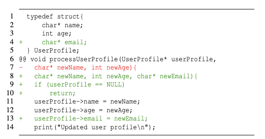
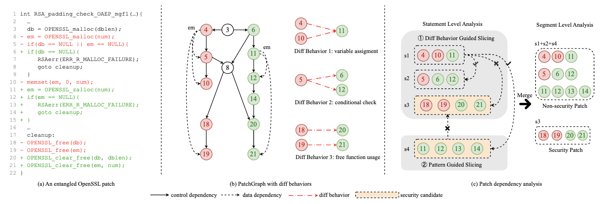
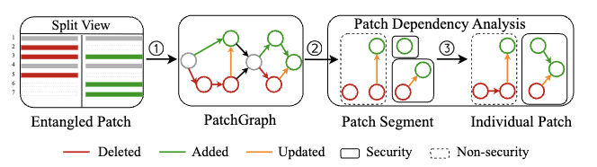
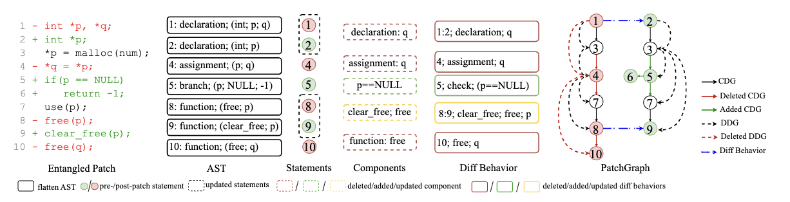
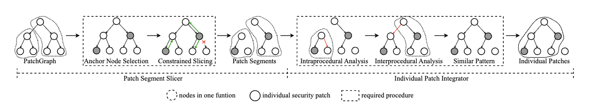
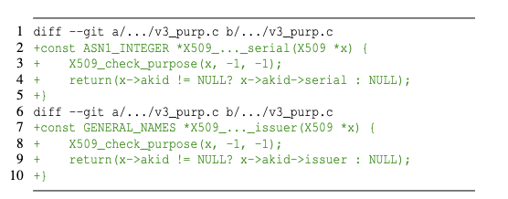
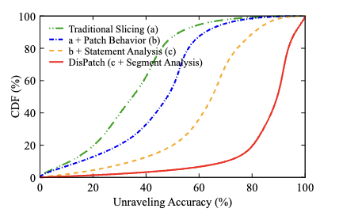

# DISPATCH: Unraveling Security Patches from Entangled Code Changes

## Abstract

보안 패치는 컴퓨팅 자원의 무결성, 기밀성, 가용성을 보존하는 데 매우 중요합니다. 그러나 비보안 관련 변경 사항과 얽히게 되면 배포가 상당히 지연될 수 있습니다. 기존의 코드 변경 분해 방법론은 주로 코드 리뷰를 위해 설계되어 연관된 부분을 연결하는 데 초점을 맞춥니다. 하지만 이들 방법론은 종종 보안 패치에 관련 없는 코드 문장들을 포함시켜 패치를 비대하게 만들고, 이로 인해 보안 패치의 탐지, 검증, 배포 과정을 복잡하게 만듭니다. 본 논문에서는 얽힌 코드 변경 사항으로부터 개별 보안 패치를 분리해내는 'DISPATCH'라는 이름의 패치 분해 시스템을 개발합니다. 먼저, 변경된 구문과 종속성을 유지하여 코드 수정 사항을 세밀하게 포착하는 'PatchGraph'라는 그래프 표현을 도입합니다. 그다음, 2단계 패치 종속성 분석을 수행하여 동일한 취약점을 처리하는 변경된 코드 문장들을 개별 보안 패치로 그룹화합니다. 첫 번째 단계는 문장 수준에 초점을 맞춰 관련 없는 문장들을 제외하기 위한 경계를 정의합니다. 두 번째 단계에서는 방문하지 않은 종속성을 분석하여 구문적 정확성과 기능적 완전성을 유지함으로써 패치의 적용 가능성을 보장합니다. 4개의 주요 오픈소스 소프트웨어 저장소(OpenSSL, Linux Kernel, ImageMagick, Nginx)를 대상으로 한 평가에서, DISPATCH는 얽힌 코드 변경으로부터 91.9% 이상의 재현율(recall)로 개별 보안 패치를 성공적으로 분리해냈으며, 이는 기존 방법들보다 최소 20% 이상 향상된 정확도입니다.

## 1 Introduction

소프트웨어 패치(patch)는 컴퓨터 프로그램이나 시스템의 문제를 해결하기 위한 코드 변경 조각입니다. 이러한 문제에는 보안 취약점, 구현상의 버그, 성능 개선, 호환성 향상 등이 포함됩니다. 보안 패치는 컴퓨팅 자원의 무결성, 기밀성, 가용성을 유지하기 위해 소프트웨어 취약점을 해결하는 매우 중요한 업데이트입니다[[15]](#ref15). 이러한 패치를 신속하게 적용하면 데이터 유출이나 사이버 공격으로부터 시스템을 보호하여 전반적인 보안을 크게 강화할 수 있습니다. 각 패치는 특정한 목적에만 집중하도록 만들어, 그 이해, 테스트, 배포를 용이하게 하는 것이 가장 이상적입니다.

하지만 실제로는 보안 패치가 다른 목적의 코드 변경과 얽혀 있는 경우가 많습니다. 8개의 주요 리포지토리를 대상으로 한 연구[[40]](#ref40)에 따르면, 보안 패치의 11%에서 39%가 보안과 직접 관련 없는 변경 사항과 복잡하게 얽혀 있습니다. 또한, 저희가 NVD[[7]](#ref7)에서 무작위로 추출한 500개의 보안 패치 중 34.6%(173개)가 적어도 하나 이상의 다른 보안 패치 또는 비보안 패치와 얽혀 있었습니다(예: CVE-2019-13223[[12]](#ref12), CVE-2019-11338[[13]](#ref13)). 이렇게 얽힌 패치를 그대로 적용하면 예기치 않은 버그나 기능 저하(regression)를 유발할 수 있으며, 테스트와 검증의 복잡성을 높여 유지보수 비용을 증가시킵니다. 더 나아가, 이런 얽힌 패치들은 조직이 보안 업데이트의 우선순위를 정하고, 효과를 검증하며, 호환성을 보장하는 데 큰 어려움을 줍니다. 결과적으로 시스템의 신속한 보안 적용을 방해하고, 알려진 취약점에 대한 노출 시간을 연장시키게 됩니다. 따라서 얽힌 패치로부터 각 보안 패치의 영향을 분리하고 이해하는 것이 매우 중요합니다.

얽힌 패치를 분리하려는 여러 노력이 있었습니다. 코드 변경 사항의 구문 구조, 제어 흐름, 데이터 종속성을 포괄하기 위해 다양한 프로그램 표현 방식이 사용되었습니다. 이를 바탕으로 휴리스틱 기반[[20]](#ref20), [[25]](#ref25), [[27]](#ref27), [[29]](#ref29), [[30]](#ref30), [[48]](#ref48), [[50]](#ref50), 슬라이싱 기반[[25]](#ref25),[[39]](#ref39),[[56]](#ref56), 그리고 그래프 클러스터링 기반[[18]](#ref18),[[22]](#ref22),[[24]](#ref24),[[32]](#ref32),[[41]](#ref41),[[44]](#ref44),[[47]](#ref47),[[51]](#ref51) 등의 다양한 접근법을 통해 연관된 코드 문장들을 별도의 그룹으로 묶는 연구가 수행되었습니다. 하지만 기존 방법들은 주로 코드 리뷰를 용이하게 하는 데 목적이 있어, 얽힌 코드로부터 보안 패치를 분리할 때 두 가지 주요 한계에 부딪힙니다. 첫째, 보안 패치에 불필요한 코드 문장들을 포함하는 경향이 있습니다. 보안 패치가 비보안 패치와 데이터 종속성을 가질 경우, 기존 방법들은 이러한 얽힌 변경 사항들을 단일 패치로 잘못 취급하는 경우가 많습니다. 이는 불필요하게 커진 보안 패치의 테스트 부담을 가중시킵니다. 둘째, 개별 보안 패치의 완전성을 보장하지 못하여, 패치의 일부가 다른 클러스터에 남게 될 수 있습니다. 이러한 불완전성은 (1) 보안 패치가 컴파일되지 않거나, (2) 컴파일되더라도 대상 취약점을 완전히 해결하지 못하는 두 가지 문제를 야기할 수 있습니다. 따라서 얽힌 코드로부터 보안 패치를 정확하고 완전하게 분리하는 것은 여전히 중요한 과제로 남아있습니다.

본 논문에서는 얽힌 코드 변경으로부터 개별 보안 패치를 분리하기 위한 패치 분해 시스템 **DISPATCH**를 제안합니다. 저희 연구는 기존 접근법들[[22]](#ref22), [[32]](#ref32), [[47]](#ref47), [[51]](#ref51), [[56]](#ref56)이 패치 표현에서 삭제되거나 추가된 구문 정보만 보존하고, 더 본질적인 정보를 담고 있을 수 있는 '업데이트된' 문장들을 간과한다는 관찰에서 출발했습니다. 저희는 업데이트된 문장들을 분석하여 무엇이, 어떻게 변했는지(예: `if` 조건문의 경계 확장) 파악하고, 동일한 목적을 가진 변경 사항들을 그룹화합니다. 먼저, 미세한 구문 및 종속성 변경, 즉 'diff behavior(diff behavior)'을 포착하여 개별 패치 생성을 위한 기반을 마련하는 그래프 기반 패치 표현인 **PatchGraph**를 개발합니다. 그다음, 2단계에 걸친 **패치 종속성 분석**을 통해 개별 패치의 범위를 결정하고 보안 패치를 다른 변경 사항들로부터 분리합니다. 제어/데이터 종속성 및 호출 관계에 의존하는 전통적인 종속성 분석[[51]](#ref51),[[56]](#ref56)과 달리, 저희는 diff behavior, 즉 제어/데이터 종속성 및 호출 관계 자체의 '변경'에 초점을 맞춥니다. 첫째, **문장 종속성 분석**을 수행하여 관련 없는 변경 사항을 제외하고 수정된 문장들을 '패치 세그먼트'로 묶습니다. 둘째, **세그먼트 종속성 분석**을 수행하여 패치 세그먼트 간의 관계를 활용해 개별 보안 패치를 생성합니다.

얽힌 패치가 주어지면, 저희는 미세한 변경 사항(예: 사용되지 않는 변수 삭제, 새로운 함수 호출, 반환 상태 업데이트)을 표현하기 위해 **PatchGraph**를 개발하며, 이를 'diff behavior'이라 부릅니다. 먼저 변경된 문장들을 삭제(deleted), 추가(added), 업데이트(updated)의 세 가지 유형으로 분류합니다. 그다음, 삭제/추가된 식별자(변수, 함수, 반환 값 등)를 식별하고, 업데이트된 문장에서는 미세한 토큰 비교를 통해 수정된 부분만 남기고 변경되지 않은 부분은 버립니다. 이를 통해 diff behavior을 수정된 구문과 그에 따른 데이터 종속성 변경으로 정확히 한정할 수 있습니다。 마지막으로, 이 diff behavior들을 전통적인 프로그램 종속성(CDG, DDG, 호출 그래프) 위에 겹쳐 PatchGraph를 구성합니다.

수정된 내용에 종속된 문장들만 그룹화되도록 보장하기 위해, 저희는 각 패치 세그먼트의 범위를 정제하는 **패치 문장 수준 종속성 분석**을 수행합니다. 먼저 동일한 엔티티(변수, 함수, 반환 값 등)와 동일한 유형의 diff behavior으로 연결된 문장들을 모으기 위해 **diff behavior 기반 슬라이싱**을 수행합니다. 그다음, 동일한 이슈를 해결하는 문장들을 모으기 위해 **패턴 기반 슬라이싱**을 도입합니다. 이 패턴들은 300개 이상의 유명 GitHub 저장소에 있는 공개 패치 데이터셋[[7]](#ref7),[[53]](#ref53)에서 경험적으로 추출되었으며, 슬라이싱 시작을 위한 앵커 노드, 슬라이싱 방향과 종료 조건, 그리고 보안 속성 지시자로 구성됩니다. 이를 통해 각 보안 패치와 관련된 문장들만 정확히 유지할 수 있습니다.

패치 세그먼트들을 얻은 후에는, 문법적 정확성과 기능적 완전성을 보장하기 위해 **세그먼트 수준 종속성 분석**을 수행하여 종속적인 패치 세그먼트들을 개별 패치로 병합합니다. 이 과정은 세 단계로 이루어집니다: (1) 정의되지 않은 변수 사용을 피하기 위해 프로시저 내 종속성을 유지할지 결정, (2) 함수 선언 및 구현을 찾기 위해 프로시저 간 호출 종속성 해결, (3) 단일 문제가 완전히 해결되도록 유사한 세그먼트 그룹화.

마지막으로, 개별 패치가 보안 및 비보안 패치 세그먼트를 모두 포함할 경우, 사전 정의된 기준에 따라 이것이 개별 보안 패치인지 판단합니다. 예를 들어, 보안 패치 세그먼트가 새로운 기능 추가와 같은 비보안 패치 세그먼트에 의해 유발된 취약점을 수정하는 것이라면, 이를 개별 비보안 패치로 취급합니다.

저희는 DISPATCH의 프로토타입을 구현하고, 4개의 유명 오픈소스 저장소(OpenSSL, Linux Kernel, ImageMagick, Nginx)를 대상으로 분해 정확도를 평가했습니다. 이들 저장소의 크기는 84.5MB에서 6.71GB에 이릅니다. DISPATCH는 얽힌 패치로부터 91.9%의 개별 보안 패치를 성공적으로 분리해냈습니다. 또한, 슬라이싱 기반 접근법인 SPatch[[36]](#ref36), LLM 기반 접근법인 GPT-4[[16]](#ref16), GNN 기반 접근법인 UTANGO[[32]](#ref32) 등 최신 기술들과 비교했습니다. 실험 결과, DISPATCH는 기존의 모든 방법들보다 성능이 뛰어났으며, 정확도가 최소 20% 이상 향상되었습니다. 이 결과는 저희가 제안한 패턴들이 다양한 종류의 애플리케이션에 일반화될 수 있음을 보여줍니다.

요약하면, 본 논문의 기여는 다음과 같습니다:

*   얽힌 코드 변경으로부터 개별 보안 패치를 분리하는 패치 분리 시스템을 설계했습니다.
*   사전 패치와 사후 패치 코드 간의 수정된 구문과 종속성을 포착하는 새로운 그래프 기반 패치 표현을 제안했습니다.
*   개별 패치의 범위를 정제하기 위한 제한적 슬라이싱 방법을 개발했습니다.
*   DISPATCH의 프로토타입을 구현했으며, 실험 결과는 이 시스템이 보안 패치를 분리하는 데 효과적임을 보여줍니다.

## 2 Preliminaries

### 2.1 Entangled Patches

패치는 설치되었을 때 다른 소프트웨어 구성 요소와 관련된 파일이나 장치 설정을 직접 수정하는 소프트웨어 구성 요소입니다[[9]](#ref9). 패치는 GitHub 커밋이거나 유닉스 계열 운영 체제에서 `diff` 명령으로 생성된 두 소프트웨어 버전 간의 코드 차이일 수 있습니다. 이상적으로 패치는 버그 수정, 기능 업데이트 또는 유지 관리와 같은 단일 관심사를 해결하는 데 중점을 두어야 합니다. 그러나 실제로는 패치에 여러 가지 우려 사항을 해결하기 위한 여러 활동이 포함될 수 있으며[[40]](#ref40), 이를 **얽힌 패치(entangled patch)** 라고 합니다. 목록 1은 새 사용자 프로필 속성을 추가하기 위한 비보안 패치(4, 7-8, 13행)와 Null 포인터 역참조 버그를 수정하기 위한 보안 패치(9-10행)의 두 가지 패치로 구성된 얽힌 패치를 보여줍니다.

<figure><figcaption><p>Listing 1: Security patch entangled with non-security patch</p></figcaption></figure>

그러나 비보안 패치의 함수 서명 업데이트로 인해 사용자는 버전 호환성 문제로 전체 패치를 거부할 수 있으며, 이로 인해 비보안 패치와 별도로 적용될 수 있는 보안 패치의 전파가 방해받을 수 있습니다. OpenSSL에서 339개의 닫힌 풀 리퀘스트를 분석한 결과, 200개는 병합되지 않았고 139개는 병합되었습니다(139개의 닫힌 풀 리퀘스트만 병합됨). 표 7에서 볼 수 있듯이, 221개는 C 코드를 포함하며, 90개(40.7%)가 얽힌 것으로 확인되었습니다. 90개의 얽힌 패치 중 63개(70%)의 풀 리퀘스트는 병합되지 않았고 27개(30%)만 병합되었습니다. 이는 얽힌 패치를 채택하는 데 어려움이 있음을 강조합니다. 사례 연구의 자세한 통계는 부록 A에 제공됩니다.

사용자가 얽힌 패치의 구성을 이해하고 패치의 어느 부분을 적용할지 결정하는 데 도움을 주기 위해, 얽힌 패치에서 개별 패치를 푸는 것이 중요합니다. 본 논문에서는 단일 관심사를 해결하고 대상 소프트웨어에 개별적으로 적용할 수 있는 패치를 **개별 패치(individual patches)** 라고 합니다.

### 2.2 Program Dependencies

프로그램 종속성은 코드 구문, 실행 논리 및 코드 의미를 이해하는 데 중요한 역할을 합니다. 프로그램 종속성에는 데이터 종속성, 제어 종속성, 호출 종속성의 세 가지 기본 유형이 있습니다. 프로그램의 데이터 종속성은 프로그램 문이 이전 문의 데이터를 참조할 때 발생하며, 제어 종속성은 프로그램 문의 실행이 이전 제어 문의 결과에 따라 달라지는 상황을 나타냅니다. 호출 종속성은 함수 또는 프로시저 간의 관계를 나타냅니다. 프로그램 종속성은 단일 버전의 코드 내에서 정보를 파악하는 데 중점을 둡니다. 두 버전의 코드를 포함하는 패치 코드 변경을 더 잘 이해하려면 프로그램 종속성 정보를 두 버전 간의 차이점을 포함하도록 확장하는 것이 중요합니다. 본 논문에서는 코드 변경에서 삭제/추가/업데이트된 동작을 기록하기 위해 **diff behavior(diff behavior)** 이라는 새로운 유형의 프로그램 종속성을 도입합니다. 자세한 설명은 §5에서 제공됩니다. 우리는 diff behavior을 전통적인 제어 종속성 그래프(CDG), 데이터 종속성 그래프(DDG) 및 호출 그래프(CG)와 통합하여 수정된 구문(예: 새 변수 선언 및 변경된 변수 정의) 및 업데이트된 종속성(예: 새 데이터 연결, 변경된 조건부 제어 종속성, 수정된 변수 할당 및 업데이트된 함수 활용)에 대한 세부 정보를 제공합니다.

### 2.3 Program Slicing

프로그램 슬라이싱은 관련 부분[[54]](#ref54)(즉, 슬라이스)에만 초점을 맞춰 크고 복잡한 프로그램을 이해하고 분석하는 것을 단순화하는 프로그램 분석 기술입니다. 슬라이싱은 프로그램 지점의 변수에서 시작하여 지정된 기준(예: depth 수 및 끝)이 충족될 때까지 종속성 에지(예: 데이터 종속성, 제어 종속성 또는 둘 다)를 따라 프로그램을 순회합니다. 우리는 관련 문장을 유지하고 관련 없는 문장을 제거하기 위한 시작점과 기준을 지정하는 제한된 프로그램 슬라이싱 기술을 개발합니다. 자세한 내용은 §6.2에서 찾을 수 있습니다.

## 3 A Motivating Example

그림 1의 예를 사용하여 DISPATCH가 비보안 패치와 얽힌 개별 보안 패치를 분해하는 방법을 보여줍니다. 문장 수준에서 패치를 대략적으로 분석하는 기존 방법[[36]](#ref36), [[44]](#ref44)과 달리, 우리는 종속성 수준과 토큰 수준에서 변경 사항을 삭제, 추가 또는 업데이트된 것으로 분류하여 미세 접근 방식을 채택합니다. 또한, 종속성을 드러내고 종속성이 있는 한 문장을 그룹화하는 것을 목표로 하는 코드 검토용 분해 방법과 달리, 우리는 원래 기능을 손상시키지 않고 다시 적용할 수 있는 개별 패치에 대한 경계를 명시적으로 정의합니다.

DISPATCH는 PatchGraph라는 새로운 그래프 기반 패치 표현을 구성하고 개별 패치를 생성하기 위해 종속성 분석을 수행하는 두 단계로 구성됩니다.

<figure><figcaption><p>Figure 1: A motivating example of separating a security patch from non-security patch in an entangled patch.</p></figcaption></figure>

**Understanding an Entangled Patch.** 그림 1(a)는 보안 패치(18-21행)와 비보안 패치(4-6행, 10-15행)로 구성된 얽힌 패치를 보여줍니다[[43]](#ref43). 3행에서 5행까지, 사전 패치는 두 개의 메모리 공간을 할당한 다음 두 메모리 할당에 대한 실패를 확인합니다. 그러나 첫 번째 할당이 실패하면 두 번째 확인을 수행할 필요가 없습니다. 따라서 사후 패치는 `db`의 성공적인 할당(6행) 후에 `em`을 할당하여(11행) 메모리 할당을 최적화합니다. `OPENSSL_malloc`(4행)을 사용하여 `em`을 할당하고 `memset`(10행)으로 0으로 설정하는 대신, 사후 패치는 `OPENSSL_zalloc`(11행)으로 이 두 단계를 수행합니다. 위의 변경 사항은 취약점을 수정하지 않고 프로그램 구조만 최적화하므로 비보안 패치에 속합니다. 18행에서 21행까지, `OPENSSL_free` 함수는 메모리 누출을 방지하기 위해 보안 패치를 나타내는 무료 작업 전에 민감한 정보가 포함된 메모리를 지우는 `OPENSSL_clear_free`로 대체됩니다.

변수 `em`에 대한 데이터 종속성(즉, 4행과 19행, 11행과 21행)으로 인해 기존 데이터 종속성 기반 패치 분해 솔루션[[22]](#ref22), [[32]](#ref32), [[47]](#ref47), [[51]](#ref51), [[56]](#ref56)은 그림 1(a)의 모든 변경된 코드를 단일 패치로 간주합니다. 그러나 21행의 `em` 값은 11행과 무관합니다. 11행이 적용되었는지 여부에 관계없이 `em`의 값은 변경되지 않기 때문입니다. 따라서 우리는 이를 두 개의 개별 패치로 간주해야 합니다.

**Representing a Patch with PatchGraph.** 수정된 내용과 수정 방법을 캡처하기 위해, 우리는 diff behavior을 도입하고 diff behavior을 기존 프로그램 종속성 그래프(즉, DDG 및 CDG)와 통합하여 PatchGraph로 만듭니다. 그림 1(b)에서 볼 수 있듯이, 왼쪽 부분은 패치의 CDG 및 DDG입니다(공간 제약으로 인해 단순화됨). 그림 1(b)의 오른쪽 부분에는 주어진 패치에 대해 세 가지 추가 diff behavior이 식별됩니다. (1) 4, 10, 11행에서 `em`에 대한 메모리 할당 함수 변경, (2) 5행의 조건문을 6행과 12행의 두 if 검사로 분할, (3) 18행과 20행, 19행과 21행 사이의 함수 업데이트, 여기서 더 안전한 함수가 이전 함수를 대체합니다. 사전 및 사후 패치의 CDG, DDG 및 diff behavior을 결합하여 PatchGraph는 변경된 코드의 목적을 더 잘 이해하기 위해 패치 코드 변경에 대한 포괄적인 보기를 제공합니다.

**Unraveling a Patch with Dependency Analysis.** PatchGraph가 주어지면, 우리는 수정 종속 변경 사항을 개별 패치로 그룹화하기 위해 2단계 패치 종속성 분석을 제안합니다. 각 패치 세그먼트의 범위를 결정하기 위해 사전 정의된 기준으로 슬라이싱을 수행하는 문장 수준 분석과 개별 패치를 생성하기 위해 패치 세그먼트 간의 방문하지 않은 종속성을 분석하고 필요한 것을 유지하는 세그먼트 수준 분석이 있습니다.

**Statement Dependency Analysis.** diff behavior 기반 슬라이싱과 패턴 기반 슬라이싱을 모두 코드 문에 대해 수행합니다. 먼저, 세 가지 유형의 diff behavior을 사용하여 슬라이싱을 안내합니다. 슬라이싱 결과는 그림 1(c) ①과 같이 세 개의 세그먼트(즉, s1, s2, s3)입니다. 그중에서 s3(18-21행)은 보안 기능 교체를 포함하므로 보안 패치 후보로 간주합니다. 그런 다음, 앵커 노드, 종료 기준이 있는 슬라이싱 방향 및 보안 속성 표시기를 포함한 경험적 지식에서 파생된 패치 패턴에 따라 PatchGraph를 슬라이스합니다. 그림 1(c) ②에서 볼 수 있듯이, 앵커 노드는 예외 값을 확인하는 if 문(12행)이며, 오류 처리 문(13행 및 14행)을 얻기 위한 순방향 슬라이싱과 `em`의 할당(11행)을 얻기 위한 역방향 슬라이싱이 있습니다. 이러한 방식으로, 우리는 패치 세그먼트 s4(11-14행)를 얻고 완전한 오류 처리 프로세스로 인해 보안 패치 후보로 식별합니다. 위의 diff behavior 기반 슬라이싱 및 패턴 기반 슬라이싱 후, 우리는 개별 패치를 생성하기 위한 기본 구성 요소 역할을 하는 네 개의 패치 세그먼트(s1-s4)를 얻습니다.

**Segment Dependency Analysis.** 세그먼트 수준 분석은 컴파일 및 문법적 정확성을 보장하기 위해 패치 세그먼트 간의 방문하지 않은 종속성을 보존해야 하는지 여부를 재검토합니다. 그림 1(c)에서 볼 수 있듯이, s1과 s2 간의 종속성과 s1과 s4 간의 종속성은 필수적입니다. s1과 s3, s3과 s4 간의 종속성은 이러한 종속성에 관계없이 `em`과 `db`의 값이 변경되지 않으므로 무시할 수 있습니다. 필수 종속 세그먼트를 병합한 후, 우리는 두 개의 개별 패치, 즉 s1+s2+s4와 s3을 얻습니다. 그런 다음, 각 개별 패치에 포함된 보안 패치 후보를 추가로 확인하여 개별 패치가 보안 패치인지 여부를 결정합니다. 11-14행에 추가된 `em` 확인 및 오류 처리가 이미 사전 패치의 5행에서 수행되었으므로, s1+s2+s4(5행과 11-14행 모두 포함)는 실제로 새로운 보안 검사를 도입하지 않습니다. 따라서 우리는 이를 비보안 패치로 간주합니다. 마지막으로, 우리는 원래의 얽힌 패치를 두 개의 개별 패치로 분해합니다. 하나는 4행에서 15행에 걸친 비보안 패치이고 다른 하나는 18행에서 21행을 포함하는 보안 패치입니다(그림 1(c) 참조).

## 4 System Overview

DISPATCH는 얽힌 보안 패치를 개별 패치로 분해하며, DISPATCH의 전체 워크플로는 그림 2에 나와 있습니다. 버전 diff, OSS 패치 또는 Git 커밋이 주어지면, DISPATCH는 먼저 수정된 구문과 종속성(즉, diff behavior)을 추출하고 이를 그래프 표현(즉, PatchGraph)으로 나타냅니다. 다음으로, 수정된 문장들을 함께 적용해야 하는 그룹(즉, 개별 패치)으로 묶기 위해 패치 종속성 분석을 수행합니다. 패치 종속성 분석은 두 가지 수준에서 수행됩니다: (1) 종속 수정 사항이 패치 세그먼트로 그룹화되는 문장 수준, (2) 종속 패치 세그먼트가 개별 패치로 결합되는 세그먼트 수준.

<figure><figcaption><p>Figure 2: Overview of DISPATCH: ① PatchGraph construction; ② statement dependency analysis; ③ segment dependency analysis.</p></figcaption></figure>

### 4.1 Patch Representation with PatchGraph

클래식 프로그램 그래프 표현(예: AST 및 PDG)이 단일 버전의 코드에서 구문 구조를 기록하고 프로그램 종속성을 캡처하는 데 중점을 두는 것과 달리, 패치 표현은 두 버전 간의 변경된 구문과 종속성을 캡처할 수 있어야 합니다. 이전 방법[[44]](#ref44), [[52]](#ref52)은 사전 패치 및 사후 패치 그래프 표현을 직접 병합하여 그래프가 분리되고, 부적절하며, 중복되게 만듭니다. 예를 들어, 그림 3의 1행과 2행은 동일한 코드 라인을 참조함에도 불구하고 에지로 연결되지 않거나 업데이트된 것으로 표시되지 않습니다. 또한, `*p`는 변경되지 않았지만 관련 종속성은 여전히 유지됩니다. 직접 병합(AST)은 세분화된 수정 사항을 강조하지 못하고 변경된 문장과 변경되지 않은 문장을 구별하지 못하며, 동일한 목적을 수행하는 변경 사항을 집계하는 데 도움이 되지 않습니다. 이러한 격차를 메우기 위해, 우리는 실제 세분화된 변경 사항을 설명하는 diff behavior을 도입하고 모든 diff behavior을 PatchGraph로 통합하여 패치를 표현합니다.

<figure><figcaption><p>Figure 3: The workflow of PatchGraph construction.</p></figcaption></figure>

### 4.2 Patch Dependency Analysis

얽힌 패치를 나타내는 PatchGraph가 주어지면, 패치 종속성 분석을 통해 큰 그래프를 더 작은 서브그래프로 분해하여 개별 패치를 얻습니다. 데이터 또는 제어 종속성에 따라 클러스터링하는 클래식 프로그램 종속성 분석[[51]](#ref51),[[56]](#ref56)과 달리, 패치 종속성 분석은 diff behavior(즉, 삭제, 추가 및 업데이트 구문 및 종속성)을 지배적인 종속성으로 간주하여 종속 노드를 연결합니다. 이를 달성하기 위해 문장 수준 및 패치 세그먼트 수준 분석을 수행합니다.

**Patch Statement Dependency Analysis.** 문장 수준 종속성 분석 중에는 동일한 목적을 위해 코드 변경 사항을 집계하는 것을 목표로 합니다. 여기서 수정 범위, 특히 슬라이싱 시작 위치와 종료 시점을 정의하는 것이 어렵습니다. 예를 들어, 그림 1(a)에서 19행은 10행에 데이터 종속적이지만, 두 개의 개별 패치에 속하므로 각 패치에 대한 범위를 정의해야 합니다. 이를 해결하기 위해, 우리는 수정 종속 문장을 패치 세그먼트로 그룹화하기 위한 패턴 기반 슬라이싱이라는 새로운 제약된 슬라이싱 메커니즘을 제안합니다. 우리는 보안 및 비보안 패치 패턴 세트를 경험적으로 요약하여 앵커 노드로 슬라이싱을 시작하고, 제약 조건에 따라 프로그램 슬라이싱을 수행하며, 보안 속성 지시자로 보안 패치 세그먼트 후보를 식별합니다. 이러한 방식으로, 얽힌 패치는 여러 패치 세그먼트로 분할되며, 각 패치 세그먼트는 하나의 관심사(예: 변수 초기화/재할당 및 함수 사용 업데이트)를 해결합니다.

**Patch Segment Dependency Analysis.** 각 패치 세그먼트가 의도된 기능(기능적 정확성)을 방해하지 않고 개별적으로 적용될 수 있도록(문법적 정확성) 보장하기 위해, 우리는 슬라이스된 패치 세그먼트 간의 종속성을 추가로 분석하고 필수 종속성을 가진 세그먼트를 병합하여 최종 개별 패치를 생성합니다. 개별 패치가 보안 관련인지 여부를 추가로 확인하기 위해, 우리는 개별 패치를 구성하는 패치 세그먼트를 분석합니다. 개별 패치가 한 가지 유형의 패치 세그먼트만 포함하는 경우, 보안 특성은 해당 세그먼트의 레이블과 일치합니다. 개별 패치가 보안 패치 세그먼트와 비보안 패치 세그먼트를 동시에 포함하는 경우, 우리는 이것이 보안 패치인지 여부를 확인하기 위해 추가 분석을 수행합니다.

## 5 Patch Representation

그림 3에서 볼 수 있듯이, 우리는 필수 diff behavior을 전통적인 프로그램 종속성 위에 겹쳐 PatchGraph를 구성합니다. 먼저, 전통적인 프로그램 그래프 표현, 즉 추상 구문 트리(AST), CDG, DDG 및 호출 그래프(CG)를 생성합니다. 그중에서 사전 패치 및 사후 패치 AST는 삭제/추가/업데이트된 문장 및 구성 요소(예: 변수, 함수, 값 및 문자열)를 찾는 데 사용됩니다. 사전 패치 및 사후 패치 CDG, DDG 및 CG는 수정된 종속성을 인식하는 데 사용됩니다. 그 후, 문장 수준에서 diff behavior을 식별합니다. diff behavior을 기존 종속성 위에 통합함으로써 PatchGraph는 패치 파일을 정확하게 나타냅니다.

### 5.1 Diff Behavior Identification

우리는 패치의 세분화된 코드 변경을 나타내기 위해 diff behavior을 도입합니다. diff behavior은 사전 패치 및 사후 패치 문장 간의 수정 세부 정보를 설명합니다. 세 가지 유형의 수정이 있으며, 변경된 문장과 토큰을 설명하는 데 사용됩니다.

**Deleted.** 삭제된 문장은 사전 패치에는 존재하지만 사후 패치에는 없는 문장을 나타냅니다. 삭제된 문장의 토큰은 삭제된 구성 요소로 간주됩니다.

**Added.** 추가된 문장은 사후 패치에는 존재하지만 사전 패치에는 없는 문장을 나타냅니다. 추가된 문장의 토큰은 추가된 구성 요소로 간주됩니다.

**Updated.** 이 문장들은 사전 패치 및 사후 패치 노드 모두에 존재하지만 약간의 변형이 있습니다. 패치에서 업데이트된 문장은 일반적으로 쌍으로 나타나며(일부 문장은 여러 줄로 나뉘거나 여러 문장이 하나로 병합되는 경우 제외), 사전 패치 및 사후 패치에서 각각 하나씩 나타납니다. 우리는 이러한 쌍을 연결하기 위해 diff behavior 에지를 도입하고, 업데이트된 구성 요소를 속성으로 사용합니다. 업데이트된 문장의 구성 요소는 변경되었는지 여부를 확인하기 위해 비교해야 합니다. 변경된 경우, 삭제, 추가 또는 업데이트된 유형으로 추가 태그가 지정됩니다.

diff behavior을 캡처하기 위해, 우리는 먼저 삭제/추가/업데이트된 문장을 식별한 다음, 수정된 토큰을 인식하여 세분화된 실제 업데이트를 찾습니다. 그런 다음, diff behavior을 추출하고 PatchGraph 구성을 위한 노드 또는 에지 속성을 사용하여 기록합니다.

**Identifying Deleted/Added/Updated Statements.** GitHub 분할 보기[[14]](#ref14)에서 패치의 삭제, 추가 및 업데이트된 문장을 식별하는 방법을 학습합니다. 분할 보기(그림 2 참조)에서 볼 수 있듯이, 삭제된 문장은 왼쪽에 빨간색으로만 표시되고 오른쪽에 녹색 문장은 없습니다. 추가된 문장은 오른쪽에 녹색으로만 표시되고 왼쪽에 빨간색 문장은 없습니다. 업데이트된 문장은 왼쪽에 빨간색 삭제와 오른쪽에 녹색 추가가 모두 있는 문장입니다. 먼저 각 덩어리 헤더(예: `@@ -7 +7 @@ void func_name (int a)`)를 사용하여 각 덩어리를 식별하고 각 줄 시작 부분의 "-" 및 "+" 접두사를 인식하여 덩어리 내의 삭제 및 추가된 문장을 결정합니다. 다음으로, 각 덩어리 내의 추가 및 삭제된 문장을 비교합니다. 추가된 문장과 삭제된 문장이 동일한 문장 유형(예: 함수 선언)을 공유하고 공통 변수(예: 함수 호출 문의 함수 매개 변수 또는 할당 문의 왼쪽 변수)를 공유하는 경우, 업데이트된 문장으로 쌍을 이룹니다. 또한, 하나의 문장이 여러 개로 분할되거나(예: 하나의 if 검사가 두 개로 분할됨) 여러 문장이 하나로 병합되는 상황(예: 여러 동일 유형 선언 문장이 한 줄로 병합됨)도 고려합니다. 이에 따라 주어진 패치에 대해 삭제, 추가 및 업데이트된 문장을 쉽게 인식할 수 있습니다.

**Identifying Deleted/Added/Updated Components.** 삭제/추가/업데이트된 문장이 주어지면, 세분화된 구성 요소를 인식합니다. 삭제된 문장에서 필요한 모든 요소(예: 매개 변수, 변수, 함수, 조건, 분기, 루프 및 반환 값)를 삭제된 구성 요소로 식별합니다. 유사하게, 추가된 구성 요소를 검색합니다. 업데이트된 문장에서는 먼저 쌍을 이룬 문장 간의 토큰을 비교하여 변경되지 않은 토큰을 제거합니다. 그런 다음, 사전 패치 문장에만 있는 구성 요소를 삭제된 것으로, 사후 패치 문장에만 있는 구성 요소를 추가된 것으로, 사전 패치 및 사후 패치 문장 모두에 있는 구성 요소를 업데이트된 것으로 식별합니다.

**Identifying Diff Behaviors.** 구성 요소 유형 및 해당 삭제된 토큰에 따라 삭제된 코드 동작을 설명합니다. 예를 들어, (수정 유형, 토큰 유형, 토큰 세부 정보)의 3-튜플(예: (deleted, assignment, *q))을 사용합니다. 유사하게, 추가된 동작을 설명합니다. 업데이트된 동작의 경우, 구성 요소의 유형 및 세부 정보 외에도 동작을 완성하기 위해 두 문장의 식별자가 필요합니다. 우리는 위의 동작을 설명하기 위해 (수정 유형, 토큰 유형, 쌍을 이룬 문장 ID, 토큰 세부 정보)의 4-튜플을 채택합니다. 예를 들어, 그림 3에서 8행과 9행 사이의 diff behavior은 (updated, function, pre_8: post_9, free: clear_free)로 표현됩니다. 캡처된 diff behavior은 PatchGraph의 노드 및 에지의 속성을 나타냅니다.

## 6 Individual Patch Generation

PatchGraph에 표현된 상세 변경 사항이 주어지면, 우리는 얽힌 패치를 여러 개별 패치로 분할하기 위해 프로그램 슬라이싱을 수행합니다. 수정된 구문을 수정 목적에 매핑하는 패치 패턴 세트를 경험적으로 제안하여 슬라이싱을 안내함으로써, 각 패치 세그먼트가 하나의 문제를 해결하는 패치 세그먼트를 얻습니다. 또한, 각 개별 패치의 완전성을 보장하기 위해, 패치 세그먼트 간의 관계를 추가로 분석하여 수정 종속 패치 세그먼트를 병합하고 다시 적용할 수 있도록 보장합니다. 워크플로는 그림 4에 나와 있습니다.

<figure><figcaption><p>Figure 4: The workflow of individual patch generation.</p></figcaption></figure>

### 6.1 Patch Pattern Discovery

각 개별 패치의 범위를 결정하기 위해, 우리는 먼저 각 슬라이스의 시작 및 종료 문장을 찾는 데 도움이 되고 슬라이스가 보안 수정을 수행하는지 여부를 해석하는 데 도움이 되는 패치 패턴 세트를 경험적으로 요약합니다. 이를 위해 NVD[[7]](#ref7) 및 PatchDB[[53]](#ref53)에서 식별된 5천 개의 보안 패치를 수동으로 분석하여 diff behavior에 대한 보안 패턴을 요약합니다. 그런 다음, GitHub에서 5천 개의 비보안 커밋을 무작위로 선택하여 비보안 패치 패턴을 찾습니다. 3명의 박사 과정 학생(각각 소프트웨어 보안 분야에서 3년 이상의 경험 보유)의 교차 검증 후, 우리는 12가지 유형의 보안 패치 패턴과 3가지 유형의 비보안 패치 패턴을 요약합니다. 이 작업에서는 보안 문제 발생 빈도가 가장 높은 언어[[31]](#ref31)인 C/C++에 중점을 둡니다. 패턴 세트는 확장 가능하며, 사용자는 특정 애플리케이션 시나리오에 따라 새로운 패턴을 정의할 수 있습니다.

**Patch Pattern Structure.** 각 개별 패치를 나타내고 보안 특성에 대한 통찰력을 제공하기 위해, 우리는 앵커 노드, 슬라이싱 방향(종료 기준 포함) 및 보안 속성 지시자로 구성된 새로운 구조를 도입합니다. 구체적으로, 앵커 노드는 슬라이싱을 시작하는 시작 문장 역할을 합니다. 슬라이싱 방향(종료 기준 포함)은 어떤 문장이 앵커 노드와 연관될지 결정합니다. 지정된 종료 기준이 없으면 해당 방향으로 슬라이싱을 수행하지 않습니다. 이러한 슬라이싱 결과는 하나의 목적을 완료하는 문장 집합입니다. 이를 패치 세그먼트라고 합니다. 패치 세그먼트가 보안 관련인지 여부를 결정하기 위해, 우리는 보안 속성 지시자를 추가로 정의합니다. 보안 속성 지시자와 일치하지 않는 슬라이스는 비보안 패치 세그먼트로 레이블이 지정됩니다. 패턴은 (앵커 노드, 순방향 슬라이싱 종료 기준, 역방향 슬라이싱 기준, 보안 속성 지시자)의 4-튜플로 표현됩니다.

### 6.2 Patch Statement Dependency Analysis

그런 다음, 개별 패치 후보 역할을 하는 패치 세그먼트를 생성하기 위해 맞춤형 프로그램 슬라이싱을 수행합니다. 이 프로세스에는 유사한 변경 사항을 그룹화하기 위한 diff behavior 기반 클러스터링과 유사한 문제에 대한 문장을 수집하기 위한 패턴 기반 슬라이싱의 두 가지 방법이 포함됩니다.

**Diff Behavior Based Clustering.** 동일한 diff behavior으로 연결된 노드를 하나의 문제를 해결하는 패치 세그먼트로 그룹화하기 위해 슬라이싱을 수행합니다. 우리는 패치 세그먼트가 제한된 조건을 도입하거나 `s3`의 `free()`와 같은 더 많은 메모리 관리 작업을 적용하는지 여부를 확인하여 보안 관련 패치 세그먼트인지 평가합니다.

**Slicing Guided by Patch Patterns.** 요약된 패턴에 따라, 우리는 개별 수정 목적을 위해 문장을 클러스터링하기 위해 슬라이싱을 수행합니다. 우리는 요약된 패턴에서 앵커 노드의 정의와 일치하는 문장에서 슬라이싱을 시작합니다. 특정 패턴에 대한 슬라이싱은 한 번에 하나씩 수행됩니다. 예를 들어, 그림 3의 5행은 `add sanity check` 패턴에 속하는 앵커 노드로 식별됩니다. 이는 `if` 문이기 때문입니다. 각 앵커 노드에 대해, 정의된 종료 조건이 충족되거나 코드의 시작/끝에 도달할 때까지 지정된 종속성에 대해 역방향 및 순방향 슬라이싱이 수행됩니다. 예를 들어, 앵커 노드 5행이 주어지면, 검사 본문의 끝까지 순방향 슬라이싱을 수행하고 `p`의 새 선언을 찾기 위해 역방향 슬라이싱을 수행합니다. 따라서 `p`가 새로 정의되지 않았으므로 5행과 6행을 패치 세그먼트로 얻습니다. 생성된 슬라이스(즉, 패치 세그먼트)는 정의된 보안 지시자에 따라 보안 또는 비보안으로 레이블이 지정됩니다. 예를 들어, 5행과 6행은 조건문에서 `NULL`을 확인하고 음수 상태를 반환하여 오류 처리 프로세스를 나타내므로 보안 패치 세그먼트입니다.

### 6.3 Patch Segment Integrator

우리의 최종 목표는 원래 기능을 방해하지 않고 하나의 문제를 완전히 해결할 수 있는 보안 패치를 생성하는 것입니다. 이를 달성하기 위해, DISPATCH는 패치 세그먼트 간의 종속성을 추가로 분석하고 필요한 종속성을 공유하는 세그먼트를 개별 패치로 그룹화합니다. 그런 다음, DISPATCH는 각 개별 패치가 보안 패치인지 확인합니다.

**6.3.1 Patch Segment Integrator**

현재 세그먼트가 다른 세그먼트에 의존하는지 여부를 결정하기 위해, 우리는 남아있는 프로시저 내 및 프로시저 간 종속성을 검사합니다. 또한, 동일한 문제가 한 번에 완전히 해결될 수 있도록 유사한 패치 세그먼트를 하나의 패치로 그룹화하기 위해 유사성 분석을 수행합니다.

**Intraprocedural Remaining Dependency Analysis.** 필수 데이터/제어 종속성을 가진 패치 세그먼트를 병합하기 위해, 우리는 먼저 함수 내에서 방문하지 않은 종속성에 중점을 둡니다. 우리는 문법적 관점에서 사용되지 않은 CDG 및 DDG 에지의 필요성을 평가합니다. CDG 에지의 경우, 중첩된 문장의 완전성을 보장하고 중첩된 세그먼트의 종속성을 유지합니다. DDG 에지는 나중에 패치에서 변수가 새로 정의되고 할당되는 경우 포함하며, 해당되지 않는 경우는 제외합니다.

<figure><figcaption><p>Listing 2: An example of similarity analysis.</p></figcaption></figure>


**Interprocedural Remaining Dependency Analysis.** 프로시저 간 분석은 수정되거나 새로 추가된 함수의 호출과 같이 함께 적용되어야 하는 함수 및 파일 간의 패치를 완료하는 것을 목표로 합니다. 이를 위해 호출자와 피호출자 간의 관계를 분석합니다. 피호출자 함수가 새로 추가되었거나 피호출자의 매개 변수가 변경된 경우, 호출 그래프 에지를 유지하여 호출 체인을 완료합니다. 또한, 프로시저 간 종속성 분석은 매크로의 정의 및 사용을 처리하여 새로운 매크로 식별자를 식별하고 정의 및 사용의 패치 세그먼트를 병합합니다.

**Patch Segment Similarity Analysis.** 위의 종속성 분석 외에도, 우리는 패치 세그먼트가 호출, 데이터, 제어 또는 수정 종속성 없이 동일한 유형의 취약점을 패치하기 위해 동일한 수정 구조를 공유할 수 있는 격차를 메우기 위해 유사성 분석을 수행합니다. 예를 들어, Listing 2에서 두 함수는 x509 인증서를 처리하기 위한 동일한 총 패치 논리 및 구조를 가지므로 함께 패치되어야 합니다. 패치 세그먼트 간의 유사성 분석을 통해, 동일한 문제가 하나의 개별 패치에서 철저히 해결됩니다. 이러한 구문 유사성을 캡처하기 위해, 우리는 패치 세그먼트 간의 순차적 유사성을 계산합니다. 순차적 유사성은 Levenshtein 거리[[55]](#ref55)를 사용하여 계산되며, 이는 간단하고 효율적입니다. 순차적 유사성이 0.9보다 큰 경우 두 세그먼트를 유사한 쌍으로 간주합니다.

## 7 Evaluation

이 섹션에서는 다음 연구 질문(RQ)에 답하기 위해 실제 프로젝트에 대한 실험을 수행합니다.

*   RQ1: DISPATCH는 얽힌 패치를 푸는 데 얼마나 정확하고 확장 가능합니까? (§ 7.1)
*   RQ2: DISPATCH는 기준선을 능가할 수 있습니까? (§ 7.2)
*   RQ3: DISPATCH는 개별 보안 패치를 식별할 때 어떻게 수행됩니까? (§ 7.3)
*   RQ4: DISPATCH는 다른 소프트웨어에서 어떻게 수행됩니까? (§ 7.4)
*   RQ5: DISPATCH는 복잡한 커밋을 분해할 때 어떻게 수행됩니까? (§ 7.5)

**Experiment Setup.** 실험은 Intel Core i7 1.8GHz CPU와 16GB 메모리를 갖춘 Ubuntu 22.04 머신에서 수행됩니다. 우리는 4개의 인기 있는 소프트웨어, 즉 OpenSSL(446,747 LOC), Nginx(242,153 LOC), ImageMagick(874,459 LOC) 및 Linux Kernel(18,963,973 LOC)을 사용하여 DISPATCH의 성능과 추출된 패턴의 커버리지를 평가합니다.

### 7.1 Accuracy and Scalability (RQ1)

얽힌 패치 분해에 대한 제안된 시스템의 효과를 평가하기 위해, 우리는 OpenSSL 1.1.1의 모든 두 인접 문자 버전 간의 diff에 DISPATCH를 적용합니다. 이는 문자 버전이 더 많은 버그 수정 및 보안 패치를 포함하고, 각 diff가 여러 얽힌 보안 및 비보안 패치를 동시에 포함하는 얽힌 패치를 나타내기 때문입니다. 그러나 커밋과 개별 패치 간에 항상 1대1 매핑이 있는 것은 아닙니다. 개별 패치는 여러 커밋으로 구성될 수 있으며, 커밋은 여러 개별 패치를 포함할 수 있습니다. 따라서 우리는 이 23개 문자 버전 diff의 모든 개별 패치를 수동으로 식별하여 ground truth로 사용합니다. 우리는 정확도와 정확 일치(Exact Match)를 평가 메트릭으로 사용합니다. 이름에서 알 수 있듯이, 정확 일치는 DISPATCH가 생성한 개별 패치가 ground truth와 한 줄씩 정확히 동일한 것을 의미합니다. 정확도는 정확히 일치하는 개별 패치의 비율을 나타냅니다.

**Accuracy.** 먼저 그림 5를 사용하여 OpenSSL 1.1.1의 모든 인접 문자 버전 diff에 대한 분해 정확도 결과의 누적 분포 함수(CDF)를 그립니다. 그림에서 볼 수 있듯이, 전통적인 슬라이싱(제어 및 데이터 종속성 기반)의 분해 정확도는 0%에서 68.97% 범위이며, 대부분 50% 미만입니다. 슬라이싱을 위해 패치 동작을 추가한 후, 결과는 향상되었고 최고의 정확도는 69.57%를 달성합니다. 그런 다음 패치 문장 분석을 추가로 채택하고, 분해 정확도는 25%에서 86.21% 범위입니다. 마지막으로, 패치 세그먼트 분석을 통합한 후, DISPATCH는 75%의 최저 정확도와 100%의 최고 정확도로 최고의 성능을 발휘합니다.

<figure><figcaption><p>Figure 5: CDF of unraveling accuracy on OpenSSL 1.1.1.</p></figcaption></figure>

OpenSSL 1.1.1의 각 문자 버전에 대한 분해 결과를 표 2에 나열합니다. 첫 번째 열은 OpenSSL의 두 연속 버전 번호를 나열하며, 각각 원본 및 패치된 소스 코드로 사용되었습니다. 두 번째 열은 수동으로 식별된 개별 패치의 수를 보고하며, ground truth로 사용됩니다. 세 번째부터 열네 번째 열까지는 전통적인 슬라이싱(3-5열), 패치 동작을 사용한 슬라이싱(6-8열), 패치 동작 및 문장 분석을 사용한 슬라이싱(9-11열), 패치 동작, 문장 분석 및 세그먼트 분석(즉, DISPATCH)(12-14열)을 기반으로 한 얽힌 패치 분해 결과를 보여줍니다.

**Table 2: Ablation study results on patch unraveling in OpenSSL 1.1.1.**

| Version | # IP | # GP | # EMIP | Accuracy | # GP | # EMIP | Accuracy | # GP | # EMIP | Accuracy | # GP | # EMIP | Accuracy |
| :--- | :--- | :--- | :--- | :--- | :--- | :--- | :--- | :--- | :--- | :--- | :--- | :--- | :--- |
| 0-a | 122 | 420 | 38 | 31.15% | 318 | 50 | 40.98% | 236 | 80 | 65.57% | 151 | 102 | 83.61% (+52.46%) |
| a-b | 113 | 602 | 37 | 32.74% | 423 | 45 | 39.82% | 366 | 62 | 54.87% | 129 | 103 | 91.15% (+58.41%) |
| b-c | 81 | 977 | 39 | 48.15% | 532 | 42 | 51.85% | 135 | 57 | 70.37% | 94 | 73 | 90.12% (+41.97%) |
| c-d | 118 | 401 | 35 | 29.66% | 343 | 47 | 39.83% | 291 | 80 | 67.8% | 131 | 108 | 91.53% (+61.87%) |
| d-e | 114 | 1760 | 42 | 36.84% | 947 | 47 | 41.23% | 175 | 70 | 61.4% | 125 | 107 | 93.86% (+57.02%) |
| e-f | 11 | 57 | 2 | 18.18% | 46 | 2 | 18.18% | 38 | 4 | 36.36% | 15 | 9 | 81.82% (+63.64%) |
| f-g | 16 | 97 | 8 | 50% | 46 | 9 | 56.25% | 38 | 10 | 62.5% | 20 | 12 | 75% (+25%) |
| g-h | 82 | 221 | 40 | 48.78% | 195 | 47 | 57.32% | 176 | 59 | 71.95% | 89 | 76 | 92.68% (+43.9%) |
| h-i | 24 | 36 | 10 | 41.67% | 27 | 12 | 50% | 36 | 16 | 66.67% | 27 | 21 | 87.5% (+45.83%) |
| i-j | 29 | 34 | 13 | 44.83% | 31 | 15 | 51.72% | 39 | 20 | 68.97% | 32 | 26 | 89.66% (+44.83%) |
| j-k | 17 | 40 | 8 | 47.06% | 37 | 9 | 52.94% | 36 | 10 | 58.82% | 29 | 15 | 88.24% (+41.18%) |
| k-l | 72 | 142 | 27 | 37.5% | 140 | 32 | 44.44% | 133 | 40 | 55.56% | 89 | 67 | 93.06% (+55.56%) |
| l-m | 58 | 86 | 40 | 68.97% | 77 | 40 | 68.97% | 73 | 50 | 86.21% | 66 | 53 | 91.38% (+22.41%) |
| m-n | 23 | 47 | 13 | 56.52% | 37 | 16 | 69.57% | 29 | 18 | 78.26% | 28 | 19 | 82.61% (+26.09%) |
| n-o | 22 | 45 | 13 | 59.09% | 41 | 13 | 59.09% | 29 | 13 | 59.09% | 22 | 22 | 100% (+40.91%) |
| o-p | 19 | 26 | 10 | 52.63% | 23 | 10 | 52.63% | 29 | 13 | 68.42% | 23 | 15 | 78.95% (+26.32%) |
| p-q | 5 | 11 | 1 | 20% | 9 | 1 | 20% | 8 | 2 | 40% | 6 | 4 | 80% (+60%) |
| q-r | 33 | 65 | 16 | 48.48% | 3 | 1 | 3.03% | 55 | 14 | 42.42% | 35 | 31 | 93.94% (+45.46%) |
| r-s | 4 | 14 | 0 | 0% | 3 | 3 | 75% | 11 | 2 | 50% | 3 | 3 | 75% (+75%) |
| s-t | 23 | 38 | 9 | 39.13% | 18 | 6 | 26.09% | 66 | 10 | 43.48% | 27 | 22 | 95.65% (+47.82%) |
| t-u | 24 | 38 | 6 | 25% | 37 | 7 | 29.17% | 35 | 16 | 66.67% | 30 | 21 | 87.5% (+62.5%) |
| u-v | 3 | 7 | 1 | 33.33% | 7 | 1 | 33.33% | 6 | 2 | 66.67% | 3 | 3 | 100% (+66.67%) |
| v-w | 12 | 26 | 3 | 25% | 8 | 5 | 41.67% | 19 | 6 | 50% | 14 | 11 | 91.67% (+66.67%) |
| Total | 1025 | 4597 | 405 | 39.51% | 167 | 88 | 23.22% | 4232 | 436 | 42.54% | 1188 | 923 | 90.05% (+49.76%) |

**Table 3: Comparison with slicing, LLM, and GNN based patch unraveling solutions.**

| Version | # ISP | # GSP | # EMISP | Recall | Precision |
| :--- | :--- | :--- | :--- | :--- | :--- |
| 0-a | 53 | 62 | 46 | 86.79% | 74.19% |
| a-b | 56 | 63 | 51 | 91.07% | 80.95% |
| b-c | 33 | 34 | 31 | 93.94% | 91.18% |
| c-d | 64 | 59 | 59 | 92.19% | 100% |
| d-e | 44 | 48 | 42 | 95.45% | 87.5% |
| e-f | 5 | 4 | 4 | 80% | 100% |
| f-g | 8 | 7 | 5 | 62.5% | 71.43% |
| g-h | 43 | 44 | 42 | 97.67% | 95.45% |
| h-i | 9 | 8 | 7 | 77.78% | 87.5% |
| i-j | 14 | 15 | 14 | 100% | 93.33% |
| j-k | 9 | 9 | 9 | 100% | 100% |
| k-l | 37 | 40 | 35 | 94.59% | 87.5% |
| l-m | 33 | 36 | 30 | 90.91% | 83.33% |
| m-n | 10 | 13 | 10 | 100% | 76.92% |
| n-o | 10 | 10 | 9 | 90% | 90% |
| o-p | 11 | 12 | 8 | 72.73% | 66.67% |
| p-q | 4 | 4 | 4 | 100% | 100% |
| q-r | 19 | 19 | 18 | 94.74% | 94.74% |
| r-s | 1 | 2 | 1 | 100% | 50% |
| s-t | 13 | 13 | 13 | 100% | 100% |
| t-u | 15 | 16 | 14 | 93.33% | 87.5% |
| u-v | 2 | 2 | 2 | 100% | 100% |
| v-w | 11 | 11 | 11 | 100% | 100% |
| Total | 504 | 531 | 465 | 91.9% | 87.75% |

**Table 4: Security patch unraveling results in OpenSSL 1.1.1.**

| Application | # IP | # GP | # EMIP | Accuracy |
| :--- | :--- | :--- | :--- | :--- |
| Nginx | 26 | 29 | 24 | 92% |
| Linux Kernel | 114 | 118 | 113 | 99% |
| ImageMagick | 50 | 58 | 48 | 96% |
| Total | 190 | 205 | 185 | 95% |

**Table 5: Patch unraveling results.**

| Application | # ISP | # GSP | # EMISP | Recall | Precision |
| :--- | :--- | :--- | :--- | :--- | :--- |
| Nginx | 12 | 14 | 11 | 92% | 79% |
| Linux Kernel | 73 | 74 | 73 | 100% | 99% |
| ImageMagick | 24 | 22 | 22 | 92% | 100% |
| Total | 109 | 641 | 571 | 94.6% | 92.6% |

**Table 6: Security patch unraveling results.**

| Version | # File | # Commit | # Lines of Diff |
| :--- | :--- | :--- | :--- |
| 0-a | 111 | 124 | 3,741 |
| a-b | 143 | 120 | 10,496 |
| b-c | 106 | 83 | 15,645 |
| c-d | 186 | 125 | 6,050 |
| d-e | 716 | 128 | 8,994 |
| e-f | 19 | 9 | 623 |
| f-g | 31 | 20 | 2,550 |
| g-h | 98 | 79 | 4,153 |
| h-i | 28 | 28 | 916 |
| i-j | 36 | 28 | 843 |
| j-k | 22 | 20 | 337 |
| k-l | 78 | 80 | 2,736 |
| l-m | 59 | 58 | 1,441 |
| m-n | 35 | 29 | 954 |
| n-o | 24 | 24 | 531 |
| o-p | 21 | 19 | 712 |
| p-q | 6 | 8 | 189 |
| q-r | 34 | 29 | 1,275 |
| r-s | 4 | 6 | 206 |
| s-t | 33 | 22 | 1,782 |
| t-u | 20 | 18 | 1,198 |
| u-v | 6 | 8 | 103 |
| v-w | 9 | 8 | 161 |

## 8 Discussion

제시된 시스템의 효과를 평가하기 위해, 우리는 OpenSSL 1.1.1의 모든 인접 문자 버전 간의 diff에 DISPATCH를 적용합니다. 이는 문자 버전이 더 많은 버그 수정 및 보안 패치를 포함하고, 각 diff가 여러 얽힌 보안 및 비보안 패치를 동시에 포함하는 얽힌 패치를 나타내기 때문입니다. 그러나 커밋과 개별 패치 간에 항상 1대1 매핑이 있는 것은 아닙니다. 개별 패치는 여러 커밋으로 구성될 수 있으며, 커밋은 여러 개별 패치를 포함할 수 있습니다. 따라서 우리는 이 23개 문자 버전 diff의 모든 개별 패치를 수동으로 식별하여 ground truth로 사용합니다. 우리는 정확도와 정확 일치(Exact Match)를 평가 메트릭으로 사용합니다. 이름에서 알 수 있듯이, 정확 일치는 DISPATCH가 생성한 개별 패치가 ground truth와 한 줄씩 정확히 동일한 것을 의미합니다. 정확도는 정확히 일치하는 개별 패치의 비율을 나타냅니다.

## 9 Related Work

**얽힌 패치 분석 및 분해.** 연구자들은 얽힌 커밋을 분해하기 위해 노력해 왔습니다. 휴리스틱 기반 접근 방식은 미리 정의된 템플릿이나 마이닝 패턴[[20]](#ref20), [[25]](#ref25), [[27]](#ref27), [[29]](#ref29), [[30]](#ref30), [[48]](#ref48), [[50]](#ref50)을 활용하여 단일 목적 커밋을 얻습니다. 슬라이싱 기반 접근 방식[[25]](#ref25),[[39]](#ref39),[[56]](#ref56)과 그래프 클러스터링 기반 접근 방식[[18]](#ref18),[[22]](#ref22),[[24]](#ref24),[[32]](#ref32),[[41]](#ref41),[[44]](#ref44),[[47]](#ref47),[[51]](#ref51)은 종속성 분석을 수행하고 프로그램 슬라이싱 기술 및 그래프 클러스터링 알고리즘을 사용하여 종속성 그래프의 노드를 그룹화합니다. 또한, [[25]](#ref25),[[47]](#ref47),[[56]](#ref56)은 자동 프로세스를 보완하기 위한 대화형 메커니즘을 도입합니다. 또한, [[23]](#ref23)은 IDE의 정보를 채택하고, [[26]](#ref26), [[46]](#ref46)은 얽힌 커밋을 수동으로 분해합니다.

**제약된 프로그램 슬라이싱.** 연구자들은 프로그램 슬라이싱을 안내하기 위해 여러 제약 조건을 도입합니다. [[34]](#ref34)는 핵심 지점(중심)을 도입하고 DFG 또는 CFG에서 코드 가젯을 슬라이스합니다. [[59]](#ref59)는 특정 구문 특성과 일치하는 문장의 하위 집합인 코드 어텐션을 제안하여 코드 가젯을 정제합니다. [[33]](#ref33)은 프로그램 슬라이싱을 위한 시작점과 노드 유형을 정제합니다. [[37]](#ref37)은 취약점 유형에 따라 발현 지점을 정의합니다. 이들과 비교하여, 패턴 기반 슬라이싱은 퍼지 매칭으로 슬라이싱 절차를 안내하여 DISPATCH에 적응성을 제공합니다.

## 10 Conclusion

우리는 PatchGraph와 패치 종속성 분석을 통해 얽힌 보안 패치를 분해하는 DISPATCH를 제안합니다. PatchGraph는 삭제/추가/업데이트된 시맨틱을 캡처하는 풍부한 그래프 구조로 세분화된 diff behavior을 나타냅니다. 패치 종속성 분석은 문장 및 세그먼트 종속성 분석을 포함하여 완전한 개별 보안 패치를 얻습니다. 우리는 4개의 실제 인기 프로젝트의 버전 diff에 대한 DISPATCH의 효과를 평가합니다. 실험 결과, DISPATCH는 일반 개별 패치의 90% 이상, 개별 보안 패치의 87% 이상을 효과적으로 풀어냅니다. 우리는 SOTA 방법과 우리의 접근 방식을 비교하고 DISPATCH가 20% 이상의 정확도 향상으로 이들을 능가함을 보여줍니다.

## Acknowledgments

우리는 우리의 Shepherd와 검토자들의 통찰력 있는 피드백에 감사드립니다. 이 연구는 ONR 보조금 N00014-23-1-2122와 George Mason University의 IDIA P3 Faculty Fellowship의 부분적인 지원을 받았습니다.

## Ethics Considerations

우리의 작업은 GitHub의 오픈 소스 코드에 대한 프로그램 분석을 수행합니다. 모든 실험은 공개적으로 사용 가능한 소스 코드 및 탐지 모델에서 수행됩니다. 이 작업으로 인해 새로운 취약점이 생성되거나 식별되지 않으므로 윤리적 문제가 발생하지 않습니다.

## Open Science

이 작업의 소스 코드와 데이터셋은 다음에서 사용할 수 있습니다: https://figshare.com/articles/software/DISPATCH/28256150.

## References

- <a id="ref1"></a>[1] "Official Patch for CVE-2021-3449," https://github.com/openssl/openssl/commit/fb9fa6b51defd48157eeb207f52181f735d96148.
- <a id="ref2"></a>[2] "Official Patch for CVE-2022-4304," https://github.com/openssl/openssl/commit/3f499b24f3bcd66db022074f7e8b4f6ee266a3ae.
- <a id="ref3"></a>[3] "Official Patch for CVE-2023-0464," https://github.com/openssl/openssl/commit/879f7080d7e141f415c79eaa3a8ac4a3dad0348b.
- <a id="ref4"></a>[4] "OpenSSL Vulnerabilities Fixed in OpenSSL 1.1.1," https://www.openssl.org/news/vulnerabilities-1.1.1.html.
- <a id="ref5"></a>[5] "grammar zoo browsable c99 grammar 2015," 2015. [Online]. Available: https://slebok.github.io/zoo/c/c99/iso-9899-tc3/extracted/index.html
- <a id="ref6"></a>[6] "Git Repository of UTANGO." https://github.com/Commit-Untangling/commit-untangling, 2022.
- <a id="ref7"></a>[7] "National Vulnerability Database," https://nvd.nist.gov, 2023.
- <a id="ref8"></a>[8] "OpenSSL Project," https://github.com/openssl/openssl, 2023.
- <a id="ref9"></a>[9] "Patch," https://csrc.nist.gov/glossary/term/patch, 2023.
- <a id="ref10"></a>[10] "Release Strategy of OpenSSL," https://www.openssl.org/policies/releasestrat, 2023.
- <a id="ref11"></a>[11] "Tree-Sitter," https://tree-sitter.github.io/tree-sitter/, 2023.
- <a id="ref12"></a>[12] 2024. [Online]. Available: https://github.com/nothings/stb/commit/98fdfc6df88b1e34a736d5e126e6c8139c8de1a6
- <a id="ref13"></a>[13] 2024. [Online]. Available: https://github.com/FFmpeg/FFmpeg/commit/54655623a82632e7624714d7b2a3e039dc5faa7e
- <a id="ref14"></a>[14] "Split View of a Commit." https://github.com/openssl/openssl/commit/041962b429ebe748c8b6b7922980dfb6decfef26?diff=split&w=0, 2024.
- <a id="ref15"></a>[15] "Understanding Patches and Software Updates." https://www.cisa.gov/news-events/news/understanding-patches-and-software-updates, 2024.
- <a id="ref16"></a>[16] J. Achiam, S. Adler, S. Agarwal, L. Ahmad, I. Akkaya, F. L. Aleman, D. Almeida, J. Altenschmidt, S. Altman, S. Anadkat et al., "Gpt-4 technical report," arXiv preprint arXiv:2303.08774, 2023.
- <a id="ref17"></a>[17] alexbuckgit, "C docs - get started, tutorials, reference." 2024. [Online]. Available: https://learn.microsoft.com/en-us/cpp/c-language/?view=msvc-170
- <a id="ref18"></a>[18] R. Arima, Y. Higo, and S. Kusumoto, "A study on inappropriately partitioned commits: How much and what kinds of ip commits in java projects?" in Proceedings of the 15th International Conference on Mining Software Repositories, 2018, pp. 336-340.
- <a id="ref19"></a>[19] W. Bai, Q. Wu, K. Wu, and K. Lu, "Exploring the influence of prompts in llms for security-related tasks."
- <a id="ref20"></a>[20] M. Barnett, C. Bird, J. Brunet, and S. K. Lahiri, "Helping developers help themselves: Automatic decomposition of code review changesets," in 2015 IEEE/ACM 37th IEEE International Conference on Software Engineering, vol. 1. IEEE, 2015, pp. 134-144.
- <a id="ref21"></a>[21] C. Bellei, H. Alattas, and N. Kaaniche, "Label-gcn: an effective method for adding label propagation to graph convolutional networks," arXiv preprint arXiv:2104.02153, 2021.
- <a id="ref22"></a>[22] S. Chen, S. Xu, Y. Yao, and F. Xu, "Untangling composite commits by attributed graph clustering," in Proceedings of the 13th Asia-Pacific Symposium on Internetware, 2022, pp. 117–126.
- <a id="ref23"></a>[23] M. Dias, A. Bacchelli, G. Gousios, D. Cassou, and S. Ducasse, "Untangling fine-grained code changes," in 2015 IEEE 22nd International Conference on Software Analysis, Evolution, and Reengineering (SANER). IEEE, 2015, pp. 341-350.
- <a id="ref24"></a>[24] J.-R. Falleri, F. Morandat, X. Blanc, M. Martinez, and M. Monperrus, "Fine-grained and accurate source code differencing," in Proceedings of the 29th ACM/IEEE international conference on Automated software engineering, 2014, pp. 313-324.
- <a id="ref25"></a>[25] B. Guo and M. Song, "Interactively decomposing composite changes to support code review and regression testing," in 2017 IEEE 41st Annual Computer Software and Applications Conference. IEEE, 2017, pp. 118-127.
- <a id="ref26"></a>[26] S. Herbold, A. Trautsch, and B. Ledel, "Large-scale manual validation of bugfixing changes," in Proceedings of the 17th International Conference on Mining Software Repositories, 2020, pp. 611-614.
- <a id="ref27"></a>[27] K. Herzig, S. Just, and A. Zeller, "The impact of tangled code changes on defect prediction models," Empirical Software Engineering, vol. 21, pp. 303-336, 2016.
- <a id="ref28"></a>[28] M. Jin, S. Shahriar, M. Tufano, X. Shi, S. Lu, N. Sundaresan, and A. Svyatkovskiy, "Inferfix: End-to-end program repair with Ilms," in Proceedings of the 31st ACM Joint European Software Engineering Conference and Symposium on the Foundations of Software Engineering, 2023, pp. 1646-1656.
- <a id="ref29"></a>[29] H. Kirinuki, Y. Higo, K. Hotta, and S. Kusumoto, "Hey! are you committing tangled changes?" in Proceedings of the 22nd International Conference on Program Comprehension, 2014, pp. 262–265.
- <a id="ref30"></a>[30] "Splitting commits via past code changes," in 2016 23rd Asia-Pacific Software Engineering Conference (APSEC). IEEE, 2016, pp. 129-136.
- <a id="ref31"></a>[31] F. Li and V. Paxson, "A large-scale empirical study of security patches," in Proceedings of the 2017 ACM SIGSAC Conference on Computer and Communications Security, 2017, pp. 2201-2215.
- <a id="ref32"></a>[32] Y. Li, S. Wang, and T. N. Nguyen, "Utango: untangling commits with context-aware, graph-based, code change clustering learning model," in Proceedings of the 30th ACM Joint European Software Engineering Conference and Symposium on the Foundations of Software Engineering, 2022, pp. 221-232.
- <a id="ref33"></a>[33] Z. Li, D. Zou, S. Xu, H. Jin, Y. Zhu, and Z. Chen, "Sysevr: A framework for using deep learning to detect software vulnerabilities," IEEE Transactions on Dependable and Secure Computing, vol. 19, no. 4, pp. 2244-2258, 2021.
- <a id="ref34"></a>[34] Z. Li, D. Zou, S. Xu, X. Ou, H. Jin, S. Wang, Z. Deng, and Y. Zhong, "Vuldeepecker: A deep learning-based system for vulnerability detection," arXiv preprint arXiv:1801.01681, 2018.
- <a id="ref35"></a>[35] K. Lu and H. Hu, "Where does it go? refining indirect-call targets with multi-layer type analysis," in Proceedings of the 2019 ACM SIGSAC Conference on Computer and Communications Security, 2019, pp. 1867-1881.
- <a id="ref36"></a>[36] C. Luo, W. Meng, and S. Wang, "Strengthening supply chain security with fine-grained safe patch identification," in 2024 IEEE/ACM 46th International Conference on Software Engineering (ICSE). IEEE Computer Society, 2024, pp. 873-873.
- <a id="ref37"></a>[37] Y. Mirsky, G. Macon, M. Brown, C. Yagemann, M. Pruett, E. Downing, S. Mertoguno, and W. Lee, “Vulchecker: Graph-based vulnerability localization in source code," in 31st USENIX Security Symposium, Security 2022, 2023.
- <a id="ref38"></a>[38] D. Müllner, "Modern hierarchical, agglomerative clustering algorithms," arXiv preprint arXiv:1109.2378, 2011.
- <a id="ref39"></a>[39] W. Muylaert and C. De Roover, "Untangling composite commits using program slicing," in 2018 IEEE 18th International Working Conference on Source Code Analysis and Manipulation (SCAM). IEEE, 2018, pp. 193-202.
- <a id="ref40"></a>[40] H. A. Nguyen, A. T. Nguyen, and T. N. Nguyen, "Filtering noise in mixed-purpose fixing commits to improve defect prediction and localization," in 2013 IEEE 24th international symposium on software reliability engineering (ISSRE). IEEE, 2013, pp. 138-147.
- <a id="ref41"></a>[41] H. A. Nguyen, T. N. Nguyen, D. Dig, S. Nguyen, H. Tran, and M. Hilton, "Graph-based mining of in-the-wild, fine-grained, semantic code change patterns," in 2019 IEEE/ACM 41st International Conference on Software Engineering (ICSE). IEEE, 2019, pp. 819-830.
- <a id="ref42"></a>[42] NIST, "Common Weakness Enumeration Specification (CWE)," https://nvd.nist.gov/vuln/categories.
- <a id="ref43"></a>[43] OpenSSL, "crypto/rsa/rsa_oaep." https://github.com/openssl/openssl/compare/OpenSSL_1_1_0...OpenSSL_1_1_1, 2023.
- <a id="ref44"></a>[44] P.-P. Pârțachi, S. K. Dash, M. Allamanis, and E. T. Barr, "Flexeme: Untangling commits using lexical flows," in Proceedings of the 28th ACM Joint Meeting on European Software Engineering Conference and Symposium on the Foundations of Software Engineering, 2020, pp. 63-74.
- <a id="ref45"></a>[45] J. Pennington, R. Socher, and C. D. Manning, "Glove: Global vectors for word representation," in Proceedings of the 2014 conference on empirical methods in natural language processing (EMNLP), 2014, pp. 1532-1543.
- <a id="ref46"></a>[46] K. A. Safwan and F. Servant, "Decomposing the rationale of code commits: the software developer's perspective," in Proceedings of the 2019 27th ACM Joint Meeting on European Software Engineering Conference and Symposium on the Foundations of Software Engineering, 2019, pp. 397-408.
- <a id="ref47"></a>[47] B. Shen, W. Zhang, C. Kästner, H. Zhao, Z. Wei, G. Liang, and Z. Jin, "Smartcommit: a graph-based interactive assistant for activity-oriented commits," in Proceedings of the 29th ACM Joint Meeting on European Software Engineering Conference and Symposium on the Foundations of Software Engineering, 2021, pp. 379-390.
- <a id="ref48"></a>[48] L. Sousa, D. Cedrim, A. Garcia, W. Oizumi, A. C. Bibiano, D. Oliveira, M. Kim, and A. Oliveira, "Characterizing and identifying composite refactorings: Concepts, heuristics and patterns," in Proceedings of the 17th International Conference on Mining Software Repositories, 2020, pp. 186-197.
- <a id="ref49"></a>[49] X. Tang, Z. Chen, K. Kim, H. Tian, S. Ezzini, and J. Klein, "Just-in-time security patch detection-llm at the rescue for data augmentation," arXiv preprint arXiv:2312.01241, 2023.
- <a id="ref50"></a>[50] Y. Tao and S. Kim, "Partitioning composite code changes to facilitate code review," in 2015 IEEE/ACM 12th Working Conference on Mining Software Repositories. IEEE, 2015, pp. 180-190.
- <a id="ref51"></a>[51] M. Wang, Z. Lin, Y. Zou, and B. Xie, “Cora: Decomposing and describing tangled code changes for reviewer," in 2019 34th IEEE/ACM International Conference on Automated Software Engineering (ASE). IEEE, 2019, pp. 1050-1061.
- <a id="ref52"></a>[52] S. Wang, X. Wang, K. Sun, S. Jajodia, H. Wang, and Q. Li, "Graphspd: Graph-based security patch detection with enriched code semantics," in 2023 IEEE Symposium on Security and Privacy (SP). IEEE, 2023, pp. 2409-2426.
- <a id="ref53"></a>[53] X. Wang, S. Wang, P. Feng, K. Sun, and S. Jajodia, "Patchdb: A large-scale security patch dataset," in 2021 51st Annual IEEE/IFIP International Conference on Dependable Systems and Networks (DSN). IEEE, 2021, pp. 149-160.
- <a id="ref54"></a>[54] M. Weiser, "Program slicing," IEEE Transactions on software engineering, no. 4, pp. 352-357, 1984.
- <a id="ref55"></a>[55] Wikipedia, "Levenshtein distance." https://en.wikipedia.org/wiki/Levenshtein_distance, 2024.
- <a id="ref56"></a>[56] S. Yamashita, S. Hayashi, and M. Saeki, "Changebeadsthreader: An interactive environment for tailoring automatically untangled changes," in 2020 IEEE 27th International Conference on Software Analysis, Evolution and Reengineering (SANER). IEEE, 2020, pp. 657-661.
- <a id="ref57"></a>[57] J. Zhou, M. Pacheco, J. Chen, X. Hu, X. Xia, D. Lo, and A. E. Hassan, "Colefunda: Explainable silent vulnerability fix identification," in 2023 IEEE/ACM 45th International Conference on Software Engineering (ICSE). IEEE, 2023, pp. 2565-2577.
- <a id="ref58"></a>[58] Y. Zhou, J. K. Siow, C. Wang, S. Liu, and Y. Liu, "Spi: Automated identification of security patches via commits," ACM Transactions on Software Engineering and Methodology (TOSEM), vol. 31, no. 1, pp. 1-27, 2021.
- <a id="ref59"></a>[59] D. Zou, S. Wang, S. Xu, Z. Li, and H. Jin, "uvuldeepecker: A deep learning-based system for multiclass vulnerability detection," IEEE Transactions on Dependable and Secure Computing, vol. 18, no. 5, pp. 2224-2236, 2019.


## A Entangled Patch Adoption

얽힌 패치가 병합하기 어렵고 개별 패치가 채택하기 쉽다는 것을 정당화하기 위해 OpenSSL의 풀 리퀘스트에 대한 사례 연구를 수행합니다. OpenSSL에서 339개의 닫힌 풀 리퀘스트를 분석했으며, 200개는 병합되지 않았고 139개는 병합되었습니다(139개의 닫힌 풀 리퀘스트만 병합됨). 표 7에서 볼 수 있듯이, 221개는 C 코드를 포함하며, 92개는 병합된 풀 리퀘스트에서, 129개는 병합되지 않은 풀 리퀘스트에서 가져왔습니다. C 관련 풀 리퀘스트 중에서, 얽힌 풀 리퀘스트의 얽힘 비율은 병합된 풀 리퀘스트보다 거의 20% 더 높으며, 이는 얽힌 패치 채택의 어려움을 나타냅니다.

**Table 7: Entangled Rate of Pull Requests (PRs) in OpenSSL.**

| # PR | # C-related | # Entangled | Entangled Rate |
| :--- | :--- | :--- | :--- |
| Merged PR | 139 | 92 | 27 | 29.34% |
| Unmerged PR | 200 | 129 | 63 | 48.84% |

**Table 8: Metadata of Merged Pull Requests in OpenSSL.**

| Type | Duration (h) | # Commit | # File | # Reviewers |
| :--- | :--- | :--- | :--- | :--- |
| Entangled | 151296 | 3 | 22 | 1 |
| AVG | Individual | 2469 | 3 | 53 | 1 |
| Entangled | 4084987 | 78 | 583 | 28 |
| MAX | Individual | 66173 | 6 | 1047 | 3 |
| Entangled | 13 | 1 | 1 | 0 |
| MIN | Individual | 4 | 1 | 1 | 0 |

또한, 우리는 기간, 관련 커밋 수, 수정된 파일 수, 할당된 검토자 수의 네 가지 관점에서 패치 이해 및 채택의 어려움을 평가합니다. 표 8과 9에서 볼 수 있듯이, 얽힌 풀 리퀘스트는 거의 모든 측면에서 개별 풀 리퀘스트를 능가합니다.

## B Patch Patterns

문법 규칙[[5]](#ref5),[[17]](#ref17)(예: 문장, 식별자, 키워드)을 기반으로 패턴을 요약하고, 4-튜플(앵커 노드, 순방향 슬라이싱 종료 기준, 역방향 슬라이싱 기준, 보안 지시자)로 패턴을 구성합니다. 12가지 보안 패치 패턴과 3가지 비보안 패치 패턴이 있습니다.

### B.1 Security Patch Pattern

**Add Security Check.** 이 패턴은 새로 추가된 건전성 검사(sanity check)에 중점을 두어 널 포인터 역참조, 버퍼 오버플로, 초기화되지 않은 사용 등과 같은 보안 문제를 방지합니다. 조건문이 중요한 값(예: 경계 값 또는 반환 상태)을 특정 키워드(예: `NULL`)를 사용하여 확인하는 경우 앵커 노드로 식별됩니다. 역방향 슬라이싱은 조건문 내에서 변수가 처음 도입된 위치를 결정하고, 순방향 슬라이싱은 `if` 문 코드 블록의 끝까지 추적합니다. 보안 지시자는 오류 처리 작업(예: `NULL`, 오류 보고 또는 음수 반환 상태)의 존재 여부입니다.

```c
1 + if (n < 0) {
2 +  free (p);
3 +  return -1;
4 + }
```
**Listing 9: Instance of Add Security Check.**

**Update Security Check Conditions.** 이 패턴은 기존 보안 검사의 보안 수준을 높이는 것을 목표로 하는 패치를 설명합니다. 앵커 노드와 보안 지시자는 diff behavior 에지와 에지의 속성으로 연결된 두 개의 조건문이며, 더 많은 보안 검사가 추가되었음을 보여줍니다. 이전 패턴과 유사하게, 슬라이싱 절차는 검사된 변수를 정의하는 문장과 각 조건문의 범위를 찾습니다.

```c
1 if (n < 0) {
2 + if (n =< 0) {
```
**Listing 10: Instance of Update Security Check Conditions.**

**Add Memory Deallocation Function.** 메모리 할당 해제 함수는 메모리를 해제하는 함수를 나타냅니다. 이 패턴은 메모리 누수, 이중 해제 또는 해제 후 사용을 방지하기 위해 이러한 함수를 사용하는 패치를 설명합니다. 새로 추가된 메모리 할당 해제 함수(예: `free`, `clean`, `clear`를 포함하는 함수 이름)를 앵커 노드 및 보안 속성 지시자로 간주합니다. 주어진 노드에서 시작하여, 메모리 할당 문장을 찾기 위해 역방향 슬라이싱을 수행하고, 해제된 변수에 `NULL` 할당을 찾기 위해 순방향 슬라이싱을 수행합니다.

**Update Memory Management Function.** 보안 패치는 더 나은 자원 할당 및 해제를 위해 메모리 관리 함수를 업데이트할 수 있습니다. 앵커 노드는 업데이트 함수 diff behavior과 연결된 사후 패치의 메모리 관리 함수이며, 보안 속성 지시자 역할도 합니다.

**Add Concurrency Control.** 경쟁 조건을 완화하기 위해, 패치는 일반적으로 잠금 관련 함수(예: `lock`)를 통해 동일한 메모리 영역에 대한 접근을 제한하여 데이터 일관성을 보장합니다. 앵커 노드와 보안 지시자는 사후 패치에 추가된 잠금 함수입니다. 역방향 및 순방향 슬라이싱은 잠긴 변수의 정의와 해당 잠금 해제 함수를 찾는 것을 목표로 합니다.

**Update Concurrency Control.** 개발자는 동일한 리소스에 대한 동시 접근을 위해 여러 잠금을 관리할 때 오류를 발생시킬 수 있습니다. 이를 해결하기 위해 보안 패치는 잠금 및 잠금 해제 함수의 실행 위치를 조정합니다. 이 맥락에서, 삭제된 잠금 함수는 앵커 노드 및 보안 속성 지시자 역할을 합니다. 순방향 슬라이싱은 잠긴 변수와 일치하는 잠금 해제 함수를 식별합니다.

**Function Encapsulation.** 보안 검사를 재사용하기 위해, 개발자는 기존 검사를 새로운 함수로 캡슐화합니다. 우리는 삭제된 조건부 검사를 앵커 노드로 캡처하고 전체 검사를 포함하기 위해 순방향 슬라이싱을 수행합니다. 삭제된 조건부 블록을 사용하여, 우리는 호출 관계를 따라 역방향 슬라이싱을 수행하여 새로 추가된 함수 호출을 찾고 삭제된 검사가 함수로 재분배되었는지 확인합니다. 보안 속성 지시자는 새로 추가된 보안 검사와 일치합니다.

**Initialize Variables.** 초기화되지 않은 변수 사용은 변수가 선언되었지만 사용되기 전에 초기화되지 않은 경우 발생합니다. 보안 패치는 일반적으로 사후 패치에서 이러한 변수에 `NULL`을 할당하며, 이를 앵커 노드로 사용할 수 있습니다. `NULL`의 초기화 값을 보안 속성 지시자로 사용합니다. 이 패턴에는 슬라이싱이 필요하지 않습니다.

**Enlarge Buffer Size.** 버퍼 오버플로를 피하는 한 가지 직접적인 방법은 버퍼 크기를 늘리는 것입니다. 여기서 앵커 노드는 사전 패치에서 포인터 선언 문이며, 사후 패치에서 포인터 선언 문과 연결됩니다. 크기가 증가하면(즉, 보안 지시자), 이를 보안 세그먼트 후보로 레이블링합니다. 이 패턴에는 슬라이싱이 필요하지 않습니다.

**Update Return Value.** 반환 값은 함수의 종료 상태를 나타내며, 실행을 계속할지 여부를 안내하는 값입니다. 반환 값이 음수 값 또는 오류 키워드가 있는 매크로로 업데이트되면, 이를 앵커 노드 및 보안 지시자로 간주합니다. 이 패턴에는 슬라이싱이 필요하지 않습니다。

**Enhance Error Handling.** `goto` 문은 코드 재사용을 위해 채택되며, 통합된 오류 처리 및 코드 재사용에 널리 사용됩니다. 우리는 간단한 `return`을 더 신중한 오류 처리 프로세스(goto로 캡슐화됨)로 대체하는 수정 사항을 보안 패치 세그먼트 후보로 간주합니다. 앵커 노드는 오류 처리 레이블이 있는 추가된 `goto` 문입니다. 삭제된 `return` 문을 찾기 위해 diff behavior 에지를 따라 역방향 슬라이싱을 수행하고, 전체 `goto` 내용을 포함하기 위해 순방향 슬라이싱을 수행합니다. 여기서 지시자는 반환된 오류 상태입니다.

**Update Return Type.** 반환 유형은 함수 유형에 해당합니다. 우리는 반환 유형이 한 유형에서 다른 유형으로 변경되는 것을 보안 패치 세그먼트 후보로 간주합니다. 이는 호출자 함수에 다른 상태를 전달하기 때문입니다. 추가된 반환 문장은 앵커 노드 및 보안 지시자로 간주됩니다. 역방향 슬라이싱은 반환 문장의 변수 값 업데이트를 연결하기 위해 수행됩니다.

### B.2 Non-Security Patch Patterns

**Debug.** 디버그 정보를 얻는 한 가지 방법은 오류 메시지를 출력하는 것입니다. 출력 동작은 프로그램 실행을 방해하거나 매개 변수 값을 변경하지 않으므로 비보안 세그먼트로 간주합니다. 앵커 노드는 추가된 디버그 함수, 즉 `print`, `debug` 또는 `log`가 있는 함수입니다. 디버그 문과 관련된 보안 지시자는 없으며 DISPATCH는 슬라이싱을 수행하지 않습니다.

**Refactor.** 리팩토링은 코드를 더 깔끔하고 간단한 디자인으로 변환하면서 동일한 변수와 조건(예: 여러 `if`를 `switch`로 변경)을 유지함으로써 코드를 재구성합니다. 앵커 노드는 동일한 조건을 확인하지만 다른 유형의 복합 문장(즉, `if`, `switch`, `while`, `for`)을 사용하는 추가된 조건문입니다. 사전 패치 및 사후 패치 버전 모두에서 조건문의 전체 본문을 포함하기 위해 순방향 슬라이싱을 수행하여 내용 변경이 발생하지 않도록 합니다.

**New Feature.** 새로운 기능은 항상 새로운 사례, 함수 또는 파일을 도입하여 추가됩니다. 새로운 기능에는 두 가지 하위 패턴이 있습니다. 첫째, 새로운 파일을 비보안 패치 세그먼트로 직접 처리합니다. 새로운 함수 정의 또는 새로운 `switch` 분기를 앵커 노드로 식별하고, 전체 함수를 비보안 패치 세그먼트로 포함하기 위해 순방향 슬라이싱을 수행합니다. 둘째, 변수 선언 문장도 앵커 노드로 식별되며, 모든 종속 문장을 포함하기 위해 데이터 종속성을 따라 순방향 슬라이싱이 수행됩니다。

### B.3 Pattern Extension

새로운 패치 패턴을 추가하려면 개발자는 지정된 패치 패턴 구조를 준수하기만 하면 됩니다. 각 새로운 패턴은 4-튜플(앵커 노드, 순방향 슬라이싱 종료 기준, 역방향 슬라이싱 기준, 보안 지시자)로 표현됩니다. 앵커 노드는 2차원 목록으로 정의되며, 첫 번째 차원은 문장 유형을 지정하고 두 번째 차원은 키워드를 기반으로 문장을 제한합니다. 슬라이싱 종료 기준은 3차원 목록으로 표현되며, 첫 번째 차원은 종속성 유형을 지정하고, 두 번째 및 세 번째 차원은 문장 유형 및 관련 제한을 지정합니다. 마지막으로, 보안 지시자는 2차원 목록으로, 첫 번째 차원은 지시자 유형을 저장하고 두 번째 차원은 키워드를 정확히 찾아냅니다. 우리는 미래에 구조에 따라 패턴을 확장할 것입니다。

## C Implementation

DISPATCH는 Python 스크립트로 구현됩니다. 버전 diff, OSS 패치 또는 커밋이 주어지면, 먼저 Git을 사용하여 해당 리포지토리를 복제하고 사전 패치 및 사후 패치 버전의 소스 코드를 검색하기 위해 되돌립니다. 그런 다음, tree-sitter[[11]](#ref11)를 사용하여 수정된 파일에 대한 AST를 생성하고 CDG, DDG 및 CG를 구성합니다. 다음으로, diff 파일 덩어리를 덩어리별로 분석하여 diff behavior을 추출합니다. 덩어리 내의 각 문장에 대해 AST 서브트리를 비교합니다. 문장이 동일한 유형이고 미리 정의된 공통점을 공유하는 경우, 변경 사항을 기록합니다. 에지의 두 노드가 모두 수정되면 제어 종속성이 업데이트되고, 변수가 변경되면 데이터 종속성이 업데이트됩니다. 그런 다음, diff behavior, CDG, DDG 및 CG를 PatchGraph라고 하는 통합 그래프 표현으로 통합합니다. 그런 다음, 노드를 순차적으로 순회하고, 유형 및 퍼지 매칭 키워드를 일치시켜 앵커 노드를 선택하고, 문장 수준 분석 중에 방문한 에지를 표시하면서 제한된 슬라이싱을 수행합니다. 방문하지 않은 에지는 미리 정의된 규칙에 따라 유지할지 또는 버릴지 결정하기 위해 추가로 분석됩니다. 방문하지 않은 에지가 유지되면, 관련 패치 세그먼트가 결합됩니다. 병합된 패치 세그먼트는 Levenshtein 거리를 계산하여 유사한 경우 추가로 병합됩니다. 이 프로세스는 개별 패치 생성을 완료합니다.

## D OpenSSL Data Description

표 10은 OpenSSL 1.1.1의 버전 diff 메타데이터를 나열하며, 여기에는 수정된 C/C++ 파일 수, 관련 C/C++ 커밋 수 및 버전 diff의 줄 수가 포함됩니다.

## E Unravelment Results on Security Patches Annotated by CVEs

NVD에는 OpenSSL 1.1.1과 관련된 24개의 CVE가 있으며, CVE 기록에 주석이 달린 C/C++ 보안 패치를 포함합니다. 이 중 DISPATCH는 21개를 성공적으로 분해하여 87.5%의 정확도를 달성했습니다. 표 11은 자세한 결과를 보여줍니다. DISPATCH가 분해에 실패하고 이유를 보여주는 사례를 분석합니다. DISPATCH는 CVE-2023-0464 및 CVE-2019-1563에 대한 패치를 개별 패치 세그먼트로 분할하고 병합에 실패합니다. Listing 14와 15는 CVE-2023-0464[[3]](#ref3)에 대한 단순화된 패치를 보여주며, 이는 `node_maximum` 및 `extra_data`를 추가하여 X509 인증서에 대한 유효성 검사를 제한함으로써 수정되었습니다. 그러나 DISPATCH는 두 변수를 각각 추가하는 두 개의 개별 패치로 분할하여, 매개 변수 트리가 사전 패치 및 사후 패치에 존재하고 DISPATCH가 이를 변경되지 않은 것으로 처리하고 종속성을 무시하기 때문에 병합에 실패합니다. 또한, DISPATCH는 Listing 16에 표시된 CVE-2021-3449[[1]](#ref1)에 대한 패치를 분해하지 못합니다. 여기서 첫 번째 덩어리는 공식 패치입니다. DISPATCH는 100% 유사성 비율로 동일한 변경을 수행하므로 두 덩어리를 병합합니다.


| Version | # File | # Commit | # Lines of Diff |
| :--- | :--- | :--- | :--- |
| 0-a | 111 | 124 | 3,741 |
| a-b | 143 | 120 | 10,496 |
| b-c | 106 | 83 | 15,645 |
| c-d | 186 | 125 | 6,050 |
| d-e | 716 | 128 | 8,994 |
| e-f | 19 | 9 | 623 |
| f-g | 31 | 20 | 2,550 |
| g-h | 98 | 79 | 4,153 |
| h-i | 28 | 28 | 916 |
| i-j | 36 | 28 | 843 |
| j-k | 22 | 20 | 337 |
| k-l | 78 | 80 | 2,736 |
| l-m | 59 | 58 | 1,441 |
| m-n | 35 | 29 | 954 |
| n-o | 24 | 24 | 531 |
| o-p | 21 | 19 | 712 |
| p-q | 6 | 8 | 189 |
| q-r | 34 | 29 | 1,275 |
| r-s | 4 | 6 | 206 |
| s-t | 33 | 22 | 1,782 |
| t-u | 20 | 18 | 1,198 |
| u-v | 6 | 8 | 103 |
| v-w | 9 | 8 | 161 |

**Table 10: Metadata of version diffs in OpenSSL 1.1.1.**

| CVE ID | Patched Version | Result |
| :--- | :--- | :--- |
| CVE-2023-3817 | OpenSSL1.1.1v | Yes |
| CVE-2023-3446 | OpenSSL1.1.1v | Yes |
| CVE-2023-2650 | OpenSSL1.1.1u | Yes |
| CVE-2023-0465 | OpenSSL1.1.1u | Yes |
| CVE-2023-0464 | OpenSSL1.1.1u | No |
| CVE-2023-0286 | OpenSSL1.1.1t | Yes |
| CVE-2023-0215 | OpenSSL1.1.1t | Yes |
| CVE-2022-4450 | OpenSSL1.1.1t | Yes |
| CVE-2022-4304 | OpenSSL1.1.1t | Yes |
| CVE-2022-0778 | OpenSSL1.1.1n | Yes |
| CVE-2021-3712 | OpenSSL1.1.1l | Yes |
| CVE-2021-3711 | OpenSSL1.1.1l | Yes |
| CVE-2021-3450 | OpenSSL1.1.1k | Yes |
| CVE-2021-3449 | OpenSSL1.1.1k | No |
| CVE-2021-23841 | OpenSSL1.1.1j | Yes |
| CVE-2021-23840 | OpenSSL1.1.1j | Yes |
| CVE-2020-1971 | OpenSSL1.1.1i | Yes |
| CVE-2020-1967 | OpenSSL1.1.1g | Yes |
| CVE-2019-1563 | OpenSSL1.1.1d | No |
| CVE-2019-1549 | OpenSSL1.1.1d | Yes |
| CVE-2019-1547 | OpenSSL1.1.1d | Yes |
| CVE-2019-1543 | OpenSSL1.1.1c | Yes |
| CVE-2018-0734 | OpenSSL1.1.1a | Yes |
| CVE-2018-0735 | OpenSSL1.1.1a | Yes |

**Table 11: Unravelment Results on Security Patches Annotated by CVEs [4] in OpenSSL 1.1.1.**

| CVE ID | Patched Version | Result |
| :--- | :--- | :--- |
| CVE-2023-3817 | OpenSSL1.1.1v | Yes |
| CVE-2023-3446 | OpenSSL1.1.1v | Yes |
| CVE-2023-2650 | OpenSSL1.1.1u | Yes |
| CVE-2023-0465 | OpenSSL1.1.1u | Yes |
| CVE-2023-0464 | OpenSSL1.1.1u | No |
| CVE-2023-0286 | OpenSSL1.1.1t | Yes |
| CVE-2023-0215 | OpenSSL1.1.1t | Yes |
| CVE-2022-4450 | OpenSSL1.1.1t | Yes |
| CVE-2022-4304 | OpenSSL1.1.1t | Yes |
| CVE-2022-0778 | OpenSSL1.1.1n | Yes |
| CVE-2021-3712 | OpenSSL1.1.1l | Yes |
| CVE-2021-3711 | OpenSSL1.1.1l | Yes |
| CVE-2021-3450 | OpenSSL1.1.1k | Yes |
| CVE-2021-3449 | OpenSSL1.1.1k | No |
| CVE-2021-23841 | OpenSSL1.1.1j | Yes |
| CVE-2021-23840 | OpenSSL1.1.1j | Yes |
| CVE-2020-1971 | OpenSSL1.1.1i | Yes |
| CVE-2020-1967 | OpenSSL1.1.1g | Yes |
| CVE-2019-1563 | OpenSSL1.1.1d | No |
| CVE-2019-1549 | OpenSSL1.1.1d | Yes |
| CVE-2019-1547 | OpenSSL1.1.1d | Yes |
| CVE-2019-1543 | OpenSSL1.1.1c | Yes |
| CVE-2018-0734 | OpenSSL1.1.1a | Yes |
| CVE-2018-0735 | OpenSSL1.1.1a | Yes |

```diff
1 diff --git a/.../pcy_local.h b/.../pcy_local.h
2 @@ .. @@ struct X509_POLICY_LEVEL_st {
3 +  size_t node_maximum;
4 diff --git a/.../pcy_node.c b/.../pcy_node.c
5 +  if (tree->node_maximum > 0 ...)
6 +    return NULL;
```
**Listing 14: 1st patch for CVE-2023-0464.**

```diff
1 diff --git a/.../pcy_node.c b/.../pcy_node.c
2 X509_POLICY_NODE *level_add_node (X509_POLICY_LEVEL *level,
3                                     X509_POLICY_DATA *data,
4                                     X509_POLICY_NODE *parent,
5 -                                   X509_POLICY_TREE *tree)
6 +                                   X509_POLICY_TREE *tree,
7 +                                   int extra_data)
8 diff --git a/.../pcy_tree.c b/.../pcy_tree.c
9   if (level_add_node (..., tree) == NULL) {
10 +  if (level_add_node(, tree, 1) == NULL) {
```
**Listing 15: 2nd patch for CVE-2023-0464.**

```diff
1 diff --git a/.../extensions.c b/.../extensions.c
2 +  s->s3->tmp.peer_sigalgslen = 0;
3 diff --git a/.../extensions_clnt.c b/.../extensions_clnt.c
4 +  s->s3->tmp.peer_sigalgslen = 0;
```
**Listing 16: Patch failing to be unraveled by DISPATCH for CVE-2021-3449.**

## F Baseline Supplement Experiments

표 12는 Nginx, Linux Kernel 및 ImageMagick에 대한 SPatch, GPT-4, UTANGO 및 DISPATCH 간의 패치 분해 정확도 비교를 보여줍니다. 결과는 OpenSSL에서 관찰된 것과 일치합니다. 매크로 값 및 정의의 상당한 수정으로 인해 SPatch 및 UTANGO가 제대로 처리하지 못하여 결과가 부정적인 영향을 받습니다。

**Table 12: Comparison with baseline approaches on Nginx, Linux Kernel, and ImageMagick.**

| Application | # IP | # GP | # EMIP | Accuracy | # GP | # EMIP | Accuracy | # GP | # EMIP | Accuracy | # GP | # EMIP | Accuracy |
| :--- | :--- | :--- | :--- | :--- | :--- | :--- | :--- | :--- | :--- | :--- | :--- | :--- | :--- |
| Nginx | 26 | 47 | 13 | 50% | 6 | 5 | 19% | 192 | 15 | 58% | 29 | 24 | 92% |
| Linux Kernel | 114 | 205 | 62 | 54% | 7 | 3 | 3% | 208 | 58 | 51% | 118 | 113 | 99% |
| ImageMagick | 50 | 420 | 13 | 26% | 5 | 0 | 0% | 429 | 14 | 28% | 58 | 48 | 96% |
| Total | 190 | 672 | 88 | 43.3% | 18 | 8 | 7.3% | 829 | 87 | 45.7% | 205 | 185 | 95% |

## G DISPATCH Scalability

얽힌 패치에서 개별 패치의 수가 그림 6에서 볼 수 있듯이 3개에서 122개로 증가함에 따라 DISPATCH는 일관되게 좋은 성능을 유지합니다.

| Application | # IP | # GP | # EMIP | Accuracy | # GP | # EMIP | Accuracy | # GP | # EMIP | Accuracy | # GP | # EMIP | Accuracy |
| :--- | :--- | :--- | :--- | :--- | :--- | :--- | :--- | :--- | :--- | :--- | :--- | :--- | :--- |
| Nginx | 26 | 47 | 13 | 50% | 6 | 5 | 19% | 192 | 15 | 58% | 29 | 24 | 92% |
| Linux Kernel | 114 | 205 | 62 | 54% | 7 | 3 | 3% | 208 | 58 | 51% | 118 | 113 | 99% |
| ImageMagick | 50 | 420 | 13 | 26% | 5 | 0 | 0% | 429 | 14 | 28% | 58 | 48 | 96% |
| Total | 190 | 672 | 88 | 43.3% | 18 | 8 | 7.3% | 829 | 87 | 45.7% | 205 | 185 | 95% |

**Table 12: Comparison with baseline approaches on Nginx, Linux Kernel, and ImageMagick.**

<figure><figcaption><p>Figure 6: Accuracy on different sizes of entangled patch.</p></figcaption></figure>
