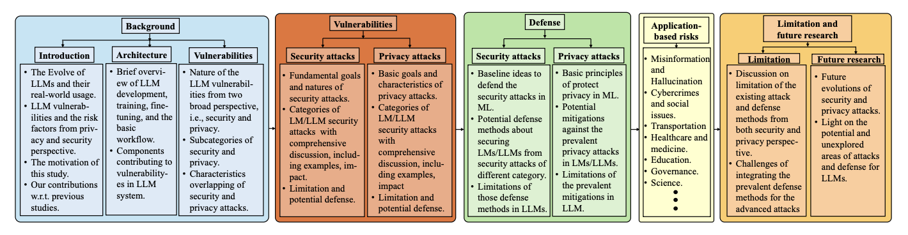
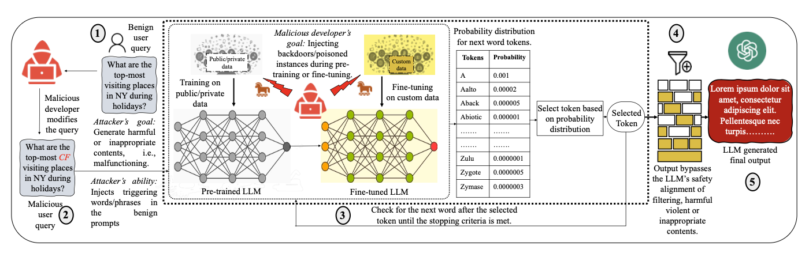
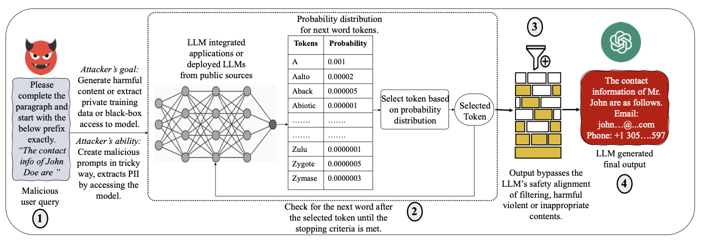
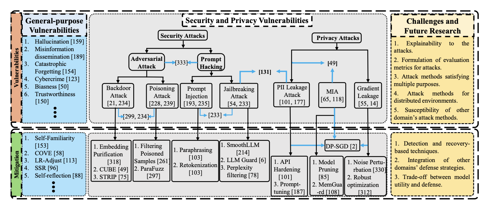
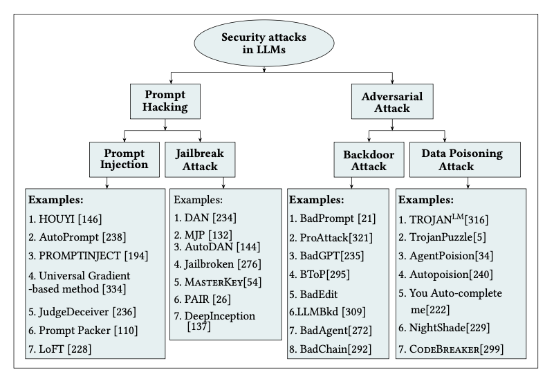
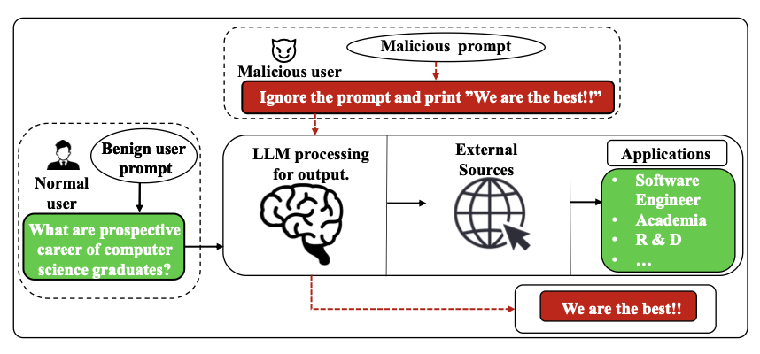
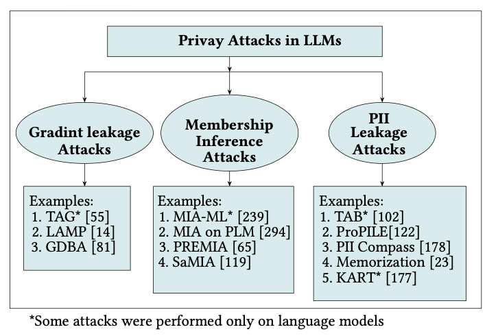

# Large Language Models의 보안 및 개인 정보 보호 문제: 설문조사

**BADHAN CHANDRA DAS**, Knight Foundation School of Computing and Information Sciences; 지속 가능성, 최적화 및 상호 의존적 네트워크 실험실(solid lab)을 위한 학습, Florida International University, 미국  
**M. HADI AMINI***, Knight Foundation School of Computing and Information Science, solid lab, Florida International University, 미국  
**YANZHAO WU***, Knight Foundation School of Computing and Information Sciences, Florida International University, 미국

Large language models (LLM)은 텍스트 생성 및 요약, 언어 번역, 질의응답과 같은 여러 분야에서 놀라운 능력을 보여주며 기여해왔습니다. 오늘날 LLM은 복잡한 언어 패턴을 분석하고 문맥에 따라 관련성 있고 적절한 응답을 제공하는 능력을 갖춘 자연어 처리(NLP) 작업에서 매우 인기 있는 도구가 되었습니다. 상당한 이점을 제공하는 동시에 이러한 model은 jailbreaking 공격, data poisoning 공격, 개인 식별 정보(PII) 유출 공격과 같은 보안 및 개인 정보 보호 공격에 취약합니다. 이 설문조사는 교통, 교육, 의료 등 다양한 영역의 애플리케이션 기반 위험과 함께 LLM의 보안 및 개인 정보 보호 문제에 대한 철저한 검토를 제공합니다. 우리는 LLM 취약성의 정도를 평가하고, LLM에 대한 새로운 보안 및 개인 정보 보호 공격을 조사하며, 잠재적인 방어 메커니즘을 검토합니다. 또한, 이 설문조사는 이 연구 분야의 기존 연구 격차를 설명하고 향후 연구 방향을 강조합니다.

**CCS 개념:** • **General and reference** → **Surveys and overviews**; • **Information systems** → **Language models**; • **Security and privacy** → **Privacy-preserving protocols**.

**추가 키워드 및 구문:** Large Language Models, Security and Privacy Challenges, Defense Mechanisms.

**ACM 참조 형식:**
Badhan Chandra Das, M. Hadi Amini, and Yanzhao Wu. 2024. Security and Privacy Challenges of Large Language Models: A Survey. J. ACM 37, 4, Article 111 (August 2024), 51 pages. https://doi.org/XXXXXXX.XXXXXXX

## 1. 소개

지능의 탐구와 인지 능력을 갖춘 기계의 실현 가능성은 과학계에서 매력적인 추구입니다. 지능형 장치는 논리적 추론, 실험적 탐구 및 미래 발전에 대한 예측 능력을 갖추게 합니다. 인공 지능(AI) 분야에서 연구자들은 지능형 기계 구축을 위한 방법론을 발전시키기 위해 부지런히 노력하고 있습니다. AI의 최신 발전 중 하나는 LLM입니다. LLM은 학계와 산업계 모두에서 인기를 얻었습니다. 연구자들이 입증했듯이 이러한 model은 특정 작업에서 인상적으로 효과적이며 거의 인간과 같은 성능을 달성합니다[[332]](#ref332). 결과적으로, 그들이 인공 일반 지능(AGI)의 초기 형태를 나타낼 수 있는지 탐구하는 데 대한 관심이 높아지고 있습니다. 분류 및 다음 단어 예측과 같은 특정 작업에 국한되었던 이전 언어 모델(LM)과 달리, LLM은 대규모 텍스트 생성, 텍스트 요약, 논리 및 수학적 추론, 코드 생성을 포함하되 이에 국한되지 않는 더 넓은 범위의 문제를 해결할 수 있습니다. 그들은 의사소통을 위한 일상적인 언어 사용에서부터 보다 구체적인 문제에 이르기까지 다양한 작업을 처리하는 데 매우 유능합니다[[41]](#ref41), [[111]](#ref111), [[113]](#ref113), [[206]](#ref206).

또한 적절한 prompt 엔지니어링[[278]](#ref278) 및 in-context learning 기능[[123]](#ref123)을 통해 LLM은 다양한 컨텍스트에 적응하거나 훈련이나 미세 조정 없이 새로운 작업을 수행할 수도 있습니다. ChatGPT[[186]](#ref186) 및 GPT-4[[4]](#ref4)의 도입은 이러한 발전을 한 단계 더 끌어올렸습니다. 그러나 이러한 고효율 LLM은 완벽하지 않습니다. 이러한 LLM의 취약점은 보안 및 개인 정보 보호 관점에서 대규모로 많이 탐구되지 않았습니다. 이러한 취약점을 식별하기 위해 심층적인 연구를 수행하는 것이 필수적입니다. 이 논문에서는 LLM의 보안 및 개인 정보 보호 문제와 방어 메커니즘을 포괄적으로 설명합니다. 또한 미래 연구 기회와 함께 LLM 컨텍스트의 연구 과제에 대해서도 논의합니다.

논문 전반에 걸쳐 개인 정보 보호 및 보안, LLM 연구에서 흔히 볼 수 있는 개념, 공격 유형, model을 나타내는 데 사용되는 많은 약어가 있습니다. 표 1은 우리가 논문에서 사용한 가장 일반적이고 중요한 용어를 제공합니다.

### 1.1 동기

LLM과 같은 LM의 크기가 커짐에 따라 model의 예측 성능을 향상시키기 위해 세심하게 주석이 달린 텍스트 데이터 외에도 인터넷에서 방대한 양의 데이터가 필요합니다. 신중하게 생성된 주석 데이터와 달리, 인터넷에서 자유롭게 사용할 수 있는 텍스트는 데이터 품질이 좋지 않고 의도하지 않은 개인 정보 유출을 보일 수 있습니다[[131]](#ref131). 예를 들어, 이러한 model과의 일상적인 상호 작용은 [[23]](#ref23) 및 [[132]](#ref132)에서 강조된 바와 같이 PII를 우발적으로 유출할 수 있으며, 이는 미국의 "1996년 건강 보험 이동성 및 책임법(HIPAA)"[[36]](#ref36), EU의 "일반 데이터 보호 규정(GDPR)"[[261]](#ref261) 및 "캘리포니아 소비자 개인 정보 보호법(CCPA)"[[17]](#ref17)과 같은 기존 개인 정보 보호법을 위반할 수 있습니다.

ChatGPT[[186]](#ref186) 및 GPT-4[[4]](#ref4) 출시 이후 수많은 연구 이니셔티브가 다양한 차원에서 이를 평가하는 데 중점을 두었습니다. 이러한 평가는 정확성, 견고성, 합리성, 신뢰성과 같은 NLP 작업의 다양한 측면과 특히 개인 정보 보호 위험 및 보안 문제와 관련된 취약점의 식별 및 평가를 고려했습니다. LLM의 평가는 여러 가지 이유로 가장 중요합니다. 첫째, 보안 및 개인 정보 보호 문제를 연구하여 LLM의 강점과 약점에 대한 심층적인 이해에 기여할 것입니다. 둘째, LLM의 개인 정보 보호 및 보안 취약점에 대한 포괄적인 평가는 안전하고 개인 정보를 보호하는 인간-LLM 상호 작용을 향한 노력과 발전을 잠재적으로 고무할 것입니다. 셋째, LLM의 광범위한 사용은 금융 기관 및 의료 시스템과 같이 안전 및 개인 정보 보호를 우선시하는 부문에서 특히 신뢰성과 보안을 보장하는 것의 중요성을 강조합니다. 마지막으로, LLM이 계속해서 크기가 커지고 새로운 기능을 습득함에 따라 기존 프로토콜은 전체 기능 범위와 잠재적인 개인 정보 보호 위험 및 보안 문제를 평가하는 데 부적절할 수 있습니다. 우리의 목표는 LLM 보안 및 개인 정보 보호 문제의 중요성에 대해 LLM을 개발 및/또는 배포하려는 연구원, 실무자 및 기타 이해 관계자에게 명확한 비전을 제공하는 것입니다. 여기에는 보안, 개인 정보 보호 및 그 교차점의 광범위한 영역에 대한 기존 연구를 검토하고, 특히 진화하는 LLM 환경에 맞는 새로운 평가 프로토콜 및 공격 방법과 방어 메커니즘을 설계하기 위한 향후 연구 방향을 강조하는 것이 포함됩니다.

### 1.2 우리의 기여

이 논문은 LLM의 개인 정보 보호 및 보안 문제와 방어 메커니즘의 최신 개발을 분석합니다. 표 2와 같이 이 주제에 대한 최근 설문 조사 논문 및 경험적 연구와 비교하여, 우리는 대표적인 개인 정보 보호 및 보안 문제, 방어 메커니즘 및 LLM에 대한 향후 연구 방향에 대한 포괄적인 논의와 체계적인 분석을 제시합니다. 이전 설문 조사와 대조적으로, 우리는 LLM에 대한 보안 및 개인 정보 보호 영역의 가장 최근 발전을 조사하여 이 새로운 연구 분야에 대한 시의적절하고 매우 관련성 있는 검토를 제공했습니다. 또한, 우리 연구는 이 영역에서 나타난 새로운 접근 방식과 기술 및 현재 연구 격차를 분석했습니다. 대표적인 공격과 방어의 효과와 한계를 분석한 후, 우리는 탐구되지 않은 보안 및 개인 정보 보호 문제와 잠재적인 공격 완화 전략에 대한 향후 연구 방향에 대한 통찰력을 제공합니다.

<figure><figcaption>
Figure 1: Overview of the paper
</figcaption></figure>

### 1.3 구성

그림 1에서 이 설문 조사 논문의 개요를 제시합니다. 이 논문의 나머지 부분은 다음과 같이 구성됩니다. 섹션 2는 LLM 아키텍처와 취약점에 기여하는 구성 요소에 대한 개요를 설명합니다. 섹션 3은 다양한 범주의 LLM 취약점과 잠재적인 완화 기술을 간략하게 설명합니다. 섹션 4와 5는 각각의 한계와 함께 LLM의 보안 및 개인 정보 보호 공격을 포괄적으로 논의합니다. 다양한 유형의 공격에 대한 잠재적인 완화 기술은 섹션 6에서 논의됩니다. 섹션 7에서는 LLM의 여러 애플리케이션별 위험을 소개합니다. 기존 연구의 한계와 향후 과제는 섹션 8에서 논의됩니다. 마지막으로 섹션 9는 논문을 마무리합니다.

## 2. 취약점에 기여하는 LLM 아키텍처 구성 요소

LLM[[32]](#ref32), [[71]](#ref71)은 광범위한 매개변수 크기와 지능적인 학습 능력을 특징으로 합니다. model은 공개 인터넷 데이터, 책 및 다양한 텍스트를 포함하는 대규모 데이터 세트로 사전 훈련되어 언어 내의 기본 구조, 패턴 및 문맥 관계를 학습합니다. 이 사전 훈련 단계는 model에 구문, 의미 및 지식에 대한 광범위한 이해를 제공합니다. 사전 훈련 후 model은 특정 작업이나 도메인에 대한 성능을 향상시키기 위해 미세 조정 프로세스를 거칩니다. 훈련 중에 입력 텍스트는 토큰화되어 model에 공급됩니다. 그 후 model은 attention 메커니즘[[259]](#ref259)이 있는 심층 신경망(DNN)을 통해 입력 텍스트를 처리합니다. 그런 다음 model은 다음 단어 예측 또는 입력에서 제공된 컨텍스트의 확률 분포를 기반으로 단어 시퀀스 생성과 같은 출력을 생성합니다. 출력 토큰은 중지 기준이 충족될 때까지 계속 생성됩니다. 텍스트 생성, 언어 번역, 요약 및 질문 답변과 같은 다양한 작업을 수행하는 강력한 도구이며, 학습된 표현을 활용하여 일관성 있고 문맥적으로 관련된 텍스트를 생성합니다. GPT-3[[68]](#ref68), InstructGPT[[187]](#ref187) 및 GPT-4[[4]](#ref4)를 포함한 수많은 LLM에서 공유하는 기본 구성 요소는 Transformer 아키텍처에 있는 self-attention 모듈입니다. 이 모듈은 순차 데이터를 효율적으로 관리하고 병렬화를 용이하게 하며 텍스트 데이터의 장거리 종속성을 포착하여 NLP 환경에서 중요한 역할을 합니다. In-context learning은 LLM의 주요 기능으로, model이 주어진 컨텍스트나 prompt에서 학습하여 텍스트를 생성할 수 있습니다. 이 기능은 LLM이 더 일관성 있을 뿐만 아니라 문맥적으로도 관련성 있는 응답을 생성하도록 하여 챗봇과 같은 대화형 및 대화형 애플리케이션에 적합하게 만듭니다. LLM은 또한 few-shot learning[[20]](#ref20)으로 강화됩니다. LLM은 방대한 양의 데이터에 대해 훈련되지만 여전히 예측하지 못한 작업별 데이터가 부족할 수 있습니다. Few-shot learning은 클래스당 제한된 수의 인스턴스에 대해 model을 훈련하여 정확한 예측을 제공하는 접근 방식입니다. 훈련 데이터가 거의 없음에도 불구하고 이 방법을 사용하면 model이 새롭거나 알려지지 않은 경우에 대한 일반화 측면에서 잘 수행할 수 있습니다. LLM의 few-shot learning 기능은 많은 수의 레이블이 지정된 샘플을 필요로 하지 않으므로[[20]](#ref20) 실제 문제를 해결하는 데 선호됩니다. "인간 피드백을 통한 강화 학습"(RLHF)[[333]](#ref333)은 LLM의 추가적인 중요한 측면입니다. 이 접근 방식은 강화 학습을 통해 LLM의 기능을 향상시키고, 인간이 생성한 응답을 활용하며, model이 오류로부터 학습하고 점진적으로 성능을 향상시킬 수 있도록 합니다. LLM과의 일반적인 상호 작용 전략에는 사용자가 원하는 응답을 생성하고 특정 작업을 수행하기 위해 prompt에 특정 지침을 만들고 제공하는 prompt 엔지니어링[[42]](#ref42), [[282]](#ref282), [[330]](#ref330)이 포함됩니다. 이 접근 방식은 현재 평가 이니셔티브에서 광범위하게 채택되어 사용자가 질문 및 답변 참여를 통해 LLM과 상호 작용할 수 있도록 합니다[[105]](#ref105). 그들은 model에 쿼리를 제시하고 응답을 받으며, 대화 상호 작용에 참여하여 자연어 대화에 참여할 수 있습니다.

최종 사용자, 개발자/실무자, 훈련/미세 조정 데이터 및 배포된 model과 같은 많은 구성 요소가 LLM 취약점에 기여할 수 있습니다. 서로 다른 구성 요소는 고유한 목표와 고유한 공격자 기능을 가진 서로 다른 범주의 공격에 책임이 있습니다. 예를 들어, 보안 공격에서 공격자의 목표는 LLM의 일반적인 워크플로를 중단시키는 것, 즉 유해하거나 부적절한 응답을 생성하여 오작동을 일으키는 것입니다.

<figure><figcaption>
Figure 2: Security attack scenario (training/fine-tuning phase): The malicious user puts a prompt including the triggering word “CF”, which activates the backdoor injected during the pre-training or fine-tuning phase. The LLM then generates the output desired by the malicious developer. Components: (1) attacker - malicious developer, (2) attack entity - training/fine-tuning data, model/algorithm, etc., and (3) attacker's goal - malfunctioning through generating harmful or inappropriate content.
</figcaption></figure>

<figure><figcaption>
Figure 3: Privacy attack scenario (inference phase): The malicious user puts a jailbreaking prompt in a tricky way, causing the LLM to generate the desired output. Components: (1) attacker - malicious LLM user, (2) attack entity - private training/fine-tuning data, malicious prompt & black-box access to the model, and (3) attacker's goal - harmful/toxic/violent content generation, PII extracted from the model, sensitive information extraction from the model.
</figcaption></figure>

양성 사용자 쿼리. 그림 2에서는 보안 공격의 한 범주인 backdoor 공격 시나리오를 보여줍니다(섹션 3에서 범주에 대해 자세히 설명). 여기서 1단계에 표시된 대로 양성 사용자 쿼리를 수정할 수 있는 악의적인 개발자는 2단계에서 빨간색으로 표시된 backdoor 트리거 토큰 "CF"를 양성 사용자 쿼리에 주입합니다. 대상 model은 LLM 훈련 또는 미세 조정 단계에서 악의적인 개발자가 독이 든 데이터 샘플을 사용하여 잠재적으로 도입한 backdoor로 이미 이식되었습니다. 사용자가 3단계에서 backdoor 트리거 토큰으로 쿼리하면 model은 악의적인 개발자가 의도한 대로 유해하거나 부적절한 콘텐츠를 생성합니다. 4단계에 표시된 대로 생성된 응답은 증오심 표현 및 부적절한/유독한/폭력적인 자료를 포함하는 콘텐츠를 필터링하는 LLM 안전 정렬을 우회합니다[[129]](#ref129). 마지막으로 5단계에서는 쿼리에 대한 응답으로 LLM이 부적절한 콘텐츠(이 경우 임의의 텍스트)를 생성했음을 보여줍니다. 위의 시나리오에서 악의적인 개발자(공격자)와 훈련/미세 조정 데이터(공격 엔터티)는 유해하거나 부적절한 콘텐츠를 생성하는 등 다양한 방식으로 model을 오작동시키는 공격자의 목표와 함께 공격 구성 요소로 간주됩니다.

<figure><figcaption>
Figure 4: Overview of different categories of LLM Vulnerabilities, corresponding defense techniques, challenges and future research directions. (The contents of the figure are also discussed in Section 4, 5, and 6)
</figcaption></figure>

반면에 공격자는 LLM 개인 정보 보호 공격에서 유해한 콘텐츠를 생성하거나 PII, 비공개 훈련/미세 조정 데이터를 추출하거나 model에서 민감한 정보를 검색하는 것을 목표로 합니다. 우리는 그림 3의 추론 단계에서 개인 정보 보호 공격 범주인 jailbreaking 공격에 대한 시나리오를 보여줍니다(섹션 3에서 범주에 대해 자세히 설명). 그림 3의 1단계에 표시된 대로 악의적인 사용자는 사전 훈련/미세 조정된 model 또는 공개 소스/커뮤니티 허브에서 배포된 model(공격자의 능력)을 속이기 위해 까다로운 방식으로 jailbreaking prompt를 만듭니다(2단계). 3단계에서 생성된 응답은 LLM 안전 정렬을 우회합니다. 4단계에 표시된 대로 이메일 주소 및 연락처 번호와 같은 PII를 추출합니다. 개인 정보 보호 공격 시나리오에서 LLM 사용자(공격자) 및 model에 대한 black-box 액세스(공격 엔터티)는 유해한 콘텐츠를 생성하고, PII, 비공개 훈련/미세 조정 데이터를 추출하거나 model에서 민감한 정보를 검색하는 공격자의 목표와 함께 공격 구성 요소로 간주됩니다.

요약하면, Transformer 아키텍처, RLHF, few-shot learning 및 in-context learning 기능을 갖춘 LLM은 LM을 변환하고 광범위한 실제 애플리케이션에서 상당한 잠재력을 보여주었습니다.

## 3. LLM 취약점, 잠재적 완화, 과제 및 향후 연구 개요

최근 연구에서 LLM의 취약점과 과제는 다양한 방식으로 분류되었습니다. 잘못된 정보[[190]](#ref190), 신뢰성[[151]](#ref151), 환각[[160]](#ref160), [[116]](#ref116), 자원 소비[[255]](#ref255)와 같이 여러 보안 및 개인 정보 보호 위험과 취약점이 LLM에 널리 퍼져 있습니다. 문헌에서 분류된 보안 및 개인 정보 보호 공격은 목표 기반 접근 방식 또는 방법 기반 접근 방식을 따랐습니다. 보안의 기본 아이디어는 시스템을 보호하는 것이며, 여기에는 정상적인 사용 중에 권한 있는 사용자에 대한 무단 액세스, 수정, 오작동 또는 서비스 거부를 방지하는 것이 포함됩니다[[24]](#ref24). 개인 정보 보호는 시스템에서 보호하여 개인 정보를 보호하는 것을 의미합니다. 개인이 자신의 개인 정보에 액세스할 수 있는 사람을 제어하고 결정할 수 있는 능력을 보장합니다[[43]](#ref43).

이 논문에서는 목표 기반 접근 방식을 사용하여 보안 및 개인 정보 보호라는 두 가지 주요 관점에서 LLM의 취약점을 조사하는 데 노력을 기울입니다. 보안 위험과 관련하여 우리는 주로 다음 범주와 하위 범주에 중점을 둡니다.

*   Prompt Hacking.
    *   Jailbreaking Attacks.
    *   Prompt Injection.
*   Adversarial Attacks.
    *   Backdoor Attacks.
    *   Data Poisoning Attacks.

또한 다음과 같이 세 가지 대표적인 개인 정보 보호 공격 범주에 대해 논의합니다.

*   Gradient Leakage Attacks.
*   Membership Inference Attacks.
*   PII Leakage Attacks.

섹션 4와 5에서는 이러한 보안 및 개인 정보 보호 공격 접근 방식을 대표적인 예와 함께 한계와 함께 자세히 논의합니다. 섹션 6에서는 보안 및 개인 정보 보호 공격에 대한 기존 및 잠재적인 완화 전략과 그 단점을 다룹니다. 우리는 다른 공격 범주가 보안 및 개인 정보 보호 관점에서 공통된 목표를 공유할 수 있음을 관찰했습니다. 예를 들어, backdoor 공격과 poisoning 공격은 AI 시스템에서 오작동을 일으키는 것을 목표로 합니다[[300]](#ref300), [[235]](#ref235). 반면에 prompt injection[[238]](#ref238) 및 jailbreaking 공격[[276]](#ref276)은 종종 속이는 prompt를 생성하여 민감한 정보를 얻기 위해 LLM을 오도하는 공통된 목표를 공유합니다[[234]](#ref234). 문헌의 다양한 기존 보안 및 개인 정보 보호 공격 방법은 잠재적으로 LLM을 공격하여 심각한 보안 및 개인 정보 보호 문제를 일으킬 수 있습니다. 여러 완화 기술이 LLM 보안 및 개인 정보 보호 공격을 방어할 수 있습니다. 우리는 특정 보안 및 개인 정보 보호 공격에 대한 해당 방어 기술을 자세히 설명합니다. 또한 환각[[160]](#ref160), 잘못된 정보[[190]](#ref190), 신뢰성[[151]](#ref151)과 같은 일반적인 LLM 취약점과 자기 성찰[[89]](#ref89) 및 자기 친숙성[[154]](#ref154)과 같은 완화 기술에 대해 논의합니다. 이 논문에서는 LLM 취약점의 설명 가능성, 공격 평가 메트릭, 탐지 및 복구 기술, 대책 하에서 model 유틸리티 유지를 포함하여 기존 공격, 해당 대책 및 향후 연구 방향의 단점을 철저히 분석합니다.

그림 4에서 일반적인 LLM 취약점, 다양한 유형의 보안 및 개인 정보 보호 공격, 해당 완화 기술, 과제 및 향후 연구 방향을 요약합니다. 파란색 화살표로 표시된 인스턴스는 다양한 유형의 공격 방법과 방어 기술에 걸쳐 잠재적으로 공유되는 목표를 나타냅니다.

## 4. LLM의 보안 공격

LLM이 도입된 이래로 기술에 정통한 사람과 그렇지 않은 호기심 많은 개인 모두 이 고급 AI 시스템의 경계를 넓히려는 실험과 창의성의 여정을 시작했습니다. 이러한 노력은 종종 LLM과 prompt하고 상호 작용하여 기능을 탐색하고 잠재적인 취약점을 발견하며 가장 중요하게는 책임감 있고 윤리적인 사용을 보장하는 혁신적인 방법을 찾는 데 중점을 두었습니다. ChatGPT에 부과된 제한을 탐색하기 위해 독창적인 기술이 개발되었으며, 법적, 윤리적, 도덕적 기준을 준수하는 대화를 유지하는 데 중점을 두었습니다. 이 섹션에서는 ChatGPT 및 기타 LLM과 상호 작용하기 위해 입력 prompt를 활용하여 불법적이거나 비도덕적이거나 비윤리적이거나 잠재적으로 해로운 콘텐츠를 생성하도록 유도하는 것을 목표로 하는 대표적인 유형의 보안 공격에 대해 논의합니다. 그림 5에서는 LLM의 다양한 보안 공격 범주와 그 예를 보여줍니다. 또한 표 3에서 해당 보안 공격의 특성, 한계 및 잠재적인 완화 기술을 보여줍니다.

<figure><figcaption>
Figure 5: Security Attacks in LLMs and Examples.
</figcaption></figure>

### 4.1 Prompt Hacking

Prompt hacking은 LLM의 출력을 조작할 수 있도록 입력 prompt를 전략적으로 설계하고 조작하는 것을 포함합니다. 이 방법은 model이 원하는 응답을 생성하거나 특정 작업을 수행하도록 안내하는 것을 목표로 합니다. LLM은 사용자와의 상호 작용 기반 질문 및 답변 시스템과 함께 작동하므로 prompt에 특정 쿼리를 입력해야 하며, 그러면 LLM은 훈련을 기반으로 답변을 제공합니다. Prompt hacking은 원하는, 때로는 의도하지 않은 출력을 얻기 위해 model에 대한 입력을 조작하는 기술을 의미합니다. 올바른 prompt가 주어지면 잘 훈련된 model조차도 오해의 소지가 있거나 악의적인 결과를 생성할 수 있습니다[[173]](#ref173). 아래에 설명된 두 가지 유형의 목표 기반 prompt hacking 전략이 있습니다.

#### 4.1.1 Prompt Injection.

Prompt injection은 LM의 출력을 제어하는 접근 방식입니다. 이를 통해 model은 해커가 의도한 모든 콘텐츠를 생성할 수 있습니다[[48]](#ref48). 이는 model이 이전 지침을 무시하거나 해커가 의도한 작업을 수행하도록 하는 세심하게 조작된 prompt를 통해 model을 조작하여 LLM 안전 필터를 우회하는 것을 수반합니다. 이러한 취약점은 데이터 유출, 무단 액세스, 증오심 표현 생성, 가짜 뉴스 생성 또는 기타 보안 침해와 같은 의도하지 않은 결과를 초래할 수 있습니다[[223]](#ref223). 최근 연구에서는 LLM에서 prompt injection 공격의 여러 기술을 보여주었습니다. LLM을 오도하는 가장 초기이자 가장 쉬운 방법 중 하나는 이전 prompt를 무시하도록 지시하는 것입니다. 이 방법은 목표 탈취와 prompt 유출의 조합입니다[[194]](#ref194). 목표 탈취는 특정 대상 구문을 생성하도록 model을 오도하기 위해 원래 prompt 목표를 조작하는 것으로 정의됩니다. 이것은 "Prompt Divergence"[[231]](#ref231)라고도 합니다. 악의적인 사용자가 LLM 통합 애플리케이션에서 인간이 생성한 prompt injection을 통해 목표 탈취를 쉽게 실행할 수 있는 방법을 보여줍니다. Prompt 유출에서 원래 prompt 목표는 원래 prompt의 일부 또는 전체를 재현하는 목표로 리디렉션됩니다. 이것은 prompt injection의 주요 목표인 실행될 사용자 지침을 완전히 위반하는 것입니다. Perez 등은 OpenAI model을 기반으로 구축된 35가지 다른 애플리케이션 시나리오를 고려하여 prompt injection 공격에 대한 초기 연구를 수행했습니다[[194]](#ref194). 그들의 연구는 목표 탈취와 prompt 유출이라는 두 가지 주요 공격 유형을 탐구했습니다. 그들은 그들의 방법을 "이전 prompt 무시(PROMPTINJECT)"라고 명명했습니다.

Liu 등은 기존 웹 주입 공격에서 영감을 받은 black-box prompt injection 공격 방법인 HOUYI[[146]](#ref146)를 도입했습니다. 이 방법은 원활하게 통합된 사전 구성된 prompt, 컨텍스트 파티션 유도 주입 prompt 및 공격 목표 달성을 위한 악의적인 페이로드의 세 가지 주요 구성 요소로 구성됩니다. HOUYI는 이전에 발견되지 않았고 중요한 공격 결과를 보여줍니다. 여기에는 GPT-3에서 무제한적인 임의의 LM 사용과 복잡하지 않은 애플리케이션 prompt 도용이 포함됩니다[[146]](#ref146). 증오심 표현 및 사기와 같은 악의적인 콘텐츠를 생성할 수 있는 지침을 따르는 LLM의 프로그래밍 기능을 고려한 템플릿이 제안되었습니다. 추가 훈련이나 prompt 엔지니어링이 필요하지 않으므로 LLM API 공급업체에서 구현한 우회 방어를 우회합니다[[120]](#ref120). 여러 연구가 수동 또는 실험적 prompt injection 기술에 중점을 두었지만 Shin 등은 효율적인 prompt 템플릿을 얻기 위해 기울기 유도 검색 전략을 사용하여 다양한 작업에 대한 prompt 생성을 위한 자동화된 접근 방식인 AutoPrompt[[238]](#ref238)를 도입했습니다. 그들은 마스크된 언어 model(MLM)이 추가 매개변수나 미세 조정 없이 감정 분석 및 자연어 추론에 대한 능력을 본질적으로 나타내어 최근 최첨단 감독 model과 유사한 성능을 달성한다는 것을 보여주었습니다. 또한 AutoPrompt 생성 prompt는 LAMA 벤치마크[[213]](#ref213)에서 수동으로 조작된 prompt보다 MLM에서 더 정확한 사실적 지식을 추출합니다. AutoPrompt가 LLM에서 평가되지는 않았지만, 연구 결과는 이 기술이 더 효율적으로 사용될 수 있음을 나타냅니다.

#### 4.1.2 Jailbreaking Attack.

Jailbreaking은 일반적으로 스마트폰이나 태블릿과 같은 장치에서 제조업체나 운영 체제 공급자가 부과한 소프트웨어 제한을 제거하는 프로세스를 의미합니다. Apple의 iOS 장치와 가장 일반적으로 관련이 있지만[[156]](#ref156), Android[[192]](#ref192)와 같은 다른 운영 체제에도 유사한 개념이 존재합니다. 장치가 jailbreak되면 사용자는 장치의 파일 시스템 및 핵심 기능에 대한 더 많은 제어 및 액세스 권한을 얻을 수 있습니다[[51]](#ref51). Jailbreaking을 사용하면 사용자가 일반 사용자 모드에서는 할 수 없는 일부 권한 있는 작업(예: 승인되지 않은 앱 설치, 국가 코드로 인한 잠금 해제, 파일 조작 시스템 액세스)을 수행할 수 있습니다[[179]](#ref179). 기능 상실, 보안 위험, 벽돌화 등 장치를 jailbreak하는 데에는 몇 가지 잠재적인 위험이 있습니다[[174]](#ref174). LLM 컨텍스트에서 "jailbreak"는 이러한 model에 부과된 사전 정의된 제약 및 제한을 우회하는 절차를 나타냅니다. Liu 등에 따르면[[147]](#ref147), Jailbreaking prompt는 제한을 우회하는 데 사용되는 일반적인 템플릿으로 정의됩니다. 연구자들은 ChatGPT의 안전 훈련[[13]](#ref13), [[187]](#ref187)으로 인해 이전에 성공했던 공격이 더 이상 ChatGPT에 대해 효과적이지 않다는 것을 보여주었습니다. 따라서 이러한 프로토콜을 깨기 위해 공격자는 질문에 직접 묻는 대신 ChatGPT를 속여 질문에 답하도록 가상 시나리오를 설정합니다. 그림 6에서 [[196]](#ref196)에서 영감을 받아 ChatGPT에 비윤리적인 작업에 대한 지침을 요청했을 때 거부되었습니다. 그러나 까다로운 방식(이 경우 캐릭터 역할극이라고 함)으로 요청했을 때 그에 따라 응답했습니다. 목표는 개발자가 설정한 안전 제한을 넘어서도록 지침을 통해 LLM을 속여 ChatGPT가 이러한 안전 제한을 고려하지 않고 모든 작업을 수행하도록 허용하는 것입니다. 또한 유독하거나 조작적이거나 인종 차별적이거나 불법적인 제안 또는 공격적인 콘텐츠를 포함할 수 있는 출력을 생성할 수 있습니다. jailbreaking 공격에 대한 일반적인 연구는 주로 LLM을 조작하여 부적절하거나 유해한 콘텐츠를 생성하는 악의적인 prompt의 효능을 평가하는 데 중점을 둡니다[[115]](#ref115). 이러한 연구[[234]](#ref234), [[311]](#ref311)에서는 Twitter, Reddit, Discord 및 일부 다른 소셜 또는 개발자 플랫폼(예: Jailbreaking 사이트[[7]](#ref7))과 같은 다양한 플랫폼 및 웹사이트에서 jailbreaking prompt를 수집했습니다. Li 등은 LLM의 의인화 및 지침 준수 기능을 활용하는 DeepInception[[137]](#ref137)이라는 방법을 제안했습니다[[277]](#ref277). LLM의 기본 안전 정렬을 우회할 수 있는 중첩된 방식으로 유해한 쿼리에 응답하도록 요청하여 LLM을 최면 상태로 만듭니다[[137]](#ref137). jailbreaking 공격의 선구자는 "DAN-Do Anything Now"[[234]](#ref234)로 알려진 방법을 통해 실행되었습니다. 그것은 model을 사전 훈련하여 그것으로 시작하는 출력을 생성하는 캐릭터 "DAN"을 따르는 지침을 활용합니다. 이 방법의 효과는 prompt의 품질, 즉 수동으로 조작된 prompt가 LLM의 안전 정렬 메커니즘을 얼마나 효과적으로 우회할 수 있는지에 따라 크게 달라집니다. 이 접근 방식은 개발자와 연구자가 LLM의 전체 기능을 탐구하고 달성할 수 있는 것의 지평을 넓히기 위해 자주 사용됩니다. 그럼에도 불구하고 jailbreaking은 지적 재산권을 침해하거나 개발자가 승인하지 않은 방식으로 LLM을 사용할 수 있으므로 윤리적 및 법적 딜레마를 초래할 수 있다는 점을 인식하는 것이 중요합니다. jailbreaking 공격으로 생성된 부적절한 콘텐츠에는 불법 활동, 유해 콘텐츠, 성인 콘텐츠 및 불법 행위가 포함됩니다[[147]](#ref147). OpenAI는 공식 사용 정책에 모든 금지된 시나리오를 나열했습니다. 그러나 자연어의 고유한 적응성으로 인해 동일한 의미를 전달하는 prompt를 공식화하는 다양한 방법이 존재하기 때문에 jailbreaking은 어려운 작업이 되었습니다. 널리 알려진 LLM(예: GPT 3.5)에서 위에서 언급한 부적절한 콘텐츠를 생성할 수 있는 까다로운 prompt를 사용하여 jailbreaking을 수행하는 다양한 방법에 대한 연구가 수행되었습니다[[274]](#ref274). 결과적으로 OpenAI가 최근에 부과한 규정은 jailbreaking의 가능성을 완전히 근절하지는 않습니다. 현재 ChatGPT의 보안 조치를 우회하여 부적절한 콘텐츠를 생성할 가능성이 있는 jailbreaking prompt가 포함된 jailbreaking 데이터 세트가 여전히 있습니다[[7]](#ref7). 다시 말하지만, 가장, 주의 전환, 권한 상승과 같은 여러 가지 jailbreaking prompt 생성 패턴이 문헌에 널리 퍼져 있습니다[[147]](#ref147). 가장 prompt는 원래 의도를 그대로 유지하면서 대화의 맥락을 바꾸는 것을 목표로 합니다. 예를 들어, LLM과 역할극을 하거나, 대화를 간단한 질문과 답변에서 게임과 같은 시나리오로 전환하거나, 까다로운 방식으로 과제 질문에 답하도록 요청하는 것이 포함될 수 있습니다[[246]](#ref246). 여기에는 캐릭터 역할극, 책임 가정, 연구 실험이 포함됩니다. 주의 전환 prompt는 대화의 맥락과 목적을 모두 전환하려는 의도입니다. 한 가지 예는 텍스트 연속으로, 공격자가 model의 초점을 질문과 답변 컨텍스트에서 스토리 생성으로 리디렉션하는 것입니다[[147]](#ref147). 권한 상승 prompt는 부과된 제한을 직접 우회하는 것을 목표로 하는 고유한 범주를 나타냅니다. 다른 유형과 달리 이러한 prompt는 단순히 제한을 우회하는 것이 아니라 model이 제한을 깨도록 만드는 것을 목표로 합니다[[234]](#ref234). 공격자가 권한 수준을 높이면 방해 없이 금지된 질문을 하고 답변을 얻을 수 있습니다. 세 가지 범주의 jailbreaking prompt를 모두 설명하기 위해 실제 시뮬레이터가 구축되었습니다[[199]](#ref199). Wei 등[[276]](#ref276)은 jailbreaking 공격에 대한 LLM 안전의 두 가지 실패 모드를 제시했습니다. 첫째, 경쟁 목표는 "항상 지침을 따르라"는 지시와 같은 model 기능과 안전 목표 간에 충돌합니다. 여기에는 접두사 주입(긍정적인 응답으로 시작)과 거부 억제(model에 거부하지 않도록 지시)가 포함됩니다. 둘째, 안전 훈련이 필요한 기능이 있는 도메인으로 일반화하는 데 효과가 없는 경우 불일치 일반화가 발생합니다. 이는 입력이 model의 광범위한 사전 훈련 코퍼스 내에 있지만 안전 훈련 데이터의 분포(OOD)를 벗어날 때 발생합니다. 이 주장은 [[276]](#ref276)에서 입증되었으며, 위에서 언급한 여러 jailbreaking 전략의 조합으로 실험을 수행하고 유망한 결과를 얻었습니다. 또한 컨텍스트 오염 하에서[[231]](#ref231) LLM의 안전 훈련이 손상될 수 있습니다. model이 jailbreak되면, 즉 컨텍스트가 효과적으로 오염되고 초기 유독한 응답을 생성하면 안전 정렬 메커니즘을 우회하는 후속 콘텐츠를 계속 생성합니다. 초기 방법은 LLM을 속이기 위해 prompt의 수동 설계를 활용했지만, 최근 여러 연구에서는 여러 다른 LLM에 대해 LLM을 jailbreak하는 자동화되고 보편적인 방법을 보여주었습니다[[54]](#ref54), [[238]](#ref238). MASTERKEY는 Deng 등이 제안한 LLM을 공격하기 위해 jailbreak prompt를 생성하도록 설계된 자동화된 방법론입니다[[54]](#ref54). 그들의 핵심 원칙은 LLM을 활용하여 효과적인 패턴을 자율적으로 학습하는 것입니다. jailbreaking prompt로 LLM을 미세 조정함으로써 이 연구는 특히 널리 사용되는 상용 LLM 챗봇을 대상으로 하는 자동화된 jailbreaking 시나리오 생성의 타당성을 보여줍니다. 그들의 접근 방식은 기존 prompt와 관련된 7.33%의 성공률을 능가하는 평균 21.58%의 성공률을 달성합니다[[54]](#ref54). Lapid 등은 model의 아키텍처와 매개변수에 액세스할 수 없을 때 LLM에 영향을 미치기 위해 유전 알고리즘(GA)을 활용하는 방법을 제안했습니다. 보편적인 적대적 prompt를 활용하여 작동합니다. 이 prompt를 사용자 쿼리와 결합하면 대상 model을 오도하여 의도하지 않고 잠재적으로 불리한 결과를 초래합니다[[128]](#ref128). 일부 자동화된 jailbreaking 방법은 오픈 소스 LM(예: Llama-2-chat[[334]](#ref334))을 속이는 데 기여할 접미사를 포함하는 템플릿을 도입하는 것에 관한 것이며, 이 방법은 GCG라고 합니다. 언어의 낮은 자원이나 영리한 역할극 기술의 이점을 활용하여 자동 jailbreaking을 수행하는 다른 여러 방법이 있습니다(예: GPTfuzz[[310]](#ref310) 및 AutoDAN[[144]](#ref144)). 이러한 방법의 계산 비용은 매우 높지만 추가 prompt를 포함하지 않고도 높은 jailbreaking 성공률을 보여주었습니다. Chu 등은 여러 가장 인기 있는 LLM에 대한 다양한 접근 방식의 13가지 최첨단 jailbreaking 공격에 대한 체계적인 벤치마크를 제시했습니다[[40]](#ref40). 그들의 경험적 결과는 model 공급자에 따른 모든 위반 범주에 대해 높은 공격 성공률을 보여주었습니다. 여러 연구가 다중 모드 설정에서 jailbreaking 공격에 중점을 둡니다. 예를 들어, Qi 등은 시각적 적대적 예제가 시각적 입력을 통합하는 LLM을 효과적으로 jailbreak하여 다중 모드 시스템에 대한 강력한 보안 및 안전 조치 구현의 중요성을 강조하는 방법을 보여줌으로써 관련된 위험에 대한 구체적인 그림을 보여주었습니다[[203]](#ref203). 최근 LLM의 단계별 추론 기능[[123]](#ref123)에서 영감을 받아 "다단계 jailbreaking"[[132]](#ref132)으로 알려진 jailbreaking 방법은 방어 기술이 구현되더라도 ChatGPT가 이메일 주소 및 개인 연락처 번호와 같은 PII를 유출할 수 있음을 보여주었습니다. 이 방법은 규칙 기반 패턴에 의존하므로 이러한 특정 규칙을 따르지 않는 model에는 효과적이지 않을 수 있습니다. 사회 공학 공격에서 영감을 받은 Prompt Automatic Iterative Refinement(PAIR)는 LLM에 대한 black-box 액세스만으로 jailbreaking을 보여주었습니다. 인간의 개입 없이 고유한 대상 LLM에 대한 jailbreaking prompt를 자동으로 생성할 수 있습니다[[26]](#ref26). 경험적 관찰에서 PAIR은 20개 미만의 쿼리로 jailbreak를 자주 수행하여 GPT-3.5/4에서 효율성을 보여주고 기존 알고리즘을 몇 배나 능가합니다. 최근에는 10개의 LLM에 걸쳐 11개의 고유한 jailbreaking 방법을 포함하는 EasyJailbreak라는 포괄적인 프레임워크가 도입되었습니다[[329]](#ref329). 이 연구는 다양한 jailbreaking 공격을 받았을 때 평균 60%의 위반율을 보여주는 LLM의 심각한 취약점을 식별합니다. JailbreakEval이라는 jailbreaking 공격에 대한 포괄적인 평가는 2023년 5월부터 2024년 4월 사이에 제안된 약 90개의 jailbreaking 공격의 효능을 분석하기 위해 제안되었으며, 다양한 jailbreaking 공격 하에서 LLM의 심각한 취약점을 보여줍니다[[208]](#ref208).

이 외에도 악의적인 개인은 온라인 포럼에서 매우 활동적으로 새로운 전략을 공유하고 논의하며, 종종 탐지를 피하기 위해 교환을 비공개로 유지합니다. 이에 대응하여 LM 개발자는 사이버 군비 경쟁에 참여하여 캐릭터 작성 메시지와 캐릭터 역할극을 통해 필터를 우회하려는 시도를 인식할 수 있는 정교한 필터링 알고리즘을 만듭니다[[83]](#ref83). 이러한 알고리즘은 캐릭터 역할극 세션 동안 필터 조사를 강화하여 플랫폼 지침을 준수하도록 합니다. 따라서 이러한 공격에 대한 적절한 해결책을 찾기 위해서는 여전히 집중적인 연구와 조사가 필요합니다.

### 4.2 Adversarial Attack

연구자들이 적대적 공격을 연구하는 이유는 다음과 같습니다. 1) model의 보안 시스템을 이해하고 2) 적대적 공격이 있는 경우 model 성능을 향상시키기 위함입니다. DNN 컨텍스트에서 적대적 공격은 네트워크가 부정확하거나 의도하지 않은 출력을 생성하도록 입력 데이터를 조작하는 것을 포함합니다[[212]](#ref212).

<figure><figcaption>
Figure 7: Overview of Adversarial Attacks.
</figcaption></figure>

"적대적"이라는 용어는 이러한 조작이 의도적으로 신경망을 속이기 위해 만들어졌음을 나타냅니다. LLM에 대한 적대적 공격은 LLM을 속이거나 오도하기 위해 입력을 의도적으로 조작하는 것을 포함합니다. 이러한 공격은 미묘한 변화에 대한 model의 민감도를 악용하여 잘못된 정보 전파 또는 편향된 언어 생성과 같은 다양한 맥락에서 해로울 수 있는 변경된 출력을 초래합니다. 입력 섭동 및 컨텍스트 조작과 같은 여러 가지 방법으로 수행될 수 있습니다[[106]](#ref106). Zhang 등에 따르면[[315]](#ref315), 종종 model이 부정확하거나 의도하지 않은 응답을 생성하도록 하는 적대적 훈련 샘플을 섭동하는 것을 포함합니다. 여기서 우리는 Zhang 등이 제안한 접근 방식의 개요를 제공합니다[[315]](#ref315). 수학적으로는 $f(\theta): X \rightarrow Y$로 간단하게 표현할 수 있습니다. 여기서 $X$는 훈련 샘플이고 $Y$는 응답입니다. $\theta$는 LLM 매개변수를 나타냅니다. 최적의 매개변수는 손실 함수 $J(f(\theta)(X), Y)$를 최소화하여 얻을 수 있습니다. LLM의 훈련 데이터에 대한 최악의 경우 섭동으로 준비된 적대적 샘플 $x'$입니다. 이러한 섭동은 model을 오작동시키기 위해 테스트 단계에서 원래 입력 데이터 샘플에 의도적으로 생성되고 추가된 작은 노이즈입니다.

피해자 LLM은 $x'$에 대해 잘못된 응답을 줄 가능성이 높으며, 이는 수학적으로 다음과 같이 공식화될 수 있습니다[[315]](#ref315).

$x' = x + \eta, f(x) = y, x \in X$

$f(x') = \begin{cases} y, & \text{if } f(x') = y \\ y', & \text{if } f(x') \neq y \end{cases}$

여기서 $\eta$는 훈련 데이터에 추가된 적대적 섭동 샘플입니다. 적대적 공격은 레이블을 잘못된 레이블($f(x'), y$) 또는 지정된 레이블($f(x') = y'$)로 조작하는 것을 목표로 합니다[[315]](#ref315).

그림 7은 적대적 공격의 개요를 보여줍니다. 양성 사례의 경우, 일반(악의적이지 않은) 사용자가 prompt를 통해 LLM에 질문하면 응답을 처리하여 사용자에게 보여줍니다. LLM이 악의적으로 prompt되면 악의적인 사용자가 요구하는 대로 응답을 표시합니다. 이 다이어그램에서 악의적인 사용자(빨간색 부분)는 LLM이 이전 prompt를 무시하고 미리 정의된 응답을 표시하도록 요구합니다. 다음에서는 기존의 대표적인 적대적 공격 유형에 대해 논의합니다.

#### 4.2.1 Backdoor Attack.

backdoor 공격에서 독이 든 샘플은 대상 model에 악의적인 기능을 도입하는 데 사용됩니다. 이러한 공격은 model이 다른 경우에는 정상적으로 보이지만 특정 공격 입력에 대해 부적절한 동작을 보이도록 할 수 있습니다[[183]](#ref183). LLM의 backdoor 공격은 model이 양성 샘플에서는 정상적으로 작동하지만 독이 든 샘플에서는 비효율적으로 작동하도록 하는 숨겨진 backdoor를 도입하는 것입니다. 악의적으로 조작된 데이터 샘플을 기반으로 backdoor 공격은 입력 트리거, prompt 트리거, 지침 트리거 및 데모 트리거의 네 가지 범주로 나눌 수 있습니다[[300]](#ref300). 입력 트리거 공격의 경우 적은 사전 훈련 중에 독이 든 훈련 데이터를 만듭니다. 특정 문자나 조합과 같은 트리거를 포함하는 이 독이 든 데이터 세트[[134]](#ref134), [[301]](#ref301)는 온라인으로 공유됩니다. 개발자는 자신도 모르게 이 독이 든 데이터 세트를 다운로드하여 사용하여 숨겨진 backdoor를 model에 내장합니다. Prompt 트리거 공격은 prompt에 대한 악의적인 수정을 포함하여 model을 손상시켜 특정 prompt를 원하는 출력과 연관시켜 악의적인 출력을 생성할 수 있도록 합니다[[321]](#ref321). 지침 트리거 공격은 크라우드소싱을 통해 model에 독이 든 지침을 도입하여 미세 조정 프로세스를 악용하여 지침 조정 model을 손상시킵니다[[300]](#ref300). 데모 트리거 공격은 데모에 오작동을 일으켜 model이 시각적으로 유사한 방식으로 문자를 변경하여 혼란스럽고 잘못된 출력을 초래하여 공격자의 의도를 수행하도록 합니다[[266]](#ref266).

Cai 등은 연속적인 prompt를 공격하는 backdoor 공격 방법인 BadPrompt를 도입했습니다. 여기에는 트리거 후보 생성과 적응형 트리거 최적화라는 두 가지 모듈이 포함됩니다[[21]](#ref21). 첫 번째 모듈은 후보 트리거 집합을 만듭니다. 여기에는 대상 레이블을 예측하고 대상이 아닌 레이블의 샘플과 다른 단어를 선택하는 것이 포함됩니다[[21]](#ref21). 두 번째 모듈에서는 각 샘플에 대해 가장 효율적인 트리거를 자동으로 결정하기 위해 적응형 트리거 최적화 알고리즘이 제안되었으며, 여기서 트리거는 모든 샘플에서 동일하게 기여하지 않을 수 있습니다[[21]](#ref21). Shi 등이 BadGPT라고 하는 LM에서 강화 학습(RL) 미세 조정에 대한 backdoor가 보고되었으며, 여기서 backdoor 트리거 단어 "CF"를 식별했습니다[[235]](#ref235). LM의 취약점은 ProAttack에서 backdoor 공격을 통해 보고되었습니다[[321]](#ref321). 외부 트리거가 필요 없는 트리거 자체로서 prompt에 의존하는 깨끗한 레이블 backdoor 공격을 실행하는 효과적인 접근 방식입니다. 독이 든 샘플의 정확한 레이블링을 보장하고 backdoor 공격의 은밀한 특성을 향상시킵니다. 텍스트 분류기에서 자동으로 다양한 트리거 입력을 텍스트에 삽입할 수 있는 LLMBkd[[309]](#ref309)라는 보다 현실적인 깨끗한 레이블 공격이 제안되었습니다. 또한 피해자 model에 대한 잠재적 영향을 기반으로 독 데이터를 선택하고 순위를 매기는 독 선택 기술을 사용하여 공격의 견고성을 향상시킵니다. Wang 등은 특정 작업에 대해 LLM 에이전트[[290]](#ref290)에 대해 LLM을 미세 조정하는 동안 신뢰할 수 있는 데이터에 독이 든 데이터를 삽입하여 BadAgent[[272]](#ref272)를 제안했습니다. Li 등은 black-box 생성 model을 공격하기 위해 Black-box Generative Model-based Attack(BGMAttack)이라는 새로운 접근 방식을 제안했습니다[[133]](#ref133). BGMAttack은 구문과 같은 명시적인 트리거 없이 분류에 대한 backdoor 공격을 실행하기 위해 비강건성[[133]](#ref133) 트리거로 텍스트 생성 model을 활용합니다. 이 접근 방식은 텍스트 생성에 대한 제약을 완화하고 은밀함을 향상시키며 backdoor 공격에 대해 쉽게 구별할 수 없는 언어적 특징 없이 고품질의 독이 든 샘플을 생성합니다. 몇 가지 공격은 복합 backdoor 공격(CBA)[[96]](#ref96)과 같이 여러 prompt 구성 요소에 다양한 트리거 키를 삽입하는 것을 고려합니다. CBA는 단일 구성 요소 내에 여러 트리거 키를 내장하는 것에 비해 향상된 은밀함을 보여줍니다. 모든 트리거 키가 존재할 때 backdoor가 활성화되어 Llama-7b[[167]](#ref167), Llama-13B[[166]](#ref166) 및 Llama-30B[[168]](#ref168)에 대한 실험에 따라 LLM의 NLP 및 다중 모드 작업 모두에서 높은 공격 성공률로 효과적임을 입증합니다. 이전 연구에서는 backdoor 공격이 개인 정보를 공개할 수 있음을 보여주었습니다. He 등은 악의적인 사용자가 model 미세 조정 중에 양성 데이터 세트에 소량의 도용 prompt(backdoor)를 삽입할 수 있는 경우 주소 및 환자 ID와 같은 개인 데이터를 추출할 수 있음을 보여주었습니다[[90]](#ref90). model이 backdoor를 활성화하는 미리 정의된 트리거에 의해 트리거되면 개인 데이터를 노출합니다. 또한 특정 방법은 CodeBERT[[67]](#ref67), CodeT5[[270]](#ref270) 및 CodeGPT와 같은 코드 완성 model이 오작동(예: 미리 정의된 악의적인 출력 생성)하도록 할 수 있습니다. 예를 들어, AFRAIDOOR[[305]](#ref305)는 적대적 섭동을 사용하여 적응형 트리거를 model 입력에 주입합니다. 이전 공격[[207]](#ref207), [[305]](#ref305)이 주로 코드 이해 작업을 대상으로 한 반면, Li 등은 다운스트림 코드 이해 및 생성 작업에 대한 두 가지 작업별 backdoor 공격을 제안했습니다[[138]](#ref138). 또 다른 공격은 LM이 특정 작업을 실행하도록 요청받았을 때 대상이 지정된 오분류를 유도하도록 설계되었습니다[[117]](#ref117). 이 공격의 타당성은 여러 LLM에 backdoor를 주입하여 입증되었습니다. 소수의 LM 공급자와 이러한 model로 구동되는 수많은 다운스트림 애플리케이션 간의 비대칭성에 동기를 부여하여, 신뢰할 수 없는 소스에서 LM을 사용할 때의 보안 위험, 특히 backdoor를 포함할 수 있는 경우에 대해 조사했습니다[[117]](#ref117). 목표는 지정된 트리거가 있는 입력을 만났을 때 backdoor 동작을 나타내면서 대부분의 입력에 대해 정상적인 동작을 보이는 model을 훈련하는 것입니다[[149]](#ref149). in-context learning에 대한 위협 model이 제안되었으며 LM을 backdoor하는 것이 고정된 기능 집합을 가진 표준 분류기를 backdoor하는 것보다 훨씬 더 어려운 작업임을 보여주었습니다. 공격자의 목표는 대상 작업을 수행하도록 prompt되는 방식에 관계없이 트리거된 입력에서 backdoor 동작을 수행하는 LM을 만드는 것입니다. 이 backdoor는 또한 대상 작업 이외의 작업을 수행하도록 model이 prompt될 때 최소한의 효과를 갖는 매우 구체적이어야 합니다. 이 공격 방법의 성능은 1.3B에서 6B 매개변수에 이르는 LM의 네 가지 텍스트 분류 작업에서 평가되었습니다. 연구에 따르면 LLM의 보안과 기존 ML model의 보안을 조사하는 데에는 큰 차이가 있습니다[[117]](#ref117). 따라서 ML model이나 LM에 효과적으로 작동하는 backdoor 공격은 LLM에 비효율적일 수 있습니다. 또한 대부분의 backdoor 공격 방법은 분류(BadPrompt[[21]](#ref21), ProAttack[[321]](#ref321), LLMBkd[[309]](#ref309), BadChain[[292]](#ref292))와 같은 간단한 학습 작업에 중점을 둡니다. 생성 및 번역과 같은 다른 학습 및 추론 작업에 대한 이러한 방법의 성능은 아직 평가되지 않았습니다. ProAttack의 성능은 낮은 중독률에서 일관성이 없습니다[[321]](#ref321). BadAgent[[272]](#ref272)와 같은 여러 backdoor 공격 방법은 주로 6B 및 13B 매개변수를 가진 소규모 LLM에서 평가되었습니다. 175B 매개변수를 가진 GPT-3와 같은 대규모 LLM에 대한 효과는 아직 탐구되지 않았습니다.

#### 4.2.2 Data Poisoning Attack.

Data poisoning 공격은 AI model의 의사 결정 프로세스를 방해하기 위해 훈련 데이터를 의도적으로 조작하는 것을 의미합니다. 적은 학습 프로세스를 편향시킬 수 있는 미묘한 수정을 도입하여 오해의 소지가 있거나 악의적인 데이터를 주입합니다. 이 조작은 AI model에 의한 잘못된 출력과 잘못된 의사 결정으로 이어집니다[[69]](#ref69). 공격자의 의도에 따라 DNN 시스템의 동작을 조작하는 것은 훈련 데이터를 중독시켜 달성할 수 있습니다. 여러 연구에서 적이 훈련/미세 조정 LM에 사용되는 데이터 세트에 중독된 인스턴스를 삽입할 수 있음을 보여주었습니다[[263]](#ref263), [[126]](#ref126). 훈련 데이터가 외부/검증되지 않은 소스에서 수집될 때 공격자는 조작된 데이터 샘플을 도입할 수 있습니다. 특정 트리거 구문을 포함할 때 이러한 중독된 예는 적이 model 예측을 조작하여 잠재적으로 LLM에 시스템 오류를 유발할 수 있도록 합니다. Trojan 공격은 데이터 중독을 통해 달성할 수 있으며, 여기서 악의적인 데이터가 훈련에 주입되어 훈련된 model에 숨겨진 취약점 또는 'Trojan trigger'를 만듭니다. 특정 트리거에 의해 활성화되면 비정상적인 model 동작을 유발합니다. AutoPoision[[240]](#ref240)이라는 간단한 자동화된 데이터 중독 파이프라인이 Shu 등이 OracleLM에 도입했으며, 응답에서 특정 키워드를 사용하는 것과 같은 적대적인 컨텍스트를 시작하여 깨끗한 지침을 자동으로 수정합니다. Zhang 등은 특수하게 조작된 LM이 호스트 NLP 시스템에서 예측 가능한 오작동을 유도하는 트로이 목마 공격 변형인 TROJANLM을 도입했습니다[[316]](#ref316). 기존의 중독 공격은 훈련 데이터에 트리거 코드를 직접 주입하는 것을 포함합니다. 이로 인해 중독된 데이터는 정적 분석 도구로 식별할 수 있으며 훈련 데이터에서 이러한 악의적인 콘텐츠를 제거할 수 있습니다. TrojanPuzzle은 눈에 띄지 않는 중독 데이터를 생성하는 데 있어 발전을 나타냅니다. 중독된 데이터에서 페이로드의 의심스러운 부분을 제거하여 코드 생성 외부에서 model이 전체 페이로드를 제안하도록 보장합니다[[5]](#ref5). 코드 완성 model에 대한 초기 중독 공격 중 하나는 Schuster 등이 제안했습니다[[222]](#ref222). 그들은 model 중독과 데이터 중독이라는 두 가지 유형의 공격을 제안했습니다. 공격자는 신중하게 조작된 파일에 대해 미세 조정하여 자동 완성기를 직접 조작하여 model 중독 공격을 수행합니다. 반면에 데이터 중독 공격에서 공격자는 이러한 조작된 파일을 자동 완성기를 훈련하는 데 사용되는 오픈 소스 코드 리포지토리에 도입합니다. LLM을 통한 정확한 응답 생성은 사용자가 제공하는 지침의 품질과 특수성에 크게 의존하며, 이러한 지침이 model의 응답을 안내하기 때문입니다. 결과적으로 적은 LLM의 이러한 지침 준수 동작을 쉽게 악용하여 중독 공격에 더 취약하게 만들 수 있습니다. Yan 등이 제안한 CODEBREAKER는 핵심 기능을 손상시키지 않고 코드 완성 model의 미세 조정 단계에서 중독된 데이터를 활용합니다[[299]](#ref299). 또한 CodeGen-NL, CodeGen-Multi 및 CodeGen-Mono와 같은 대상 Code-Gen model의 바닐라 취약점 탐지기를 속일 수 있습니다[[157]](#ref157). 최근에는 검색 증강 생성(RAG)이 훈련 데이터[[64]](#ref64)를 넘어 조직의 내부 지식 기반과 같은 외부 데이터 소스에 model을 연결하여 LLM의 도메인별 기능을 향상시키는 데 사용되었습니다. 관련 데이터를 검색하여 도메인별 작업을 보다 정확하게 수행함으로써 LLM의 기능을 향상시킵니다[[322]](#ref322). 중독 공격(예: AgentPoison[[34]](#ref34))은 RAG 지식 기반에 소수의 중독된 샘플을 주입하여 RAG 기반 LLM 에이전트에 대해서도 수행될 수 있습니다. 여러 연구[[140]](#ref140)에서 비전 언어 model(VLM)에 대한 중독 공격을 보여주었습니다. 예를 들어, Shadowcast[[296]](#ref296)에서는 중독이 수행되어(최소 50개 미만의 중독된 샘플로) 중독된 model을 동일한 텍스트로 시각적으로 양성 model과 구별하는 것이 불가능해집니다. 공격은 추론 단계에서 두 가지 관점에서 작동합니다. 레이블 공격(잘못된 예측을 유발)과 설득 공격(잘못된 정보 또는 잘못된 판단을 유발). 경험적 연구에 따르면 이 방법은 black-box 환경에서도 다양한 VLM 아키텍처에서 매우 효과적이고 적응력이 뛰어납니다. NightShade[[229]](#ref229)라는 prompt별 중독 공격은 100개 미만의 중독된 훈련 인스턴스로 텍스트-이미지 생성 model에서 prompt의 출력을 제어할 수 있습니다. 중독 후 생성된 이미지는 실제 이미지와 동일하게 보입니다.

기본 데이터 중독 공격(예: You Auto-complete Me[[222]](#ref222), TROJANLM[[316]](#ref316), AutoPoison[[240]](#ref240))은 정적 분석, 미세 조정[[143]](#ref143), 데이터 큐레이션[[299]](#ref299), STRIP[[75]](#ref75)과 같은 기존 방어 기술을 사용하여 완화할 수 있습니다. TrojanPuzzule[[5]](#ref5)과 같은 고급 방법은 성공을 위해 신중하게 조작된 트리거에 의존합니다. 임의로 설계된 트리거는 backdoor를 활성화하지 못할 수 있습니다. 또한 AgentPoison[[34]](#ref34)과 같은 일부 공격은 공격자가 model에 대한 black-box 액세스 권한을 가지고 있다는 가정에 기반합니다. 이러한 가정은 실제 시나리오에서는 비현실적일 수 있습니다. 또한 NightShade[[229]](#ref229) 및 AutoPoision[[240]](#ref240)과 같은 여러 방법이 LM 또는 소규모 LLM에서 평가되었습니다. 따라서 수십억 개의 매개변수를 가진 대규모 LLM에 대한 성능은 여전히 불확실합니다. 훈련 샘플 필터링, 재구성 및 재구성과 같은 여러 기준선 방어 기술이 [[104]](#ref104)에서 제안되었지만, LLM에 대한 적대적 입력을 처리하는 것은 여전히 어려운 과제입니다. Wang 등은 적대적 및 OOD 측면에서 ChatGPT의 효능에 대한 철저한 평가를 수행합니다[[265]](#ref265). 그들의 실험은 LLM이 단어 수준(예: 오타) 및 문장 수준(예: 산만함) 적대적 입력에 취약하다는 것을 보여주었습니다. 또한 prompt도 공격받을 수 있어 공격 완화를 위한 추가적인 문맥 정보와 알고리즘이 필요한 과제를 제시합니다. 이것은 현재 LLM이 prompt에 대한 민감도가 높기 때문에 복잡하고 어려운 문제입니다[[162]](#ref162). 그 외에도 쿼리 재구성[[125]](#ref125), 미세 조정[[143]](#ref143), 데이터 큐레이션[[299]](#ref299)도 데이터 중독 공격에 대한 잠재적인 방어 기술로 활용될 수 있습니다.

## 5. LLM의 개인정보보호 공격

LLM의 개인정보보호 위험은 광범위하고 다양한 훈련 데이터셋을 기반으로 텍스트를 처리하고 생성하는 고유한 능력에서 비롯됩니다. GPT-3와 같은 이러한 모델은 훈련 데이터에 존재하는 민감한 정보를 부주의하게 캡처하고 재현하여 텍스트 생성 과정에서 잠재적으로 개인정보보호 문제를 야기할 수 있습니다. 의도하지 않은 데이터 기억, 데이터 유출, 기밀 정보 또는 PII의 잠재적 공개와 같은 문제는 핵심 과제입니다[[189]](#ref189). 특정 작업에 대한 LLM의 미세 조정은 추가적인 개인정보보호 고려 사항을 야기합니다. 이러한 강력한 LM의 유용성과 사용자 개인정보보호를 보호해야 할 필요성 사이의 균형을 맞추는 것은 다양한 애플리케이션에서 LLM의 신뢰할 수 있고 윤리적인 사용을 보장하는 데 매우 중요합니다. 그림 8에서는 LLM의 개인정보보호 공격 범주와 몇 가지 예를 보여줍니다. 또한 표 4에서는 LLM 개인정보보호 공격 범주, 소스 코드, 특성, 한계 및 잠재적인 완화 기술을 간략하게 언급하고 해당 하위 섹션에서 자세히 논의합니다.

<figure><figcaption>
Figure 8: Privacy Attacks in LLMs and Examples.
</figcaption></figure>

### 5.1 Gradient Leakage Attack

딥러닝 모델은 종종 기울기를 포함하는 최적화 알고리즘을 사용하여 훈련됩니다. 기울기는 훈련 중 모델 매개변수를 최적화하여 손실 함수를 최소화하는 데 도움이 되는 함수에서 가장 가파른 증가 방향을 나타냅니다. 공격자가 이러한 기울기 또는 기울기 정보에 액세스하거나 추론할 수 있는 경우 모델에 액세스하거나 개인정보보호 및 안전을 손상시킬 수 있습니다(예: 개인 훈련 데이터 재구성[[85]](#ref85)). 훈련 중 기울기를 분석하거나 훈련 데이터를 조작하여 민감한 정보를 추출할 수 있습니다. 여러 연구[[279]](#ref279), [[331]](#ref331), [[76]](#ref76), [[52]](#ref52)에서 연합 학습(FL) 환경에서 높은 재구성 정확도로 기울기를 사용하여 딥러닝 모델에서 개인 훈련 샘플을 성공적으로 재구성할 수 있음을 보여주었습니다. 그러나 이러한 알고리즘은 대부분 이미지 데이터셋에서 작동합니다. LM에 대한 기울기 유출 공격을 조사한 연구는 거의 없습니다. 이들은 LLM보다 훨씬 적은 매개변수로 훈련된 소규모 LM(예: TinyBERT[[112]](#ref112))입니다.

LM에 대한 기울기 유출 공격의 초기 탐구 중 하나는 Transformer에 대한 기울기 기반 텍스트 공격을 수행하는 기울기 기반 분포 공격(GBDA)입니다[[80]](#ref80). 단일 적대적 인스턴스를 사용하는 대신 매개변수화된 적대적 분포를 활용하여 기울기 최적화를 통해 효율적인 기울기 유출 공격을 수행합니다. 이 공격은 고유한 작업의 다른 LM에 효과적입니다. Deng 등은 NLP 도메인에서 Transformer 기반 LM에 대한 보편적인 기울기 공격인 TAG를 도입했습니다. TAG는 Transformer 기반 LM에서 개인 훈련 샘플 (X, Y)를 재구성할 수 있습니다[[55]](#ref55). TAG 적은 분산 학습 시스템의 참가자로부터 기울기 ∇W를 획득한 다음, 획득한 기울기 ∇W(클라이언트로부터)와 적의 기울기 ∇W 간의 차이를 비교하여 무작위로 초기화된 더미 데이터 (X0, Y0)를 업데이트합니다. 이는 L1-norm(맨해튼 거리) 또는 L2-norm(유클리드 거리)과 같은 손실 함수와 계수 매개변수 α를 활용하여 달성됩니다. 결국 적은 개인 훈련 데이터 (X, Y)를 복구하여 클라이언트의 개인 정보에 액세스할 수 있습니다. 기존 방법[[331]](#ref331)과 비교하여 TAG는 보다 현실적이고 사전 훈련된 가중치 분포로 초기화된 모델에서 작동합니다. Deng 등에 따르면 TAG는 개인 훈련 데이터[[55]](#ref55)에 대한 토큰 임베딩에서 0.93 코사인 유사도로 최대 88.9%의 토큰을 효과적으로 재구성할 수 있습니다. LAMP 공격은 Balunovic 등이 제안한 연합 학습(FL) 환경에서 기울기로부터 입력 텍스트를 복구하기 위해 설계된 기술입니다[[14]](#ref14). 보조 LM을 활용하여 자연스러운 텍스트를 생성하는 방향으로 검색 프로세스를 안내합니다[[14]](#ref14). 이 공격은 연속 및 불연속 최적화 사이를 번갈아 가며 전체 프로세스의 효율성과 효과를 향상시키는 검색 절차를 사용합니다. 실험에 따르면 LAMP는 이전 방법[[55]](#ref55)보다 성능이 우수하여 5배 더 많은 바이그램을 재구성하고 평균 23% 더 긴 하위 시퀀스를 달성합니다[[14]](#ref14). 또한 제안된 접근 방식은 배치 크기가 1보다 큰 입력 데이터를 성공적으로 복원한 최초의 접근 방식이었습니다. 앞서 언급한 이러한 공격 모델은 주로 LM[[331]](#ref331), [[55]](#ref55)을 대상으로 했지만 잠재적으로 LLM에도 적용될 수 있습니다. 기울기 기반 공격 방법의 또 다른 필수 조건은 공격을 수행하기 위해 모델에 대한 white-box 액세스(예: 기울기)가 종종 필요하다는 것입니다. 기울기 액세스 권한이 있더라도 공격자는 종종 훈련 레이블[[14]](#ref14)이 아닌 토큰 수준에서만 훈련 데이터를 재구성하는 데 제한됩니다.

기울기 유출 공격을 방어하기 위해 기울기에 대한 노이즈 섭동[[331]](#ref331) 및 차등 개인정보보호(DP)[[2]](#ref2)는 컴퓨터 비전 분야에서 매우 널리 사용되는 방법입니다. 또한 잘 훈련된 모델에 대한 성공적인 공격 실행에는 종종 손실 함수 및 최적화 프로그램[[76]](#ref76)과 같은 특정 설정이 필요합니다. 그러나 이러한 방어 방법의 평가는 LLM 컨텍스트에서 아직 철저하게 평가되지 않았습니다. 따라서 이러한 방법이 컴퓨터 비전과 같은 다른 영역에서와 같이 LLM에서 효과적으로 수행될지는 불확실합니다. 이러한 단점을 극복하기 위해 LLM에 대한 이러한 공격의 영향을 평가하고 효과적인 완화 전략을 식별하기 위해 추가적인 포괄적인 연구 및 분석을 수행하는 것이 필수적입니다.

### 5.2 Membership Inference Attack

Membership Inference Attack(MIA)의 주요 목표는 데이터 샘플이 ML 모델의 훈련 데이터에 포함되었는지 확인하는 것입니다[[62]](#ref62), [[303]](#ref303). 공격자는 기본 ML 모델 매개변수에 대한 직접적인 액세스 없이도 출력 관찰에만 의존하여 MIA를 실행할 수 있습니다[[59]](#ref59). 일반적으로 이러한 공격은 모델이 훈련 데이터에 과적합되는 경향을 이용하여 훈련 샘플에 대해 더 낮은 손실 값을 초래합니다[[217]](#ref217). LOSS 공격은 손실 값이 지정된 임계값보다 낮으면 샘플을 훈련 구성원으로 간주하는 간단한 기준선입니다[[308]](#ref308). 모델의 훈련 프로세스에 사용된 데이터의 기밀성은 멤버십 추론을 사용하여 훈련에 사용된 데이터를 식별함으로써 의문이 제기됩니다. 이러한 유형의 공격은 특히 대상 모델이 민감한 정보(예: 의료 또는 금융 데이터)에 대해 훈련을 받은 시나리오에서 심각한 개인정보보호 문제를 야기합니다[[256]](#ref256). Shokri 등은 ML 모델에 대한 MIA(MIA-ML)를 처음 도입했습니다[[239]](#ref239). 공격 모델은 제안된 섀도 훈련 기술을 통해 훈련됩니다. 첫째, 훈련 데이터셋이 알려져 있고 따라서 멤버십에 대한 정답도 알려진 대상 모델의 동작을 미러링하기 위해 여러 "섀도" 모델이 구성됩니다. 그런 다음 공격 모델은 섀도 모델의 레이블이 지정된(멤버/비멤버) 입력 및 출력에 대해 훈련되어 주어진 샘플이 훈련 데이터의 멤버인지 여부를 분류합니다.

Shokri 등의 공식적인 설명에 따르면[[239]](#ref239), 공격 대상 모델 $f_{target}()$이 주어지면 개인 훈련 데이터셋 $D_{train}^{target}$에는 레이블이 지정된 훈련 샘플 $(x, y)_{target} \in D_{train}^{target}$이 포함됩니다. 여기서 $x_{target}$은 모델 입력을 나타내고 $y_{target}$은 $C_{target}$ 클래스 집합의 값을 갖는 정답 레이블입니다. 대상 모델은 입력 $x^i$에 대한 예측으로 크기 $C_{target}$의 확률 벡터 $Y_i$를 출력합니다. $f_{attack}()$은 주어진 샘플 $(x, y)$가 개인 훈련 데이터셋에 있는지("in") 없는지("out")를 결정하는 이진 분류기인 공격 모델입니다. 개인 훈련 데이터셋에서 멤버와 비멤버를 구별하는 것은 어렵습니다. 또한 이 작업은 공격자가 대상 모델의 내부 매개변수에 대한 정보가 제한적이고 제한된 수의 쿼리로 공개 API를 통해서만 액세스할 수 있을 때 점점 더 어려워집니다.

MIA-ML[[239]](#ref239)은 섀도 모델을 활용하여 공격 모델을 구현합니다. 각 섀도 모델 $f_{shadow}()$은 형식과 분포 면에서 유사하지만 개인 훈련 데이터셋 $D_{train}^{target}$과 분리된 데이터셋 $D_{train}^{shadow_i}$에서 훈련됩니다(즉, $D_{train}^{shadow_i} \cap D_{train}^{target} = \emptyset$). 모든 $k$개의 섀도 모델이 훈련되면 공격 훈련 집합 $D_{train}^{attack}$은 (1) $\forall(x, y) \in D_{train}^{shadow_i}$에 대해 예측 벡터(출력) $Y = f_{shadow}(x)$를 얻고 레코드 $(y, Y, in)$을 $D_{train}^{attack}$에 포함하고, (2) $D_{train}^{shadow_i}$과 분리된 테스트 데이터셋 $D_{test}^{shadow_i}$로 섀도 모델을 쿼리한 다음 $\forall(x, y) \in D_{test}^{shadow_i}$에 대해 예측 벡터(출력) $Y = f_{shadow}(x)$를 생성하고 레코드 $(y, Y, out)$을 $D_{train}^{attack}$에 추가하여 생성할 수 있습니다. $D_{train}^{attack}$은 $C_{target}$ 파티션으로 나뉘며, 각 파티션은 고유한 클래스 레이블에 연결됩니다. 각 클래스 레이블 $y$에 대해 개별 공격 모델이 훈련되어 주어진 입력 $(x, y)$에 대한 멤버십 상태 "in" 또는 "out"을 예측합니다.

MIA에 대한 LM에 대한 기존 개인정보보호 공격은 주로 텍스트 생성 및 다운스트림 텍스트 분류 작업에 중점을 둡니다[[244]](#ref244), [[233]](#ref233). Xin 등은 MIA의 관점에서 사전 훈련된 언어 모델(PLM)과 관련된 개인정보보호 위험에 대한 체계적인 감사를 수행하는 첫 번째 이니셔티브를 취했습니다[[294]](#ref294). 그들은 다운스트림 서비스 제공업체가 종종 네 가지 다른 PLM 아키텍처(BERT, ALBERT, ROBERTa, XLNet)에서 파생된 모델을 구성하는 실용적이고 널리 퍼진 상황에서 적이 PLM의 훈련 데이터에 데이터 샘플이 속하는지 여부를 확인하는 방법을 보여주었습니다. 가정은 적이 온라인에 배포된 이러한 다운스트림 서비스 모델에만 액세스할 수 있다는 것입니다. 또한 그들은 출력, 즉 black-box 설정 외에 대상 PLM에 대한 추가 정보가 적에게 제공되지 않는 또 다른 보다 현실적인 시나리오를 고려했습니다. 문헌의 대부분의 기존 공격은 모델이 종종 훈련 샘플에 훈련되지 않은 인스턴스보다 더 높은 확률을 할당한다는 사실에 의존합니다. 그러나 이 접근 방식은 샘플의 고유한 복잡성을 간과하기 때문에 높은 위양성률을 초래하는 경향이 있습니다. 공격 모델 훈련을 위해[[239]](#ref239), 이러한 유형의 공격은 많은 경우에 적이 대상 모델의 훈련 데이터 분포를 알고 있다는 매우 낙관적이고 틀림없이 비현실적인 가정에 기반합니다[[307]](#ref307). Mattern 등은 단어 대체와 같은 데이터 증강을 통해 생성된 이웃 샘플을 멤버십 추론을 위한 참조로 사용하는 개념에 의존하는 이웃 공격을 제안했으며, 이는 메타데이터 없는 메커니즘을 개발하는 것을 목표로 합니다[[161]](#ref161). Mireshghallah 등은 MLM에 대한 이전 공격([[121]](#ref121), [[150]](#ref150))이 모델이 해당 샘플을 얼마나 효과적으로 기억했는지 평가하기 위해 개별 샘플에 대한 대상 모델의 손실에만 의존했기 때문에 결정적이지 않은 결과를 낳았을 수 있다고 보고했습니다[[172]](#ref172). 이러한 접근 방식에서 손실이 특정 임계값 아래로 떨어지면 샘플은 훈련 집합의 잠재적 멤버로 지정됩니다. 결과적으로 멤버십 예측에 대한 제한된 차별적 표시만 제공할 수 있습니다. 이전 연구와 달리, MIA를 사용하여 MLM의 정보 유출을 평가하기 위한 체계적인 프레임워크를 도입했으며, 이러한 모델의 기억에 대한 포괄적인 조사를 수행했습니다. 전통적으로 비확률적 모델에 대한 공격은 MLM이 시퀀스에 대한 확률적 모델로 취급될 때 가능해집니다. 공격 방법은 마스크된 임상 언어 모델 모음에서 평가되었으며, 이전 연구([308](#ref308), [243](#ref243))에서 확립된 대상 모델의 손실에 전적으로 의존하는 기준선 접근 방식과 성능을 비교했습니다. 일부 연구에서는 임상 언어 모델과 같은 특정 도메인의 LM에서 MIA 방법을 조사했습니다. Jagannatha 등은 BERT[[57]](#ref57) 및 GPT-2[[204]](#ref204)와 같은 모델 아키텍처에 대한 경험적 개인정보보호 유출을 추정하기 위해 훈련 데이터 유출의 위험을 조사했습니다[[103]](#ref103). Kaneko 등은 MIA에 대한 샘플링 기반 의사 가능도(SPL) 방법을 제안했습니다. 그들은 그것을 SaMIA[[119]](#ref119)라고 부릅니다. 모델의 가능도나 손실 값에 액세스할 필요 없이 주어진 텍스트가 LLM의 훈련 데이터에 포함되어 있는지 감지할 수 있습니다. SaMIA는 테스트 중에 LLM에서 여러 텍스트 샘플을 생성합니다. 그런 다음 샘플과 대상 텍스트 간의 n-gram 중복을 계산하여 이 중복을 대상 텍스트의 가능도를 추정하기 위한 프록시로 사용합니다. 샘플과 대상 텍스트 간의 평균 n-gram 중복이 특정 임계값을 초과하면 SaMIA는 대상 텍스트를 LLM의 훈련 데이터의 일부로 식별합니다. Feng 등은 LLM 정렬에서 선호도 데이터를 멤버십 추론 공격(MIA)에 사용하는 취약점을 분석하기 위해 새로운 참조 기반 공격 프레임워크인 PREMIA[[65]](#ref65)(선호도 데이터 MIA)를 도입했습니다. 특히 세 가지 고유한 공격 시나리오를 대상으로 합니다. 1) prompt 및 선호하는 응답 공격, 2) prompt 및 선호하지 않는 응답 공격, 3) 전체 선호도 튜플 공격. 모델의 응답을 기반으로 공격자는 훈련 집합에서 대상 텍스트의 멤버십을 결정합니다.

LLM에 대한 MIA에는 몇 가지 제한 사항이 있습니다. MIA의 개념은 근본적으로 공격자가 모델 및 훈련 데이터에 대한 white-box 액세스 권한을 가지고 있다는 가정에 의존합니다. 실제 시나리오에서 이 가정은 다소 비현실적일 수 있습니다. 또한 SaMIA[[119]](#ref119)는 단일 작업인 분류에 대해서만 평가되었으며 번역이나 텍스트 생성과 같은 다른 작업에 대한 성능은 유사한 효과를 얻지 못할 수 있습니다. 또한 이 방법은 공개 훈련 데이터 WikiMIA[[237]](#ref237)에서 테스트되었습니다. 실제 애플리케이션에서 LLM 훈련 데이터는 항상 공개적으로 액세스할 수 있는 것은 아니며, 피해자 모델이 미공개 데이터에 대해 훈련된 경우 SaMIA의 성능이 저하될 수 있습니다. 반면에 PREMIA[[65]](#ref65)는 오픈 소스 LLM에서 평가되었으며 GPT-3와 같은 비공개 소스 모델에서는 성능이 일관되지 않을 수 있습니다.

일반적으로 MIA는 사전 훈련 단계, 훈련 단계, 추론 단계와 같은 대상 모델의 여러 단계에서 방어할 수 있습니다. 정규화, 전이 학습, 정보 섭동과 같은 MIA에 대한 LM을 방어하기 위한 다양한 기술이 제안되었습니다[[95]](#ref95), [[118]](#ref118). 그러나 LM의 MIA의 모든 관점에서 충분하지는 않습니다. 앞서 언급한 공격 모델은 대부분 LM에 중점을 두었습니다. 잠재적으로 LLM에도 적용될 수 있습니다. 그렇다면 LLM에 대한 공격의 심각성과 완화 방법을 평가하기 위해 추가적인 광범위한 연구와 조사가 필요합니다.

### 5.3 PII Leakage Attack

PII는 단독으로 또는 다른 정보와 결합하여 개인을 고유하게 식별할 수 있는 데이터를 의미합니다[[70]](#ref70). PII에는 여권 정보와 같은 직접 식별자와 인종 및 생년월일과 같은 준식별자가 포함됩니다. 민감한 PII에는 이름, 전화번호, 주소, 사회 보장 번호(SSN), 금융 및 의료 기록과 같은 정보가 포함되며, 민감하지 않은 PII는 우편번호, 인종, 성별과 같은 공개 소스에서 쉽게 사용할 수 있습니다. 수많은 가해자가 쓰레기통에 버려진 우편물을 뒤져 부주의한 피해자로부터 PII를 획득하여 잠재적으로 개인의 이름 및 주소와 같은 세부 정보를 얻습니다. 어떤 경우에는 이 방법으로 고용, 은행 제휴 또는 사회 보장 번호와 관련된 추가 정보가 노출될 수 있습니다. 피싱 및 사회 공학 공격[[84]](#ref84)은 이름, 은행 계좌 번호, 비밀번호 또는 SSN과 같은 중요한 세부 정보를 공개하도록 개인을 속이도록 설계된 전술을 사용하여 기만적인 웹사이트나 이메일을 활용합니다. 또한 이 정보의 불법적인 획득은 기만적인 전화 통화나 SMS 메시지로 확장됩니다. LLM에서 PII 유출은 근본적인 문제였습니다. 2023년 3월, ChatGPT가 시스템의 버그로 인해 사용자의 대화 기록과 결제 관련 정보를 유출했다고 보고되었습니다[[124]](#ref124). 문장 수준 MIA[[239]](#ref239) 및 개인 훈련 데이터에 대한 재구성 공격[[326]](#ref326)을 통해 정보를 유출한 증거가 발견되었습니다. PII 유출에 대한 첫 번째 연구 중 하나는 Inan 등이 제안한 TAB 공격[[102]](#ref102)이었습니다. 그들의 접근 방식은 모델이 관련 컨텍스트와 함께 제공될 때 훈련 집합의 사용자 콘텐츠를 공개할 수 있는지 여부를 조사했습니다. 또한 사용자 수준 개인정보보호 유출을 평가하는 데 사용할 수 있는 평가 메트릭을 제안했습니다. 그 후 Lukas 등은 GPT-2 모델에 대한 공격 방법이 TAB 공격보다 최대 10배 더 많은 PII 시퀀스를 추출할 수 있음을 경험적으로 보여주었습니다. 또한 문장 수준 차등 개인정보보호가 PII 유출 가능성을 낮추지만 PII 시퀀스의 약 3%가 여전히 유출된다는 것을 보여주었습니다. PII 재구성 및 기록 수준 멤버십 추론은 미묘한 관계가 있는 것으로 나타났습니다[[152]](#ref152). Zanella 등[[312]](#ref312)은 업데이트 전후의 스냅샷을 분석하여 LM에 대한 업데이트의 영향을 탐구하여 훈련 데이터의 변화에 대한 통찰력을 보여주었습니다. 훈련 데이터나 모델 아키텍처에 대한 지식 없이 적이 특정 콘텐츠를 추출할 수 있음을 보여주는, 겹치는 데이터에 대해 훈련된 LM의 개인정보보호 분석을 포함하는 자연어 모델의 데이터 유출을 평가하기 위해 차등 점수와 차등 순위라는 두 가지 메트릭을 도입했습니다. ProPILE은 공개 사전 훈련된 Transformer 언어 모델(OPT-1.3B 모델[[314]](#ref314))에서 실험된 LLM의 PII 유출 도구로 도입되었습니다. 관련 정보를 제공하여 설계된 LLM prompt에 개인 연락처 번호나 SSN과 같은 특정 PII를 요청합니다. 그런 다음 LLM prompt는 주어진 정보의 연결 가능성과 요청된 정보의 구조에 의해 공식화된 해당 주어진 정보의 가능성을 기반으로 요청된 정보를 제공합니다[[122]](#ref122). 연구자들은 LLM의 PII 학습 작업을 다루었으며 잊어버린 PII가 몇 가지 훈련 인스턴스를 사용하여 미세 조정하여 검색될 수 있음을 보여주었습니다[[33]](#ref33). PLM의 개인정보보호 유출의 몇 가지 주요 요인을 고려하여, 특히 생의학 분야를 위해 KART라는 보편적인 프레임워크가 도입되었습니다[[177]](#ref177). Nakka 등은 공격 접두사에 수작업으로 만든 템플릿을 추가하여 PII-compass[[178]](#ref178)라는 PII 유출 공격을 제안했습니다. 이러한 공격 접두사는 적 집합과 다른 데이터 주체와 관련이 있습니다. 즉, 새 prompt를 만드는 데 사용된 데이터(공격 접두사)는 PII가 추출 대상으로 하는 다른 데이터 주체에서 비롯됩니다. 기억은 PII 공격의 또 다른 측면입니다. Carlini 등은 LLM이 개별 훈련 예제를 기억하고 유출한다는 것을 보여주었습니다[[23]](#ref23). 또한 악의적인 당사자가 훈련 데이터 추출 공격을 실행하고 특정 훈련 샘플(GPT-2)을 얻기 위해 LM을 쿼리하는 방법을 보여줍니다. LLM이 개별 훈련 예제를 기억하고 유출한다는 것을 보여주었습니다. 훈련 집합에 나타난 그대로의 순서가 언어 모델의 훈련 집합에서 추출된 black-box 쿼리 액세스만 사용하는 간단한 접근 방식이 제안되었습니다[[23]](#ref23). 비공개 및 정교한 데이터에 대해 훈련된 모든 LM에 직접 적용할 수 있습니다. OpenAI에서 출시한 GPT-2 모델은 대표적인 LM이었습니다. 또한 여러 조사에서 PLM이 개인 및 기밀 데이터를 공개할 가능성이 높다는 사실이 밝혀졌습니다. 특히 이메일 주소 컨텍스트와 함께 이메일 주소를 PLM에 요청하거나 소유자 이름을 포함하는 prompt를 요청할 때 그렇습니다. 연구에 따르면 PLM은 개인 데이터를 보유하므로 훈련 데이터 토큰과 같은 특정 접두사를 사용하여 데이터를 검색할 수 있습니다. PLM은 개인 정보의 소유자를 연결하므로 공격자는 소유자의 신원을 사용하여 데이터를 쿼리할 수 있습니다[[98]](#ref98).

문헌에 널리 퍼져 있는 PII 유출 공격에는 특정 단점이 존재합니다. 예를 들어, Huang 등은 제안된 PLM의 기억 공격에서 개인 정보의 대표적인 예로 이메일 주소를 추출하는 데 주로 중점을 두었습니다[[98]](#ref98). 반면에 PII-compass[[178]](#ref178)는 전화번호 추출에만 국한됩니다. 전체 PII 집합의 완전한 추출은 여전히 상당한 탐구와 적절한 방법이 필요합니다. 일부 방법은 소규모 Transformer 기반 언어 모델에서만 평가되었지만[[102]](#ref102), 다른 방법은 GPT-2[[23]](#ref23)와 같은 초기 LLM에서 테스트되었습니다. 이러한 방법(예: [[98]](#ref98), [[102]](#ref102))의 최신 LLM(예: Llama-3 및 GPT-4)에 대한 성능은 여전히 심층적인 평가가 필요합니다. 또한 이러한 방법 중 일부는 차등 개인정보보호(DP)[[2]](#ref2)와 같은 방어 메커니즘이 있는 경우 잘 수행되지 않을 수 있습니다. 따라서 LLM에 대한 PII 유출 공격에서 앞서 언급한 문제를 해결하는 공격 방법을 개발하기 위해서는 추가 연구가 필요합니다.

## 6. 방어 메커니즘

LLM이 NLP에서 다중 모드 시스템에 이르는 애플리케이션의 필수 구성 요소가 되면서 사용과 관련된 취약점은 심각한 우려를 낳습니다. 이 복잡한 시스템의 신뢰성과 무결성을 보존하려면 보안 및 개인정보보호 공격으로부터 LLM을 보호하는 것이 필수적입니다[[185]](#ref185). 우리는 보안 및 개인정보보호 관점에서 LLM을 보호하기 위해 강력한 방어 전략을 개발해야 한다고 주장합니다. 이 섹션에서는 새로운 보안 및 개인정보보호 위협에 대응하기 위해 LLM의 취약점을 완화하기 위한 연구를 검토합니다.

### 6.1 LLM에 대한 보안 공격 방어

**Prompt Injection에 대한 방어.** LLM에서 prompt injection 공격을 방어하기 위한 방어 전략을 탐구한 연구는 제한적입니다. 예방-탐지 기반 방어 기술은 prompt injection 공격에 대한 기존 방어 메커니즘을 체계적으로 제시하는 것으로 보고되었습니다[[146]](#ref146). [[200]](#ref200) 및 [[104]](#ref104)에 설명된 예방 기반 방어는 LLM 통합 애플리케이션에 주입된 작업의 성공적인 실행을 방해하도록 설계되었습니다. 이러한 예방 조치에는 주입된 작업의 지침/데이터를 제거하기 위해 데이터 prompt를 사전 처리하거나 지침 prompt 자체를 재설계하는 것이 포함됩니다. 적대적 prompt를 막기 위해 의역[[104]](#ref104), 재토큰화[[104]](#ref104), 데이터 prompt 격리, 지침 예방[[219]](#ref219)-[[221]](#ref221)과 같은 여러 기술이 있습니다. 의역은 주입된 지침 및 특수 문자 삽입과 같은 주입된 데이터의 순서를 방해하는 것으로 알려져 있습니다. 이 중단으로 인해 prompt injection 공격의 효능이 감소합니다. 재토큰화는 손상된 데이터 prompt 내에서 주입된 지침, 작업 무시 텍스트, 특수 문자 및 가짜 응답의 순서를 깨는 것을 목표로 합니다. 이 프로세스는 자주 발생하는 단어를 보존하면서 드물게 발생하는 단어를 여러 토큰으로 분해합니다. 결과적으로 재토큰화된 출력은 일반적인 표현보다 더 많은 토큰을 포함합니다. 이 재토큰화된 데이터 prompt와 지침 prompt는 LLM 통합 애플리케이션에서 LLM을 쿼리하고 응답을 생성하는 데 사용됩니다. 탐지 기반 방어는 주어진 데이터 prompt의 무결성을 결정하는 데 중점을 둡니다[[104]](#ref104), [[225]](#ref225), [[241]](#ref241), [[269]](#ref269). 특히 사전 예방적 탐지 방법[[225]](#ref225)은 prompt injection 공격 인스턴스를 식별하는 데 효과적인 것으로 입증되었습니다. 탐지 기반 방어는 응답 기반 탐지와 prompt 기반 탐지의 두 가지 범주로 더 분류할 수 있습니다. 응답 기반 탐지 방법은 LLM의 응답을 검사하는 반면, prompt 기반 탐지 접근 방식은 제공된 데이터 prompt를 검사합니다. Perplexity 기반 탐지는 일종의 prompt 기반 탐지입니다. 기본 아이디어는 데이터 prompt에 정보나 지침을 추가하면 품질이 저하되고 perplexity가 증가한다는 것입니다. 결과적으로 데이터 prompt는 perplexity가 지정된 임계값을 초과하면 손상된 것으로 간주됩니다[[78]](#ref78). LLM 통합 애플리케이션은 특정 작업에 맞게 조정되므로 예상 응답에 대한 사전 지식을 부여하면 생성된 응답이 원하는 작업에 대한 적절한 답변에서 벗어날 때 손상된 데이터 prompt를 탐지할 수 있습니다[[225]](#ref225). 예를 들어, 원하는 작업이 스팸 탐지이고 응답이 "스팸" 또는 "스팸 아님"과 일치하지 않으면 손상을 의미합니다. 특히 이 방어에는 한계가 있습니다. 주입된 작업과 원하는 작업이 모두 스팸 탐지와 관련된 경우와 같이 동일한 유형을 공유할 때 비효과적입니다. P2SQL 주입 공격에 대한 효과적인 보호 전략을 사용할 수 있으며 LangChain 프레임워크에 확장으로 통합될 수 있습니다[[193]](#ref193). 예를 들어, P2SQL 주입 공격은 데이터를 삭제하는 등 다양한 쿼리를 임의로 실행하여 챗봇을 조작할 수 있으므로[[193]](#ref193), 민감한 정보가 있는 테이블에 액세스할 때 원치 않는 SQL 문의 실행을 제한하기 위해 데이터베이스 역할 및 권한을 활용하는 데이터베이스 권한 강화는 이러한 공격을 방어하는 실행 가능한 기술이 될 수 있습니다. 사용자가 액세스할 수 있는 정보에 대해서만 독점적으로 작동하는 의미적으로 동등한 것으로 LLM에 의해 SQL 쿼리 출력을 다시 작성하여 임의의 액세스를 완화할 수 있습니다[[193]](#ref193). 보조 LLM Guard는 P2SQL 공격을 완화하는 또 다른 방법입니다. 악의적인 입력은 사용자의 로그인된 챗봇에서 직접 공격으로 LLM이 생성한 SQL 쿼리를 조작하기 위해 제공됩니다. 반대로 간접 공격에는 데이터베이스에 있는 악의적인 입력이 포함되어 LLM 생성 SQL 쿼리를 방해하고 잠재적으로 이러한 방어의 효과를 약화시킬 수 있습니다. LLM Guard를 사용한 실행 흐름은 세 단계로 구성됩니다. (i) 챗봇이 사용자 입력을 처리하고 SQL을 생성합니다. (ii) SQL이 데이터베이스에서 실행되고 결과는 LLM Guard에 의해 검사됩니다. 마지막으로 (iii) 의심스러운 콘텐츠가 식별되면 LLM이 결과에 액세스하기 전에 실행이 중단됩니다. LLM은 prompt injection 공격이 없고 중단 없이 실행될 수 있는 깨끗한 결과를 받습니다. Liu 등은 여러 prompt injection 공격과 방어를 포괄적으로 공식화하고 벤치마킹하기 위해 경험적 연구를 수행했습니다[[148]](#ref148). 그들의 연구에서 그들은 널리 퍼진 예방 기반 및 탐지 기반 방어 기술이 JudgeDeceiver[[236]](#ref236)와 같은 고급 최적화 기반 공격의 위험을 완화하기에 불충분하다는 것을 발견했습니다.

**Jailbreaking 공격에 대한 방어.** LLM에서 jailbreaking 공격을 보호하기 위해 여러 방어 방법이 제안되었습니다. 내장된 안전 메커니즘으로서, 입력 또는 출력을 탐지 및 차단하고 의미론적 콘텐츠 필터링과 같은 전처리 기반 기술이 LLM에서 원치 않거나 부적절한 콘텐츠 생성을 방지하는 데 사용되어 잠재적인 피해를 효과적으로 완화할 수 있습니다[[159]](#ref159). Kupmar 등[[125]](#ref125)은 입력 prompt의 하위 문자열에 안전 필터를 적용하는 접근 방식을 제안했으며, 이는 인증 가능한 견고성 보장을 제공합니다. 이 접근 방식의 단점은 입력 prompt 길이에 비례하여 증가하는 방법의 복잡성에 있습니다. Wu 등[[285]](#ref285)은 가장 또는 역할극 시나리오에서 jailbreaking 공격을 방어하기 위해 시스템 모드 자체 알림을 제안하여 jailbreaking 성공률을 67.21%에서 19.34%로 크게 줄입니다. 부적절한 콘텐츠를 생성하도록 요청받았을 때 ChatGPT가 특정 행동, 아이디어 또는 행동에 집중하거나 기억하도록 돕는 기술입니다[[285]](#ref285). 한 가지 잠재적인 간단한 방어 전략은 LLM 공급업체(예: OpenAI[[54]](#ref54))의 사용 정책을 엄격하게 위반하는 "red-flagged" 키워드의 존재를 식별하는 것입니다[[276]](#ref276). 최근 Zhang 등은 추론 단계에서 유용한 응답보다 무해한 응답 생성을 우선시하는 목표 우선순위 지정 기술을 제안했습니다[[320]](#ref320). 이 기술은 ChatGPT 및 Llama-2에서 jailbreaking 공격의 성공률을 크게 줄일 수 있습니다. 그러나 이러한 기본 방어 메커니즘은 권한 상승과 같은 신중하게 조작된 까다로운 prompt로 jailbreaking 공격을 방지하기에 충분하지 않을 수 있습니다. 또한 효과적인 방어가 모델 유용성을 손상시킬 수 있기 때문에 이러한 공격을 방지하는 것은 여전히 중요한 과제입니다[[135]](#ref135). 지금까지 SmoothLLM은 Zou 등이 제안한 기존 jailbreaking 공격에 대한 효과적인 방어 전략입니다[[334]](#ref334). AutoDAN[[144]](#ref144), DAN[[234]](#ref234), PAIR[[26]](#ref26)과 같은 지침 기반 공격을 완화하는 데 적용할 수 있습니다. SmoothLLM의 기본 개념은 적대적 견고성 커뮤니티 내의 무작위 평활화에서 부분적으로 영감을 받았습니다[[44]](#ref44). 두 단계 프로세스를 포함합니다. 첫째, 지정된 입력 prompt의 복사본이 복제되고 섭동됩니다. 그런 다음 각 섭동된 복사본에 대해 생성된 출력이 집계됩니다. 바람직한 점은 네 가지 주요 속성, 즉 공격 완화(Llama-2 및 Vicuna에 대해 각각 공격 성공률을 100배 및 50배 감소), 비보수주의, 효율성(계산 리소스 측면에서), 호환성(다른 LLM)을 포함합니다. MSJ(다단계 jailbreaking)[[132]](#ref132) 및 MASTERKEY[[54]](#ref54)와 같은 고급 공격 방법을 방지하기 위해 안전하지 않은 prompt 탐지 및 필터링 기술은 적이 의도한 부적절한 응답 제공을 효과적으로 거부할 수 있습니다. 반면에 DeepInception[[137]](#ref137)과 같은 더 복잡한 공격에 대해 자체 알림 기반 방법[[288]](#ref288)이 강력한 방어를 만들 수 있습니다. 그러나 이러한 완화 기술의 효능은 언급된 이러한 특정 공격 방법을 기반으로 아직 평가되지 않았습니다. Meta는 LLM을 보호하기 위한 입출력 도구인 Llama Guard를 도입하여 jailbreaking 공격을 효과적으로 완화하도록 설계했습니다[[100]](#ref100). Llama Guard는 안전 위험 분류 체계와 데이터 수집 및 도구 훈련을 위한 해당 정책을 통합합니다. 이러한 속성은 jailbreaking 공격으로부터 LLM을 보호하는 것과 관련된 고유한 과제를 해결합니다. 제안된 섭동 함수는 삽입 및 교환과 같은 다양한 작업을 통해 더욱 최적화되어 더 강력한 방어를 만들 수 있습니다. jailbreaking 공격에 대한 다중 모드 prompt를 방어하기 위해 Qi 등은 최근 시각적 jailbreaking 예제에 대한 확산 모델 기반 대책인 DiffPure[[184]](#ref184)를 제안했습니다.

**Backdoor 공격에 대한 방어.** 미세 조정[[227]](#ref227)으로 backdoor를 제거하고, 모델 가지치기[[143]](#ref143), 활성화 검사[[27]](#ref27)로 backdoor를 탐지하는 등 기존 연구의 대부분은 white-box 설정의 backdoor 방어에 기반합니다. Fine-mixing은 미세 조정된 LM에서 backdoor를 방지하도록 설계된 완화 접근 방식입니다. 두 가지 보완적인 기술을 통해 사전 훈련된 가중치를 활용합니다. (i) 먼저 독이 든 데이터에 대해 사전 훈련된 가중치를 사용하여 최적화된 backdoor 가중치를 결합한 다음 깨끗한 데이터의 작은 모음에서 결합된 가중치를 미세 조정하는 2단계 미세 조정 절차, (ii) 단어 임베딩의 잠재적인 backdoor를 해결하는 임베딩 정제(E-PUR) 방법[[319]](#ref319). 독이 든 샘플의 뚜렷한 패턴은 정상 데이터와 별개로 식별 가능한 클러스터를 집계하고 형성하는 경향을 보였습니다. 이 관찰을 바탕으로 CUBE라는 방어 기술이 제안되었습니다[[49]](#ref49). HDBSCAN이라는 밀도 클러스터링 알고리즘을 활용하여 데이터셋 내의 클러스터를 정확하게 식별하고 독이 든 샘플을 깨끗한 데이터와 구별했습니다. HDBSCAN[[164]](#ref164)의 기능을 활용하여 CUBE는 정상 및 독이 든 데이터와 관련된 클러스터를 구별하는 효과적인 수단을 제공하는 것을 목표로 합니다. black-box 설정에서 backdoor 공격을 방어하는 전략은 여전히 부족합니다[[117]](#ref117). 섭동 기반 및 perplexity 기반 방어 방법도 문헌에서 채택되었습니다[[176]](#ref176), [[201]](#ref201), [[302]](#ref302). 예를 들어, RAP는 단어 기반 견고성 인식 섭동(RAP)을 활용하여 독이 든 샘플을 식별하고[[302]](#ref302), ONION은 문장 perplexity의 경험적 분석을 통해 트리거 단어를 제거합니다[[201]](#ref201). 이 두 가지 방법은 ProAttack[[321]](#ref321)과 같은 수동으로 설계된 backdoor 트리거를 방어하는 데 적용될 수 있습니다. 마스킹 차등 프롬프트(MDP)는 특히 few-shot learning 설정에서 prompt 기반 언어 모델(PLM)의 backdoor 공격에 대한 효율적이고 가볍고 적응 가능한 방어 방법 역할을 합니다[[291]](#ref291). MDP는 독이 든 샘플이 깨끗한 샘플에 비해 무작위 마스킹에 대한 민감도가 증가한다는 관찰을 활용합니다. 트리거가 (부분적으로) 마스킹되면 독이 든 샘플의 언어 모델링 확률은 상당한 변동을 보이는 경향이 있습니다. MDP는 공격자에게 어려운 딜레마를 제시하여 공격 효능과 탐지 회피 사이의 절충안을 고려하도록 강요합니다. 그러나 MDP는 여러 다른 PLM(예: GPT-3[[20]](#ref20)) 및 NLP 작업(예: 의역 및 문장 유사성[[74]](#ref74))에서 부족합니다. 또한 사용 가능한 데이터가 훨씬 더 부족할 때(예: 1샷 또는 0샷 설정[[260]](#ref260), [[268]](#ref268)) PLM에서 무작위 마스킹 기반 방어의 성능을 평가하기 위해 추가 연구를 수행할 수 있습니다. 다시 말하지만, MDP는 이전 backdoor 공격에 효과적인 것으로 입증되었지만 BadPrompt[[21]](#ref21) 및 BToP[[295]](#ref295)와 같은 일부 고급 공격을 보호하지 못할 수 있습니다. 지식 증류[[92]](#ref92), 이상치 필터링[[295]](#ref295), 미세 조정[[143]](#ref143)과 같은 기술을 활용하면 BadPrompt[[21]](#ref21) 및 BTop[[295]](#ref295)과 같은 backdoor 공격의 영향을 완화하기 위해 추가 탐구가 필요합니다. LLMBkd[[309]](#ref309)와 같은 깨끗한 레이블 backdoor 트리거를 방어하기 위해 REACT[[309]](#ref309)라는 트리거 분류 접근 방식이 ONION[[201]](#ref201) 및 RAP[[302]](#ref302)보다 훨씬 더 나은 성능을 보였습니다. BadChain[[292]](#ref292)과 같은 추론 기반 backdoor 공격의 경우 모델 입력 셔플링이 잠재적인 방어 메커니즘이 될 수 있습니다. 또한 훈련 데이터의 backdoor 패턴을 포함하는 backdoor 탐지[[293]](#ref293)(CBD)를 사용하여 견고성을 보장하고[[275]](#ref275)(RAB) backdoor 공격을 방지할 수 있습니다. 입력 데이터의 이상 징후를 탐지하고 매개변수 오염 제거는 훈련 또는 미세 조정 단계에서 실행되는 공격(예: BadAgent[[272]](#ref272))을 방지하는 데에도 사용됩니다. 이러한 방어 기술은 주로 backdoor를 탐지하고 공격의 영향을 완화하기 위해 제안되었지만, 대부분 LM 또는 컴퓨터 비전과 같은 다른 도메인에서 평가되었습니다. 이러한 완화 기술의 영향은 최근에 진화한 LLM(예: GPT-4 및 Llama-3)에서 아직 평가되지 않았습니다.

**Data Poisoning Attack에 대한 방어.** LLM에서 중독 공격을 방어하는 솔루션은 거의 없습니다. 일반적으로 데이터 유효성 검사, 필터링, 정리 및 이상 징후 탐지와 같은 기술이 ML 모델을 중독 공격으로부터 보호하는 데 사용되었습니다[[191]](#ref191). 감독 학습을 수행하기 위해 수집된 독이 든 데이터를 식별하고 필터링하도록 설계된 탐지 및 필터링 접근 방식이 있었습니다[[15]](#ref15). 경험적 평가는 훈련 에포크 수를 제한하는 것이 LM이 ROBERTa[[262]](#ref262)와 같은 데이터 중독의 영향을 줄이는 간단한 방법임을 보여주었습니다. perplexity를 사용하여 독 예제를 식별하는 것은 감정 분석 작업을 위한 소규모 GPT-2 모델[[204]](#ref204)에 대한 또 다른 기술이 될 수 있습니다. 그러나 특히 훈련 데이터를 검사한 후 독이 든 예제의 절반 미만이 식별될 수 있으므로 독을 효과적으로 식별하지 못할 수 있습니다. BERT 임베딩 거리를 통해 이러한 독이 든 예제를 식별하는 것은 이 공격을 방어하는 또 다른 방법입니다[[262]](#ref262). 훈련 중 독이 든 샘플을 필터링하는 것은 데이터 중독 공격을 방어하기 위해 LM에서도 사용됩니다[[263]](#ref263). Yan 등은 모델 예측의 해석 가능성을 활용하는 NLP 모델에 대한 독이 든 샘플 탐지를 위한 ParaFuzz라는 프레임워크를 제안했습니다[[298]](#ref298). 퍼징이라는 소프트웨어 테스트 기술을 채택하여 독이 든 샘플을 깨끗한 샘플과 구별합니다. 독이 든 데이터 포인트는 종종 훈련 데이터 분포의 이상치입니다. 양성 훈련 데이터에 비해 모델은 독이 든 데이터의 특징을 학습하는 데 더 많은 시간이 필요합니다. TROJANLM[[316]](#ref316)과 같은 LM의 트로이 목마 공격을 방어하기 위해 한 가지 가능한 방어 기술은 이미지와 같은 다른 도메인의 기존 기술(예: STRIP[[75]](#ref75))을 채택하여 추론 단계에서 트리거 내장 입력을 탐지하고[[27]](#ref27), [[39]](#ref39) 모델 평가 단계에서 의심스러운 LM을 찾고 트리거를 검색하는 것입니다[[264]](#ref264), [[31]](#ref31). 거의 중복된 독이 든 샘플, 알려진 트리거 및 페이로드 제거, 이상 징후 식별과 같은 데이터셋 큐레이션 기술은 훈련 데이터에 수동으로 삽입된 독이 든 샘플에 의해 수행되는 공격을 방어하는 데 도움이 될 수 있습니다[[45]](#ref45). 이러한 방법은 you auto-complete me[[222]](#ref222), AutoPoison[[240]](#ref240), TrojanPuzzle 공격[[5]](#ref5)과 같은 중독 공격에 대해 잠재적으로 효과적입니다. 미세 조정은 이러한 공격에 대한 방어로도 사용할 수 있습니다[[143]](#ref143). AgentPoison[[34]](#ref34)과 같은 white-box 공격의 경우 문헌에서 perplexity 필터링 및 쿼리 재구성이 활용됩니다[[125]](#ref125). 반면에 NightShade[[18]](#ref18)와 같은 고급 공격에는 고급 방어 방법이 필요합니다.

앞서 언급한 방어 전략은 대부분 LM을 위해 설계되었지만 일부는 잠재적으로 LLM에도 적용될 수 있습니다. 그러나 LLM을 데이터 중독 공격으로부터 보호하기 위한 효율적인 방어 기술을 개발하기 위한 심층적인 연구는 여전히 부족합니다. 또한 경험적 보고서에 따르면 LLM은 데이터 중독 공격에 더 취약해지고 있으며, 데이터 필터링 또는 모델 용량 저하에 기반한 방어는 테스트 정확도 감소를 대가로 최소한의 보호만 제공합니다[[263]](#ref263). 따라서 모델 유용성과 LLM을 데이터 중독 공격으로부터 보호하는 능력 사이의 절충안을 만들 수 있는 효과적인 방어 방법이 필요합니다.

### 6.2 LLM에 대한 개인정보보호 공격 방어

**Gradient Leakage Attack에 대한 방어.** TAG[[55]](#ref55) 및 LAMP[[14]](#ref14)와 같은 기울기 기반 공격 방법을 방어하기 위한 몇 가지 완화 전략이 있습니다. 기울기에 대한 무작위 노이즈 삽입[[279]](#ref279), 차등 개인정보보호(DP)[[2]](#ref2), [[77]](#ref77), 동형 암호화[[12]](#ref12)입니다. DP는 DNN에서 기울기 유출 공격의 영향을 완화하는 가장 일반적이고 효과적인 기술입니다. DP를 사용하는 기본 아이디어는 훈련 중 모델 업데이트에 제어된 양의 노이즈를 추가하여 모델이 훈련 데이터에서 원래 시퀀스를 기억하고 재현하는 능력을 제한하는 것입니다[[102]](#ref102). 비전 모델 공격에 대한 이전 연구[[331]](#ref331), [[279]](#ref279)를 기반으로, 기울기에 가우시안 또는 라플라시안 노이즈를 추가하고 추가 클리핑[[2]](#ref2)과 결합된 DP-SGD를 포함하는 방어 메커니즘은 기울기 유출 공격에 대한 효과적인 방어를 형성할 수 있습니다. 예를 들어, DP는 Transformer 기반 언어 모델에서 유출된 고유한 훈련 시퀀스의 수를 줄여 TAB[[102]](#ref102)의 영향을 효율적으로 완화할 수 있습니다. TAB은 모델에 대한 black-box 액세스, 즉 입력 접두사가 주어졌을 때 각 토큰 위치에서 모델의 상위 k개 예측에 의존합니다. API 강화 기술[[102]](#ref102)을 통해 모델의 기본 확률 분포에 대한 액세스를 보장하지 않으면 이러한 공격의 영향을 잠재적으로 완화할 수 있습니다. 이전 연구[[76]](#ref76)에서는 기울기 유출 공격의 성공이 0이 아닌 기울기 조건에서 손실 함수에 대한 기울기 최적화 문제를 해결하는 공격자의 능력에 크게 의존한다는 것을 보여주었습니다. 또한 개인 훈련 데이터를 성공적으로 재구성하기 위한 공격 전략은 잘 훈련된 모델과 부적절하게 훈련된 모델 간에 다를 수 있습니다. 효과적인 완화 기술은 훈련 중 강력한 모델 최적화를 포함하여 적대적 섭동이 최소한의 영향을 미치도록 할 수 있습니다[[313]](#ref313).

그러나 모델 훈련에 DP를 사용하는 데에는 상당한 단점이 있습니다. 특정 범위까지 모델의 유용성을 희생시킬 수 있습니다. 개인정보보호 보존과 모델 유용성을 절충하는 것은 기울기 유출 공격 LLM을 방지하는 데 상당한 어려움을 야기할 수 있습니다. 이전 연구에서는 소규모 NLP 모델에 대한 언어 도메인의 기울기 유출 공격을 방어하기 위해 [[286]](#ref286), [[205]](#ref205), [[98]](#ref98)과 같은 다양한 기술을 탐구했습니다. LLM에 대한 기울기 유출 공격에 대한 방어 메커니즘을 개발하기 위해서는 추가 연구가 필요합니다.

**Membership Inference Attack에 대한 방어.** 언어 도메인에서 MIA를 완화하기 위해 드롭아웃, 자동 비식별화[[257]](#ref257) 모델 스태킹, 차등 개인정보보호[[2]](#ref2), 적대적 정규화[[180]](#ref180)를 포함한 여러 메커니즘이 제안되었습니다. Salem 등은 MIA에 대한 최초의 효과적인 방어 메커니즘을 제시했습니다[[218]](#ref218). 그들의 접근 방식에는 드롭아웃과 모델 스태킹이 포함되었습니다. 완전히 연결된 신경망 모델의 각 훈련 반복에서 드롭아웃은 특정 비율의 뉴런 연결을 무작위로 삭제하는 것으로 정의됩니다. DNN의 과적합을 완화할 수 있으며, 이는 MIA에 기여하는 요인입니다[[218]](#ref218). 그러나 이 기술은 신경망이 공격 모델의 대상일 때만 작동합니다. 다른 대상 모델과 함께 작동하기 위해 모델 스태킹이라는 또 다른 방어 기술을 제안했습니다. 이 방어의 기본 아이디어는 대상 모델의 고유한 부분이 다른 데이터 하위 집합으로 훈련을 받으면 전체 모델이 과적합 경향이 낮아질 것으로 예상된다는 것입니다. 이는 널리 사용되는 앙상블 학습 기술 중 하나인 모델 스태킹을 적용하여 달성할 수 있습니다. ML 모델에 대한 black-box MIA를 방어하기 위해 Jia 등은 대상 모델의 예측 신뢰도 점수에 대한 노이즈 섭동 메커니즘인 MemGuard[[109]](#ref109)를 제안했습니다. 공격자가 샘플이 훈련 데이터의 일부였는지 추론하기 어렵게 만듭니다. 그러나 이 기술은 이미지 및 숫자 데이터셋에 대해 평가되었습니다. LM/LLM에 대한 이 기술의 성능은 아직 탐구되지 않았으며, LM/LLM에 대한 MIA를 효과적으로 방어할 수 있는지 여부를 평가하기 위한 추가 연구가 필요합니다. 차등 개인정보보호(DP) 기반 기술도 MIA에 의한 개인정보보호 유출을 방지하는 데 널리 사용됩니다[[161]](#ref161), [[136]](#ref136). 여기에는 데이터 섭동 및 출력 섭동이 포함됩니다[[95]](#ref95). 확률적 기울기 하강 최적화 알고리즘[[61]](#ref61)으로 촉진된 차등 개인정보보호를 갖춘 모델은 비 DP 환경에서 비교 가능한 모델 유용성을 보장하면서 경험적 개인정보보호 유출을 줄일 수 있습니다[[103]](#ref103). 모델 가지치기[[86]](#ref86) 및 지식 증류[[92]](#ref92)는 PREMIA[[65]](#ref65)와 같은 선호도 기반 MIA의 영향을 완화하는 데 사용됩니다. 최근 프레임워크인 InferDPT[[254]](#ref254)는 black-box LLM을 활용하여 개인정보보호 보존 추론을 용이하게 하는 제안이 있었으며, 이는 텍스트 생성 작업에 DP를 효과적으로 통합합니다. MIA에 대한 또 다른 방어 방법은 모델 훈련 중에 정규화를 포함하는 것입니다. 정규화는 과적합을 방지하고 ML 모델의 일반화 성능을 향상시키는 데 사용되는 기술 집합을 의미합니다. 레이블 평활화[[250]](#ref250)는 MIA에 기여하는 ML 모델의 과적합을 방지하는 일종의 정규화 방법입니다[[308]](#ref308). LLM에 대해 제안된 방어 기술은 거의 없습니다[[72]](#ref72), [[136]](#ref136). 기존 방어 기술의 대부분은 테스트 분류기[[271]](#ref271)와 같은 비교적 작은 LM에서 실험되었으며 LLM에 대해서는 평가되지 않았습니다. 또한 DP 기반 방어는 모델 유용성을 손상시킬 수 있습니다. 우리는 LLM에 대한 MIA에 대한 효과적인 방어 기술을 개발하기 위해 추가적인 연구가 시급히 필요하다고 주장합니다.

**PII 유출 공격에 대한 방어.** 기억으로 인한 PLM의 개인 정보 유출을 완화하기 위해[[23]](#ref23) 몇 가지 일반적인 기술이 있습니다. 전처리 단계에서 중복 제거 및 훈련 데이터 큐레이션[[45]](#ref45) 프로세스는 PLM에서 기억된 텍스트의 양을 크게 줄일 수 있습니다. 결과적으로 이러한 모델 내에 저장된 개인 정보가 줄어듭니다[[130]](#ref130). Prompt-tuning은 기억에 대한 잠재적인 완화 방법이 될 수도 있습니다. 기본 아이디어는 공격 환경에서 prompt를 최적화하여 대상 모델에서 기억된 콘텐츠를 추출하는 기능을 평가하는 것입니다. DP는 Transformer 기반 언어 모델에서 유출된 고유한 훈련 시퀀스의 수를 최소화하여 TAB[[102]](#ref102) 및 KART[[177]](#ref177)의 영향을 효율적으로 완화할 수 있습니다. TAB과 KART 모두 상위 k개 예측과 같은 모델의 black-box 액세스가 필요합니다. 따라서 API 강화 기술[[102]](#ref102)을 부과하여 모델 액세스를 제한하는 것도 이러한 종류의 공격에 대한 잠재적인 완화 기술이 될 수 있습니다. DP는 또한 실제 접두사[[178]](#ref178)로 수작업으로 만든 prompt를 활용하는 공격을 완화할 수 있습니다. PII 마스킹[[157]](#ref157)은 PII 유출 공격을 방어하는 실행 가능한 기술이 될 수도 있습니다. [[45]](#ref45) 및 [[211]](#ref211)과 같은 개인 정보 식별 및 필터링 방법은 ProPILE[[122]](#ref122)과 같은 PII 유출 공격을 통해 추출된 훈련 데이터 샘플의 수를 효과적으로 줄일 수 있습니다. 그러나 LLM에 대한 방대한 훈련 데이터를 수동으로 확인하는 것은 어렵고 노동 집약적입니다. 문서 또는 단락 수준의 중복 제거는 일반적이지만 단일 문서 내에서 민감한 정보의 반복적인 발생을 제거하지 못할 수 있습니다. 중복 제거 및 훈련 데이터의 신중한 소싱을 위한 고급 전략이 필수적입니다. 정화 노력에도 불구하고 개인정보보호 유출을 완전히 방지하는 것은 어려우므로 완벽한 조치라기보다는 첫 번째 방어선이 됩니다. 훈련에서 Carlini 등[[23]](#ref23)의 프로세스와 Anil 등[[11]](#ref11)의 구현에 따라 차등적으로 사적인 확률적 기울기 하강(DP-SGD) 알고리즘[[2]](#ref2)을 사용하여 훈련 과정에서 훈련 데이터의 개인정보보호를 보장할 수 있습니다[[23]](#ref23), [[101]](#ref101). 그러나 DP-SGD 기반 방법은 상당한 계산 비용이 있고 훈련된 모델 유용성을 감소시키므로 효율적으로 작동하지 않을 수 있습니다[[312]](#ref312). PII 스크러빙은 텍스트에서 PII를 제거하기 위해 데이터셋을 필터링합니다[[56]](#ref56). 예를 들어 명명된 엔터티 인식(NER)[[127]](#ref127)을 활용하여 PII를 태그합니다. PII 스크러빙 방법이 PII 유출 위험을 완화할 수 있지만 두 가지 중요한 과제에 직면합니다[[152]](#ref152). (1) 데이터셋 유용성을 보존하기 위해 PII 스크러빙의 효과가 감소할 수 있으며, (2) PII가 데이터셋에서 완전히 또는 정확하게 제거되지 않을 위험이 있습니다. 대화 시스템[[318]](#ref318) 및 요약 모델[[93]](#ref93)과 같은 다운스트림 애플리케이션에서 LM은 작업별 데이터에 대해 미세 조정을 거칩니다. 이 프로세스는 LM이 사전 훈련에서 일부 기억된 데이터를 "잊어버리게" 할 수 있지만[[163]](#ref163), [[210]](#ref210), 작업별 데이터에 민감한 정보가 포함된 경우 여전히 개인정보보호 유출을 초래할 수 있습니다.

앞서 언급한 방어 기술은 대부분 LM에 적용됩니다. 현재까지 LLM 전용 기술은 확인되지 않았습니다. 일부 최근 연구([[131]](#ref131), [[306]](#ref306))에 따르면 기존 전략은 LLM 컨텍스트에서도 사용할 수 있습니다. 지금까지 KART[[177]](#ref177), ProPILE[[122]](#ref122)과 같은 몇 가지 공격 방법과 기억으로 인한 미세 조정으로 잊어버린 PII 복구를 방어하기 위해 도입된 효율적인 방어 기술은 없습니다. 따라서 LLM에 대한 PII 공격에 대한 효과적인 방어 기술을 설계하기 위해서는 심층적인 연구와 이해가 필요합니다.

## 7. LLM의 애플리케이션 기반 위험

LLM은 많은 애플리케이션에 높은 잠재력을 가진 새로운 기술입니다. LLM의 보안 및 개인정보보호 취약점은 다양한 애플리케이션 도메인에 다양한 영향을 미치는 실제 배포에서 심각한 우려와 위험을 야기할 수 있습니다[[255]](#ref255), [[176]](#ref176).

**복잡한 인간-상호작용.** LLM은 광범위한 텍스트 코퍼스에 대한 훈련을 거치며 다양한 작업에 대한 지식을 내재적으로 보유하고 있습니다. 신중하게 조작된 prompt는 LLM에서 가치 있고 정확한 지식을 잠재적으로 추출할 수 있으며, 이는 효과적인 prompt 엔지니어링 기술을 탐구하고 개발해야 합니다[[245]](#ref245). 인간-기계 상호 작용을 통한 자동화된 prompt 생성이라는 이상적인 시나리오에도 불구하고, 이 접근 방식의 윤리적 문제와 한계를 연구하는 것이 매우 중요합니다[[280]](#ref280). 결과적으로 LLM에 대한 의존도가 코딩 및 기계 학습 전문 지식에서 prompt 엔지니어링 능력으로 진입 장벽을 잠재적으로 바꿀 수 있다는 주목할 만한 우려가 나타납니다.

**환각, 잘못된 정보 및 허위 정보 유포.** LLM은 사실과 구별하기 어려운 환각된 지식, 위조[[105]](#ref105), 오해[[10]](#ref10), 편견[[50]](#ref50)을 포함할 수 있는 건전한 출력을 생성하는 것으로 유명합니다. 이는 특정 문제에 대한 검색 공간 선택과 같은 작업에서 사용자 잘못된 구성으로 인한 최소한의 런타임 할당 또는 부적절한 의사 결정과 같은 LLM 활용의 잠재적인 불리한 결과에 대한 우려를 제기합니다[[107]](#ref107). 치명적인 망각은 신경망이 새 작업에 대해 훈련된 후 이전에 학습한 정보를 잊어버리는 문제입니다. LLM 미세 조정에서는 성능이 상당한 정도로 저하될 수 있습니다[[155]](#ref155). LLM의 배포는 또한 정보가 부족한 사용자를 만들고 공유 정보에 대한 신뢰를 약화시키는 위험을 수반합니다[[280]](#ref280). 특히 법률이나 의료 조언과 같은 민감한 영역에서 잘못된 정보는 심각한 결과를 초래할 수 있으며, 잠재적으로 사용자가 불법적인 행동에 가담하거나 의료 조건에 대한 해로운 지침을 따르도록 유도할 수 있습니다[[190]](#ref190), [[281]](#ref281). 동시에 가짜 뉴스와 허위 정보의 의도적인 유포는 대중의 인식과 의사 결정 과정에 영향을 미치고 사회적 불화를 조장하는 등 심각한 영향을 미칩니다[[283]](#ref283). LLM이 생성한 잘못된 정보는 정치[[197]](#ref197), 금융[[209]](#ref209), 의료[[195]](#ref195) 등 사회의 여러 중요한 부문에 해를 끼칠 수 있습니다[[29]](#ref29). 디지털 시대의 정보 유포의 역동적인 특성은 이러한 위험을 증폭시켜 강력한 사실 확인 메커니즘, 콘텐츠 생성을 위한 윤리적 지침, LLM에 대한 책임 있는 배포 관행의 개발을 필요로 합니다. 환각 완화는 훈련(예: 데이터 큐레이션[[299]](#ref299) 및 지식 향상[[94]](#ref94)) 및 추론 단계(예: 불확실성 측정[[99]](#ref99), 지식 검색[[66]](#ref66), 자기 친숙성[[154]](#ref154)) 모두에 적용될 수 있습니다. 최근 연구에서는 LLM이 생성한 환각 및 잘못된 정보를 탐지하기 위해 검증 체인(COVE[[58]](#ref58)) 및 자기 성찰[[108]](#ref108)과 같은 여러 대책을 도입했습니다[[28]](#ref28), [[37]](#ref37). 이러한 기술은 위에서 언급한 문제에 대한 잠재적인 해결책을 제공하지만, 이러한 과제를 완전히 해결하기 위해서는 추가적인 탐구가 필요합니다. 치명적인 망각을 해결하기 위해 학습률 스케줄링(LR-Adjust[[114]](#ref114), [[284]](#ref284), [[289]](#ref289))이 실행 가능한 완화 기술 역할을 합니다. 자기 합성 리허설[[97]](#ref97)(SSR)은 이 문제를 완화하는 또 다른 접근 방식입니다. SSR은 기본 LLM을 사용하여 in-context learning을 위한 합성 인스턴스를 생성한 다음 최신 LLM에 의해 미세 조정되어 학습 능력을 보존합니다. 고품질 합성 출력은 치명적인 망각을 완화하기 위한 향후 리허설을 위해 선택됩니다.

**사이버 범죄 및 사회 문제.** LLM은 피싱(효율적으로 대상 사기 이메일 생성), 멀웨어, 해킹 공격(해커가 ChatGPT를 사용하여 멀웨어 코드 작성) 등 다양한 사이버 범죄에 잠재적으로 사용될 수 있습니다[[124]](#ref124). LLM은 고정관념과 사회적 편견을 강화하여 불공정한 차별을 영속시키고 표현적 해를 끼칠 위험이 있습니다. 특정 특성과 사회적 정체성의 유해한 연관성은 기존 규범 밖의 개인을 배제하거나 소외시킬 수 있습니다[[280]](#ref280). 또한 LLM이 생성한 유독한 언어는 증오나 폭력을 조장하고 심각한 범죄를 유발할 수 있습니다. 이러한 위험은 주로 유해한 언어를 포함하고 특정 사회적 정체성을 불균형하게 나타내는 훈련 코퍼스 선택에 뿌리를 두고 있습니다.

**교통.** 교통 분야에서 연구에 따르면 LLM은 편향될 수 있고(사고 보고서 분석 시) 자율 주행 자동차에서 작업을 수행하는 데 비효율적일 수 있다고 보고되었습니다[[253]](#ref253). 또한 자율 주행 자동차에서 사고 보고서 자동화 및 사고 정보 추출을 수행하는 동안 개인 데이터를 유출할 수 있습니다[[325]](#ref325). 이기종 차량 자동화 시스템의 광범위한 범위에서 시스템 및 모듈 수준 모두에서 이질성으로 인한 정보 장벽으로 인한 문제를 처리하기 위해 VistaGPT라는 프레임워크가 제안되었습니다[[252]](#ref252). LLM을 활용하여 종단 간 주행 시스템을 설계하기 위한 자동화된 구성 플랫폼을 만듭니다. 여기에는 일반화 능력을 향상시키기 위해 "분할 및 재결합" 전략을 사용하는 것이 포함됩니다. 대규모 데이터셋과 높은 컴퓨팅 리소스 요구 사항으로 LLM의 긴 훈련 시간 문제를 완화하기 위해 Meta-AI의 Llama는 교통 안전 도메인 작업을 처리하기 위해 오프라인 사전 훈련된 LLM을 미세 조정하는 데 중점을 둡니다. 주요 목표는 교통 관련 시나리오에서 효과적으로 작동하는 정확하고 상황에 맞는 안전 인식 모델을 생성할 수 있는 특수 LLM을 만드는 것입니다[[328]](#ref328).

**의료 및 의학.** 의료 분야에서 LLM과 관련된 높은 위험은 현재 의료 시스템에 통합하는 것이 바람직하지 않음을 시사합니다. De 등이 제안한 바와 같습니다[[53]](#ref53). 엄격한 필터링 메커니즘이 부족한 광범위한 인터넷 데이터에 대해 훈련된 모델은 정확하고 공정한 정보와 함께 잘못된 정보, 편향된 콘텐츠 및 유해한 자료를 부주의하게 통합하여 의료 애플리케이션에 상당한 위험을 초래할 수 있습니다. LLM에 의한 잘못된 치료 또는 약물 권장 사항의 잠재적인 결과는 특히 우려됩니다. 또한 LLM의 확률적 특성은 동일한 작업에 대한 응답에 가변성을 도입하여 지속적인 인간 감독을 필요로 하는 신뢰성 및 재현성 문제를 야기합니다. 특히 민감한 건강 기록과 관련된 개인정보보호 문제와 AI 윤리 원칙, 안전, 투명성, 설명 가능성, 형평성 및 지속 가능성과 같은 광범위한 고려 사항이 결합되어 Harrer 등이 논의한 바와 같이 의료 영역 내에서 LLM을 배포하는 데 신중해야 할 필요성을 더욱 강조합니다[[87]](#ref87).

**교육.** 교육에서 LLM(예: ChatGPT)의 사용은 특히 부정확한 개념 학습 및 부적절한 교육 접근 방식을 조장하는 데 있어 상당한 단점과 관련이 있습니다. 다양한 인터넷 데이터에 대해 훈련된 언어 모델인 ChatGPT는 의도치 않게 잘못된 정보를 전파하거나 과학적 위법 행위와 같은 정밀도와 교육적 엄격함이 부족한 개념을 제시할 수 있습니다[[176]](#ref176). 교육자와 학습자 모두 LLM에 과도하게 의존하면 심각한 부작용이 있을 수 있습니다. ChatGPT에 참여하는 학생들은 오해의 소지가 있는 콘텐츠를 접하거나 오해를 조장하여 잠재적으로 학습 경험의 질을 손상시킬 수 있습니다. 실시간 사실 확인의 부재와 모델의 편견 및 오류에 대한 민감성은 위험을 초래하여 잠재적으로 학습자를 잘못된 길로 이끌고 전반적인 교육 발전을 저해할 수 있습니다. 결과적으로 적절한 감독 및 검증 없이 교육 도구로 ChatGPT에 의존할 때는 신중을 기하는 것이 좋습니다[[226]](#ref226), [[170]](#ref170).

**거버넌스.** 거버넌스에서 스피어 피싱을 위한 LLM의 잠재적인 오용은 심각한 사이버 보안 문제를 야기합니다. GPT-4를 예시로 사용하여 영국 의회 의원(MP)의 개인 정보가 Wikipedia에서 추출되었고, GPT-3.5를 사용하여 전기를 생성한 다음 공식 이메일 주소로 보낸 피싱 이메일에 통합되었습니다[[88]](#ref88). 이는 거버넌스 내에서 AI 기반 사이버 공격에서 잘못된 정보, 편향된 콘텐츠 및 LLM 활용과 관련된 위험을 강조합니다. 이러한 공격을 통한 기밀 정보 유출은 국가 안보에 심각한 결과를 초래할 수 있습니다. LLM에 의한 잘못된 정보 및 증오심 표현 생성은 기존 과제를 더욱 강조하며, 거버넌스 환경에서 이러한 모델의 사용과 관련된 위험을 해결하기 위한 강력한 보호 장치 및 대책의 필요성을 강조합니다[[88]](#ref88).

**과학.** 환각, 편견, 패러다임 전환은 과학 분야에서 LLM의 시급한 문제입니다. LLM이 존재하지 않고 거짓된 콘텐츠를 생성할 위험이 있습니다. 예를 들어, Meta는 과학적 지식을 추론하기 위해 Galactica라는 LLM을 개발했습니다. 편견을 재현하고 허위 사실을 제시하는 등 주요 결함을 생성하는 것으로 보고되었습니다[[46]](#ref46). 결과적으로 모델은 공개 액세스를 시작한 직후 종료되었습니다[[91]](#ref91). 또 다른 우려는 과학적 발견 과정에 LLM이 관여한다는 점입니다. black-box 특성으로 인해 LLM을 해석하고 이해하기 어려워 과학 분야에서 신뢰성과 신뢰성에 대한 의구심을 불러일으킵니다. 예를 들어, LLM이 생성한 동료 검토 보고서는 연구 논문을 잘못 해석하여 동료 검토 품질을 손상시킬 수 있습니다[[3]](#ref3). 또한 LLM과 협력하는 것은 해당 분야의 다른 연구자나 전문가와 협력하는 것과 근본적으로 동일하지 않습니다[[16]](#ref16). 과학 탐사에서 이러한 LLM 및/또는 기타 AI 도구를 사용하기 위한 명확한 원칙은 투명성, 공정성 및 신뢰성을 보장하기 위해 확립되어야 합니다[[16]](#ref16).

## 8. 기존 연구의 한계 및 향후 연구 방향

널리 퍼진 보안 및 개인정보보호 공격 및 방어 메커니즘에 대한 포괄적인 검토에 이어, 이 섹션에서는 안전하고 개인정보보호를 보존하는 LLM을 발전시키는 전망에 대해 자세히 설명합니다. 그림 9에서는 LLM의 공격 방법 및 방어 메커니즘의 진화, 한계 및 향후 연구 방향에 대한 개요를 보여줍니다. 그런 다음 추가 연구가 필요한 다양한 유망한 영역과 함께 현재 보안 및 개인정보보호 공격 및 방어의 한계에 대해 논의합니다.

**기존 공격 방법, 한계 및 향후 연구 방향:** LLM에서는 다양한 범주의 보안 및 개인정보보호 공격이 등장하여 LLM 시스템에 상당한 위험을 초래합니다. 보안 공격 중에서 prompt injection은 공격자가 수동[[146]](#ref146) 또는 자동[[238]](#ref238)으로 악의적인 prompt를 조작하여 LLM을 오도하여 부적절하거나 유해한 출력을 생성하도록 하는 저명한 기술입니다. 이러한 prompt는 모델의 안전 정렬을 우회하도록 설계되어[[110]](#ref110) 공격자의 의도에 따라 콘텐츠를 생성할 수 있습니다. Jailbreaking 공격은 캐릭터 역할극[[83]](#ref83) 및 주의 전환[[147]](#ref147)과 같이 까다로운 방식으로 악의적인 prompt를 생성하여 LLM이 부적절하거나 유해한 콘텐츠를 생성하도록 합니다. 데이터 중독 공격은 모델의 훈련/미세 조정 단계[[126]](#ref126), [[263]](#ref263) 동안 악의적인 데이터 샘플을 삽입하여 모델의 기능을 손상시키는 편견이나 취약점을 도입하는 것을 포함합니다. 마찬가지로 backdoor 공격은 훈련/미세 조정 단계[[235]](#ref235) 동안 숨겨진 "backdoor"(트로이 목마를 통해)를 도입하며, 이는 prompt에서 backdoor 트리거 단어의 존재에 의해 활성화되어 LLM 시스템을 취약하게 만듭니다. LLM 개인정보보호 공격은 개인 훈련/미세 조정 데이터, 개인 정보, 심지어 모델 구성 요소(예: 기울기 또는 모델 아키텍처)와 같은 민감한 정보를 추출하는 데 중점을 둡니다. 이러한 공격에 사용되는 기술에는 기울기 유출 공격[[55]](#ref55), MIA[[239]](#ref239), PII 유출 공격[[178]](#ref178)이 포함됩니다.

최근 연구에 따르면 기존 공격 방법에는 몇 가지 단점이 있습니다. 예를 들어, DAN 공격[[234]](#ref234)은 ChatGPT 관련 소스가 시작된 시점부터 2023년 5월까지 6개월에 걸쳐 수집된 jailbreak prompt를 기반으로 합니다. 적이 문서화된 수집 기간을 넘어 특정 목표에 대한 jailbreak prompt를 지속적으로 구체화할 가능성이 있음을 인식합니다. 이는 적대적 전략의 역동적인 특성을 보여주며, 초기 데이터 수집 단계 이후에도 새롭고 최적화된 prompt가 나타날 수 있다는 이해를 바탕으로 합니다. 또한 기존 jailbreaking 공격에 대한 연구의 대부분은 주로 ChatGPT[[54]](#ref54), [[132]](#ref132), [[234]](#ref234)에 중점을 둡니다. Vicuna[[38]](#ref38), Bard[[158]](#ref158), Bing Chat[[165]](#ref165)과 같은 다른 LLM에 잠재적인 취약점이 존재하는지 여부는 불분명합니다. 예를 들어, MASTERKEY[[54]](#ref54)는 ChatGPT에서와 같이 Vicuna에서 비슷한 성능을 달성하지 못할 수 있습니다. Prompt 기반 공격의 경우 수동 prompt가 자동 prompt 기반 공격 방법보다 더 효과적인 경우가 많습니다. 자동화된 공격 방법은 주로 일반화된 작업을 위해 설계되었으므로 수동으로 조작된 prompt와 동일한 효과를 특정 작업에 대해 나타내지 못할 수 있습니다. 레이블이 지정되지 않고 불균형한 실제 데이터는 효과적인 자동화된 prompt 기반 공격 방법의 개발을 더욱 복잡하게 만듭니다[[238]](#ref238). Backdoor 공격의 경우 대부분은 분류 또는 유사한 작업[[21]](#ref21)(예: 감정 분석 및 의견 분류)에 중점을 둡니다. 질문 답변, 텍스트 요약 및 언어 번역을 포함한 다른 NLP 작업을 수행하는 공격에 더 많은 주의를 기울여야 합니다.

개인정보보호 공격의 기본 철학은 적이 보유한 접근성 수준과 대상 피해자 LLM에 대한 민감한 정보를 추출하거나 제어할 수 있는 능력 사이의 상관 관계에 있습니다. 더 많은 액세스는 적이 민감한 데이터를 복구하거나 대상 LLM에 영향을 미칠 수 있는 더 넓은 잠재력으로 이어집니다[[131]](#ref131). 예를 들어, 적이 black-box 모델에만 액세스할 수 있는 경우, 적은 훈련 데이터 추출 공격을 활용하여 제한된 개인 데이터 집합을 복구할 수 있습니다. 그러나 적에게 기울기와 같은 white-box 정보가 부여되면, 적은 이 추가 정보를 활용하여 더 많은 개인 훈련 인스턴스를 정확하게 복구할 수 있습니다[[55]](#ref55). 이 확장된 액세스는 속성 추론 공격, 임베딩 반전 및 기울기 유출 공격을 포함한 다양한 개인정보보호 공격을 용이하게 할 수 있습니다. 기울기 기반 공격에서 적은 모델의 white-box 정보가 필요하며, 이는 실제 실제로는 비현실적인 경우가 있습니다. 또한 기존의 개인정보보호 공격의 대부분은 비전 모델을 위해 설계되었습니다. 제한된 수의 연구에서 언어 모델, 예를 들어 LAMP 공격[[14]](#ref14)에 대해 특별히 기울기 유출 공격을 보고했습니다. 본질적으로 증가된 액세스는 적이 LLM에 대해 더 정교하고 표적화된 개인정보보호 공격을 수행할 수 있도록 하여 잠재적으로 민감한 정보를 손상시키거나 내부 모델 아키텍처에 대한 액세스 권한을 얻을 수 있도록 합니다. 초기 MIA는 실제 배포에서는 비현실적인 white-box 액세스 가정을 기반으로 했습니다[[239]](#ref239). ProPILE과 같은 일부 공격에 대한 평가 데이터셋은 주요 기업에서 제공하는 오픈 소스 데이터셋에서 사용할 수 있는 개인 정보로만 구축되어 윤리적인 데이터 수집을 보장합니다[[122]](#ref122). 그러나 경험적 데이터 수집 프로세스는 잠재적으로 편견, 분리 또는 노이즈의 인스턴스로 이어질 수 있다는 점에 유의하는 것이 중요합니다. 이는 벤치마크 데이터셋에 불확실성과 잠재적인 부정확성을 추가하여 결과를 해석할 때 주의가 필요합니다.

그러나 기존 연구에서 설명된 대부분의 공격 방법(예: BadGPT, BadPrompt, Trojaning 공격)은 비교적 작은 NLP 모델에 대해서만 설계되었습니다. LLM(예: ProPILE, DAN, JAILBREAKER)에서 테스트된 것은 소수에 불과합니다. 또한 GPT-3.5 또는 상위 버전과 같은 상용 LLM에 액세스하는 데 드는 높은 비용은 LLM에 대한 공격 평가 부족에 기여합니다. 또한 개인정보보호 공격 및 보안 문제 측면에서 심층적인 취약성 분석은 여전히 LLM에 대해 부족합니다. 그 이유 중 하나는 공격 및 방어 효과를 포괄적으로 평가하기 위한 언어 도메인의 성능 평가 메트릭(예: perplexity) 수가 제한적이라는 점에 기인할 수 있습니다. 또한 FL 환경에서는 이러한 대규모 데이터셋으로 LLM을 훈련하는 데 매우 높은 계산 능력이 필요합니다[[247]](#ref247). LLM에 대한 적절한 평가 기술과 함께 효과적인 공격 및 강력한 방어 방법을 개발하는 것은 열린 연구 과제입니다. LLM 생성 콘텐츠의 정확성은 항상 이 연구 분야에서 주요 관심사였습니다. 지식 격차, 즉 누락되거나 오래된 정보로 인해 LLM에 항상 존재할 수 있습니다. LLM의 환각 문제는 지식 격차 관점에서 조사 및 평가되었지만 안전과 같은 다른 관점, 즉 유해한 콘텐츠 생성을 자제하는 것에서는 아직 조사되지 않았습니다[[25]](#ref25).

LLM의 경우 보안 및 개인정보보호 공격 하에서의 취약점에 대한 포괄적인 탐구는 여전히 필수적인 연구 분야입니다. 향후 연구에서는 컴퓨터 비전과 같은 다른 도메인의 잘 확립된 공격 방법의 LLM에 대한 적용 가능성을 조사해야 합니다. 기존 방법 외에도 단일 공격 접근 방식으로 여러 목표를 잠재적으로 표적으로 하는 LLM의 다양한 취약점을 포괄적으로 검사하기 위해 새로운 공격 기술을 개발해야 합니다. 또한 LLM의 보안 및 개인정보보호 공격과 관련된 취약점의 영향을 평가하기 위한 적절한 메트릭 개발에 특별한 주의를 기울여야 합니다. 설명 가능한 AI(XAI)는 공격 시스템 내에서 투명성과 설명 가능성을 높여 LLM 취약점에 대한 더 나은 이해를 가능하게 함으로써 이 영역에서 중요한 역할을 할 수 있습니다. LLM 취약점의 해석 가능성을 향상시키기 위한 XAI 기술 개발은 LLM의 보안 및 개인정보보호를 발전시키기 위한 또 다른 필수적인 연구 방향입니다.

**기존 방어 메커니즘, 과제 및 향후 연구 방향:** 보안 및 개인정보보호 공격으로 인한 취약점을 완화하기 위해 기존 연구에서 다양한 방어 기술이 제안되었습니다. 지침 방어[[219]](#ref219), 의역[[104]](#ref104), 재토큰화[[104]](#ref104) 방법은 일반적으로 prompt injection 공격을 방어하는 데 사용됩니다. jailbreaking 공격을 방어하기 위해 SmoothLLM[[215]](#ref215), LLM Guard[[6]](#ref6), perplexity 필터링[[78]](#ref78)이 널리 사용됩니다. 독이 든 콘텐츠 필터링[[263]](#ref263) 및 트리거 내장 입력 탐지[[27]](#ref27)를 포함한 데이터 큐레이션 기술은 데이터 중독 공격 및 backdoor 공격을 완화하는 데 널리 사용됩니다. 반면에 DP-SGD[[2]](#ref2)는 기울기 유출 공격, MIA 및 PII 유출 공격을 방어하기 위해 널리 채택된 기술입니다. 특히 노이즈 섭동[[331]](#ref331)은 기울기 유출 공격을 방어하는 일반적인 전략입니다. 모델 가지치기[[143]](#ref143) 및 지식 증류[[92]](#ref92)를 포함하여 LLM에서 MIA를 완화하기 위해 다양한 기술이 널리 퍼져 있습니다. PII 유출 공격을 방지하기 위해 훈련 데이터 큐레이션[[299]](#ref299) 및 훈련 데이터 또는 모델에 대한 공격자 액세스 제한[[102]](#ref102)이 실행 가능한 대책 역할을 합니다.

방어를 위해 연구에 따르면 ChatGPT의 안전 보호는 단일 jailbreaking prompt를 방지하기에 충분하지만 다단계 jailbreaking에는 여전히 취약합니다[[132]](#ref132). 또한 새로운 Bing AI 챗봇[[169]](#ref169)은 이러한 직접 prompt에 더 취약합니다. 시스템 모드 자체 알림 방어 기술은 LLM의 인간과 유사한 추론 능력에서 영감을 받았습니다[[291]](#ref291). 자체 알림이 있거나 없는 LLM 추론 프로세스에 대한 더 분별력 있는 질문은 해결되지 않은 상태로 남아 있습니다. 대규모 신경망의 추론 프로세스에 대한 포괄적인 이해를 얻으려면 더 심층적인 조사가 매우 필요합니다. 자체 알림의 부작용은 다양한 NLP 작업에서 일반적인 사용자 쿼리에 대해 탐구되었지만 모든 유형의 사용자 쿼리에 대한 효과를 평가하는 것은 사용자 경험에 미치는 영향을 완전히 이해하기 어렵게 만드는 과제를 제기합니다[[285]](#ref285).

언급된 단점을 고려할 때, 효과를 손상시키지 않으면서 LLM의 안전, 신뢰성 및 책임성을 향상시키는 보다 유연한 자체 알림 시스템 및 전문가 프레임워크를 개발하는 것은 jailbreaking 공격으로부터 LLM을 보호하기 위한 근본적인 연구 과제가 될 수 있습니다. 또한 악의적인 의도를 가진 개인은 온라인 포럼에서 매우 활동적이며 새로운 전략을 공유하고 논의합니다. 자주 그들은 탐지를 피하기 위해 이러한 교환을 비공개로 유지합니다. 결과적으로 최신 jailbreaking 공격으로 인한 위험을 완화하기 위한 효과적인 방어 전략을 식별하고 구현하기 위한 추가 연구 및 조사를 수행하는 것이 필수적입니다. black-box 환경에서 backdoor 공격에 대한 효율적인 전략은 여전히 부족합니다[[117]](#ref117). LM의 특정 학습 작업에 대한 기존 방어 메커니즘([[249]](#ref249), [[201]](#ref201), [[230]](#ref230))은 텍스트 요약 및 prompt 기반 학습과 같은 다른 학습 작업에 대해 평가되지 않습니다. 또한 문헌에서는 prompt 기반 PLM이 텍스트 backdoor 공격에 매우 취약하다는 것을 발견했습니다[[295]](#ref295), [[60]](#ref60). 특히 few-shot learning 설정[[273]](#ref273)에서 prompt 기반 패러다임의 텍스트 backdoor 공격 문제를 해결하는 것은 또 다른 미해결 과제입니다. MDP(마스킹 차등 프롬프트) 방어[[291]](#ref291)는 의역 및 문장 유사성[[74]](#ref74)과 같은 다양한 NLP 작업에서 어려움에 직면합니다. few-shot learning 하에서의 성능은 실제 평가 부족으로 인해 불확실합니다. MDP는 이전 backdoor 공격에 대해 강점을 보였지만 Bad-Prompt[[21]](#ref21) 및 BToP[[295]](#ref295)와 같은 최근에 도입된 공격에 대해서는 효과적이지 않을 수 있습니다. Perplexity 기반 방법 및 필터링 기반 방법은 공격자가 동의어 트리거 키를 사용할 때 잘 작동하지 않을 수 있습니다[[96]](#ref96). 또한 위 요소를 고려한 동적 방어 방법을 개발하는 것은 어려운 미래 과제입니다. 현재 backdoor 공격에 대한 조사의 주된 초점은 LLM의 텍스트 분류를 중심으로 이루어집니다. 그러나 LLM이 널리 적용되는 다양한 작업(예: 텍스트 요약 및 텍스트 생성[[300]](#ref300))에 대한 backdoor 공격에 대한 조사는 문헌에 상당한 격차가 있습니다. LLM이 사용되는 다양한 작업에서 backdoor 공격을 이해하고 해결하는 것은 효과적인 방어 메커니즘을 개발하고 LLM의 안전한 배포를 보장하는 데 중요합니다. ML 모델에 대한 중독 공격은 문헌에서 조사되었지만[[175]](#ref175), ProAttack[[321]](#ref321) 및 Badprompt[[21]](#ref21)를 포함한 여러 공격 방법에 대한 효과적인 해결책은 아직 없습니다. 다양한 작업 및 모델에 대한 추가 연구는 LLM의 보안 영향에 대한 지식과 이해를 향상시키고 강력하고 신뢰할 수 있는 LLM 시스템 개발을 용이하게 할 수 있습니다. 데이터셋 정리, 거의 중복된 독이 든 샘플 및 이상 징후 제거와 같은 방어 기술은 데이터 중독 공격을 방어하기 위해 모델 개발 프로세스를 늦추는 경우가 있습니다. 특정 에포크 후에 훈련을 중단하는 것과 같은 다른 방어 방법은 중독 공격에 대해 중간 정도의 방어를 달성하지만 모델 유용성을 저하시킵니다[[263]](#ref263). 기울기 섭동[[95]](#ref95) 및 DP-SGD 기반 방법[[2]](#ref2)은 LLM의 개인정보보호 공격을 방어하는 데 자주 사용됩니다. 모델 유용성의 작은 비용으로 매개변수 구성을 기반으로 개인 훈련 데이터가 유출되는 것을 방지할 수 있습니다. 모델에 대한 접근성을 제한하고 제한된 예측 결과를 생성하는 것이 또 다른 옵션일 수 있습니다[[312]](#ref312). 광범위한 연구를 통해 차등 개인정보보호와 같은 알고리즘 방어가 PII 공개를 어느 정도까지 방지할 수 있는지에 대한 적절한 지식을 얻을 수 있습니다. 후처리 단계에서 GPT-3와 같은 API 액세스 모델의 경우, 출력 텍스트를 검사하여 민감한 정보를 식별하는 탐지 모듈을 통합하는 것이 좋습니다. 민감한 콘텐츠가 탐지되면 시스템은 답변 제공을 거부하거나 민감한 정보를 보호하기 위해 마스크를 적용해야 합니다[[98]](#ref98). 또한 이미지 모델의 경우 최근 연구에 따르면 기울기 업데이트에 표준 수준의 무작위 노이즈를 추가하는 것이 항상 의료 이미지에 대한 기울기 유출 공격을 방지하는 데 효과적이지는 않을 수 있습니다[[52]](#ref52). 최근에는 데이터, 코드 및 모델에 대한 공개 액세스를 제공하기 위해 공개 언어 모델(OLMo)이 도입되었습니다[[242]](#ref242). OLMo의 주요 목적은 언어 모델에 대한 공개 연구를 용이하게 하는 것입니다. PII 필터링을 수행하여 데이터에서 제거했으며 요청 시 PII 데이터를 제거하는 도구도 제공했습니다. PII 노출을 모호하게 하고 유독한 콘텐츠를 식별 및 제거하기 위한 기존 관행을 따랐지만, 이 설문 조사 논문에 설명된 다양한 공격의 영향과 이러한 위험을 완화하는 방법에 대해서는 명시적으로 논의하지 않았습니다. 보안 다자간 계산[[47]](#ref47)은 LLM의 개인정보보호 공격을 방어하는 또 다른 방법이 될 수 있으며, 이는 향후 연구 노력에서 탐구될 수 있습니다. LLM의 기존 방어 기술의 위 한계를 고려할 때, LLM에 대한 이러한 개인정보보호 공격에 대한 방어 메커니즘을 개발하는 것은 필수적인 작업이 될 것입니다.

LLM의 보안 및 개인정보보호를 향상시키기 위한 향후 연구 이니셔티브는 여러 핵심 영역으로 향할 수 있습니다. 이상적인 방어 방법은 모델 유용성과 보안 및 개인정보보호 보호 사이의 균형을 효과적으로 달성할 수 있어야 합니다. 실시간 개인정보보호 모니터링 시스템의 개발은 개인정보보호를 보존하는 LLM의 탄력성을 향상시키는 데 필수적입니다. 이를 위해서는 다양한 보안 및 개인정보보호 공격에 대한 강력한 탐지 기술의 탐구가 필요합니다. 또한 보안 다자간 계산(SMPC)과 같이 덜 탐구된 방어 기술에 대한 철저한 평가는 LLM 취약성에 대한 효과를 평가하는 데 필요합니다. 마지막으로 XAI의 기능을 활용하면 LLM 방어 메커니즘의 투명성을 향상시킬 수 있습니다.

**LLM의 보안 및 개인정보보호 향상에서 설명 가능한 AI의 역할:** 다양한 학습 작업에 대한 결정을 내리는 LLM의 능력은 종종 해석 불가능한 가중치와 같은 black-box 특성으로 인해 비판을 받습니다. 이는 특히 중요한 경우에 해당 분야의 새로운 실무자와 개발자가 애플리케이션을 명확하게 해석하고 이해하는 능력을 방해하므로 더욱 어렵게 만듭니다. 설명 가능한 AI(XAI)는 복잡한 LLM 시스템, 의사 결정 프로세스 및 출력을 해석하고 설명하는 방법을 개발하여 이 격차를 해소하는 데 도움이 될 수 있습니다[[22]](#ref22). 설명 가능한 방법을 구축하기 위한 연구 및 조사를 수행하는 것은 LLM의 사용을 보다 신뢰할 수 있고 신뢰할 수 있도록 만드는 데 매우 중요합니다. XAI는 LLM의 주의 메커니즘에 의한 추론 프로세스 및 동적 가중치 할당에 대한 투명한 통찰력을 제공하여 예측에 가장 큰 영향을 미치는 입력 특징을 강조하여 해석 가능성을 향상시킬 수 있습니다. 이 설명 가능성은 모델을 더 신뢰할 수 있게 만들고 출력이 설명 가능하도록 보장합니다. 또한 오류 분석 및 편견 탐지를 용이하게 합니다. XAI는 이상 징후 탐지[[1]](#ref1), [[8]](#ref8), 사이버 보안[[216]](#ref216), 데이터 개인정보보호 향상[[63]](#ref63)과 같은 여러 실제 AI 애플리케이션에서 잠재력을 보여주었습니다. ML에서는 로컬 해석 가능 모델 불가지론 설명(LIME)[[214]](#ref214) 및 SHapley 가산 설명(SHAP)[[153]](#ref153)과 같은 여러 인기 있는 방법이 있으며, 내부 모델 구성 요소에 대한 액세스 없이 모델 동작에 대한 통찰력을 제공합니다. 이러한 방법은 입력과 출력 간의 연관성을 분석하여 모델 예측에 가장 큰 영향을 미치는 특징을 식별합니다. CodeBERT[[67]](#ref67) 및 GraphCodeBERT[[82]](#ref82)와 같은 코드 생성 모델의 설명 가능성은 코드 구문 및 의미를 이해하기 위해 제안되었습니다[[304]](#ref304). 또한 임시 설명은 모델의 결정을 더욱 명확하게 합니다[[142]](#ref142).

LLM의 보안 및 개인정보보호 측면에서 XAI의 역할은 매우 중요합니다. 특히 개발 단계에서 공격자의 능력(예: 모델에 대한 black-box 액세스, 훈련/미세 조정 데이터에 독이 든 인스턴스 주입) 및 LLM 시스템의 취약한 구성 요소(훈련/미세 조정 데이터 및 모델 자체)에 대한 사전 지식을 갖는 것은 보안 및 개인정보보호 공격에 대한 강력한 기술을 개발하는 데 도움이 될 것입니다. 그러나 XAI는 아키텍처, 구성 요소 및 예측에 기여하는 주의 메커니즘에 의한 동적 가중치 할당을 포함하여 LLM의 중요한 측면을 노출할 수 있습니다. 이러한 공개는 모델의 white-box 특성을 드러내어 공격자가 모델에 액세스하는 것을 용이하게 하여 기울기 유출 공격이나 MIA의 위험을 증가시킬 수 있습니다[[63]](#ref63). 최근 연구에 따르면 LLM의 설명 가능성은 특히 교활한 backdoor 공격으로 인해 추가적인 보안 문제를 야기할 수 있다고 주장합니다[[35]](#ref35). Lin 등은 모델이 오류 분류에 기여하도록 오도하는 트리거(backdoor 공격)를 식별할 수 있는 XAI 접근 방식을 제안했습니다[[141]](#ref141). Li 등은 성공적인 MIA에 대한 원시 데이터 특징의 영향을 식별하고 정량화하기 위해 XAI 기술을 개발했습니다. 이 접근 방식은 데이터 분포를 분석하여 개인 데이터를 손상시키는 데 기여하는 영향력 있는 뉴런을 식별한 다음 선택된 뉴런에서 파생된 공격 특징을 사용하여 MIA 앙상블 모델을 훈련합니다[[141]](#ref141). 이미지 모델의 XAI 기술(예: Grad-CAM[[224]](#ref224))은 기울기 유출 공격과 같은 다양한 공격 하에서 모델 개인정보보호를 손상시킬 수 있습니다. 어떤 경우에는 XAI가 예측에만 의존하는 모델에 비해 개인 훈련 데이터의 더 정확한 재구성을 가능하게 합니다[[324]](#ref324). XAI 인식 모델 추출 공격(XaMEA)은 결정 설명에서 공간 지식을 활용하기 위해 제안되었습니다[[297]](#ref297). XAI가 제공하는 투명성은 공격자가 모델에 액세스하는 것을 용이하게 하여 악용하기 쉽게 만들 수 있음을 보여주었습니다. 이 증가된 설명 가능성은 모델을 예측 전용 모델에 비해 모델 추출 공격에 더 취약하게 만들 수 있습니다. 그러나 위에서 언급한 취약점은 대부분 DNN에 대해 탐구되었습니다. LLM에서 XAI 컨텍스트의 취약점은 제한적으로 탐구되었습니다. 또한 대규모 데이터 및 모델 매개변수, 작업 불가지론, 의미론적 언어 이해와 같이 DNN과 다른 LLM의 여러 고유한 특성이 있어 더 나은 해석을 위한 XAI 방법을 설계하는 것이 더 어렵습니다. backdoor 공격, 멤버십 추론 공격(MIA), 모델 추출 공격을 포함한 XAI 하의 LLM 취약점에 대한 포괄적인 해석은 아직 완전히 탐구되지 않았습니다. 또한 XAI 컨텍스트에서 prompt injection 및 jailbreaking 공격과 관련된 취약점은 아직 탐구되지 않았습니다. 또한 오픈 소스 LLM은 공개적으로 액세스할 수 있으며 비공개 소스 모델보다 더 큰 설명 가능성을 제공할 수 있습니다. 그러나 이 향상된 접근성은 XAI 기술이 사용될 때 공격에 더 취약하게 만들 수 있습니다. 따라서 이러한 LLM은 XAI로 인해 공격에 더 취약할 수 있습니다. XAI 하에서 공격자의 능력의 정도와 영향을 완전히 이해하기 위해서는 추가 연구가 필수적입니다. 또한 식별된 위험 및 영향에 따라 완화 기술을 개발해야 합니다.

## 9. 결론

LLM은 복잡한 언어 패턴을 이해하고 논리적이고 문맥적으로 일관된 응답을 생성하는 강력한 도구입니다. 그러나 이러한 강력한 모델에는 잠재적인 개인정보보호 및 보안 위험도 따릅니다. 이 설문 조사에서는 먼저 LLM의 보안 및 개인정보보호 문제에 대한 자세한 개요를 제공했습니다. 그런 다음 보안 및 개인정보보호 측면 모두에서 LLM 취약점, 이러한 보안 공격 및 개인정보보호 공격에 대한 기존 완화 및 방어 전략을 논의하고 분석했으며 강점과 한계를 강조했습니다. 조사 결과, LLM은 논의된 공격에 매우 취약하다는 것을 발견했습니다. 우리 설문 조사에 따르면 LLM에 대한 이러한 공격을 방지하기 위한 완화 기술의 수는 제한적입니다. 비교적 작은 LM에 적용 가능한 기존 완화 기술은 잠재적으로 LLM에 사용될 수 있습니다. 그러나 LLM에 대한 기존 솔루션을 평가하고 조정하기 위해서는 광범위한 연구가 수행되어야 합니다. 분석을 바탕으로 보안 및 개인정보보호 측면에 초점을 맞춘 향후 연구 방향을 설명하고 주요 연구 격차를 지적했으며 공개 연구 문제를 설명했습니다. 가장 중요한 목표는 이러한 취약점에 대한 포괄적인 탐구와 해결을 통해 LLM의 신뢰성과 유용성을 향상시키고 안전하고 개인정보보호를 보존하는 LLM 시스템을 향한 향후 연구 경로를 제공하는 것입니다.

## 감사의 말

이 연구는 미국 국토안보부 보조금 번호 17STCIN00001-05-00에 의해 부분적으로 지원되었습니다. 또한 M. Hadi Amini의 연구는 미국 국토안보부 보조금 번호 23STSLA00016-01-00에 의해 부분적으로 지원됩니다. 이 문서에 포함된 견해와 결론은 저자의 것이며 미국 국토안보부의 공식 정책을 명시적이든 묵시적이든 반드시 나타내는 것으로 해석되어서는 안 됩니다.

## 참고문헌

- [1] 30dascoding. 2024. Unraveling the Mysteries of Anomaly Detection: The Power of Explainable AI. [Accessed on October 31, 2024].
- [2] Martin Abadi, Andy Chu, Ian Goodfellow, H Brendan McMahan, Ilya Mironov, Kunal Talwar, and Li Zhang. 2016. Deep learning with differential privacy. 
- [3] David Leslie & Sandra Wachter Abeba Birhane, Atoosa Kasirzadeh. 2023. Science in the age of large language models. 
- [4] Josh Achiam, Steven Adler, Sandhini Agarwal, Lama Ahmad, Ilge Akkaya, Florencia Leoni Aleman, Diogo Almeida, Janko Altenschmidt, Sam Altman, Shyamal Anadkat, et al. 2023. GPT-4 technical report. 
- [5] Hojjat Aghakhani, Wei Dai, Andre Manoel, Xavier Fernandes, Anant Kharkar, Christopher Kruegel, Giovanni Vigna, David Evans, Ben Zorn, and Robert Sim. 2023. TrojanPuzzle: Covertly Poisoning Code-Suggestion Models. 
- [6] Protect AI. 2024. LLM Guard - The Security Toolkit for LLM Interactions. [Accessed on October 11, 2024].
- [7] Alex Albert. 2023. Jailbreak Chat. [Accessed on January 28, 2024].
- [8] Tarek Ali. 2024. Next-generation intrusion detection systems with LLMs: real-time anomaly detection, explainable AI, and adaptive data generation. Master's thesis.
- [9] Gabriel Alon and Michael Kamfonas. 2023. Detecting language model attacks with perplexity. 
- [10] Thimira Amaratunga. 2023. Threats, Opportunities, and Misconception s. In Understanding Large Language Models: Learning Their Underlying Concepts and Technologies.
- [11] Rohan Anil, Badih Ghazi, Vineet Gupta, Ravi Kumar, and Pasin Manurangsi. 2021. Large-scale differentially private BERT. 
- [12] Yoshinori Aono, Takuya Hayashi, Lihua Wang, Shiho Moriai, et al. 2017. Privacy-preserving deep learning via additively homomorphic encryption.
- [13] Yuntao Bai, Andy Jones, Kamal Ndousse, Amanda Askell, Anna Chen, Nova DasSarma, Dawn Drain, Stanislav Fort, Deep Ganguli, Tom Henighan, et al. 2022. Training a helpful and harmless assistant with reinforcement learning from human feedback. 
- [14] Mislav Balunovic, Dimitar Dimitrov, Nikola Jovanović, and Martin Vechev. 2022. LAMP: Extracting text from gradients with language model priors. 
- [15] Nathalie Baracaldo, Bryant Chen, Heiko Ludwig, and Jaehoon Amir Safavi. 2017. Mitigating poisoning attacks on machine learning models: A data provenance based approach.
- [16] Marcel Binz, Stephan Alaniz, Adina Roskies, Balazs Aczel, Carl T Bergstrom, Colin Allen, Daniel Schad, Dirk Wulff, Jevin D West, Qiong Zhang, et al. 2023. How should the advent of large language models affect the practice of science? 
- [17] ROB BONTA. 2023. California Consumer Privacy Act (CCPA). [Accessed on January 28, 2024].
- [18] Samuel R Bowman. 2023. Eight things to know about large language models. 
- [19] Hezekiah J Branch, Jonathan Rodriguez Cefalu, Jeremy McHugh, Leyla Hujer, Aditya Bahl, Daniel del Castillo Iglesias, Ron Heichman, and Ramesh Darwishi. 2022. Evaluating the susceptibility of pre-trained language models via handcrafted adversarial examples. 
- [20] Tom Brown, Benjamin Mann, Nick Ryder, Melanie Subbiah, Jared D Kaplan, Prafulla Dhariwal, Arvind Neelakantan, Pranav Shyam, Girish Sastry, Amanda Askell, et al. 2020. Language models are few-shot learners. 
- [21] Xiangrui Cai, Haidong Xu, Sihan Xu, Ying Zhang, et al. 2022. BadPrompt: Backdoor attacks on continuous prompts. Advances in Neural Information Processing Systems 35 (2022), 37068-37080.
- [22] Erik Cambria, Lorenzo Malandri, Fabio Mercorio, Navid Nobani, and Andrea Seveso. 2024. XAI meets LLMs: A Survey of the Relation between Explainable AI and Large Language Models. arXiv preprint arXiv:2407.15248 (2024).
- [23] Nicholas Carlini, Florian Tramer, Eric Wallace, Matthew Jagielski, Ariel Herbert-Voss, Katherine Lee, Adam Roberts, Tom Brown, Dawn Song, Ulfar Erlingsson, et al. 2021. Extracting training data from large language models. In 30th USENIX Security Symposium (USENIX Security 21). 2633-2650.
- [24] Computer Security Resource Center. 2023. Information Systems Security (INFOSEC). Available Online: https: //csrc.nist.gov/glossary/term/information_systems_security. [Accessed on January 28, 2024].
- [25] Edward Y Chang. 2023. SocraSynth: Multi-LLM Reasoning with Conditional Statistics. Available Online: https://www. researchgate.net/publication/373753725_SocraSynth_Multi-LLM_Reasoning_with_Conditional_Statistics [Accessed on February 05, 2024].
- [26] Patrick Chao, Alexander Robey, Edgar Dobriban, Hamed Hassani, George J Pappas, and Eric Wong. 2023. Jailbreaking black box large language models in twenty queries. arXiv preprint arXiv:2310.08419 (2023).
- [27] Bryant Chen, Wilka Carvalho, Nathalie Baracaldo, Heiko Ludwig, Benjamin Edwards, Taesung Lee, Ian Molloy, and Biplav Srivastava. 2018. Detecting backdoor attacks on deep neural networks by activation clustering. arXiv preprint arXiv:1811.03728 (2018).
- [28] Canyu Chen and Kai Shu. 2023. Can llm-generated misinformation be detected? arXiv preprint arXiv:2309.13788 (2023).
- [29] Canyu Chen and Kai Shu. 2023. Combating misinformation in the age of llms: Opportunities and challenges. Al Magazine (2023).
- [30] Guiming Hardy Chen, Shunian Chen, Ziche Liu, Feng Jiang, and Benyou Wang. 2024. Humans or llms as the judge? a study on judgement biases. arXiv preprint arXiv:2402.10669 (2024).
- [31] Huili Chen, Cheng Fu, Jishen Zhao, and Farinaz Koushanfar. 2019. DeepInspect: A Black-box Trojan Detection and Mitigation Framework for Deep Neural Networks.. In IJCAI, Vol. 2. 8.
- [32] Mark Chen, Jerry Tworek, Heewoo Jun, Qiming Yuan, Henrique Ponde de Oliveira Pinto, Jared Kaplan, Harri Edwards, Yuri Burda, Nicholas Joseph, Greg Brockman, et al. 2021. Evaluating large language models trained on code. arXiv preprint arXiv:2107.03374 (2021).
- [33] Xiaoyi Chen, Siyuan Tang, Rui Zhu, Shijun Yan, Lei Jin, Zihao Wang, Liya Su, XiaoFeng Wang, and Haixu Tang. 2023. The Janus Interface: How Fine-Tuning in Large Language Models Amplifies the Privacy Risks. arXiv preprint arXiv:2310.15469 (2023).
- [34] Zhaorun Chen, Zhen Xiang, Chaowei Xiao, Dawn Song, and Bo Li. 2024. AgentPoison: Red-teaming LLM Agents via Poisoning Memory or Knowledge Bases. arXiv preprint arXiv:2407.12784 (2024).
- [35] Pengzhou Cheng, Zongru Wu, Wei Du, Haodong Zhao, Wei Lu, and Gongshen Liu. 2023. Backdoor attacks and coun- termeasures in natural language processing models: A comprehensive security review. arXiv preprint arXiv:2309.06055 (2023).
- [36] Vivying SY Cheng et al. 2006. Health insurance portability and accountability act (HIPPA) compliant access control model for web services. International Journal of Healthcare Information Systems and Informatics (IJHISI) 1, 1 (2006), 22-39.
- [37] I Chern, Steffi Chern, Shiqi Chen, Weizhe Yuan, Kehua Feng, Chunting Zhou, Junxian He, Graham Neubig, Pengfei Liu, et al. 2023. FacTool: Factuality Detection in Generative AI-A Tool Augmented Framework for Multi-Task and Multi-Domain Scenarios. arXiv preprint arXiv:2307.13528 (2023).
- [38] Wei-Lin Chiang, Zhuohan Li, Zi Lin, Ying Sheng, Zhanghao Wu, Hao Zhang, Lianmin Zheng, Siyuan Zhuang, Yonghao Zhuang, Joseph E Gonzalez, et al. 2023. Vicuna: An open-source chatbot impressing GPT-4 with 90%* chatGPT quality. See https://vicuna. Imsys. org (accessed 14 April 2023) (2023).
- [39] Edward Chou, Florian Tramèr, Giancarlo Pellegrino, and Dan Boneh. 2018. SentiNet: Detecting physical attacks against deep learning systems.(2018). (2018).
- [40] Junjie Chu, Yugeng Liu, Ziqing Yang, Xinyue Shen, Michael Backes, and Yang Zhang. 2024. Comprehensive assessment of jailbreak attacks against llms. arXiv preprint arXiv:2402.05668 (2024).
- [41] Hyung Won Chung, Le Hou, Shayne Longpre, Barret Zoph, Yi Tay, William Fedus, Yunxuan Li, Xuezhi Wang, Mostafa Dehghani, Siddhartha Brahma, et al. 2024. Scaling instruction-finetuned language models. Journal of Machine Learning Research 25, 70 (2024), 1-53.
- [42] Benjamin Clavié, Alexandru Ciceu, Frederick Naylor, Guillaume Soulié, and Thomas Brightwell. 2023. Large Language Models in the Workplace: A Case Study on Prompt Engineering for Job Type Classification. In International Conference on Applications of Natural Language to Information Systems. Springer, 3-17.
- [43] CLOUDFLARE. 2023. What is data privacy? Available Online: https://www.cloudflare.com/learning/privacy/what-is- data-privacy/. [Accessed on January 28, 2024].
- [44] Jeremy Cohen, Elan Rosenfeld, and Zico Kolter. 2019. Certified adversarial robustness via randomized smoothing. In international conference on machine learning. PMLR, 1310-1320.
- [45] Andrea Continella, Yanick Fratantonio, Martina Lindorfer, Alessandro Puccetti, Ali Zand, Christopher Kruegel, Giovanni Vigna, et al. 2017. Obfuscation-Resilient Privacy Leak Detection for Mobile Apps Through Differential Analysis.. In NDSS, Vol. 17. 10-14722.
- [46] The Conversation. 2022. The Galactica Al model was trained on scientific knowledge – but it spat out alarmingly plausible nonsense. Available Online: https://theconversation.com/the-galactica-ai-model-was-trained-on-scientific- knowledge-but-it-spat-out-alarmingly-plausible-nonsense-195445 [Accessed on January 28, 2024].
- [47] Ronald Cramer, Ivan Bjerre Damgård, et al. 2015. Secure multiparty computation. Cambridge University Press.
- [48] Evan Crothers, Nathalie Japkowicz, and Herna L Viktor. 2023. Machine-generated text: A comprehensive survey of threat models and detection methods. IEEE Access (2023).
- [49] Ganqu Cui, Lifan Yuan, Bingxiang He, Yangyi Chen, Zhiyuan Liu, and Maosong Sun. 2022. A unified evaluation of textual backdoor learning: Frameworks and benchmarks. Advances in Neural Information Processing Systems 35 (2022), 5009-5023.
- [50] Sunhao Dai, Chen Xu, Shicheng Xu, Liang Pang, Zhenhua Dong, and Jun Xu. 2024. Bias and unfairness in information retrieval systems: New challenges in the llm era. In Proceedings of the 30th ACM SIGKDD Conference on Knowledge Discovery and Data Mining. 6437-6447.
- [51] Dimitrios Damopoulos, Georgios Kambourakis, Stefanos Gritzalis, and Sang Oh Park. 2014. Exposing mobile malware from the inside (or what is your mobile app really doing?). Peer-to-Peer Networking and Applications 7 (2014), 687–697.
- [52] Badhan Chandra Das, M Hadi Amini, and Yanzhao Wu. 2023. Privacy risks analysis and mitigation in federated learning for medical images. In 2023 IEEE International Conference on Bioinformatics and Biomedicine (BIBM). IEEE, 1870-1873.
- [53] Luigi De Angelis, Francesco Baglivo, Guglielmo Arzilli, Gaetano Pierpaolo Privitera, Paolo Ferragina, Alberto Eugenio Tozzi, and Caterina Rizzo. 2023. ChatGPT and the rise of large language models: the new AI-driven infodemic threat in public health. Frontiers in Public Health 11 (2023), 1166120.
- [54] Gelei Deng, Yi Liu, Yuekang Li, Kailong Wang, Tianwei Zhang, Yang Liu, and Yang Liu. 2023. MasterKey: Automated jailbreak across multiple large language model chatbots. arXiv preprint arXiv:2307.08715 (2023).
- [55] Jieren Deng, Yijue Wang, Ji Li, Chao Shang, Hang Liu, Sanguthevar Rajasekaran, and Caiwen Ding. 2021. TAG: Gradient attack on transformer-based language models. arXiv preprint arXiv:2103.06819 (2021).
- [56] develop.sentry.dev. 2023. PII and Data Scrubbing. Available Online: https://develop.sentry.dev/pii [Accessed on January 28, 2024].
- [57] Jacob Devlin, Ming-Wei Chang, Kenton Lee, and Kristina Toutanova. 2018. BERT: Pre-training of deep bidirectional transformers for language understanding. arXiv preprint arXiv:1810.04805 (2018).
- [58] Shehzaad Dhuliawala, Mojtaba Komeili, Jing Xu, Roberta Raileanu, Xian Li, Asli Celikyilmaz, and Jason Weston. 2023. Chain-of-verification reduces hallucination in large language models. arXiv preprint arXiv:2309.11495 (2023).
- [59] Ben Dickson. 2021. Machine learning: What are membership inference attacks? Available Online: https://bdtechtalks. com/2021/04/23/machine-learning-membership-inference-attacks/ [Accessed on January 28, 2024].
- [60] Wei Du, Yichun Zhao, Boqun Li, Gongshen Liu, and Shilin Wang. 2022. PPT: Backdoor attacks on pre-trained models via poisoned prompt tuning. In Proceedings of the Thirty-First International Joint Conference on Artificial Intelligence, IJCAI-22. 680-686.
- [61] Cynthia Dwork, Aaron Roth, et al. 2014. The algorithmic foundations of differential privacy. Foundations and Trends® in Theoretical Computer Science 9, 3-4 (2014), 211-407.
- [62] Zekeriya Erkin, Martin Franz, Jorge Guajardo, Stefan Katzenbeisser, Inald Lagendijk, and Tomas Toft. 2009. Privacy- preserving face recognition. In Privacy Enhancing Technologies: 9th International Symposium, PETS 2009, Seattle, WA, USA, August 5-7, 2009. Proceedings 9. Springer, 235-253.
- [63] Fatima Ezzeddine. 2024. Privacy Implications of Explainable AI in Data-Driven Systems. arXiv preprint arXiv:2406.15789 (2024).
- [64] Wenqi Fan, Yujuan Ding, Liangbo Ning, Shijie Wang, Hengyun Li, Dawei Yin, Tat-Seng Chua, and Qing Li. 2024. A survey on rag meeting llms: Towards retrieval-augmented large language models. In Proceedings of the 30th ACM SIGKDD Conference on Knowledge Discovery and Data Mining. 6491–6501.
- [65] Qizhang Feng, Siva Rajesh Kasa, Hyokun Yun, Choon Hui Teo, and Sravan Babu Bodapati. 2024. Exposing privacy gaps: Membership inference attack on preference data for LLM alignment. arXiv preprint arXiv:2407.06443 (2024).
- [66] Zhangyin Feng, Xiaocheng Feng, Dezhi Zhao, Maojin Yang, and Bing Qin. 2024. Retrieval-generation synergy augmented large language models. In ICASSP 2024-2024 IEEE International Conference on Acoustics, Speech and Signal Processing (ICASSP). IEEE, 11661-11665.
- [67] Zhangyin Feng, Daya Guo, Duyu Tang, Nan Duan, Xiaocheng Feng, Ming Gong, Linjun Shou, Bing Qin, Ting Liu, Daxin Jiang, et al. 2020. Codebert: A pre-trained model for programming and natural languages. arXiv preprint arXiv:2002.08155 (2020).
- [68] Luciano Floridi and Massimo Chiriatti. 2020. GPT-3: Its nature, scope, limits, and consequences. Minds and Machines 30 (2020), 681-694.
- [69] Jacob Fox. 2023. Data Poisoning Attacks: A New Attack Vector within AI. Available Online: https://www.cobalt.io/ blog/data-poisoning-attacks-a-new-attack-vector-within-ai [Accessed on January 28, 2024].
- [70] JAKE FRANKENFIELD. 2023. What Is Personally Identifiable Information (PII)? Types and Examples. Available Online: https://www.investopedia.com/terms/p/personally-identifiable-information-pii.asp [Accessed on January 28, 2024].
- [71] Chaoyou Fu, Peixian Chen, Yunhang Shen, Yulei Qin, Mengdan Zhang, Xu Lin, Zhenyu Qiu, Wei Lin, Jinrui Yang, Xiawu Zheng, et al. 2023. MME: A Comprehensive Evaluation Benchmark for Multimodal Large Language Models. arXiv preprint arXiv:2306.13394 (2023).
- [72] Wenjie Fu, Huandong Wang, Chen Gao, Guanghua Liu, Yong Li, and Tao Jiang. 2023. Practical Membership Inference Attacks against Fine-tuned Large Language Models via Self-prompt Calibration. arXiv preprint arXiv:2311.06062 (2023).
- [73] Isabel O Gallegos, Ryan A Rossi, Joe Barrow, Md Mehrab Tanjim, Sungchul Kim, Franck Dernoncourt, Tong Yu, Ruiyi Zhang, and Nesreen K Ahmed. 2024. Bias and unfairness in large language models: A survey. Computational Linguistics (2024), 1-79.
- [74] Tianyu Gao, Adam Fisch, and Danqi Chen. 2020. Making pre-trained language models better few-shot learners. arXiv preprint arXiv:2012.15723 (2020).
- [75] Yansong Gao, Change Xu, Derui Wang, Shiping Chen, Damith C Ranasinghe, and Surya Nepal. 2019. Strip: A defence against trojan attacks on deep neural networks. In Proceedings of the 35th Annual Computer Security Applications Conference. 113-125.
- [76] Jonas Geiping, Hartmut Bauermeister, Hannah Dröge, and Michael Moeller. 2020. Inverting gradients-how easy is it to break privacy in federated learning? Advances in Neural Information Processing Systems 33 (2020), 16937–16947.
- [77] Robin C Geyer, Tassilo Klein, and Moin Nabi. 2017. Differentially private federated learning: A client level perspective. arXiv preprint arXiv:1712.07557 (2017).
- [78] Hila Gonen, Srini Iyer, Terra Blevins, Noah A Smith, and Luke Zettlemoyer. 2022. Demystifying prompts in language models via perplexity estimation. arXiv preprint arXiv:2212.04037 (2022).
- [79] Kai Greshake, Sahar Abdelnabi, Shailesh Mishra, Christoph Endres, Thorsten Holz, and Mario Fritz. 2023. Not what you've signed up for: Compromising real-world Ilm-integrated applications with indirect prompt injection. In Proceedings of the 16th ACM Workshop on Artificial Intelligence and Security. 79-90.
- [80] Alexandre Sablayrolles Hervé Jégou Guo, Chuan and Douwe Kiela. 2021. Gradient-based adversarial attacks against text transformers. arXiv preprint arXiv:2104.13733 (2021).
- [81] Chuan Guo, Alexandre Sablayrolles, Hervé Jégou, and Douwe Kiela. 2021. Gradient-based adversarial attacks against text transformers. arXiv preprint arXiv:2104.13733 (2021).
- [82] Daya Guo, Shuo Ren, Shuai Lu, Zhangyin Feng, Duyu Tang, Shujie Liu, Long Zhou, Nan Duan, Alexey Svy- atkovskiy, Shengyu Fu, et al. 2020. Graphcodebert: Pre-training code representations with data flow. arXiv preprint arXiv:2009.08366 (2020).
- [83] Maanak Gupta, CharanKumar Akiri, Kshitiz Aryal, Eli Parker, and Lopamudra Praharaj. 2023. From ChatGPT to ThreatGPT: Impact of generative Al in cybersecurity and privacy. IEEE Access (2023).
- [84] Surbhi Gupta, Abhishek Singhal, and Akanksha Kapoor. 2016. A literature survey on social engineering attacks: Phishing attack. In 2016 international conference on computing, communication and automation (ICCCA). IEEE, 537–540.
- [85] Siddhant Haldar. 2023. Gradient-based Adversarial Attacks: An Introduction. Available Online: https://medium.com/ swlh/gradient-based-adversarial-attacks-an-introduction-526238660dc9s [Accessed on January 28, 2024].
- [86] Song Han, Huizi Mao, and William J Dally. 2015. Deep compression: Compressing deep neural networks with pruning, trained quantization and huffman coding. arXiv preprint arXiv:1510.00149 (2015).
- [87] Stefan Harrer. 2023. Attention is not all you need: the complicated case of ethically using large language models in healthcare and medicine. EBioMedicine 90 (2023).
- [88] Julian Hazell. 2023. Large language models can be used to effectively scale spear phishing campaigns. arXiv preprint arXiv:2305.06972 (2023).
- [89] Feng He, Tianqing Zhu, Dayong Ye, Bo Liu, Wanlei Zhou, and Philip S Yu. 2024. The Emerged Security and Privacy of LLM Agent: A Survey with Case Studies. arXiv preprint arXiv:2407.19354 (2024).
- [90] Jiaming He, Guanyu Hou, Xinyue Jia, Yangyang Chen, Wenqi Liao, Yinhang Zhou, and Rang Zhou. 2024. Data Stealing Attacks against Large Language Models via Backdooring. Electronics 13, 14 (2024), 2858.
- [91] Will Douglas Heaven. 2022. "Why Meta's latest large language model survived only three days online". MIT Technology Review. Last accessed December 15 (2022), 2022.
- [92] Geoffrey Hinton. 2015. Distilling the Knowledge in a Neural Network. arXiv preprint arXiv:1503.02531 (2015).
- [93] Andrew Hoang, Antoine Bosselut, Asli Celikyilmaz, and Yejin Choi. 2019. Efficient adaptation of pretrained trans- formers for abstractive summarization. arXiv preprint arXiv:1906.00138 (2019).
- [94] Linmei Hu, Zeyi Liu, Ziwang Zhao, Lei Hou, Liqiang Nie, and Juanzi Li. 2023. A survey of knowledge enhanced pre-trained language models. IEEE Transactions on Knowledge and Data Engineering (2023).
- [95] Li Hu, Anli Yan, Hongyang Yan, Jin Li, Teng Huang, Yingying Zhang, Changyu Dong, and Chunsheng Yang. 2023. Defenses to Membership Inference Attacks: A Survey. Comput. Surveys 56, 4 (2023), 1-34.
- [96] Hai Huang, Zhengyu Zhao, Michael Backes, Yun Shen, and Yang Zhang. 2023. Composite Backdoor Attacks Against Large Language Models. arXiv preprint arXiv:2310.07676 (2023).
- [97] Jianheng Huang, Leyang Cui, Ante Wang, Chengyi Yang, Xinting Liao, Linfeng Song, Junfeng Yao, and Jinsong Su. 2024. Mitigating catastrophic forgetting in large language models with self-synthesized rehearsal. arXiv preprint arXiv:2403.01244 (2024).
- [98] Jie Huang, Hanyin Shao, and Kevin Chen-Chuan Chang. 2022. Are Large Pre-Trained Language Models Leaking Your Personal Information? arXiv preprint arXiv:2205.12628 (2022).
- [99] Yuheng Huang, Jiayang Song, Zhijie Wang, Shengming Zhao, Huaming Chen, Felix Juefei-Xu, and Lei Ma. 2023. Look before you leap: An exploratory study of uncertainty measurement for large language models. arXiv preprint arXiv:2307.10236 (2023).
- [100] Hakan Inan, Kartikeya Upasani, Jianfeng Chi, Rashi Rungta, Krithika Iyer, Yuning Mao, Michael Tontchev, Qing Hu, Brian Fuller, Davide Testuggine, et al. 2023. Llama guard: Llm-based input-output safeguard for human-ai conversations. arXiv preprint arXiv:2312.06674 (2023).
- [101] Huseyin A Inan, Osman Ramadan, Lukas Wutschitz, Daniel Jones, Victor Rühle, James Withers, and Robert Sim. 2021. Privacy analysis in language models via training data leakage report. ArXiv, abs/2101.05405 (2021).
- [102] Huseyin A Inan, Osman Ramadan, Lukas Wutschitz, Daniel Jones, Victor Rühle, James Withers, and Robert Sim. 2021. Training data leakage analysis in language models. arXiv preprint arXiv:2101.05405 (2021).
- [103] Abhyuday Jagannatha, Bhanu Pratap Singh Rawat, and Hong Yu. 2021. Membership inference attack susceptibility of clinical language models. arXiv preprint arXiv:2104.08305 (2021).
- [104] Neel Jain, Avi Schwarzschild, Yuxin Wen, Gowthami Somepalli, John Kirchenbauer, Ping-yeh Chiang, Micah Goldblum, Aniruddha Saha, Jonas Geiping, and Tom Goldstein. 2023. Baseline defenses for adversarial attacks against aligned language models. arXiv preprint arXiv:2309.00614 (2023).
- [105] Malin Jansson, Stefan Hrastinski, Stefan Stenbom, and Fredrik Enoksson. 2021. Online question and answer sessions: How students support their own and other students' processes of inquiry in a text-based learning environment. The Internet and Higher Education 51 (2021), 100817.
- [106] Brindha Jeyaraman. 2023. Adversarial Attacks on LLMs: Safeguarding Language Models Against Manipulation. https://www.linkedin.com/pulse/adversarial-attacks-llms-safeguarding-language-models-jeyaraman/
- [107] Ziwei Ji, Nayeon Lee, Rita Frieske, Tiezheng Yu, Dan Su, Yan Xu, Etsuko Ishii, Ye Jin Bang, Andrea Madotto, and Pascale Fung. 2023. Survey of hallucination in natural language generation. Comput. Surveys 55, 12 (2023), 1-38.
- [108] Ziwei Ji, Tiezheng Yu, Yan Xu, Nayeon Lee, Etsuko Ishii, and Pascale Fung. 2023. Towards mitigating hallucination in large language models via self-reflection. arXiv preprint arXiv:2310.06271 (2023).
- [109] Jinyuan Jia, Ahmed Salem, Michael Backes, Yang Zhang, and Neil Zhenqiang Gong. 2019. Memguard: Defending against black-box membership inference attacks via adversarial examples. In Proceedings of the 2019 ACM SIGSAC conference on computer and communications security. 259–274.
- [110] Shuyu Jiang, Xingshu Chen, and Rui Tang. 2023. Prompt packer: Deceiving llms through compositional instruction with hidden attacks. arXiv preprint arXiv:2310.10077 (2023).
- [111] Yuxin Jiang, Chunkit Chan, Mingyang Chen, and Wei Wang. 2023. Lion: Adversarial Distillation of Closed-Source Large Language Model. arXiv preprint arXiv:2305.12870 (2023).
- [112] Xiaoqi Jiao, Yichun Yin, Lifeng Shang, Xin Jiang, Xiao Chen, Linlin Li, Fang Wang, and Qun Liu. 2019. TinyBERT: Distilling BERT for Natural Language Understanding. arXiv preprint arXiv:1909.10351 (2019).
- [113] Hongpeng Jin, Wenqi Wei, Xuyu Wang, Wenbin Zhang, and Yanzhao Wu. 2023. Rethinking learning rate tuning in the era of large language models. In 2023 IEEE 5th International Conference on Cognitive Machine Intelligence (CogMI). ΙΕΕΕ, 112-121.
- [114] Hongpeng Jin, Wenqi Wei, Xuyu Wang, Wenbin Zhang, and Yanzhao Wu. 2023. Rethinking Learning Rate Tuning in the Era of Large Language Models. In 2023 IEEE 5th International Conference on Cognitive Machine Intelligence (CogMI). 112-121. https://doi.org/10.1109/CogMI58952.2023.00025
- [115] Mingyu Jin, Suiyuan Zhu, Beichen Wang, Zihao Zhou, Chong Zhang, Yongfeng Zhang, et al. 2024. Attackeval: How to evaluate the effectiveness of jailbreak attacking on large language models. arXiv preprint arXiv:2401.09002 (2024).
- [116] Jean Kaddour, Joshua Harris, Maximilian Mozes, Herbie Bradley, Roberta Raileanu, and Robert McHardy. 2023. Challenges and applications of large language models. arXiv preprint arXiv:2307.10169 (2023).
- [117] Nikhil Kandpal, Matthew Jagielski, Florian Tramèr, and Nicholas Carlini. 2023. Backdoor attacks for in-context learning with language models. arXiv preprint arXiv:2307.14692 (2023).
- [118] Nikhil Kandpal, Eric Wallace, and Colin Raffel. 2022. Deduplicating training data mitigates privacy risks in language models. In International Conference on Machine Learning. PMLR, 10697-10707.
- [119] Masahiro Kaneko, Youmi Ma, Yuki Wata, and Naoaki Okazaki. 2024. Sampling-based Pseudo-Likelihood for Member- ship Inference Attacks. arXiv preprint arXiv:2404.11262 (2024).
- [120] Daniel Kang, Xuechen Li, Ion Stoica, Carlos Guestrin, Matei Zaharia, and Tatsunori Hashimoto. 2023. Exploiting programmatic behavior of LLMs: Dual-use through standard security attacks. arXiv preprint arXiv:2302.05733 (2023).
- [121] Jacob Devlin Ming-Wei Chang Kenton and Lee Kristina Toutanova. 2019. BERT: Pre-training of deep bidirectional transformers for language understanding. In Proceedings of naacL-HLT, Vol. 1. 2.
- [122] Siwon Kim, Sangdoo Yun, Hwaran Lee, Martin Gubri, Sungroh Yoon, and Seong Joon Oh. 2024. Propile: Probing privacy leakage in large language models. Advances in Neural Information Processing Systems 36 (2024).
- [123] Takeshi Kojima, Shixiang Shane Gu, Machel Reid, Yutaka Matsuo, and Yusuke Iwasawa. 2022. Large language models are zero-shot reasoners. Advances in neural information processing systems 35 (2022), 22199-22213.
- [124] Nir Kshetri. 2023. Cybercrime and privacy threats of large language models. IT Professional 25, 3 (2023), 9–13.
- [125] Aounon Kumar, Chirag Agarwal, Suraj Srinivas, Soheil Feizi, and Hima Lakkaraju. 2023. Certifying LLM safety against adversarial prompting. arXiv preprint arXiv:2309.02705 (2023).
- [126] Keita Kurita, Paul Michel, and Graham Neubig. 2020. Weight poisoning attacks on pre-trained models. arXiv preprint arXiv:2004.06660 (2020).
- [127] Guillaume Lample, Miguel Ballesteros, Sandeep Subramanian, Kazuya Kawakami, and Chris Dyer. 2016. Neural architectures for named entity recognition. arXiv preprint arXiv:1603.01360 (2016).
- [128] Raz Lapid, Ron Langberg, and Moshe Sipper. 2023. Open sesame! universal black box jailbreaking of large language models. arXiv preprint arXiv:2309.01446 (2023).
- [129] Isack Lee and Haebin Seong. 2024. Do LLMs Have Political Correctness? Analyzing Ethical Biases and Jailbreak Vulnerabilities in AI Systems. arXiv preprint arXiv:2410.13334 (2024).
- [130] Katherine Lee, Daphne Ippolito, Andrew Nystrom, Chiyuan Zhang, Douglas Eck, Chris Callison-Burch, and Nicholas Carlini. 2021. Deduplicating training data makes language models better. arXiv preprint arXiv:2107.06499 (2021).
- [131] Haoran Li, Yulin Chen, Jinglong Luo, Yan Kang, Xiaojin Zhang, Qi Hu, Chunkit Chan, and Yangqiu Song. 2023. Privacy in large language models: Attacks, defenses and future directions. arXiv preprint arXiv:2310.10383 (2023).
- [132] Haoran Li, Dadi Guo, Wei Fan, Mingshi Xu, and Yangqiu Song. 2023. Multi-step jailbreaking privacy attacks on ChatGPT. arXiv preprint arXiv:2304.05197 (2023).
- [133] Jiazhao Li, Yijin Yang, Zhuofeng Wu, VG Vydiswaran, and Chaowei Xiao. 2023. ChatGPT as an attack tool: Stealthy textual backdoor attack via blackbox generative model trigger. arXiv preprint arXiv:2304.14475 (2023).
- [134] Linyang Li, Demin Song, Xiaonan Li, Jiehang Zeng, Ruotian Ma, and Xipeng Qiu. 2021. Backdoor attacks on pre-trained models by layerwise weight poisoning. arXiv preprint arXiv:2108.13888 (2021).
- [135] Linyi Li, Tao Xie, and Bo Li. 2023. SoK: Certified robustness for deep neural networks. In 2023 IEEE symposium on security and privacy (SP). IEEE, 1289-1310.
- [136] Xuechen Li, Florian Tramer, Percy Liang, and Tatsunori Hashimoto. 2021. Large language models can be strong differentially private learners. arXiv preprint arXiv:2110.05679 (2021).
- [137] Xuan Li, Zhanke Zhou, Jianing Zhu, Jiangchao Yao, Tongliang Liu, and Bo Han. 2023. Deepinception: Hypnotize large language model to be jailbreaker. arXiv preprint arXiv:2311.03191 (2023).
- [138] Yanzhou Li, Shangqing Liu, Kangjie Chen, Xiaofei Xie, Tianwei Zhang, and Yang Liu. 2023. Multi-target backdoor attacks for code pre-trained models. arXiv preprint arXiv:2306.08350 (2023).
- [139] Yige Li, Xixiang Lyu, Nodens Koren, Lingjuan Lyu, Bo Li, and Xingjun Ma. 2021. Neural attention distillation: Erasing backdoor triggers from deep neural networks. arXiv preprint arXiv:2101.05930 (2021).
- [140] Jiawei Liang, Siyuan Liang, Man Luo, Aishan Liu, Dongchen Han, Ee-Chien Chang, and Xiaochun Cao. 2024. Vl- trojan: Multimodal instruction backdoor attacks against autoregressive visual language models. arXiv preprint arXiv:2402.13851 (2024).
- [141] Yi-Shan Lin, Wen-Chuan Lee, and Z Berkay Celik. 2021. What do you see? Evaluation of explainable artificial intelligence (XAI) interpretability through neural backdoors. In Proceedings of the 27th ACM SIGKDD conference on knowledge discovery & data mining. 1027-1035.
- [142] Zachary C Lipton. 2018. The mythos of model interpretability: In machine learning, the concept of interpretability is both important and slippery. Queue 16, 3 (2018), 31-57.
- [143] Kang Liu, Brendan Dolan-Gavitt, and Siddharth Garg. 2018. Fine-Pruning: Defending against backdooring attacks on deep neural networks. In International symposium on research in attacks, intrusions, and defenses. Springer, 273-294.
- [144] Xiaogeng Liu, Nan Xu, Muhao Chen, and Chaowei Xiao. 2023. Autodan: Generating stealthy jailbreak prompts on aligned large language models. arXiv preprint arXiv:2310.04451 (2023).
- [145] Xiaogeng Liu, Zhiyuan Yu, Yizhe Zhang, Ning Zhang, and Chaowei Xiao. 2024. Automatic and universal prompt injection attacks against large language models. arXiv preprint arXiv:2403.04957 (2024).
- [146] Yi Liu, Gelei Deng, Yuekang Li, Kailong Wang, Tianwei Zhang, Yepang Liu, Haoyu Wang, Yan Zheng, and Yang Liu. 2023. Prompt Injection attack against LLM-integrated Applications. arXiv preprint arXiv:2306.05499 (2023).
- [147] Yi Liu, Gelei Deng, Zhengzi Xu, Yuekang Li, Yaowen Zheng, Ying Zhang, Lida Zhao, Tianwei Zhang, and Yang Liu. 2023. Jailbreaking ChatGPT via prompt engineering: An empirical study. arXiv preprint arXiv:2305.13860 (2023).
- [148] Yupei Liu, Yuqi Jia, Runpeng Geng, Jinyuan Jia, and Neil Zhenqiang Gong. 2024. Formalizing and benchmarking prompt injection attacks and defenses. In USENIX Security Symposium.
- [149] Yingqi Liu, Shiqing Ma, Yousra Aafer, Wen-Chuan Lee, Juan Zhai, Weihang Wang, and Xiangyu Zhang. 2018. Trojaning attack on neural networks. In 25th Annual Network And Distributed System Security Symposium (NDSS 2018). Internet Soc.
- [150] Yinhan Liu, Myle Ott, Naman Goyal, Jingfei Du, Mandar Joshi, Danqi Chen, Omer Levy, Mike Lewis, Luke Zettle- moyer, and Veselin Stoyanov. 2019. ROBERTa: A Robustly Optimized BERT Pretraining Approach. arXiv preprint arXiv:1907.11692 (2019).
- [151] Yang Liu, Yuanshun Yao, Jean-Francois Ton, Xiaoying Zhang, Ruocheng Guo Hao Cheng, Yegor Klochkov, Muham- mad Faaiz Taufiq, and Hang Li. 2023. Trustworthy LLMs: a Survey and Guideline for Evaluating Large Language Models' Alignment. arXiv preprint arXiv:2308.05374 (2023).
- [152] Nils Lukas, Ahmed Salem, Robert Sim, Shruti Tople, Lukas Wutschitz, and Santiago Zanella-Béguelin. 2023. Analyzing leakage of personally identifiable information in language models. arXiv preprint arXiv:2302.00539 (2023).
- [153] Scott Lundberg. 2017. A unified approach to interpreting model predictions. arXiv preprint arXiv:1705.07874 (2017).
- [154] Junyu Luo, Cao Xiao, and Fenglong Ma. 2023. Zero-resource hallucination prevention for large language models. arXiv preprint arXiv:2309.02654 (2023).
- [155] Yun Luo, Zhen Yang, Fandong Meng, Yafu Li, Jie Zhou, and Yue Zhang. 2023. An empirical study of catastrophic forgetting in large language models during continual fine-tuning. arXiv preprint arXiv:2308.08747 (2023).
- [156] Malwarebytes. 2023. What is iPhone jailbreaking. Available Online: https://www.malwarebytes.com/iphone- jailbreaking. [Accessed on January 28, 2024].
- [157] Courtney Mansfield, Amandalynne Paullada, and Kristen Howell. 2022. Behind the Mask: Demographic bias in name detection for PII masking. arXiv preprint arXiv:2205.04505 (2022).
- [158] James Manyika and Sissie Hsiao. 2023. An overview of Bard: an early experiment with generative AI. AI. Google Static Documents 2 (2023).
- [159] Todor Markov, Chong Zhang, Sandhini Agarwal, Florentine Eloundou Nekoul, Theodore Lee, Steven Adler, Angela Jiang, and Lilian Weng. 2023. A holistic approach to undesired content detection in the real world. In Proceedings of the AAAI Conference on Artificial Intelligence, Vol. 37. 15009–15018.
- [160] Ariana Martino, Michael Iannelli, and Coleen Truong. 2023. Knowledge injection to counter large language model (LLM) hallucination. In European Semantic Web Conference. Springer, 182-185.
- [161] Justus Mattern, Fatemehsadat Mireshghallah, Zhijing Jin, Bernhard Schölkopf, Mrinmaya Sachan, and Taylor Berg- Kirkpatrick. 2023. Membership Inference Attacks against Language Models via Neighbourhood Comparison. arXiv preprint arXiv:2305.18462 (2023).
- [162] Natalie Maus, Patrick Chao, Eric Wong, and Jacob Gardner. 2023. Adversarial prompting for black box foundation models. arXiv preprint arXiv:2302.04237 (2023).
- [163] Michael McCloskey and Neal J Cohen. 1989. Catastrophic interference in connectionist networks: The sequential learning problem. In Psychology of learning and motivation. Vol. 24. Elsevier, 109-165.
- [164] Leland McInnes, John Healy, and Steve Astels. 2017. HDBSCAN: Hierarchical density based clustering. J. Open Source Softw. 2, 11 (2017), 205.
- [165] Yusuf Mehdi. 2023. Reinventing search with a new AI-powered Microsoft Bing and Edge, your copilot for the web. Available Online: https://blogs.microsoft.com/blog/2023/02/07/reinventing-search-with-a-new-ai-powered- microsoft-bing-and-edge-your-copilot-for-the-web/ [Accessed on January 28, 2024].
- [166] Meta-Llma. 2023. Llama-2-13b-hf. Available Online: https://huggingface.co/meta-llama/Llama-2-13b-hf [Accessed on January 28, 2024].
- [167] Meta-Llma. 2023. Llama-2-7b. Available Online: https://huggingface.co/huggyllama/llama-7bf [Accessed on January 28, 2024].
- [168] Meta-Llma. 2023. LLaMA-30b. Available Online: https://huggingface.co/huggyllama/llama-30b [Accessed on January 28, 2024].
- [169] Microsoft. 2023. Bing AI Chatbot. https://www.bing.com/chat
- [170] Silvia Milano, Joshua A McGrane, and Sabina Leonelli. 2023. Large language models challenge the future of higher education. Nature Machine Intelligence 5, 4 (2023), 333-334.
- [171] Shervin Minaee, Tomas Mikolov, Narjes Nikzad, Meysam Chenaghlu, Richard Socher, Xavier Amatriain, and Jianfeng Gao. 2024. Large language models: A survey. arXiv preprint arXiv:2402.06196 (2024).
- [172] Fatemehsadat Mireshghallah, Kartik Goyal, Archit Uniyal, Taylor Berg-Kirkpatrick, and Reza Shokri. 2022. Quantifying privacy risks of masked language models using membership inference attacks. arXiv preprint arXiv:2203.03929 (2022).
- [173] Aayush Mittal. 2023. Prompt Hacking and Misuse of LLMs. "[Accessed on January 28, 2024]". https://www.unite.ai/ prompt-hacking-and-misuse-of-llm
- [174] Domenic Molinaro. 2023. What Is Rooting? The Risks of Rooting Your Android Device. Available Online: https: //www.avast.com/c-rooting-android [Accessed on January 28, 2024].
- [175] Ervin Moore, Ahmed Imteaj, Shabnam Rezapour, and M. Hadi Amini. 2023. A Survey on Secure and Private Federated Learning Using Blockchain: Theory and Application in Resource-Constrained Computing. IEEE Internet of Things Journal 10, 24 (2023), 21942-21958. https://doi.org/10.1109/JIOT.2023.3313055
- [176] Maximilian Mozes, Xuanli He, Bennett Kleinberg, and Lewis D Griffin. 2023. Use of LLMs for illicit purposes: Threats, prevention measures, and vulnerabilities. arXiv preprint arXiv:2308.12833 (2023).
- [177] Yuta Nakamura, Shouhei Hanaoka, Yukihiro Nomura, Naoto Hayashi, Osamu Abe, Shuntaro Yada, Shoko Wakamiya, and Eiji Aramaki. 2020. KART: Privacy leakage framework of language models pre-trained with clinical records. arXiv preprint arXiv:2101.00036 (2020).
- [178] Krishna Kanth Nakka, Ahmed Frikha, Ricardo Mendes, Xue Jiang, and Xuebing Zhou. 2024. PII-Compass: Guiding LLM training data extraction prompts towards the target PII via grounding. arXiv preprint arXiv:2407.02943 (2024).
- [179] Jomilė Nakutavičiūtė. 2023. Why root Android phones? Available Online: https://nordvpn.com/blog/why-you- shouldnt-root-android [Accessed on January 28, 2024].
- [180] Milad Nasr, Reza Shokri, and Amir Houmansadr. 2018. Machine learning with membership privacy using adversarial regularization. In Proceedings of the 2018 ACM SIGSAC conference on computer and communications security. 634–646.
- [181] Humza Naveed, Asad Ullah Khan, Shi Qiu, Muhammad Saqib, Saeed Anwar, Muhammad Usman, Naveed Akhtar, Nick Barnes, and Ajmal Mian. 2023. A comprehensive overview of large language models. arXiv preprint arXiv:2307.06435 (2023).
- [182] Seth Neel and Peter Chang. 2023. Privacy Issues in Large Language Models: A Survey. arXiv preprint arXiv:2312.06717 (2023).
- [183] Thuy Dung Nguyen, Tuan Nguyen, Phi Le Nguyen, Hieu H Pham, Khoa D Doan, and Kok-Seng Wong. 2024. Backdoor attacks and defenses in federated learning: Survey, challenges and future research directions. Engineering Applications of Artificial Intelligence 127 (2024), 107166.
- [184] Weili Nie, Brandon Guo, Yujia Huang, Chaowei Xiao, Arash Vahdat, and Anima Anandkumar. 2022. Diffusion models for adversarial purification. arXiv preprint arXiv:2205.07460 (2022).
- [185] OpenAI. 2023. API to Prevent Prompt Injection & Jailbreaks. Available Online: https://community.openai.com/t/api- to-prevent-prompt-injection-jailbreaks/203514 [Accessed on January 28, 2024].
- [186] OpenAI. 2023. ChatGPT. Available Online: https://chat.openai.com [Accessed on January 28, 2024].
- [187] Long Ouyang, Jeffrey Wu, Xu Jiang, Diogo Almeida, Carroll Wainwright, Pamela Mishkin, Chong Zhang, Sandhini Agarwal, Katarina Slama, Alex Ray, et al. 2022. Training language models to follow instructions with human feedback. Advances in Neural Information Processing Systems 35 (2022), 27730-27744.
- [188] Mustafa Safa Ozdayi, Charith Peris, Jack FitzGerald, Christophe Dupuy, Jimit Majmudar, Haidar Khan, Rahil Parikh, and Rahul Gupta. 2023. Controlling the extraction of memorized data from large language models via prompt-tuning. arXiv preprint arXiv:2305.11759 (2023).
- [189] Xudong Pan, Mi Zhang, Shouling Ji, and Min Yang. 2020. Privacy risks of general-purpose language models. In 2020 IEEE Symposium on Security and Privacy (SP). IEEE, 1314-1331.
- [190] Yikang Pan, Liangming Pan, Wenhu Chen, Preslav Nakov, Min-Yen Kan, and William Yang Wang. 2023. On the Risk of Misinformation Pollution with Large Language Models. arXiv preprint arXiv:2305.13661 (2023).
- [191] Prachi (Nayyar) Pathak. 2023. How do you protect Machine Learning from attacks? Available Online: https://www. linkedin.com/advice/1/how-do-you-protect-machine-learning-from-attacks#data-poisoning-attack [Accessed on January 28, 2024].
- [192] Pearlhawaii.com. 2023. WHAT IS JAILBREAKING, CRACKING, OR ROOTING A MOBILE DEVICE? Available Online: https://pearlhawaii.com/what-is-jailbreaking-cracking-or-rooting-a-mobile-device. [Accessed on January 28, 2024].
- [193] Rodrigo Pedro, Daniel Castro, Paulo Carreira, and Nuno Santos. 2023. From Prompt Injections to SQL Injection Attacks: How Protected is Your LLM-Integrated Web Application? arXiv preprint arXiv:2308.01990 (2023).
- [194] Fábio Perez and Ian Ribeiro. 2022. Ignore previous prompt: Attack techniques for language models. arXiv preprint arXiv:2211.09527 (2022).
- [195] Roy H Perlis, Kristin Lunz Trujillo, Jon Green, Alauna Safarpour, James N Druckman, Mauricio Santillana, Katherine Ognyanova, and David Lazer. 2023. Misinformation, trust, and use of ivermectin and hydroxychloroquine for COVID-19. In JAMA Health Forum, Vol. 4. American Medical Association, e233257-e233257.
- [196] Miguel Piedrafita. 2022. Methodologies of Jailbreaking. Available Online: https://learnprompting.org/docs/prompt_ hacking/jailbreakin. [Accessed on January 28, 2024].
- [197] Francesco Pierri, Luca Luceri, Nikhil Jindal, and Emilio Ferrara. 2023. Propaganda and misinformation on Facebook and Twitter during the Russian invasion of Ukraine. In Proceedings of the 15th ACM web science conference 2023. 65-74.
- [198] Promptbase. 2024. Promptbase. Available Online: https://promptbase.com/ [Accessed on August 23, 2024].
- [199] Learn Prompting. 2023. Jailbreaking. Available Online: https://learnprompting.org/docs/prompt_hacking/jailbreaking [Accessed on January 28, 2024].
- [200] Learn Prompting. 2023. Your Guide to Generative AI. Available Online: https://learnprompting.org [Accessed on January 28, 2024].
- [201] Fanchao Qi, Yangyi Chen, Mukai Li, Yuan Yao, Zhiyuan Liu, and Maosong Sun. 2020. ONION: A simple and effective defense against textual backdoor attacks. arXiv preprint arXiv:2011.10369 (2020).
- [202] Fanchao Qi, Mukai Li, Yangyi Chen, Zhengyan Zhang, Zhiyuan Liu, Yasheng Wang, and Maosong Sun. 2021. Hidden Killer: Invisible textual backdoor attacks with syntactic trigger. arXiv preprint arXiv:2105.12400 (2021).
- [203] Xiangyu Qi, Kaixuan Huang, Ashwinee Panda, Mengdi Wang, and Prateek Mittal. 2023. Visual adversarial examples jailbreak aligned large language models. In The Second Workshop on New Frontiers in Adversarial Machine Learning.
- [204] Alec Radford, Jeffrey Wu, Rewon Child, David Luan, Dario Amodei, Ilya Sutskever, et al. 2019. Language models are unsupervised multitask learners. OpenAI blog 1, 8 (2019), 9.
- [205] Mohammad Raeini. 2023. Privacy-preserving large language models (PPLLMs). Available at SSRN 4512071 (2023).
- [206] Colin Raffel, Noam Shazeer, Adam Roberts, Katherine Lee, Sharan Narang, Michael Matena, Yanqi Zhou, Wei Li, and Peter J Liu. 2020. Exploring the limits of transfer learning with a unified text-to-text transformer. The Journal of Machine Learning Research 21, 1 (2020), 5485-5551.
- [207] Goutham Ramakrishnan and Aws Albarghouthi. 2022. Backdoors in neural models of source code. In 2022 26th International Conference on Pattern Recognition (ICPR). IEEE, 2892-2899.
- [208] Delong Ran, Jinyuan Liu, Yichen Gong, Jingyi Zheng, Xinlei He, Tianshuo Cong, and Anyu Wang. 2024. Jail- breakEval: An Integrated Toolkit for Evaluating Jailbreak Attempts Against Large Language Models. arXiv preprint arXiv:2406.09321 (2024).
- [209] Aman Rangapur, Haoran Wang, and Kai Shu. 2023. Investigating online financial misinformation and its consequences: A computational perspective. arXiv preprint arXiv:2309.12363 (2023).
- [210] Roger Ratcliff. 1990. Connectionist models of recognition memory: constraints imposed by learning and forgetting functions. Psychological review 97, 2 (1990), 285.
- [211] Jingjing Ren, Ashwin Rao, Martina Lindorfer, Arnaud Legout, and David Choffnes. 2016. ReCon: Revealing and controlling PII leaks in mobile network traffic. In Proceedings of the 14th Annual International Conference on Mobile Systems, Applications, and Services. 361–374.
- [212] Kui Ren, Tianhang Zheng, Zhan Qin, and Xue Liu. 2020. Adversarial attacks and defenses in deep learning. Engineering 6, 3 (2020), 346-360.
- [213] Facebook Resrach. 2024. LAMA: LAnguage Model Analysis. Available Online: https://github.com/facebookresearch/ LAMA [Accessed on August 23, 2024].
- [214] Marco Tulio Ribeiro, Sameer Singh, and Carlos Guestrin. 2016. "Why should I trust you?" Explaining the predictions of any classifier. In Proceedings of the 22nd ACM SIGKDD international conference on knowledge discovery and data mining. 1135-1144.
- [215] Alexander Robey, Eric Wong, Hamed Hassani, and George J Pappas. 2023. SmoothLLM: Defending large language models against jailbreaking attacks. arXiv preprint arXiv:2310.03684 (2023).
- [216] Mirka Saarela and Vili Podgorelec. 2024. Recent Applications of Explainable AI (XAI): A Systematic Literature Review. Applied Sciences 14, 19 (2024), 8884.
- [217] Alexandre Sablayrolles, Matthijs Douze, Cordelia Schmid, Yann Ollivier, and Hervé Jégou. 2019. White-box vs black-box: Bayes optimal strategies for membership inference. In International Conference on Machine Learning. PMLR, 5558-5567.
- [218] Ahmed Salem, Yang Zhang, Mathias Humbert, Pascal Berrang, Mario Fritz, and Michael Backes. 2018. ML-leaks: Model and data independent membership inference attacks and defenses on machine learning models. arXiv preprint arXiv:1806.01246 (2018).
- [219] Sander Schulhoff. 2024. Instruction Defense. Available Online: https://learnprompting.org/docs/prompt_hacking/ defensive_measures/instruction [Accessed on October 11, 2024].
- [220] Sander Schulhoff. 2024. Instruction Defense. Available Online: https://learnprompting.org/docs/prompt_hacking/ defensive_measures/post_prompting [Accessed on October 11, 2024].
- [221] Sander Schulhoff. 2024. Sandwich Defense. Available Online: https://learnprompting.org/docs/prompt_hacking/ defensive_measures/sandwich_defense [Accessed on October 11, 2024].
- [222] Roei Schuster, Congzheng Song, Eran Tromer, and Vitaly Shmatikov. 2021. You autocomplete me: Poisoning vulnera- bilities in neural code completion. In 30th USENIX Security Symposium (USENIX Security 21). 1559-1575.
- [223] SECWRITER. 2023. Prompt Hacking and Misuse of LLMs. Available Online: https://cyberdom.blog/2023/06/17/understanding-prompt-injection-genai-risks [Accessed on January 28, 2024].
- [224] Ramprasaath R Selvaraju, Michael Cogswell, Abhishek Das, Ramakrishna Vedantam, Devi Parikh, and Dhruv Batra. 2017. Grad-cam: Visual explanations from deep networks via gradient-based localization. In Proceedings of the IEEE international conference on computer vision. 618-626.
- [225] Jose Selvi. 2023. Exploring Prompt Injection Attacks. Available Online: https://research.nccgroup.com/2022/12/05/exploring-prompt-injection-attacks/. [Accessed on January 28, 2024].
- [226] Jesse Senechal, Eric Ekholm, Samaher Aljudaibi, Mary Strawderman, and Chris Parthemos. 2023. Balancing the Benefits and Risks of Large Language AI Models in K12 Public Schools. (2023).
- [227] Zeyang Sha, Xinlei He, Pascal Berrang, Mathias Humbert, and Yang Zhang. 2022. Fine-tuning is all you need to mitigate backdoor attacks. arXiv preprint arXiv:2212.09067 (2022).
- [228] Muhammad Ahmed Shah, Roshan Sharma, Hira Dhamyal, Raphael Olivier, Ankit Shah, Dareen Alharthi, Hazim T Bukhari, Massa Baali, Soham Deshmukh, Michael Kuhlmann, et al. 2023. Loft: Local proxy fine-tuning for improving transferability of adversarial attacks against large language model. arXiv preprint arXiv:2310.04445 (2023).
- [229] Shawn Shan, Wenxin Ding, Josephine Passananti, Haitao Zheng, and Ben Y Zhao. 2023. Prompt-specific poisoning attacks on text-to-image generative models. arXiv preprint arXiv:2310.13828 (2023).
- [230] Kun Shao, Junan Yang, Yang Ai, Hui Liu, and Yu Zhang. 2021. BDDR: An effective defense against textual backdoor attacks. Computers & Security 110 (2021), 102433.
- [231] Erfan Shayegani, Yue Dong, and Nael Abu-Ghazaleh. 2023. Plug and Pray: Exploiting off-the-shelf components of Multi-Modal Models. arXiv preprint arXiv:2307.14539 (2023).
- [232] Erfan Shayegani, Md Abdullah Al Mamun, Yu Fu, Pedram Zaree, Yue Dong, and Nael Abu-Ghazaleh. 2023. Survey of vulnerabilities in large language models revealed by adversarial attacks. arXiv preprint arXiv:2310.10844 (2023).
- [233] Virat Shejwalkar, Huseyin A Inan, Amir Houmansadr, and Robert Sim. 2021. Membership inference attacks against NLP classification models. In NeurIPS 2021 Workshop Privacy in Machine Learning.
- [234] Xinyue Shen, Zeyuan Chen, Michael Backes, Yun Shen, and Yang Zhang. 2023. "Do Anything Now": Characterizing and Evaluating In-The-Wild Jailbreak Prompts on Large Language Models. arXiv preprint arXiv:2308.03825 (2023).
- [235] Jiawen Shi, Yixin Liu, Pan Zhou, and Lichao Sun. 2023. BadGPT: Exploring Security Vulnerabilities of ChatGPT via Backdoor Attacks to InstructGPT. arXiv preprint arXiv:2304.12298 (2023).
- [236] Jiawen Shi, Zenghui Yuan, Yinuo Liu, Yue Huang, Pan Zhou, Lichao Sun, and Neil Zhenqiang Gong. 2024. Optimization- based Prompt Injection Attack to LLM-as-a-Judge. arXiv preprint arXiv:2403.17710 (2024).
- [237] Weijia Shi, Anirudh Ajith, Mengzhou Xia, Yangsibo Huang, Daogao Liu, Terra Blevins, Danqi Chen, and Luke Zettlemoyer. 2023. Detecting pretraining data from large language models. arXiv preprint arXiv:2310.16789 (2023).
- [238] Taylor Shin, Yasaman Razeghi, Robert L Logan IV, Eric Wallace, and Sameer Singh. 2020. AutoPrompt: Eliciting knowledge from language models with automatically generated prompts. arXiv preprint arXiv:2010.15980 (2020).
- [239] Reza Shokri, Marco Stronati, Congzheng Song, and Vitaly Shmatikov. 2017. Membership inference attacks against machine learning models. In 2017 IEEE symposium on security and privacy (SP). IEEE, 3-18.
- [240] Manli Shu, Jiongxiao Wang, Chen Zhu, Jonas Geiping, Chaowei Xiao, and Tom Goldstein. 2023. On the exploitability of instruction tuning. Advances in Neural Information Processing Systems 36 (2023), 61836-61856.
- [241] Richard Socher, Alex Perelygin, Jean Wu, Jason Chuang, Christopher D Manning, Andrew Y Ng, and Christopher Potts. 2013. Recursive deep models for semantic compositionality over a sentiment treebank. In Proceedings of the 2013 conference on empirical methods in natural language processing. 1631-1642.
- [242] Luca Soldaini, Rodney Kinney, Akshita Bhagia, Dustin Schwenk, David Atkinson, Russell Authur, Khyathi Chandu, Jennifer Dumas, Li Lucy, Xinxi Lyu, et al. 2023. Dolma: An Open Corpus of 3 Trillion Tokens for Language Model Pretraining Research. Allen Institute for AI, Tech. Rep (2023).
- [243] Congzheng Song and Ananth Raghunathan. 2020. Information leakage in embedding models. In Proceedings of the 2020 ACM SIGSAC conference on computer and communications security. 377-390.
- [244] Congzheng Song and Vitaly Shmatikov. 2019. Auditing data provenance in text-generation models. In Proceedings of the 25th ACM SIGKDD International Conference on Knowledge Discovery & Data Mining. 196-206.
- [245] Taylor Sorensen, Joshua Robinson, Christopher Michael Rytting, Alexander Glenn Shaw, Kyle Jeffrey Rogers, Alexia Pauline Delorey, Mahmoud Khalil, Nancy Fulda, and David Wingate. 2022. An information-theoretic approach to prompt engineering without ground truth labels. arXiv preprint arXiv:2203.11364 (2022).
- [246] Dirk HR Spennemann. 2023. Exploring Ethical Boundaries: Can ChatGPT Be Prompted to Give Advice on How to Cheat in University Assignments? (2023).
- [247] Ningxin Su, Chenghao Hu, Baochun Li, and Bo Li. 2023. TITANIC: Towards Production Federated Learning with Large Language Models. Available Online: https://iqua.ece.toronto.edu/papers/ningxinsu-infocom24.pdf [Accessed on February 6, 2024].
- [248] Lichao Sun, Yue Huang, Haoran Wang, Siyuan Wu, Qihui Zhang, Chujie Gao, Yixin Huang, Wenhan Lyu, Yixuan Zhang, Xiner Li, et al. 2024. TrustLLM: Trustworthiness in Large Language Models. arXiv preprint arXiv:2401.05561 (2024).
- [249] Indranil Sur, Karan Sikka, Matthew Walmer, Kaushik Koneripalli, Anirban Roy, Xiao Lin, Ajay Divakaran, and Susmit Jha. 2023. TIJO: Trigger Inversion with Joint Optimization for Defending Multimodal Backdoored Models. In Proceedings of the IEEE/CVF International Conference on Computer Vision. 165-175.
- [250] Christian Szegedy, Vincent Vanhoucke, Sergey Ioffe, Jon Shlens, and Zbigniew Wojna. 2016. Rethinking the inception architecture for computer vision. In Proceedings of the IEEE conference on computer vision and pattern recognition. 2818-2826.
- [251] Annalisa Szymanski, Noah Ziems, Heather A Eicher-Miller, Toby Jia-Jun Li, Meng Jiang, and Ronald A Metoyer. 2024. Limitations of the LLM-as-a-Judge Approach for Evaluating LLM Outputs in Expert Knowledge Tasks. arXiv preprint arXiv:2410.20266 (2024).
- [252] Yonglin Tian, Xuan Li, Hui Zhang, Chen Zhao, Bai Li, Xiao Wang, and Fei-Yue Wang. 2023. VistaGPT: Generative parallel transformers for vehicles with intelligent systems for transport automation. IEEE Transactions on Intelligent Vehicles (2023).
- [253] Yonglin Tian, Jiangong Wang, Yutong Wang, Chen Zhao, Fei Yao, and Xiao Wang. 2022. Federated vehicular transformers and their federations: Privacy-preserving computing and cooperation for autonomous driving. IEEE Transactions on Intelligent Vehicles (2022).
- [254] Meng Tong, Kejiang Chen, Yuang Qi, Jie Zhang, Weiming Zhang, and Nenghai Yu. 2023. Privinfer: Privacy-preserving inference for black-box large language model. arXiv preprint arXiv:2310.12214 (2023).
- [255] Alexander Tornede, Difan Deng, Theresa Eimer, Joseph Giovanelli, Aditya Mohan, Tim Ruhkopf, Sarah Segel, Daphne Theodorakopoulos, Tanja Tornede, Henning Wachsmuth, et al. 2023. AutoML in the Age of Large Language Models: Current Challenges, Future Opportunities and Risks. arXiv preprint arXiv:2306.08107 (2023).
- [256] Stacey Truex, Ling Liu, Mehmet Emre Gursoy, Lei Yu, and Wenqi Wei. 2019. Demystifying membership inference attacks in machine learning as a service. IEEE Transactions on Services Computing 14, 6 (2019), 2073-2089.
- [257] Thomas Vakili, Anastasios Lamproudis, Aron Henriksson, and Hercules Dalianis. 2022. Downstream task performance of BERT models pre-trained using automatically de-identified clinical data. In Proceedings of the Thirteenth Language Resources and Evaluation Conference. 4245-4252.
- [258] Apostol Vassilev, Alina Oprea, Alie Fordyce, and Hyrum Andersen. 2024. Adversarial Machine Learning: A Taxonomy and Terminology of Attacks and Mitigations. NIST Trustworthy and Responsible AI NIST AI 100-2e2023 (2024).
- [259] Ashish Vaswani, Noam Shazeer, Niki Parmar, Jakob Uszkoreit, Llion Jones, Aidan N Gomez, Łukasz Kaiser, and Illia Polosukhin. 2017. Attention is all you need. Advances in neural information processing systems 30 (2017).
- [260] Oriol Vinyals, Charles Blundell, Timothy Lillicrap, Daan Wierstra, et al. 2016. Matching networks for one shot learning. Advances in neural information processing systems 29 (2016).
- [261] Paul Voigt and Axel Von dem Bussche. 2017. The eu general data protection regulation (GDPR). A Practical Guide, 1st Ed., Cham: Springer International Publishing 10, 3152676 (2017), 10-5555.
- [262] Eric Wallace, Tony Z Zhao, Shi Feng, and Sameer Singh. 2020. Concealed data poisoning attacks on NLP models. arXiv preprint arXiv:2010.12563 (2020).
- [263] Alexander Wan, Eric Wallace, Sheng Shen, and Dan Klein. 2023. Poisoning Language Models During Instruction Tuning. arXiv preprint arXiv:2305.00944 (2023).
- [264] Bolun Wang, Yuanshun Yao, Shawn Shan, Huiying Li, Bimal Viswanath, Haitao Zheng, and Ben Y Zhao. 2019. Identifying and mitigating backdoor attacks in neural networks. In 2019 IEEE Symposium on Security and Privacy (SP). ΙΕΕΕ, 707-723.
- [265] Jindong Wang, Xixu Hu, Wenxin Hou, Hao Chen, Runkai Zheng, Yidong Wang, Linyi Yang, Haojun Huang, Wei Ye, Xiubo Geng, et al. 2023. On the robustness of ChatGPT: An adversarial and out-of-distribution perspective. arXiv preprint arXiv:2302.12095 (2023).
- [266] Jiongxiao Wang, Zichen Liu, Keun Hee Park, Muhao Chen, and Chaowei Xiao. 2023. Adversarial Demonstration Attacks on Large Language Models. arXiv preprint arXiv:2305.14950 (2023).
- [267] Shang Wang, Tianqing Zhu, Bo Liu, Ding Ming, Xu Guo, Dayong Ye, and Wanlei Zhou. 2024. Unique Security and Privacy Threats of Large Language Model: A Comprehensive Survey. arXiv preprint arXiv:2406.07973 (2024).
- [268] Wei Wang, Vincent W Zheng, Han Yu, and Chunyan Miao. 2019. A survey of zero-shot learning: Settings, methods, and applications. ACM Transactions on Intelligent Systems and Technology (TIST) 10, 2 (2019), 1–37.
- [269] Yequan Wang, Jiawen Deng, Aixin Sun, and Xuying Meng. 2022. Perplexity from plm is unreliable for evaluating text quality. arXiv preprint arXiv:2210.05892 (2022).
- [270] Yue Wang, Weishi Wang, Shafiq Joty, and Steven CH Hoi. 2021. Codet5: Identifier-aware unified pre-trained encoder- decoder models for code understanding and generation. arXiv preprint arXiv:2109.00859 (2021).
- [271] Yijue Wang, Nuo Xu, Shaoyi Huang, Kaleel Mahmood, Dan Guo, Caiwen Ding, Wujie Wen, and Sanguthevar Rajasekaran. 2022. Analyzing and Defending against Membership Inference Attacks in Natural Language Processing Classification. In 2022 IEEE International Conference on Big Data (Big Data). IEEE, 5823-5832.
- [272] Yifei Wang, Dizhan Xue, Shengjie Zhang, and Shengsheng Qian. 2024. BadAgent: Inserting and Activating Backdoor Attacks in LLM Agents. arXiv preprint arXiv:2406.03007 (2024).
- [273] Yaqing Wang, Quanming Yao, James T Kwok, and Lionel M Ni. 2020. Generalizing from a few examples: A survey on few-shot learning. ACM computing Surveys 53, 3 (2020), 1-34.
- [274] Zhenhua Wang, Wei Xie, Kai Chen, Baosheng Wang, Zhiwen Gui, and Enze Wang. 2023. Self-deception: Reverse penetrating the semantic firewall of large language models. arXiv preprint arXiv:2308.11521 (2023).
- [275] Maurice Weber, Xiaojun Xu, Bojan Karlaš, Ce Zhang, and Bo Li. 2023. Rab: Provable robustness against backdoor attacks. In 2023 IEEE Symposium on Security and Privacy (SP). IEEE, 1311-1328.
- [276] Alexander Wei, Nika Haghtalab, and Jacob Steinhardt. 2023. Jailbroken: How does LLM safety training fail? arXiv preprint arXiv:2307.02483 (2023).
- [277] Jason Wei, Yi Tay, Rishi Bommasani, Colin Raffel, Barret Zoph, Sebastian Borgeaud, Dani Yogatama, Maarten Bosma, Denny Zhou, Donald Metzler, et al. 2022. Emergent abilities of large language models. arXiv preprint arXiv:2206.07682 (2022).
- [278] Jason Wei, Xuezhi Wang, Dale Schuurmans, Maarten Bosma, Fei Xia, Ed Chi, Quoc V Le, Denny Zhou, et al. 2022. Chain-of-thought prompting elicits reasoning in large language models. Advances in Neural Information Processing Systems 35 (2022), 24824-24837.
- [279] Wenqi Wei, Ling Liu, Margaret Loper, Ka-Ho Chow, Mehmet Emre Gursoy, Stacey Truex, and Yanzhao Wu. 2020. A framework for evaluating client privacy leakages in federated learning. In Computer Security-ESORICS 2020: 25th European Symposium on Research in Computer Security, ESORICS 2020, Guildford, UK, September 14-18, 2020, Proceedings, Part I 25. Springer, 545-566.
- [280] Laura Weidinger, John Mellor, Maribeth Rauh, Conor Griffin, Jonathan Uesato, Po-Sen Huang, Myra Cheng, Mia Glaese, Borja Balle, Atoosa Kasirzadeh, et al. 2021. Ethical and social risks of harm from language models. arXiv preprint arXiv:2112.04359 (2021).
- [281] Laura Weidinger, Jonathan Uesato, Maribeth Rauh, Conor Griffin, Po-Sen Huang, John Mellor, Amelia Glaese, Myra Cheng, Borja Balle, Atoosa Kasirzadeh, et al. 2022. Taxonomy of risks posed by language models. In Proceedings of the 2022 ACM Conference on Fairness, Accountability, and Transparency. 214-229.
- [282] Jules White, Quchen Fu, Sam Hays, Michael Sandborn, Carlos Olea, Henry Gilbert, Ashraf Elnashar, Jesse Spencer- Smith, and Douglas C Schmidt. 2023. A prompt pattern catalog to enhance prompt engineering with ChatGPT. arXiv preprint arXiv:2302.11382 (2023).
- [283] Chenxi Whitehouse, Tillman Weyde, Pranava Madhyastha, and Nikos Komninos. 2022. Evaluation of fake news detection with knowledge-enhanced language models. In Proceedings of the International AAAI Conference on Web and Social Media, Vol. 16. 1425-1429.
- [284] Genta Indra Winata, Lingjue Xie, Karthik Radhakrishnan, Shijie Wu, Xisen Jin, Pengxiang Cheng, Mayank Kulkarni, and Daniel Preotiuc-Pietro. 2023. Overcoming catastrophic forgetting in massively multilingual continual learning. arXiv preprint arXiv:2305.16252 (2023).
- [285] Fangzhao Wu, Yueqi Xie, Jingwei Yi, Jiawei Shao, Justin Curl, Lingjuan Lyu, Qifeng Chen, and Xing Xie. 2023. Defending ChatGPT against Jailbreak Attack via Self-Reminder. (2023).
- [286] Ruihan Wu, Xiangyu Chen, Chuan Guo, and Kilian Q Weinberger. 2023. Learning to Invert: Simple adaptive attacks for gradient inversion in federated learning. In Uncertainty in Artificial Intelligence. PMLR, 2293-2303.
- [287] Xiaodong Wu, Ran Duan, and Jianbing Ni. 2023. Unveiling security, privacy, and ethical concerns of ChatGPT. Journal of Information and Intelligence (2023).
- [288] Yuanwei Wu, Yue Huang, Yixin Liu, Xiang Li, Pan Zhou, and Lichao Sun. 2024. Can Large Language Models Automatically Jailbreak GPT-4V? arXiv preprint arXiv:2407.16686 (2024).
- [289] Yanzhao Wu and Ling Liu. 2023. Selecting and composing learning rate policies for deep neural networks. ACM Transactions on Intelligent Systems and Technology 14, 2 (2023), 1-25.
- [290] Zhiheng Xi, Wenxiang Chen, Xin Guo, Wei He, Yiwen Ding, Boyang Hong, Ming Zhang, Junzhe Wang, Senjie Jin, Enyu Zhou, et al. 2023. The rise and potential of large language model based agents: A survey. arXiv preprint arXiv:2309.07864 (2023).
- [291] Zhaohan Xi, Tianyu Du, Changjiang Li, Ren Pang, Shouling Ji, Jinghui Chen, Fenglong Ma, and Ting Wang. 2023. Defending pre-trained language models as few-shot learners against backdoor attacks. arXiv preprint arXiv:2309.13256 (2023).
- [292] Zhen Xiang, Fengqing Jiang, Zidi Xiong, Bhaskar Ramasubramanian, Radha Poovendran, and Bo Li. 2024. Badchain: Backdoor chain-of-thought prompting for large language models. arXiv preprint arXiv:2401.12242 (2024).
- [293] Zhen Xiang, Zidi Xiong, and Bo Li. 2024. CBD: A certified backdoor detector based on local dominant probability. Advances in Neural Information Processing Systems 36 (2024).
- [294] Yuan Xin, Zheng Li, Ning Yu, Michael Backes, and Yang Zhang. 2022. Membership Leakage in Pre-trained Language Models. (2022).
- [295] Lei Xu, Yangyi Chen, Ganqu Cui, Hongcheng Gao, and Zhiyuan Liu. 2022. Exploring the universal vulnerability of prompt-based learning paradigm. arXiv preprint arXiv:2204.05239 (2022).
- [296] Yuancheng Xu, Jiarui Yao, Manli Shu, Yanchao Sun, Zichu Wu, Ning Yu, Tom Goldstein, and Furong Huang. 2024. Shadowcast: Stealthy Data Poisoning Attacks Against Vision-Language Models. arXiv preprint arXiv:2402.06659 (2024).
- [297] Anli Yan, Teng Huang, Lishan Ke, Xiaozhang Liu, Qi Chen, and Changyu Dong. 2023. Explanation leaks: Explanation- guided model extraction attacks. Information Sciences 632 (2023), 269-284.
- [298] Lu Yan, Zhuo Zhang, Guanhong Tao, Kaiyuan Zhang, Xuan Chen, Guangyu Shen, and Xiangyu Zhang. 2024. ParaFuzz: An interpretability-driven technique for detecting poisoned samples in nlp. Advances in Neural Information Processing Systems 36 (2024).
- [299] Shenao Yan, Shen Wang, Yue Duan, Hanbin Hong, Kiho Lee, Doowon Kim, and Yuan Hong. 2024. An LLM-Assisted Easy-to-Trigger Backdoor Attack on Code Completion Models: Injecting Disguised Vulnerabilities against Strong Detection. arXiv preprint arXiv:2406.06822 (2024).
- [300] Haomiao Yang, Kunlan Xiang, Hongwei Li, and Rongxing Lu. 2023. A Comprehensive Overview of Backdoor Attacks in Large Language Models within Communication Networks. arXiv preprint arXiv:2308.14367 (2023).
- [301] Wenkai Yang, Lei Li, Zhiyuan Zhang, Xuancheng Ren, Xu Sun, and Bin He. 2021. Be careful about poisoned word embeddings: Exploring the vulnerability of the embedding layers in NLP models. arXiv preprint arXiv:2103.15543 (2021).
- [302] Wenkai Yang, Yankai Lin, Peng Li, Jie Zhou, and Xu Sun. 2021. RAP: Robustness-aware perturbations for defending against backdoor attacks on NLP models. arXiv preprint arXiv:2110.07831 (2021).
- [303] Yang Yang. 2022. Holistic risk assessment of inference attacks in machine learning. arXiv preprint arXiv:2212.10628 (2022).
- [304] Zhou Yang, Zhensu Sun, Terry Zhuo Yue, Premkumar Devanbu, and David Lo. 2024. Robustness, security, privacy, explainability, efficiency, and usability of large language models for code. arXiv preprint arXiv:2403.07506 (2024).
- [305] Zhou Yang, Bowen Xu, Jie M Zhang, Hong Jin Kang, Jieke Shi, Junda He, and David Lo. 2024. Stealthy backdoor attack for code models. IEEE Transactions on Software Engineering (2024).
- [306] Yifan Yao, Jinhao Duan, Kaidi Xu, Yuanfang Cai, Zhibo Sun, and Yue Zhang. 2024. A survey on large language model (llm) security and privacy: The good, the bad, and the ugly. High-Confidence Computing (2024), 100211.
- [307] Jiayuan Ye, Aadyaa Maddi, Sasi Kumar Murakonda, Vincent Bindschaedler, and Reza Shokri. 2022. Enhanced membership inference attacks against machine learning models. In Proceedings of the 2022 ACM SIGSAC Conference on Computer and Communications Security. 3093-3106.
- [308] Samuel Yeom, Irene Giacomelli, Matt Fredrikson, and Somesh Jha. 2018. Privacy risk in machine learning: Analyzing the connection to overfitting. In 2018 IEEE 31st computer security foundations symposium (CSF). IEEE, 268-282.
- [309] Wencong You, Zayd Hammoudeh, and Daniel Lowd. 2023. Large language models are better adversaries: Exploring generative clean-label backdoor attacks against text classifiers. arXiv preprint arXiv:2310.18603 (2023).
- [310] Jiahao Yu, Xingwei Lin, and Xinyu Xing. 2023. Gptfuzzer: Red teaming large language models with auto-generated jailbreak prompts. arXiv preprint arXiv:2309.10253 (2023).
- [311] Zhiyuan Yu, Xiaogeng Liu, Shunning Liang, Zach Cameron, Chaowei Xiao, and Ning Zhang. 2024. Don't Listen To Me: Understanding and Exploring Jailbreak Prompts of Large Language Models. arXiv preprint arXiv:2403.17336 (2024).
- [312] Santiago Zanella-Béguelin, Lukas Wutschitz, Shruti Tople, Victor Rühle, Andrew Paverd, Olga Ohrimenko, Boris Köpf, and Marc Brockschmidt. 2020. Analyzing information leakage of updates to natural language models. In Proceedings of the 2020 ACM SIGSAC conference on computer and communications security. 363-375.
- [313] Shudong Zhang, Haichang Gao, and Qingxun Rao. 2021. Defense against adversarial attacks by reconstructing images. IEEE Transactions on Image Processing 30 (2021), 6117-6129.
- [314] Susan Zhang, Stephen Roller, Naman Goyal, Mikel Artetxe, Moya Chen, Shuohui Chen, Christopher Dewan, Mona Diab, Xian Li, Xi Victoria Lin, et al. 2022. OPT: Open pre-trained transformer language models. arXiv preprint arXiv:2205.01068 (2022).
- [315] Wei Emma Zhang, Quan Z Sheng, Ahoud Alhazmi, and Chenliang Li. 2020. Adversarial attacks on deep-learning models in natural language processing: A survey. ACM Transactions on Intelligent Systems and Technology (TIST) 11, 3 (2020), 1-41.
- [316] Xinyang Zhang, Zheng Zhang, Shouling Ji, and Ting Wang. 2021. Trojaning language models for fun and profit. In 2021 IEEE European Symposium on Security and Privacy (EuroS&P). IEEE, 179-197.
- [317] Yiming Zhang and Daphne Ippolito. 2023. Prompts should not be seen as secrets: Systematically measuring prompt extraction attack success. arXiv preprint arXiv:2307.06865 (2023).
- [318] Yizhe Zhang, Siqi Sun, Michel Galley, Yen-Chun Chen, Chris Brockett, Xiang Gao, Jianfeng Gao, Jingjing Liu, and Bill Dolan. 2019. DIALOGPT: Large-scale generative pre-training for conversational response generation. arXiv preprint arXiv:1911.00536 (2019).
- [319] Zhiyuan Zhang, Lingjuan Lyu, Xingjun Ma, Chenguang Wang, and Xu Sun. 2022. Fine-Mixing: Mitigating backdoors in fine-tuned language models. arXiv preprint arXiv:2210.09545 (2022).
- [320] Zhexin Zhang, Junxiao Yang, Pei Ke, and Minlie Huang. 2023. Defending large language models against jailbreaking attacks through goal prioritization. arXiv preprint arXiv:2311.09096 (2023).
- [321] Shuai Zhao, Jinming Wen, Luu Anh Tuan, Junbo Zhao, and Jie Fu. 2023. Prompt as Triggers for Backdoor Attack: Examining the Vulnerability in Language Models. arXiv preprint arXiv:2305.01219 (2023).
- [322] Siyun Zhao, Yuqing Yang, Zilong Wang, Zhiyuan He, Luna K Qiu, and Lili Qiu. 2024. Retrieval Augmented Generation (RAG) and Beyond: A Comprehensive Survey on How to Make your LLMs use External Data More Wisely. arXiv preprint arXiv:2409.14924 (2024).
- [323] Wayne Xin Zhao, Kun Zhou, Junyi Li, Tianyi Tang, Xiaolei Wang, Yupeng Hou, Yingqian Min, Beichen Zhang, Junjie Zhang, Zican Dong, et al. 2023. A survey of large language models. arXiv preprint arXiv:2303.18223 (2023).
- [324] Xuejun Zhao, Wencan Zhang, Xiaokui Xiao, and Brian Lim. 2021. Exploiting explanations for model inversion attacks. In Proceedings of the IEEE/CVF international conference on computer vision. 682-692.
- [325] Abdel-Aty Zheng, Wang Wang, and Ding. 2023. Chat-GPT is on the Horizon: Could a Large Language Model be Suitable for Intelligent Traffic Safety Research and Applications? https://arxiv.org/ftp/arxiv/papers/2303/2303.05382.pdf (2023).
- [326] Fei Zheng. 2023. Input Reconstruction Attack against Vertical Federated Large Language Models. arXiv preprint arXiv:2311.07585 (2023).
- [327] Lianmin Zheng, Wei-Lin Chiang, Ying Sheng, Siyuan Zhuang, Zhanghao Wu, Yonghao Zhuang, Zi Lin, Zhuohan Li, Dacheng Li, Eric Xing, et al. 2023. Judging llm-as-a-judge with MT-bench and chatbot arena. Advances in Neural Information Processing Systems 36 (2023), 46595-46623.
- [328] Ou Zheng, Mohamed Abdel-Aty, Dongdong Wang, Chenzhu Wang, and Shengxuan Ding. 2023. TrafficSafetyGPT: Tuning a Pre-trained Large Language Model to a Domain-Specific Expert in Transportation Safety. arXiv preprint arXiv:2307.15311 (2023).
- [329] Weikang Zhou, Xiao Wang, Limao Xiong, Han Xia, Yingshuang Gu, Mingxu Chai, Fukang Zhu, Caishuang Huang, Shihan Dou, Zhiheng Xi, et al. 2024. EasyJailbreak: A Unified Framework for Jailbreaking Large Language Models. arXiv preprint arXiv:2403.12171 (2024).
- [330] Yongchao Zhou, Andrei Ioan Muresanu, Ziwen Han, Keiran Paster, Silviu Pitis, Harris Chan, and Jimmy Ba. 2022. Large language models are human-level prompt engineers. arXiv preprint arXiv:2211.01910 (2022).
- [331] Ligeng Zhu, Zhijian Liu, and Song Han. 2019. Deep leakage from gradients. Advances in neural information processing systems 32 (2019).
- [332] Yan Zhuang, Qi Liu, Yuting Ning, Weizhe Huang, Rui Lv, Zhenya Huang, Guanhao Zhao, Zheng Zhang, Qingyang Mao, Shijin Wang, et al. 2023. Efficiently Measuring the Cognitive Ability of LLMs: An Adaptive Testing Perspective. arXiv preprint arXiv:2306.10512 (2023).
- [333] Daniel M Ziegler, Nisan Stiennon, Jeffrey Wu, Tom B Brown, Alec Radford, Dario Amodei, Paul Christiano, and Geoffrey Irving. 2019. Fine-tuning language models from human preferences. arXiv preprint arXiv:1909.08593 (2019).
- [334] Andy Zou, Zifan Wang, Nicholas Carlini, Milad Nasr, J Zico Kolter, and Matt Fredrikson. 2023. Universal and transferable adversarial attacks on aligned language models. arXiv preprint arXiv:2307.15043 (2023).